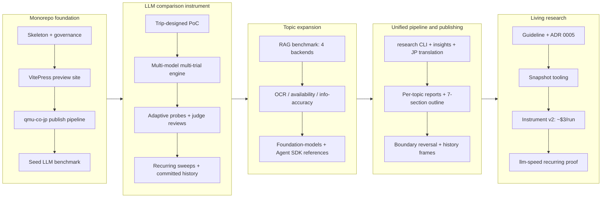

# Branch story — work-20260622-191220

## 1. Overview

This branch transforms the LLM research infrastructure from a single-model PoC into a production-grade, reproducible, incremental measurement system: a 59-configuration multi-provider comparison, a 4-backend RAG benchmark, OCR/availability/information-accuracy topics, and a unified research CLI with LLM insights and Japanese translation. It closes with the living-research layer — a proposal-first research guideline, compact snapshot articles over dated trial history, and a v2 measurement instrument that cuts a recurring real run from about $46 to about $3.

**Highlights:**

1. Multi-model LLM comparison engine: a 59-configuration matrix across Anthropic/OpenAI/Google/xAI with adaptive schema probes, per-call timeouts, judge reviews, and recurring incremental sweeps with committed history
2. RAG benchmark: retrieval quality (recall/nDCG/MRR) plus operational metrics across sqlite-vec, OpenAI File Search, AWS S3 Vectors, and Cloudflare Vectorize/AutoRAG, proven by real sweeps
3. Publishing boundary reversal: canonical reports live in this repo as Markdown + JSON artifacts with enforced 7-section outlines; Japanese pages and indexes generate from one shared metadata module
4. Living research structure: the proposal-first Research Development Guideline (ADR 0005), snapshot sidebar articles capped at 1,500 tokens over dated uniform trial reports, with llm-speed migrated as the reference implementation
5. Instrument v2 efficiency: unified speed probe (x3 trials for stdDev), warm-started binary schema search, batched information accuracy, and a 47-config subject rule — a recurring real run now costs about $3

## 2. Motivation

qmu.co.jp's AI foundation work requires verifiable, evidence-based model and infrastructure choices rather than marketing specs, and the AI landscape moves monthly — so the research must be living, not one-off. The team needed transparent multi-provider comparison, repeatable RAG backend measurement, a pipeline that systematically produces Japanese reports, articles compact enough for LLM agents to consult as context, and per-run costs low enough that recurring measurement is economically sustainable. This branch establishes all of that as one system, governed by a written proposal-first protocol so a terse developer idea becomes an approved, recurring research design.

## 3. Changes

The 100-commit arc runs in five phases. The monorepo foundation established reproducible tooling and the corporate publish boundary. The LLM comparison instrument grew from a trip-designed three-model PoC into a recurring 59-configuration sweep with committed, regenerable history. Topic expansion added the four-backend RAG benchmark and the OCR, availability, and information-accuracy topics. The unified pipeline brought one CLI, LLM insights, Japanese translation, standardized outlines, and the reversed publishing boundary. Finally the living-research layer landed: a proposal-first guideline, snapshot articles over dated trial history, and instrument v2 cutting a real run to about $3.

### 3-1. Initialize the research monorepo skeleton, tooling, and governance ([d15e4a1](https://github.com/qmu/research/commit/d15e4a1))

Laid down the monorepo skeleton: two independent npm projects, the Makefile runner CI invokes verbatim, governance docs (LICENSE, CLAUDE.md, ADRs), and baseline CI.

### 3-2. Add the VitePress research preview site ([5d31194](https://github.com/qmu/research/commit/5d31194))

Added the VitePress preview site rooted at docs/, giving every result page a locally previewable, WCAG-checked rendering before publication.

### 3-3. Add the qmu-co-jp markdown publish pipeline ([fa66a5b](https://github.com/qmu/research/commit/fa66a5b))

Built scripts/publish-research.sh, the one-directional Markdown copy pipeline into qmu-co-jp's /research section (ADR 0003 boundary).

### 3-4. Seed a reproducible LLM benchmark research, end to end ([0f6f6bd](https://github.com/qmu/research/commit/0f6f6bd))

Seeded the first end-to-end research topic — a small exact-match LLM benchmark — proving the run → page → preview → publish loop.

### 3-5. Fundamental LLM model-comparison PoC and report ([4be4412](https://github.com/qmu/research/commit/4be4412))

An Agent-Teams trip designed and implemented the llm-model-comparison PoC: pure tested domain, three-provider CompletionClient ACL, fixture path, generated report, ADR 0004.

### 3-6. Comprehensive LLM comparison (1/2) — multi-model, multi-trial engine with per-trial raw capture and aggregated statistics ([679dcfe](https://github.com/qmu/research/commit/679dcfe))

Grew the PoC into a multi-model, multi-trial engine capturing every call verbatim and aggregating per-metric statistics.

### 3-7. Comprehensive LLM comparison (2/2) — full report: methodology, per-aspect analysis, per-model profiles, transparency appendix, and the readability/a11y fix ([0597161](https://github.com/qmu/research/commit/0597161))

Rewrote the comparison report with methodology, per-aspect analysis, and transparency appendix; fixed code-block contrast to WCAG 2.2 AA.

### 3-8. Redesign the LLM-comparison probes: real throughput/latency, JSON-schema complexity, per-effort-level sweep, and LLM-judge model reviews ([726b003](https://github.com/qmu/research/commit/726b003))

Redesigned the probes: throughput/latency split, adaptive JSON-schema complexity sweep, per-effort-level matrix, and LLM-judge reviews.

### 3-9. Recurring, incremental LLM-comparison sweeps with historical benchmark storage and error recovery ([02e02ba](https://github.com/qmu/research/commit/02e02ba))

Made sweeps recurring and incremental: selector-based re-benchmarks merge into the latest record; history series plus gzip archives with retention.

### 3-10. Add coding-agent-optimized models (OpenAI Codex + xAI grok-code-fast-1) to the comparison ([ddeb948](https://github.com/qmu/research/commit/ddeb948))

Added coding-agent models — OpenAI Codex via the Responses API surface and xAI's grok-code-fast-1 behind a new OpenAI-compatible provider tag.

### 3-11. Add current xAI Grok models and migrate the deprecated coding slug ([1c734f1](https://github.com/qmu/research/commit/1c734f1))

Refreshed the xAI lineup to the current Grok models and migrated the deprecated coding slug.

### 3-12. Commit real-run comparison history to the repo and render the report from it ([0135c6c](https://github.com/qmu/research/commit/0135c6c))

Split fixture and real output paths and committed real-run history so the real report regenerates from git via compare:render without re-calling providers.

### 3-13. Establish the rag-benchmark research topic (retrieval quality + operational) with sqlite-vec ([f0dd74a](https://github.com/qmu/research/commit/f0dd74a))

Established the rag-benchmark topic: retrieval quality (recall/nDCG/MRR) plus operational metrics over a sqlite-vec foundation backend.

### 3-14. Add the OpenAI vector store (File Search) backend to the rag-benchmark ([6c85c2c](https://github.com/qmu/research/commit/6c85c2c))

Added OpenAI File Search as the first managed vector-store backend behind a thin ACL and registry card.

### 3-15. Add AWS S3 Vectors backend to the rag-benchmark ([956c066](https://github.com/qmu/research/commit/956c066))

Added the AWS S3 Vectors backend with honest region-limited error rendering.

### 3-16. Add Cloudflare Vectorize and AutoRAG backends to the rag-benchmark ([8d205c1](https://github.com/qmu/research/commit/8d205c1))

Added Cloudflare Vectorize and AutoRAG backends, documenting the dashboard-provisioned R2 binding constraint.

### 3-17. Resume: run the real sweep + refresh the Drive PDF (Grok), then the held ship + rag backlog ([f39b236](https://github.com/qmu/research/commit/f39b236))

Seeded the real comparison history with the first full 59/59 live sweep (including Grok) and refreshed the Drive PDF.

### 3-18. Cover LLM foundation-model rows whose effort is n/a ([54a7006](https://github.com/qmu/research/commit/54a7006))

Covered effort=n/a foundation-model rows as first-class configurations instead of gaps.

### 3-19. Agent SDKの比較をLLM基礎調査へ追加する ([9997907](https://github.com/qmu/research/commit/9997907))

Added the Agent SDK design-comparison reference article to the LLM foundation research set.

### 3-20. LLM 比較を複数試行にして信頼区間つきで報告する ([f0347fa](https://github.com/qmu/research/commit/f0347fa))

Moved the comparison to multi-trial reporting with 95% confidence intervals and per-metric sample counts.

### 3-21. RAG ベンチマークに試行と信頼区間を入れる ([552b97d](https://github.com/qmu/research/commit/552b97d))

Brought the same trial/confidence methodology to the RAG benchmark.

### 3-22. RAG ベンチマークを増分履歴モデルに載せる ([abb991e](https://github.com/qmu/research/commit/abb991e))

Put the RAG benchmark on the incremental history model with committed compact points.

### 3-23. 計測履歴を時系列チャートで可視化する ([e0f57cf](https://github.com/qmu/research/commit/e0f57cf))

Rendered measurement history as dependency-free inline-SVG time-series charts via a shared renderer.

### 3-24. LLM基礎検証の情報構造を再編し、最終記事の正本をこのリポジトリに置く ([d964681](https://github.com/qmu/research/commit/d964681))

Reorganized the LLM foundation research into the 6-topic information architecture with this repo as the canonical source.

### 3-25. 本リポジトリの VitePress を正本の公開サイトに仕立てる ([3881d4c](https://github.com/qmu/research/commit/3881d4c))

Turned the VitePress site into the canonical publishing surface presenting the 6-section IA.

### 3-26. 情報精度（事実正確性）の比較を追加する ([77e3cdc](https://github.com/qmu/research/commit/77e3cdc))

Added the information-accuracy topic: deterministic alias/exact-match token-F1 scoring over a TruthfulQA manifest.

### 3-27. 可用性（ダウン頻度・ダウンタイム長）の比較を追加する ([a1997f8](https://github.com/qmu/research/commit/a1997f8))

Added the availability topic (first as an active health-probe observation).

### 3-28. OCR能力の比較を追加する ([9048efe](https://github.com/qmu/research/commit/9048efe))

Added the OCR-capability topic with CER/WER and structured field extraction over synthetic documents via the vision port.

### 3-29. 公開境界を反転する（正本を本リポジトリに移し、exporter とパイプラインを整える） ([2fb19fc](https://github.com/qmu/research/commit/2fb19fc))

Reversed the publishing boundary: canonical articles live in this repo; qmu-co-jp receives copies.

### 3-30. 画像入力に対応したプロバイダーポートを用意する ([d62062d](https://github.com/qmu/research/commit/d62062d))

Added a vision-capable provider port and one anti-corruption layer for image-input models.

### 3-31. RAG ベンチマークのエラー経路でクラウド資源を確実に破棄する ([8f72cb6](https://github.com/qmu/research/commit/8f72cb6))

Guaranteed cloud-resource teardown on RAG error paths so a failed real run can never leak billable resources.

### 3-32. 研究トピックを統一 CLI（research <topic>）に載せる ([7de604d](https://github.com/qmu/research/commit/7de604d))

Added the unified `research <topic>` CLI translating fixture/estimate/real modes onto each topic's runner.

### 3-33. トピックの計測結果から LLM 分析レポート（insights）を生成する ([d8f1afd](https://github.com/qmu/research/commit/d8f1afd))

Added the LLM insights stage: an analytical overview written from the data artifact with mandatory provenance.

### 3-34. 英語 insights レポートを日本語へ自動翻訳する ([321dd5d](https://github.com/qmu/research/commit/321dd5d))

Added the Japanese auto-translation stage with a numeric-preservation check and deterministic keyless stub.

### 3-35. compare を「速度」と「精度」トピックに分割する ([90f11d9](https://github.com/qmu/research/commit/90f11d9))

Split the combined compare sweep into the speed and accuracy published topics as pure projections of one measurement.

### 3-36. RAG・OCR・可用性を統一トピック CLI へ移行する ([efc5f83](https://github.com/qmu/research/commit/efc5f83))

Connected insights and translation to the RAG, OCR, and availability topics.

### 3-37. 非計測の参照トピック（基盤モデルカタログ・Agent SDK）を構造に合わせる ([279a7bb](https://github.com/qmu/research/commit/279a7bb))

Fitted the non-benchmark reference topics (foundation-models catalog, Agent SDK) into the same structure.

### 3-38. VitePress サイトと公開を per-topic レポートに作り直す ([56d4067](https://github.com/qmu/research/commit/56d4067))

Rebuilt the site and publishing flow around the per-topic generated reports as the main line.

### 3-39. 可用性トピックを「API 能動プローブ」から「ステータスページ観測」へ作り直す ([9d37ac4](https://github.com/qmu/research/commit/9d37ac4))

Rebuilt availability from active API probing to public status-page observation (no keys, no synthetic load).

### 3-40. 可用性トピックを「スナップショット」から「LLM 抽出＋累積 DB＋30/90 日トレンド」へ作り直す ([631d8cd](https://github.com/qmu/research/commit/631d8cd))

Rebuilt availability again as LLM-extracted incident history accumulating in a committed JSON DB with 30/90-day trends.

### 3-41. LLM research sidebar labels and Japanese topic parity ([4747012](https://github.com/qmu/research/commit/4747012))

Derived the Japanese sidebar from the shared topic metadata, fixing label parity.

### 3-42. Report history, direct Japanese translation, and qmu-co-jp publish pipeline ([0a7c5f8](https://github.com/qmu/research/commit/0a7c5f8))

Implemented dated report-history frames (EN/JP/data per generation) with auto-generated EN/JA history indexes and qmu publish metadata.

### 3-43. Separate published research topics from internal measurement sources ([4e01988](https://github.com/qmu/research/commit/4e01988))

Separated published research topics from internal measurement sources, making publishedResearchTopics the single authoritative list.

### 3-44. Standardize public research article outline ([cea205c](https://github.com/qmu/research/commit/cea205c))

Standardized every public article on the enforced 7-section outline (article-outline.ts plus tests) in both languages.

### 3-45. Write the Research Development Guideline (proposal-first protocol + snapshot/history article structure) ([d7329e2](https://github.com/qmu/research/commit/d7329e2))

Wrote the Research Development Guideline (proposal-first protocol: cadence, subjects, metrics, cost/trial range, accumulated history) plus ADR 0005 and the 1,500-token snapshot budget.

### 3-46. Implement snapshot/history structure in site tooling (metadata fields + snapshot renderer + budget validator) ([e522aa0](https://github.com/qmu/research/commit/e522aa0))

Implemented the snapshot structure in site tooling: per-topic ResearchDesign metadata, the snapshot renderer over dated frames, and a machine-checked compactness budget.

### 3-47. Migrate llm-speed to snapshot+history as the reference implementation and verify the recurring-run loop end-to-end ([ec38a52](https://github.com/qmu/research/commit/ec38a52))

Migrated llm-speed to the snapshot+history structure and proved the recurring loop end-to-end on a real run (estimate $6.71 → actual ≈$3, prior frames untouched).

### 3-48. Comparison instrument v2: efficiency-first probes for the recurring sweep ([c79751f](https://github.com/qmu/research/commit/c79751f))

Rebuilt the measurement instrument (v2): unified speed probe ×3 trials, warm-started binary schema search, batched information accuracy, 47-config matrix — cutting a real run from ≈$46 to ≈$3.

## 4. Outcome

- **Foundation infrastructure:** Established a public research monorepo with two independent npm projects (packages/tech/ and packages/industry/), a Makefile-based runner, VitePress preview site, and a one-directional publish pipeline to qmu.co.jp with complete governance (LICENSE, CLAUDE.md, ADRs, dependency-decisions log)
- **LLM Model Comparison instrument:** Shipped a comprehensive 59-model-configuration matrix spanning Anthropic (Fable 5/Opus/Sonnet/Haiku), OpenAI (GPT-5.x + Codex + Realtime API), Google (Gemini tier), and xAI Grok (general + reasoning variants); measures throughput/latency, schema depth/breadth (adaptive per-axis probing), length accuracy, and information accuracy across configurable effort levels
- **Multi-trial + incremental methodology:** Deterministic multi-trial sweeps with failure isolation, per-config progress streaming, per-call timeouts (180s guard), and incremental repair/merge commands (--only-errored) that double as structural-vs-transient error diagnosis tools
- **Real-run history + regenerable reports:** Compact history plus gzip-archived full records under docs/research-reports/history/, enabling byte-identical report regeneration via `npm run compare:render` without re-calling provider APIs
- **RAG-benchmark research topic:** A complete four-backend vector-store comparison harness (retrieval quality: recall@k/nDCG@k/MRR + operational: ingest/latency/cost) with sqlite-vec, OpenAI File Search, AWS S3 Vectors, and Cloudflare Vectorize/AutoRAG, each plugging in as a thin ACL + registry card
- **Living research layer:** The proposal-first Research Development Guideline (ADR 0005), per-topic ResearchDesign metadata, snapshot articles within a machine-checked 1,500-token budget over dated uniform trial reports, and instrument v2 (unified speed probe ×3, warm-started schema search, batched information accuracy, 47-config subject rule) proven by a real end-to-end recurring run (estimate $6.71 → actual ≈$3, 47/47 measured, zero errors)
- **Quality gates:** 280/280 vitest tests, linting, VitePress build, and keyless fixtures pass; fixture artifacts byte-stable across consecutive runs; real sweeps fully measured with zero cascading failures

## 5. Historical Analysis

The research monorepo inherited and extended patterns from prior work: (1) the seed llm-benchmark topic established the now-canonical research-topic anatomy — pure domain logic, vendor SDKs behind anti-corruption layers, thin CLI runners, a keyless fixture path for CI self-tests, and a committed JSON full-record artifact — and that tri-layer pattern proved reusable without modification for the llm-model-comparison, rag-benchmark, and every later topic. (2) The Makefile-as-runner convention ensured every operation is reproducible locally, with CI invoking the exact targets a developer runs. (3) The report shape surfaced a WCAG 2.2 AA contrast violation in default code-block colours, and the fix benefited every report on the site. (4) The curated-vs-measured split (registry + live probes) meant registry errors, like OpenAI's unsupported 'minimal' effort, were diagnosed and fixed through the same --only-errored repair path used for transient failures. (5) The availability topic was rebuilt twice (active probes → status-page observation → LLM-extracted accumulating trend DB), and that accumulate-and-summarize precedent became the model for ADR 0005's snapshot/history article structure.

## 6. Concerns

### JSON artifact link resolution deferred

- **Severity:** moderate
- **Description:** Reports link to raw JSON run-artifacts by relative path, but the corporate copy only transfers Markdown, so the transparency links will not resolve on the Astro site until artifacts join the copy set or switch to stable GitHub URLs (see [0597161](https://github.com/qmu/research/commit/0597161) in docs/research-reports/)
- **How to Fix:** Extend scripts/publish-research.sh to copy .data.json alongside .md, or point artifact references at stable raw.githubusercontent.com URLs

### Model IDs require periodic live verification

- **Severity:** moderate
- **Description:** Curated model ids churn: grok-code-fast-1 was retired mid-branch, some web names do not match wire ids, and mid/small-tier prices are best-known estimates (see [c148f4f](https://github.com/qmu/research/commit/c148f4f), [1c734f1](https://github.com/qmu/research/commit/1c734f1) in packages/tech/src/llm-model-comparison/models.ts)
- **How to Fix:** Schedule periodic verification runs against the providers, record a last-verified date in models.ts, and document per-provider deprecation policies in docs/dependency-decisions.md

### Fixture determinism depends on careful seeding

- **Severity:** moderate
- **Description:** Byte-stable fixture reports require the pinned timestamp plus per-trial-index seeding; a future probe redesign could silently break byte-stability if the seeding strategy is not carried forward (see [679dcfe](https://github.com/qmu/research/commit/679dcfe) in packages/tech/src/vendors/llm/fixture.ts; instrument v2 preserved it in [c79751f](https://github.com/qmu/research/commit/c79751f))
- **How to Fix:** Document the determinism precondition beside the fixture client and include a two-consecutive-runs byte-stability check in the quality gate of any ticket touching the fixture shape

### JP pages are overwritten by the insights-translation stage after real runs

- **Severity:** moderate
- **Description:** Running `research -- <topic> --real` ends with an insights translation that overwrites the topic's Japanese page with a non-outline document; the enforced-outline test catches it, but the recovery step is manual (see [ec38a52](https://github.com/qmu/research/commit/ec38a52) in packages/tech/src/research/translate-runner.ts)
- **How to Fix:** Run `npm run research:translate-report -- <topic>` after every real run (now documented), or reorder the pipeline so the full-report translation is the terminal JP stage

### Only llm-speed is migrated to the snapshot structure

- **Severity:** low
- **Description:** The guideline defines the snapshot/history structure for every published topic, but only llm-speed runs in snapshot mode; the other five sidebar pages are still full reports (see [ec38a52](https://github.com/qmu/research/commit/ec38a52) in packages/tech/src/research/domain/site.ts)
- **How to Fix:** Migrate the remaining topics one ticket at a time using llm-speed as the reference implementation, starting with accuracy which already shares the v2 sweep

### Real-run cloud backend credentials and quotas are account-dependent

- **Severity:** low
- **Description:** S3 Vectors is region-limited, Cloudflare AutoRAG needs a dashboard-provisioned R2 binding, and xAI needs pre-funded credits; all render honest error/fixtured states rather than fake numbers (see [956c066](https://github.com/qmu/research/commit/956c066), [8d205c1](https://github.com/qmu/research/commit/8d205c1))
- **How to Fix:** Keep the honest-error rendering and document the account prerequisites beside each backend's reproduction steps

## 7. Successful Development Patterns

- **Incremental repair as a diagnostic tool:** The --only-errored path, introduced for recovery, became the primary way to distinguish structural from transient failures — a live repair run surfaced OpenAI's exact 400 message naming the fix ([9c606ef](https://github.com/qmu/research/commit/9c606ef))
- **Fixture determinism via seeding, not hardcoding:** A pinned timestamp plus per-trial-index seeding yields non-degenerate yet byte-stable fixtures, so the keyless path is both a CI self-test and a live demonstration of the pipeline ([679dcfe](https://github.com/qmu/research/commit/679dcfe))
- **Separate fixture and real output paths:** Committing fixture artifacts while keeping real outputs regenerable from committed history removed the tension between CI byte-stability and real measurement ([0135c6c](https://github.com/qmu/research/commit/0135c6c))
- **Per-config progress streaming prevents silent hangs:** Emitting one line per finished configuration made multi-hour sweeps observable and distinguishable from stalls ([2739ddd](https://github.com/qmu/research/commit/2739ddd))
- **Adaptive probing over fixed ladders:** A fixed complexity ladder measured its own ceiling; per-axis adaptive search (and later warm-started binary search) measures the model's real boundary at a fraction of the calls ([5e78529](https://github.com/qmu/research/commit/5e78529), [c79751f](https://github.com/qmu/research/commit/c79751f))
- **Vendor ACL pattern scales horizontally:** Every new provider or backend was a thin ACL plus a registry card with zero domain changes — evidence the domain/vendors/entrypoints boundary is drawn correctly ([ddeb948](https://github.com/qmu/research/commit/ddeb948), [6c85c2c](https://github.com/qmu/research/commit/6c85c2c))
- **Prior measurements as instrument input:** Instrument v2's warm-start reuses the previous run's measured schema boundaries to cut search cost ~6×, showing committed history is not just a record but an optimization resource ([c79751f](https://github.com/qmu/research/commit/c79751f))
- **Proposal-first research design:** Turning a terse developer idea into an agent-proposed cadence/subjects/metrics/cost design before any paid run kept every real-money decision explicit and cheap to revise — the guideline itself was applied mid-branch to redesign the instrument ([d7329e2](https://github.com/qmu/research/commit/d7329e2))

## 8. Release Preparation

**Verdict**: Ready for release

### 8-1. Concerns

- None - changes are safe for release

### 8-2. Pre-release Instructions

- None - standard release process applies

### 8-3. Post-release Instructions

- Sync the corporate site per ADR 0003 as part of /ship: run `npm run research:site -- write-indexes` in packages/tech, then `scripts/publish-research.sh copy --all`, then generate the qmu-co-jp publish ticket and run /drive in qmu-co-jp.

## 9. Notes

- The trip design artifacts under `.workaholic/trips/llm-model-comparison/` (direction, architecture model, design v1→v2, review rounds) are the rationale behind the comparison instrument's ticket arc — each comparison ticket's origin traces back to that design.
- This branch advances two missions: `living-research-development-guideline` (5/5 acceptance criteria met; the story's frontmatter mission) and `per-topic-research-pipeline-benchmark-llm-insights-jp-translation` (its 12 tickets are all archived on this branch).
- Instrument v2 deliberately breaks metric comparability with v1 (developer decision, efficiency-first): artifacts carry `instrumentVersion`, and snapshot tendency charts connect only same-version points. Prior frames remain archived and listed as trials.

## Deployment Evidence

- **When:** 2026-07-13T09:45:20+09:00
- **Target:** Research publishing site (deploy-on-merge)
- **Method:** api-probe (pre-merge readiness)
- **Status:** pass
- **Observed:** make lint pass; vitest 280/280 pass; VitePress build complete no dead links; fixture artifact md5 488ee811 byte-stable across two runs; working tree clean at branch HEAD

## Deployment Evidence

- **When:** 2026-07-13T09:47:09+09:00
- **Target:** Research publishing site (deploy-on-merge)
- **Method:** api-probe (post-merge promotion)
- **Status:** pass
- **Observed:** git ls-remote origin main returned 147224ce8fa0aef16e0f3a5130c44b26f94d6105, matching the PR 15 merge commit; main is the published source of truth
