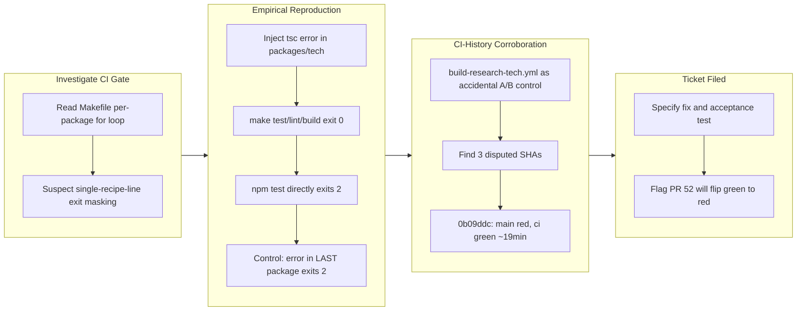

## 1. Overview

This branch files a single ticket documenting a **proven** exit-code masking defect in the repository's `Makefile`: each per-package `for` loop is one recipe line, so `make` evaluates only the shell's status — a POSIX loop's status is its **last** iteration's — and every earlier package's failure is discarded. Because `PACKAGES := packages/tech packages/industry` lists `packages/tech` first, the package holding nearly all of this repo's code sits permanently in the masked position, and `ci.yml` invokes those same targets. No code was changed: the branch is evidence-gathering and ticket-filing only, and its value is the evidence it records.

**Highlights:**

1. Filed a ticket specifying the defect, its root cause, and a concrete fix (per-package prerequisites via `$(MAKE) -C`, restoring `make -k`/`-j`; or minimally `set -e`/status accumulation in the loop).
2. Reproduced the masking empirically with raw, unpiped exit codes: an injected `tsc` error in `packages/tech` left `make test`, `make lint`, and build's package loop at exit **0** while `cd packages/tech && npm test` correctly returned **2**; a control with the same error in the **last** package correctly returned **2**.
3. Corroborated the defect from CI history alone: `build-research-tech.yml` runs `npm test`/`npm run lint` directly under `working-directory: packages/tech`, bypassing the loop — an accidental per-commit A/B control against `ci.yml`'s `make test`. The two workflows disagree on three SHAs today, including `main` at `0b09ddc`, which was **genuinely red while `ci` reported green** for ~19 minutes.
4. Specified the acceptance criteria: a regression test asserting on **raw** exit codes that a deliberately failing **non-final** package makes the target non-zero, plus a replay proving the fixed `Makefile` goes red on `0b09ddc`.
5. Flagged a live consequence: open PR #52 fails `packages/tech` tests right now (`7b53196`) while `ci` calls it green, so the fix will correctly flip it red — its owner should be warned rather than ambushed.

## 2. Motivation

The HQ rule is explicit that verification must never mask exit codes, and this repository's own `operation/ci-cd.md` policy exists to prevent exactly this failure mode: "treating a green indicator — absent any evidence of what the inspection actually verified — as proof the code is healthy." That precondition was violated in practice. `CLAUDE.md` codifies "One runner. All common operations run through `make`; CI invokes the same targets," which is precisely why a lying `Makefile` is a severity-1 defect rather than a cosmetic one — every developer and agent is instructed to trust it. Rather than patch the `Makefile` blind, the work first proved the defect was real and live: an empirical reproduction with raw exit codes isolated the exact failure, and an independent corroboration was found for free in CI history, because a sibling workflow happens to bypass the loop and therefore functions as an accidental control. That control showed the two workflows disagreeing on three real SHAs, including a window where `main` was red while CI reported green. Given the blast radius of a `Makefile` change that affects every CI gate, and a live PR that will flip from green to red once fixed, the branch's output is a fully-specified ticket rather than an unreviewed fix landed in haste.

## 3. Changes

Work began by reading the `Makefile`'s per-package loop and suspecting it collapsed multi-package exit status into a single masked recipe line. That suspicion was confirmed empirically: an injected `tsc` error in `packages/tech` left every `make` target at exit 0 while a direct `npm test` correctly failed, with a control proving the loop only sees the last package. A second, independent line of evidence turned up in CI history, where a sibling workflow's direct `npm test` disagreed with `ci.yml`'s masked `make test` on three real commits, including one where `main` was genuinely broken for ~19 minutes while CI showed green. Both threads converged into a single ticket specifying the fix and its acceptance criteria, with no code changed.

**This branch archived no tickets.** It is a ticket-only branch, so the single subsection below describes its one commit rather than a completed ticket. The ticket it adds remains in `.workaholic/tickets/todo/` — filing it is the deliverable; implementing it is deliberately a separate change (see §6).

### 3-1. Add ticket for exit-code masking in make targets ([d3a2921](https://github.com/qmu/research/commit/d3a2921))

Adds `.workaholic/tickets/todo/a-qmu-jp/20260717130639-make-targets-mask-non-final-package-failures.md` (260 lines), which records the mechanism, the affected targets (`test`, `lint`, `build`, `install`, `format` — with `drift`, `a11y`, `docs`, and `publish` verified **safe**), the proven CI blast radius, both candidate fix shapes, and a quality gate demanding raw-exit-code assertions. No code paths are touched and no behavior changes.

## 4. Outcome

- Adds one ticket file (260 lines) documenting and empirically proving that the `Makefile`'s per-package `for` loops (`test`, `lint`, `build`, `install`) discard every exit status but the last iteration's, so a broken `packages/tech` — first in `PACKAGES` — is silently reported as passing by `make test`/`make lint`/`make build`, and by extension by `ci.yml`, which invokes the same targets.
- No behavior change: single commit `d3a2921`, ticket-only, zero code paths touched.
- The ticket specifies the fix (per-package prerequisite targets via `$(MAKE) -C`, or `set -e`/status-accumulation inside the loop), a regression-test requirement asserting on raw exit codes with a deliberately-failing **non-final** package, and an acceptance check that the fixed `Makefile` goes red when replayed against `0b09ddc` — the real commit where `main` was genuinely broken and CI reported green.
- Empirically verified against the live tree with raw (unpiped) exit codes: `make test`/`make lint`/build's package loop each return 0 on a deliberately broken first package while `npm test` directly returns 2; the same fault moved to the last package is correctly caught (exit 2); `0b09ddc` reproduces red locally (exit 1) and `40e6bee` reproduces green (exit 0). All probe changes were reverted; the tree is clean.
- Identifies `build-research-tech.yml` as an accidental per-commit A/B control and uses it to prove — not merely suspect — three real CI-history disagreements: `0b09ddc` (main), `7b53196` (open PR #52), and `ada7084` (PR #49 branch).
- Independently re-verified during this report: `packages/tech` `npm test` returns **raw exit 0** at HEAD (491 tests), confirming `main` is currently green and this is a structural gate defect rather than an active incident.

## 5. Historical Analysis

The masking loop shape dates to the very first commit on the `Makefile`: `d15e4a1` ("Initialize research monorepo skeleton, tooling, and governance", 2026-06-22), which introduced the `test`/`build`/`lint`/`install`/`format` targets exactly as the single-line `@for p in $(PACKAGES); do ... ; done` recipe that discards every non-final exit status. `git log --oneline -- Makefile` shows only three later commits touching this file — `5d31194` (VitePress docs site: added separate, correctly-checked `docs` install/build lines and the `a11y` target), `fa66a5b` (wired the publish script), and `363f108` (added the independently-safe `drift` target) — and a line-level diff of all three confirms none altered the `test`/`build`/`lint`/`install` loop bodies. The defect has therefore been latent in the repository's sole general-purpose gate for the `Makefile`'s entire history, through every subsequent merge to `main`, and was never introduced by a later regression: it was there from the skeleton onward and simply never produced a visible symptom, because `packages/tech` — the masked, first-position package — was covered incidentally by `build-research-tech.yml` whenever a PR touched `packages/tech/**`, which most PRs do. The failure mode was invisible precisely because the backstop was quietly doing the gate's job.

## 6. Concerns

### (carried from PR #15) Fixture determinism depends on careful seeding

- **Severity:** moderate
- **Description:** Byte-stable fixture reports require the pinned timestamp plus per-trial-index seeding; a future probe redesign could silently break byte-stability if the seeding strategy is not carried forward (see [679dcfe](https://github.com/qmu/research/commit/679dcfe) in `packages/tech/src/vendors/llm/fixture.ts`; instrument v2 preserved it in [c79751f](https://github.com/qmu/research/commit/c79751f)). This branch does not touch `fixture.ts` and the two-consecutive-runs byte-stability check still has no evidence of existing.
- **How to Fix:** Document the determinism precondition beside the fixture client and include a two-consecutive-runs byte-stability check in the quality gate of any ticket touching the fixture shape.

### (carried from PR #15) JSON artifact link resolution deferred

- **Severity:** moderate
- **Description:** Reports link to raw JSON run-artifacts by relative path, but the corporate copy only transfers Markdown, so transparency links will not resolve on the Astro site until artifacts join the copy set or switch to stable GitHub URLs (see [0597161](https://github.com/qmu/research/commit/0597161) in `docs/research-reports/`). `scripts/publish-research.sh` still does a single Markdown-only `cp` (line 161) and this branch touched neither `scripts/` nor `docs/`.
- **How to Fix:** Extend `scripts/publish-research.sh` to copy `.data.json` alongside `.md`, or point artifact references at stable raw.githubusercontent.com URLs.

### (carried from PR #15) Model IDs require periodic live verification

- **Severity:** moderate
- **Description:** Curated model ids churn: `grok-code-fast-1` was retired mid-branch, some web names do not match wire ids, and mid/small-tier prices are best-known estimates (see [c148f4f](https://github.com/qmu/research/commit/c148f4f), [1c734f1](https://github.com/qmu/research/commit/1c734f1) in `packages/tech/src/llm-model-comparison/models.ts`). Live evidence this is still active: `models.ts:285` now records `grok-code-fast-1` retired in xAI's 2026-05-15 model line — the exact churn this concern predicted, recurring.
- **How to Fix:** Schedule periodic verification runs against the providers, record a last-verified date in `models.ts`, and document per-provider deprecation policies in `docs/dependency-decisions.md`.

### (carried from PR #15) Real-run cloud backend credentials and quotas are account-dependent

- **Severity:** low
- **Description:** S3 Vectors is region-limited, Cloudflare AutoRAG needs a dashboard-provisioned R2 binding, and xAI needs pre-funded credits; all render honest error/fixtured states rather than fake numbers (see [956c066](https://github.com/qmu/research/commit/956c066), [8d205c1](https://github.com/qmu/research/commit/8d205c1)). Unchanged by this branch; persists as institutional memory with no terminal state.
- **How to Fix:** Keep the honest-error rendering and document the account prerequisites beside each backend's reproduction steps.

### The masking gate is filed but not yet fixed — it remains live on `main`

- **Severity:** urgent
- **Description:** This branch adds only the ticket; the `Makefile`'s exit-code-discarding loops in `test`, `lint`, `build`, and `install` are unchanged and still live on `main` at the time of this report (see [d3a2921](https://github.com/qmu/research/commit/d3a2921) in `Makefile`). The defect is not hypothetical — it has already passed a genuinely red `main` once (`0b09ddc`) — and it remains capable of doing so again for any future commit that breaks `packages/tech` without touching `packages/tech/**`, the one case `build-research-tech.yml`'s `paths:` filter does not backstop (proven: PR #46 changed 0 files under `packages/tech`, so the masking `make test` was the only tech gate on `40e6bee`). `CLAUDE.md` instructs every developer and agent to trust `make test`/`make build`/`make lint` as the canonical, CI-equivalent gate, so every "CI green" judgment made through it between now and the fix landing carries this caveat, silently and by design invisible to whoever relies on it.
- **How to Fix:** Treat the fix (per-package prerequisite targets or fail-fast/status-accumulating loops, plus the raw-exit-code regression test and the `0b09ddc` replay acceptance check specified in the ticket) as the priority follow-up, not a someday cleanup. Until it lands, anyone trusting a green `make test`/`make build`/`make lint` on this repo is trusting an inspection proven able to lie.

### PR #52 will flip from green to red once the masking fix lands

- **Severity:** moderate
- **Description:** PR #52's `packages/tech` tests fail today (`7b53196`, `pretokenize.ts:41` — regex `Invalid group`) while `ci` currently reports it green because of the exit-code masking this ticket documents. Once the `Makefile` fix lands, `ci` will correctly turn that PR red — a change in signal, not a new regression, but one that will look like an ambush to its owner if unannounced.
- **How to Fix:** Proactively notify PR #52's owner before or when the masking fix merges, framing the newly-red `ci` as the gate finally telling the truth about a pre-existing failure, not a fix-induced break.

### `build-research-tech.yml` must not be deleted alongside the Makefile fix

- **Severity:** moderate
- **Description:** `build-research-tech.yml` runs `npm test`/`npm run lint` directly under `working-directory: packages/tech`, bypassing the loop, and is the sole reason the masking defect was ever caught in CI history at all — it disagreed with `ci`'s `make test` on three real SHAs (`0b09ddc`, `7b53196`, `ada7084`), all of which `ci` called green. It only runs when a PR's `paths:` filter matches `packages/tech/**`, so it is not a complete backstop. It also duplicates `make` logic inline in workflow YAML, contravening the "One runner" convention — a real tension, but not one to resolve by deleting the only working net.
- **How to Fix:** Keep `build-research-tech.yml` in place through the `Makefile` fix; decide its fate only as a separate, explicit, documented decision after the fixed `ci.yml` has been proven to go red on its own against real history (e.g. `0b09ddc`).

### CI-history audit only covered the last 30 runs

- **Severity:** low
- **Description:** The evidentiary basis for the masking claim (the three `ci`/`build-research-tech` disagreements) comes from auditing only the last 30 CI runs. Older history was never checked, so the true historical blast radius — how many more `main` merges were quietly broken — is unproven in either direction. Equally, no masked failure is claimed for PRs #47/#48/#51/#53, where the two workflows agreed, and `40e6bee` was checked out and tested genuinely green (raw exit 0).
- **How to Fix:** If a fuller retrospective is ever needed (e.g. for an incident report), extend the audit window past 30 runs; otherwise scope every claim made from this ticket to the audited window only.

### `main` is currently green — a structural gate defect, not an active incident

- **Severity:** low
- **Description:** As of `ec158df`, `packages/tech` exits 0 (independently re-verified during this report: raw exit 0, 491 tests). While the masking defect is proven and severe, there is no live production breakage right now. Conflating "the gate can lie" with "the build is broken today" would misdirect triage urgency.
- **How to Fix:** When communicating this ticket's priority, keep the distinction explicit: fix at high priority because the gate is structurally untrustworthy, not because `main` is currently failing.

## 7. Successful Development Patterns

- **Assert on raw exit codes, never through a pipe.** The investigation's own verification method (`make test; rc=$?; ...`) deliberately avoided the exact anti-pattern it was diagnosing — a pipe (`cmd | tail`) would have masked the very exit status being tested. This discipline is now baked into the ticket's Quality Gate as a requirement for the eventual regression test, and is directly reusable as a standing rule for any test that verifies a gate's failure behavior.
- **An accidental duplicate check became a working A/B control.** `build-research-tech.yml` bypasses the `Makefile` loop entirely, so it disagreed with `ci`'s `make test` on exactly the commits where masking occurred. That let the investigator prove the defect from CI history alone, with no need to inject synthetic failures to make the case for historical incidents — a reusable pattern for auditing any gate suspected of being unsound: look for a second, differently-shaped workflow already covering the same surface and diff their historical verdicts.
- **Separate proof-of-defect from the fix.** The ticket defers both the `Makefile` change and any decision to retire `build-research-tech.yml` to a follow-up, specifically so a reviewer can watch the fixed gate go red against `0b09ddc` on its own — preserving a clean, reproducible acceptance test rather than fixing and proving in the same commit, where the before/after comparison would be harder to isolate.
- **Explicit PROVEN vs. SUSPECTED discipline, with real overclaim resistance.** The ticket separates a "Proven, not suspected" section from a "Suspicion only — do not overclaim" section, and backs the latter with evidence: `40e6bee` was actually checked out and tested clean (genuinely green, no masked failure there), and no masked failure is claimed for PRs where the two workflows agreed. Testing a plausible-looking suspicion and reporting a negative result, rather than letting ambiguity read as evidence, is itself a reusable investigative pattern.

## 8. Release Preparation

**Verdict**: Ready for release

### 8-1. Concerns

- None - changes are safe for release. The branch-safety scan returned `pass` with no findings; `doc-drift.sh` reported no structural changes and no candidates; the diff is one new Markdown ticket file (260 insertions) with no executable code. The defect the ticket documents is **not** a blocker for this branch: recording the evidence is the branch's entire purpose, and the ticket landing does not make the defect worse or alter any gate's behavior.

### 8-2. Pre-release Instructions

- None - standard release process applies.

### 8-3. Post-release Instructions

- Prioritize the filed ticket. The masking gate stays live on `main` until a follow-up implements the fix; until then every green `make test` carries the §6 caveat.
- Warn PR #52's owner that `ci` will correctly go red on that branch once the fix lands (its `packages/tech` tests fail today at `7b53196`).

## 9. Notes

**This is a ticket-only branch.** It archives no tickets and changes no code, so the story's `tickets:` and `mission:` relations are empty and §3 describes the single commit instead of a completed ticket. `/report`'s usual ticket-driven Changes section does not apply; the branch's value is the evidence recorded in the filed ticket, which remains in `.workaholic/tickets/todo/` for a later `/drive`.

**Verification caveat for reviewers:** do not use `make test`, `make lint`, or `make build` to check this branch — those targets are the subject of the ticket and return 0 on trees that fail their own tests. Verify per-package directly (`cd packages/tech && npm test`) and read the **raw** exit code, never through a pipe.

**Base-ref note:** this report was generated against `origin/main` (`ec158df`) explicitly. The local `main` ref is 71 commits stale (`6a1f68e`), and the report scripts' default of bare `main` would have attributed 72 already-merged commits to this branch.

**Deferred-concern triage:** the Phase 1 judge proposed one compound (`json-artifact-link-resolution-deferred` + `model-ids-require-periodic-live-verification` → "Published research shows drift-prone numbers while its verification artifacts are dead links", suggested severity `urgent`). It was **not applied** — the A+B severity call is the developer's, and this run had no interactive gate. It is raised for the developer's decision instead; both members remain active and are carried above individually.
