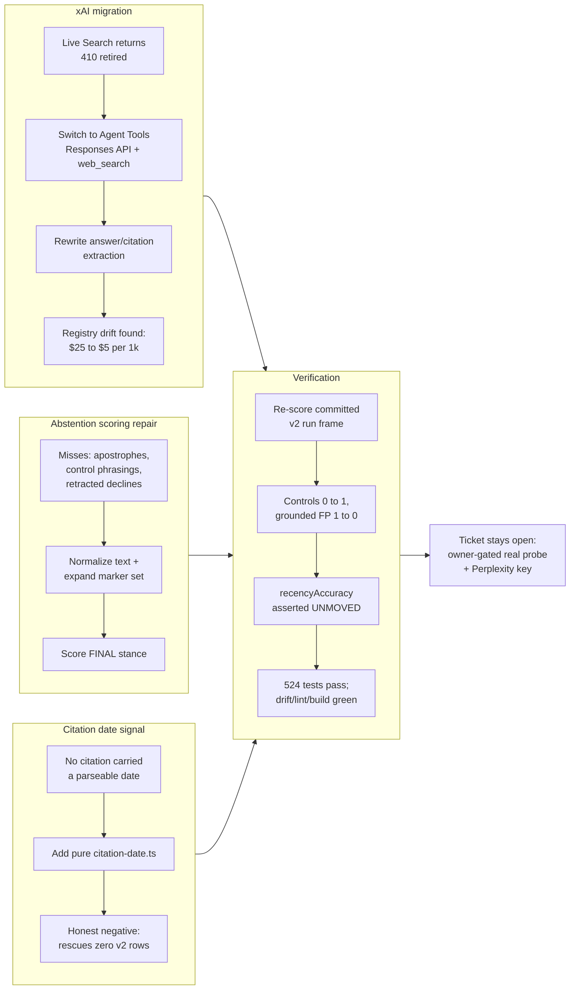

## 1. Overview

This branch delivers a keyless v3 repair of the trend-recency research instrument, closing three of the four instrument gaps that the 2026-07-17 first real trial (ticket 20260717103500) surfaced while proving the design itself. The single commit (0d1688c) migrates the xAI grounded client off a retired API, hardens abstention scoring, adds a citation date signal, and proves all of it by re-scoring the actual committed v2 run frame rather than inventing test strings.

**Partial delivery — read section 8 before merging.** The ticket that motivated this work deliberately stays open in `.workaholic/tickets/todo/a-qmu-jp/`: its Quality Gate needs an owner-gated live `--real` probe and a still-unprovisioned Perplexity key, neither of which a keyless branch can supply. Nothing here closes those, and the Grok grounded row stays an honest error row rather than an assumed-working one.

**Highlights:**

1. Migrated the xAI grounded client off Live Search — retired mid-series, returning `410 "Live search is deprecated"` on every call in the first trial — onto the Agent Tools Responses API (`${XAI_BASE_URL}/responses`, `tools: [{ type: "web_search" }]`), rewriting answer/citation extraction to read `output_text` and the top-level `citations` list, with a `url_citation` annotation fallback whose `title` field is a citation *number* rather than a source title, so it is dropped rather than misused.
2. Caught a registry-drift finding while migrating: Agent Tools bills $5 per 1k successful calls against the retired Live Search's $25 per 1k — the model card had been carrying a retired price that overstated every `--estimate` for this subject by **5x**. Corrected to $5 with `lastVerified` 2026-07-17.
3. Hardened `scoreAbstention` to normalize typographic apostrophes (U+2019) and negative contractions, extend the marker set with phrasings the trial's controls actually used ("have not yet occurred", "No such models exist.", "does not exist"), and read the answer's **final** stance — so a grounded answer that opens with a decline, announces a lookup, then delivers a real answer no longer false-positives as abstained.
4. Added a pure `citation-date.ts` signal (provider-supplied date, else a publisher-embedded date parsed from the cited URL's path) and proved it as an **honest negative**: it rescues zero rows of the v2 frame, because Gemini returns opaque `vertexaisearch` redirects and the other providers cited undated permalinks.
5. Proved the whole scoring repair against the actual committed v2 run record (`rescore-v2-frame.test.ts`) instead of invented strings: the three ungrounded controls flip abstained 0→1 on all probes, the grounded false-positive row flips 1→0, and `recencyAccuracy` is explicitly asserted **unmoved** so the trial's 1.00-vs-0.00 grounded-vs-control headline survives the instrument bump.

## 2. Motivation

The 2026-07-17 first real trial proved the trend-recency design — grounded models scored 1.00 vs. 0.00 for ungrounded controls on recency accuracy across all three measured probes, at a real cost of $0.25 — but its committed run record exposed four instrument gaps. Three were provable without any paid call or new key: re-scoring the already-committed v2 result frame validates the abstention-scoring fix, and unit tests validate the xAI wire-format migration and the new citation-date parser. The fourth gap (a Perplexity Sonar key) and live confirmation that the xAI Agent Tools migration actually works over the wire are owner-gated actions outside what a keyless session can close, so the ticket stays in todo rather than being marked done.

## 3. Changes

The work moves through four themes inside the single commit: migrating the xAI grounded client to Agent Tools after Live Search's retirement (which surfaced a 5x price drop the model card had not caught), repairing abstention scoring to read an answer's final stance rather than its opening words, adding a citation-date signal that is honestly proved to rescue nothing in the current data, and tying all three repairs back to the committed v2 run frame so the scoring changes are validated against real recorded answers instead of synthetic fixtures — with `recencyAccuracy` pinned unmoved throughout. The commit ends at a deliberate stop: the ticket that drove it stays open because the remaining gaps require an owner's live probe and a new API key, not more keyless work.

### 3-1. Repair the trend-recency instrument (v3, keyless) ([0d1688c](https://github.com/qmu/research/commit/0d1688c))

Migrated the xAI grounded client off the retired Live Search surface onto Agent Tools, hardened abstention scoring to read an answer's final stance, added the pure `citation-date.ts` signal, and corrected the model card's retired $25/1k price to the actual $5/1k. Proved the scoring repair by re-scoring the committed v2 run frame with `recencyAccuracy` asserted unmoved, and the wire parsers by unit tests against recorded-shape payloads. 13 files, +863/−74; no paid call was made.

**Note on ticket accounting:** this branch archived **no** tickets, by design. Ticket `20260717103500-trend-recency-instrument-v3-repairs.md` stays in `.workaholic/tickets/todo/a-qmu-jp/` because its Quality Gate cannot be met keyless (see section 8). Section 3 therefore carries one entry keyed to the commit rather than to an archived ticket — the commit is the unit of change here.

## 4. Outcome

- Migrated the xAI grounded client off the retired Live Search surface (Chat Completions `search_parameters`, which now answers HTTP 410 `"Live search is deprecated"`) to the Agent Tools surface — the OpenAI-compatible Responses protocol at `${XAI_BASE_URL}/responses` with `tools: [{ type: "web_search" }]`, reading the answer from `output_text` and sources from the top-level `citations` list with an inline `url_citation` annotation fallback (`packages/tech/src/vendors/llm/xai.ts`).
- Caught and corrected registry price drift surfaced by the migration: Agent Tools re-priced the grounded surface down from $25 to $5 per 1k successful calls; the model card had carried the retired, 5x-stale price, overstating every `--estimate` for this subject.
- Reworked abstention scoring to normalize typographic apostrophes and expand negative contractions (catching the GPT-5.5 control's U+2019 "I don't have"), added phrasings the controls actually used, and switched to reading the answer's **final** stance so a decline later retracted by a delivered answer is no longer scored as a false positive. Gemini's controls had also been under-counted — a miss the ticket itself had not named, which named only GPT-5.5 and Grok.
- Added a new pure domain module, `packages/tech/src/trend-recency/domain/citation-date.ts`, dating a citation from the provider's field with a publisher-embedded URL path date as fallback.
- Regenerated the keyless fixture byte-stable under the existing determinism precondition.
- **Verification:** `npm test` in `packages/tech` — 524 passed / 1 pre-existing skip; `make drift` (byte-stable), `make lint`, and `make build` all green, each confirmed by raw **unmasked** exit code 0. No paid API call was made.
- Proved the scoring-gate fix by re-scoring the already-committed v2 run frame (`rescore-v2-frame.test.ts`) rather than inventing fixture strings: the GPT-5.5/Grok/Gemini controls flip 0→1 on all three probes, the grounded Claude row flips 1→0, and `recencyAccuracy` is asserted unmoved so the first trial's 1.00-vs-0.00 headline survives the instrument bump.

Three of the trial's four gaps are closed keyless. The fourth, and the live verification of the migration, remain open by design.

## 5. Historical Analysis

This branch is a direct sequel to PR #51 (`work-20260717-103001`), which ran the first real (paid) trial of the trend-recency instrument and proved the underlying design — grounded `recencyAccuracy` of 1.00 against a 0.00 control, at a real cost of $0.25 — while surfacing four concrete instrument gaps (the xAI 410, the unprovisioned Perplexity key, the URL-date signal's zero-rescue result, and the `make test` masking defect). This branch closes the three of those four that are provable without new credentials or live network calls, and leaves the credentialed/network-dependent remainder open by design.

The deeper throughline runs back to PR #15 (`work-20260622-191220`), the origin of all four deferred concerns carried into section 6. Of those, `model-ids-require-periodic-live-verification` is the most load-bearing: filed roughly a month before this branch, it predicted almost exactly the failure mode this branch tripped over — a curated model id/price going stale as the vendor's surface churned underneath it (there, `grok-code-fast-1`'s retirement; here, Live Search's retirement *and* a 5x-stale price). The concern's three-part fix (scheduled live verification, `lastVerified` fields in `models.ts`, documented per-provider deprecation policy) is still entirely unimplemented, so this branch's fix to the one card it happened to hit is a symptomatic patch, not a systemic one — the same failure will recur at the next vendor surface change. This is a case where a deferred concern accurately forecast a specific incident and stayed unaddressed long enough for the incident to actually happen.

## 6. Concerns

### (carried from PR #15) Model IDs require periodic live verification

- **Severity:** moderate
- **Description:** Curated model ids churn: `grok-code-fast-1` was retired mid-branch, some web names do not match wire ids, and mid/small-tier prices are best-known estimates (see [c148f4f](https://github.com/qmu/research/commit/c148f4f), [1c734f1](https://github.com/qmu/research/commit/1c734f1) in `packages/tech/src/llm-model-comparison/models.ts`). This branch is that predicted failure recurring rather than being remediated: the trend-recency card carried a RETIRED xAI surface (Live Search, HTTP 410) and a 5x-stale price ($25 vs. the actual $5/1k) under a `lastVerified` date of 2026-07-14, caught only because a real trial hit the 410 (see [0d1688c](https://github.com/qmu/research/commit/0d1688c) in `packages/tech/src/vendors/llm/xai.ts`). None of the three How-to-Fix clauses are implemented — no scheduled verification runs exist, `models.ts` still has zero `lastVerified` fields, and `docs/dependency-decisions.md` documents no per-provider deprecation policy.
- **How to Fix:** Schedule periodic verification runs against the providers, record a last-verified date in `models.ts`, and document per-provider deprecation policies in `docs/dependency-decisions.md`.

### (carried from PR #15) Fixture determinism depends on careful seeding

- **Severity:** moderate
- **Description:** Byte-stable fixture reports require the pinned timestamp plus per-trial-index seeding; a future probe redesign could silently break byte-stability if the seeding strategy is not carried forward (see [679dcfe](https://github.com/qmu/research/commit/679dcfe) in `packages/tech/src/vendors/llm/fixture.ts`). This branch's byte-stable fixture regeneration is compliance with the pre-existing drift gate, not remediation of the concern — commit [0d1688c](https://github.com/qmu/research/commit/0d1688c) touches neither `fixture.ts`, `scripts/check-fixture-drift.sh`, the Makefile, nor CI, and `fixture.ts` still documents per-client seeding without the pinned-timestamp half of the byte-stability precondition.
- **How to Fix:** Document the determinism precondition (pinned timestamp plus per-trial-index seeding) beside the fixture client, and include a two-consecutive-runs byte-stability check in the quality gate of any ticket touching the fixture shape.

### (carried from PR #15) JSON artifact link resolution deferred

- **Severity:** moderate
- **Description:** Reports link to raw JSON run-artifacts by relative path, but the corporate copy only transfers Markdown, so the transparency links will not resolve on the Astro site until artifacts join the copy set or switch to stable GitHub URLs (see [0597161](https://github.com/qmu/research/commit/0597161) in `docs/research-reports/`). Neither remediation path was taken on this branch: `scripts/publish-research.sh` still copies only Markdown with no `.data.json` in the copy plan, and reports still link artifacts by relative path.
- **How to Fix:** Extend `scripts/publish-research.sh` to copy `.data.json` alongside `.md`, or point artifact references at stable `raw.githubusercontent.com` URLs.

### (carried from PR #15) Real-run cloud backend credentials and quotas are account-dependent

- **Severity:** low
- **Description:** S3 Vectors is region-limited, Cloudflare AutoRAG needs a dashboard-provisioned R2 binding, and xAI needs pre-funded credits; all render honest error/fixtured states rather than fake numbers (see [956c066](https://github.com/qmu/research/commit/956c066), [8d205c1](https://github.com/qmu/research/commit/8d205c1)). Freshly re-confirmed by this branch: no paid call was made, `PERPLEXITY_API_KEY` remains unprovisioned, and the Grok grounded row stays an honest error row until an owner-gated `--real` probe runs (see [0d1688c](https://github.com/qmu/research/commit/0d1688c) in `packages/tech/src/vendors/llm/xai.ts`).
- **How to Fix:** Keep the honest-error rendering and document the account prerequisites beside each backend's reproduction steps.

### `make test` returns exit 0 even when a package fails

- **Severity:** urgent
- **Description:** The Makefile's `test` target uses `@for p in $(PACKAGES); do ... (cd $$p && npm test); done`, a shell loop whose exit status is only that of the LAST iteration. `packages/industry` is last in `PACKAGES` and currently has zero test files, so it always exits 0 regardless of whether `packages/tech` failed — this masked a real `tsc` error during this branch's development and was caught only because the developer ran `npm test` per-package instead of trusting `make test` (see [0d1688c](https://github.com/qmu/research/commit/0d1688c) in `Makefile`). The same loop shape is used by `install`, `build`, and `lint`, so all three likely share the defect, and `.github/workflows/ci.yml` invokes `make build`, `make test`, and `make lint`, so CI's green signal is not trustworthy for any of these targets. This directly undercuts the project's Command Scripts for Development Tasks policy (`workaholic:implementation`), whose premise is that CI invokes the same commands as developers and that those commands reliably surface failure.
- **How to Fix:** Change each `for p in $(PACKAGES)` loop in the Makefile to fail fast (e.g. `set -e` inside the loop body, or `... || exit 1` after each package's command) so a single package's failure fails the target and the CI job. A dedicated ticket for this is being filed separately — do not open a duplicate.

### xAI Agent Tools migration is unproven on the wire

- **Severity:** moderate
- **Description:** The xAI grounded client's migration off the retired Live Search surface to the Agent Tools `/responses` endpoint (see [0d1688c](https://github.com/qmu/research/commit/0d1688c) in `packages/tech/src/vendors/llm/xai.ts`) is documentation-faithful — shaped per the xAI docs that the 410 error itself pointed at — but the only live-wire evidence available is the HTTP 410 from the OLD surface; the new Agent Tools request/response shape (the `output_text` extraction and the `citations`/`url_citation` fallback parsing) has never been exercised against the real API. The Grok grounded row in the trend-recency instrument therefore stays an honest error row rather than a proven-working one.
- **How to Fix:** Run an owner-gated single-subject `--real` probe against the live xAI Agent Tools endpoint to confirm the request shape and response parsing work on the wire, then flip the Grok row from error to verified.

### `/report` and `/ship` release-scan default to a stale local `main` ref

- **Severity:** moderate
- **Description:** The `workaholic:release-scan` step used by `/report` (warn) and `/ship` (block) defaults to diffing against the local `main` ref. On this desk, local `main` is 71 commits stale relative to `origin/main` (which is already an ancestor of `HEAD`), so a scan against local `main` diffs in 71 commits of already-merged work and produces 9 false-positive findings — 6 of them `hard`/secret-classified — that would **non-overridably** hard-block `/ship`, even though none of those commits are part of this branch's actual diff (see [0d1688c](https://github.com/qmu/research/commit/0d1688c)). The same stale ref makes `collect-commits.sh main` return 72 commits instead of 1, so it degrades the story pipeline's inputs too. `/ship`'s mandatory catch-up does **not** fix this: `origin/main` is already an ancestor of `HEAD`, so catch-up is a no-op and the stale local ref survives it.
- **How to Fix:** Have `/report` and `/ship` resolve the scan and commit-collection base against `origin/<base>` (or explicitly fetch and fast-forward the local ref before scanning) rather than trusting a possibly-stale local ref, so the gate reflects the branch's real diff.

### Citation URL date signal rescues no row of the v2 frame

- **Severity:** low
- **Description:** The new `domain/citation-date.ts` URL-path date signal, when re-scored against the committed v2 run frame, rescues zero rows — Gemini returns opaque `vertexaisearch` redirect URLs and the other providers cite undated permalinks (see [0d1688c](https://github.com/qmu/research/commit/0d1688c) in `packages/tech/src/trend-recency/domain/citation-date.ts`). This is asserted as an honest negative test rather than silently shipped as a no-op signal, but the underlying gap from the first real trial remains open: finding 3 is plumbing, not closed.
- **How to Fix:** Resolving cited URLs over the network (following redirects, fetching publish dates from the landing page) would close the gap, but is deliberately deferred because it would make scoring depend on the live web rather than a keyless, deterministic instrument. Only take this on alongside a plan for keeping the new network dependency test-stable.

### PERPLEXITY_API_KEY remains unprovisioned

- **Severity:** low
- **Description:** The Sonar-backed probe cannot run a real trial because `PERPLEXITY_API_KEY` has not been provisioned; this is an owner action tied to establishing a new billing relationship, not a code defect (see [0d1688c](https://github.com/qmu/research/commit/0d1688c)).
- **How to Fix:** Owner provisions the Perplexity API key and billing relationship; a real-trial probe can then close the gap.

## 7. Successful Development Patterns

- **Proved the scoring fix by re-scoring committed data, not inventing new fixtures.** `rescore-v2-frame.test.ts` re-runs the scorer over the already-published v2 run frame rather than synthetic strings, and asserts `recencyAccuracy` stays unmoved — making the test double as proof that the first real trial's 1.00-vs-0.00 headline is preserved across the instrument bump, not merely that the scorer changed. This is a stronger regression guard than a fresh fixture would have been, because it is anchored to a result already validated by a paid trial. It also caught a miss the ticket had not named: Gemini's controls were under-counted too, not just GPT-5.5's and Grok's.
- **Asserted an honest negative as a test, rather than shipping a silent no-op.** The URL-date citation signal rescues zero rows of the v2 frame; instead of quietly landing a feature that does nothing observable, the branch encodes that as an explicit assertion, keeping the gap visible and traceable instead of letting it hide behind "the code merged, so it must be doing something."
- **Kept an unverified path as an honest error row instead of assuming success.** The migrated Grok grounded client is not claimed to work; the row stays an explicit error state until an owner-gated `--real` probe proves it on the wire. This avoids the much worse failure mode of a green-looking result table built on an unverified assumption.
- **Migrated from the vendor documentation the failure itself pointed at.** Rather than guessing at a fix, the xAI Agent Tools migration was shaped directly from the xAI docs the HTTP 410 message referenced, reducing the risk of another documentation-vs-wire mismatch on the first attempt. The subtle detail that an annotation's `title` is a citation *number*, not a source title, was caught this way and handled by dropping it rather than rendering a misleading source name.
- **Treated a migration as an opportunity to catch collateral drift.** Migrating the xAI client surfaced a stale 5x price ($25 vs. the actual $5/1k) in the model registry as a side effect, not as the primary goal — drift caught incidentally because the code path was being read closely for an unrelated reason, which is a cheap way to surface `model-ids-require-periodic-live-verification`-style rot before it compounds.
- **Verified with raw, unmasked exit codes rather than trusting `make test`.** The branch's own finding — that `make test` masks a failing package — was caught precisely because the developer fell back to running `npm test` per-package and checking raw exit codes instead of trusting the aggregate Makefile target: a concrete instance of the project's "verification does not mask exit codes" discipline catching a real defect in the tooling meant to enforce it.

## 8. Release Preparation

**Verdict**: Needs attention before release

### 8-1. Concerns

- **`/ship`'s branch-safety gate will hard-block this branch non-overridably, on false positives.** Local `main` is 71 commits behind `origin/main` (`main`=6a1f68e, `origin/main`=ec158df), so the scan's default base diffs in 71 commits of already-merged work: `scan-branch-safety.sh | gate-decision.sh` returns `{"decision":"block","overridable":false,"hard":6,"total":9}`. Every finding is an artifact — the flagged lines are placeholder test values (`sk-123`, `AKIA`, `secret`) in `packages/tech/src/vendors/llm/credentials.test.ts` and the identifier `secretAccessKey` in `credentials.ts`, all already on `origin/main` and none in this branch's delta. Scanned against the true base (`origin/main`) the verdict is `pass` with **0 findings**. Per `workaholic:release-scan`, `secret` findings are non-overridable, and `/ship`'s mandatory catch-up will **not** clear this: `origin/main` is already an ancestor of `HEAD`, so catch-up is a no-op and the stale local ref survives it. This is a tooling artifact, **not** a code-safety problem with the branch.
- **CI's green signal is not evidence for this merge.** The Makefile's `for p in $(PACKAGES); do (cd $$p && npm test); done` loop reports only the last package's status, and `packages/industry` — the last package — has zero test files, so `make test` in CI passes unconditionally regardless of `packages/tech`. CI invokes `make build`/`make test`/`make lint`, so all three share the shape. Pre-existing on `origin/main`, not introduced here, and being ticketed separately. It does **not** block this branch: `packages/tech` was verified per-package with unmasked exit codes (`tsc` 0, tests 0 / 524 passed, build 0, lint 0) and `packages/industry` (0), so the branch is genuinely green on direct evidence rather than on the masked signal.

### 8-2. Pre-release Instructions

- **Fast-forward the local `main` ref before running `/ship`**, or the merge gate will hard-block on the 9 false-positive findings with no override path. `main` is checked out in the primary checkout, so update it there: `git -C /home/ec2-user/projects/research fetch origin && git -C /home/ec2-user/projects/research merge --ff-only origin/main`. Then re-run `bash ${CLAUDE_PLUGIN_ROOT}/skills/release-scan/scripts/scan-branch-safety.sh | bash ${CLAUDE_PLUGIN_ROOT}/skills/release-scan/scripts/gate-decision.sh` and confirm `{"decision":"pass","hard":0}` before shipping. **Do not** work around this by allowlisting the credentials paths in `.workaholic/scan-allow` — the paths are not the problem, the stale base is.

### 8-3. Post-release Instructions

- **Have an owner run the gated single-subject `--real` probe for `grok-4-3-grounded`** to verify the xAI Agent Tools wiring live: `packages/tech/src/vendors/llm/xai.ts` is documentation-faithful but unproven on the wire, and its parsers are unit-tested only against recorded-shape payloads. Run `--estimate` first — the registry price correction ($25 → $5 per 1k calls) lowers this subject's estimate ~5x, so the $30/trial ceiling holds with room. Until that probe runs, the Grok grounded row must stay an honest error row; do not let it be re-rendered as assumed-working.
- **Leave `.workaholic/tickets/todo/a-qmu-jp/20260717103500-trend-recency-instrument-v3-repairs.md` in todo after this merge.** Its Quality Gate bullet 2 (the live grounded probe) and the Perplexity key are owner-gated and cannot be closed keyless; this branch is a deliberate partial delivery and the open ticket is the correct carrier for the remaining live verification. Re-run the trial and regenerate the report once both keys are available.

## 9. Notes

**Ticket and mission accounting.** This branch archived zero tickets by design, so the `tickets:` relation is `[]` and `tickets_completed` is 0. The `mission:` relation is nonetheless set to `periodic-research-target-trend-catchable-ai-models-grok-perplexity` — the mission named by ticket 20260717103500, which this branch demonstrably advances. The skill's normal derivation (union of the *archived* tickets' `mission:` slugs) yields `[]` here, which would silently drop a real advance from the mission's rolled-up progress — the exact failure the derivation rule exists to prevent. The slug is still *computed*, not hand-picked: it is read from the frontmatter of the ticket this branch's commit names. Because the mission's Acceptance list does not enumerate ticket 20260717103500, `tick-acceptance.sh` correctly ticks nothing; only the changelog records the advance, which is the accurate outcome for a partial delivery against an open ticket.

**A deferred-concern compound is awaiting the developer's decision.** The Phase 1 judge proposed combining `model-ids-require-periodic-live-verification` (moderate) + `real-run-cloud-backend-credentials-and` (low) into one **urgent** compound: *"Registry facts can only be verified by credential-gated real runs, so published reports carry silently-stale prices and retired surfaces."* The rationale is that together they close the only detection loop for registry drift — a stale card cannot be caught keyless (the fixture path renders it deterministically and the drift gate then certifies it as *correct*), and cannot be caught live either, because the probe that would catch it is owner-gated. This branch is the proof: a retired surface and a 5x-overstated price reached the published trend-recency artifact and surfaced only when a rare owner-approved real trial hit a 410. Per the skill, the A+B severity call is the developer's and `/report` never auto-merges concerns, so **no merge was applied**; the two concerns remain separate and active pending that decision.

**Verification evidence.** `packages/tech`: `npm test` exit 0 (524 passed / 1 pre-existing skip), `tsc --noEmit` exit 0, `npm run build` exit 0, `npm run lint` exit 0. `packages/industry`: `npm test` exit 0. `make drift` exit 0 and byte-stable. All exit codes read raw and unmasked (never piped through `tail`). No paid API call was made on this branch.
