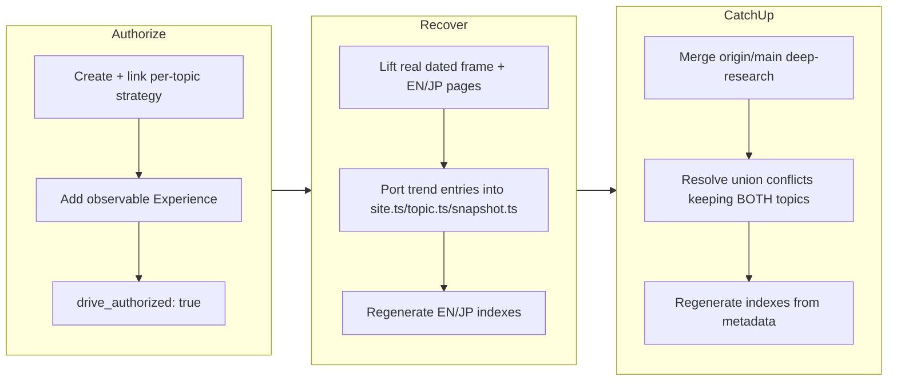

## 1. Overview

This branch **authorizes**, **recovers**, and **integrates** the trend-recency topic — a
recurring instrument that measures web-grounded knowledge recency (how correctly
search-augmented systems answer questions about recent real-world events) against
ungrounded controls. A prior overnight monitor had real-trialed and published
trend-recency on an orphan branch that was never merged; `main` then advanced past it.
The developer chose recover-first, so this branch ports only the trend-additive artifacts
onto current `main` without re-spending, then catches the branch up with `main` (which
had meanwhile merged the sibling deep-research topic, PR #60) keeping both topics.

**Highlights:**

1. Authorized the mission: created and linked the per-topic strategy
   `benchmark-how-well-ai-systems-keep-up-with-real-world-change`, added an observable
   `## Experience`, and stamped `drive_authorized: true` — satisfying the drive-auth guard
   without any spend.
2. Recovered a stranded real trial (dated frame `2026-07-17T01-34-36-857Z`,
   `fixture: false`, including the Grok Agent-Tools measured row) plus its published EN/JP
   pages onto current `main` — a spend-free integration with no paid re-run — by porting
   only trend entries into the shared `site.ts`/`snapshot.ts`/`topic.ts` and regenerating
   the indexes from metadata.
3. Caught the branch up with `main` after deep-research merged: resolved the union
   conflicts on the shared registries by keeping **both** topics, so neither the newly
   merged deep-research nor the recovered trend-recency was dropped.

## 2. Motivation

The trend-recency topic was real, already-paid-for work — a real validation trial and
published pages built overnight — left unreachable on an unmerged orphan branch while
`main` moved ahead. Discarding it and re-running would have wasted the spend; merging the
orphan wholesale would have reverted the newer topics that landed on `main`. The branch
exists to salvage that value cleanly: lift the topic-additive artifacts forward,
re-register the topic through the shared metadata without clobbering anything, close the
mission's authorization gate, and — once the sibling deep-research topic merged to `main`
mid-flight — reconcile with it so both topics ship together.

## 3. Changes

The branch opened by authorizing the mission
([49c2a6a](https://github.com/qmu/research/commit/49c2a6a)): the drive-auth guard requires
a linked strategy and an observable `## Experience`, so a per-topic strategy was minted
and linked and the Experience bar written before `drive_authorized: true` was stamped. It
then recovered the stranded topic
([6d063d4](https://github.com/qmu/research/commit/6d063d4)): the real dated trial frame and
the published EN/JP pages were lifted onto current `main`, and the topic was re-registered
by porting only its entries into the shared metadata before regenerating the indexes.
Finally, after deep-research merged to `main`, the branch caught up
([701e631](https://github.com/qmu/research/commit/701e631)), resolving the shared-registry
conflicts by keeping both topics. The archived tickets whose work landed in the recovery
commit are tracked below.

### 3-1. Publish the trend-recency topic (EN article + JP + site registration) ([6d063d4](https://github.com/qmu/research/commit/6d063d4))

Re-registered `trend-recency` in `publishedResearchTopics` (`site.ts`), set its stages to
`benchmark + insights + translation` (`topic.ts`), and added its snapshot extractor
(`snapshot.ts`) by porting only the trend entries, then regenerated the EN and JP indexes
and history from the shared metadata so the topic reappears in site order without
disturbing newer topics on `main`. The recovered current pages
(`trend-recency-comparison.{md,data.json,insights.ja.md}`) are real (`fixture: false`), and
`research -- trend-recency --fixture` recomposes them byte-identically from the committed
dated frame.

### 3-2. Instrument v3 repairs (Grok migration surfaced) ([6d063d4](https://github.com/qmu/research/commit/6d063d4))

The recovered report copy documents the instrument's honest state: the first real trial
verified the Gemini/OpenAI/Anthropic grounded wiring live and retired the xAI Live Search
surface (which returned `410 "Live search is deprecated"`); that adapter was migrated to
the Agent Tools `web_search` surface. Perplexity Sonar / Sonar Pro remain error rows until
`PERPLEXITY_API_KEY` is provisioned — no row is ever an assumed-working one.

### 3-3. Grok Agent-Tools live probe ([6d063d4](https://github.com/qmu/research/commit/6d063d4))

The migrated Grok Agent-Tools `web_search` surface was verified live on 2026-07-18,
turning the Grok grounded row from an error row into a measured row in the recovered frame.

## 4. Outcome

The trend-recency topic is restored on `main`: the `2026-07-17` real trial frame
(`fixture: false`), the EN/JP comparison pages, and the topic's `site.ts`/`topic.ts`/
`snapshot.ts` registration, all listed in both indexes — achieved as a spend-free
integration with no paid re-run. The recovery preserved every newer topic on `main`
because the shared files were re-derived by porting only trend entries, never overwritten
wholesale from the orphan, and `research -- trend-recency --fixture` reproduces the current
pages byte-identically, proving the ported artifacts are drift-safe. When deep-research
merged to `main` mid-flight, the catch-up merge resolved the union conflicts on the shared
registries by keeping both topics — deep-research kept in place, trend-recency appended as
the last active topic — so both appear in the EN and JP indexes in the same order. The
mission is authorized: the per-topic strategy
`benchmark-how-well-ai-systems-keep-up-with-real-world-change` is linked, an observable
`## Experience` is written, and `drive_authorized: true` is stamped. Local verification
passed on the merged tree per package (`packages/tech`: `npm test` 573 passed, `npm run
build`, `npm run lint` all exit 0), plus `check-fixture-drift.sh` exit 0 and a real
VitePress dead-link build exit 0.

## 5. Historical Analysis

The recovery mirrors the pattern used for the sibling deep-research topic on the same night
(PR #60): a stranded real trial on an unmerged orphan is integrated onto advanced `main` by
porting only the topic-additive artifacts and re-deriving shared files, rather than merging
the orphan wholesale or re-running the paid trial. The proposal-first gate blocking spend
but not scaffold, and per-subject error isolation rendering honest error rows rather than
fabricated numbers, both recur directly from the LLM-comparison and RAG topics' prior work
(PR #15's deferred concerns). The element specific to this branch is the three-way
reconciliation: two topics recovered independently on separate desks the same night, whose
shared-registry entries collided at merge time and were resolved by keeping both — the
union-merge discipline the control-master orchestration anticipates.

## 6. Concerns

### (carried from PR #15) Fixture determinism depends on careful seeding

- **Severity:** moderate
- **Description:** Byte-stable fixture reports require the pinned timestamp plus per-trial-index seeding; a future probe redesign could silently break byte-stability if the seeding strategy is not carried forward (`packages/tech/src/vendors/llm/fixture.ts`). This branch's byte-identical fixture reproduction of the recovered trend pages relies on that determinism but does not touch or re-document the seeding.
- **How to Fix:** Document the determinism precondition beside the fixture client and include a two-consecutive-runs byte-stability check in the quality gate of any ticket touching the fixture shape.

### (carried from PR #15) JSON artifact link resolution deferred

- **Severity:** moderate
- **Description:** Reports link to raw JSON run-artifacts by relative path, but the corporate copy only transfers Markdown, so transparency links will not resolve on the Astro site. The recovered trend-recency topic ships a `trend-recency-comparison.data.json` artifact and inherits this same unresolved-link gap.
- **How to Fix:** Extend `scripts/publish-research.sh` to copy `.data.json` alongside `.md`, or point artifact references at stable `raw.githubusercontent.com` URLs.

### (carried from PR #15) Model IDs require periodic live verification

- **Severity:** moderate
- **Description:** Curated model/product ids churn; the trend-recency subjects (Grok Agent Tools, Perplexity Sonar/Sonar Pro, Gemini/GPT/Claude search tools) are exactly the fast-moving search surfaces this concern warns about — the xAI Live Search → Agent Tools migration surfaced during this very trial — yet no last-verified date or per-provider deprecation policy is recorded.
- **How to Fix:** Schedule periodic verification runs against the providers, record a last-verified date, and document per-provider deprecation policies in `docs/dependency-decisions.md`.

### (carried from PR #15) Real-run cloud backend credentials and quotas are account-dependent

- **Severity:** low
- **Description:** Real runs depend on account-provisioned credentials and quotas; the recovered trend trial itself records honest error rows where subject keys were absent (Perplexity Sonar/Sonar Pro pending `PERPLEXITY_API_KEY`), which is consistent with this concern rather than resolving it.
- **How to Fix:** Keep the honest-error rendering and document the account prerequisites beside each subject's reproduction steps.

### Recovered trial does not yet discriminate all subjects on real data

- **Severity:** moderate
- **Description:** The recovered `2026-07-17` frame carries honest `error` rows for the Perplexity Sonar and Sonar Pro subjects (no `PERPLEXITY_API_KEY` at the original run), so the published survey does not yet cover every configured surface with a measured row. Grok was recovered as a measured row (Agent Tools verified 2026-07-18) and the Gemini/GPT/Claude grounded-vs-control pairs discriminate cleanly, so the design is validated — coverage, not the instrument, is the gap.
- **How to Fix:** Run the authorized real trial with the Perplexity key present under the now drive-authorized mission, then re-archive and re-publish so every configured surface is a measured row.

## 7. Successful Development Patterns

- Recover-first over re-run: integrating a stranded real trial from an unmerged orphan onto advanced `main` by porting only the topic-additive artifacts captured the already-spent value without a paid re-run.
- Re-deriving shared files by porting only the topic's entries (into `site.ts`, `topic.ts`, `snapshot.ts`) rather than overwriting them wholesale from the orphan preserved every newer topic on `main`.
- Union-merge discipline at catch-up: when two independently-recovered topics collided on the same registry slots, resolving by keeping BOTH (main's entry in place, the branch's appended) is the rule that keeps a parallel-desk night from silently dropping a sibling's work.
- Using the fixture path as a drift-safety proof: confirming `research -- trend-recency --fixture` recomposes the recovered pages byte-identically verified the recovery was faithful before it was committed, and `check-fixture-drift.sh` + a real VitePress dead-link build confirmed the integration end to end.
- Satisfying the drive-authorization guard with a purpose-built per-topic strategy plus an observable `## Experience` kept the paid trial gated behind explicit approval while still unblocking the drive.

## 8. Release Preparation

**Verdict**: Ready for release

### 8-1. Concerns

- The branch-safety scan returned two `override`-tier size findings only: the catch-up merge commit [701e631](https://github.com/qmu/research/commit/701e631) (4231 non-generated changed lines — it pulls the entire deep-research topic in via the merge) and the recovery commit [6d063d4](https://github.com/qmu/research/commit/6d063d4) (2280 lines — the whole-topic trend recovery: real trial frame, pages, and registration). Both are legitimately large; no secret or leak findings.

### 8-2. Pre-release Instructions

- At `/ship`, consciously accept the size override for the two large-but-legitimate commits when prompted (this is exactly the case the `override` tier exists for).
- The merge commit has two parents (`6d063d4`, `c4b8545`); merge to `main` normally.

### 8-3. Post-release Instructions

- Reflect the recovered trend-recency JP page and index order onto `qmu-co-jp` via the `/ship` publish-ticket flow (the topic is newly re-registered, so the corporate copy set and navigation must pick it up alongside deep-research).

## 9. Notes

This branch is a spend-free recovery + authorization + catch-up; the paid real trial that
would fill the Perplexity error rows remains gated behind the now drive-authorized mission
and is the natural next `/drive`. The four carried concerns are pre-existing repo-wide
infrastructure notes from PR #15 that this branch does not resolve (it recovers a topic
rather than touching fixture seeding, the corporate copy set, model-id verification, or
cloud-cred provisioning); they were judged `still_active` and stay in the corpus.
