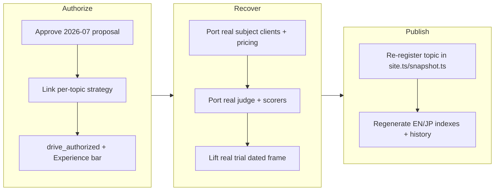

## 1. Overview

This branch does two things at once: it **authorizes** the deep-research mission
(per-topic strategy, developer-approved proposal, `drive_authorized: true`), and it
**recovers** the deep-research topic — real subject clients, a real LLM judge, a real
validation trial, and published EN/JP pages — from a stranded orphan branch onto
current `main` without re-spending. A prior overnight monitor had built, real-trialed,
and published deep-research on `work-20260718`, but that branch was never merged and
`main` advanced past it; a wholesale merge would have reverted newer work. The developer
chose recover-first, so this branch ports only the deep-research-additive artifacts and
re-derives shared files by porting the deep-research entries alone.

**Highlights:**

1. Recovered a stranded real deep-research trial (dated frame `2026-07-19T02-12-52-868Z`, `fixture: false`) plus its five real subject clients, real judge, and published EN/JP pages onto current `main` — a spend-free integration with no paid re-run.
2. Registered the topic by porting only the deep-research entries into the shared `site.ts` and `snapshot.ts`, then regenerating EN/JP indexes and history from metadata, so no newer work on `main` was overwritten.
3. Authorized the mission: approved the 2026-07-verified proposal at the Floor tier, replaced the interim strategy with the per-topic strategy `periodically-benchmark-deep-research-autonomous-research-apis`, and stamped `drive_authorized: true` with an explicit "rows discriminate the five subjects" Experience bar.

## 2. Motivation

The deep-research topic represented real, already-paid-for work — a full agentic-API
comparison built and trialed overnight — that had been left unreachable on an unmerged
orphan branch while `main` moved ahead. Discarding it and re-running would have wasted
the spend; merging it wholesale would have reverted the newer topics that landed on
`main` in the interim. The branch therefore exists to salvage that value: lift the
topic-additive artifacts forward cleanly, re-register the topic through the shared
metadata without clobbering anything, and — in the same push — close the mission's
authorization gate so the topic has an approved, drive-authorized home going forward.

## 3. Changes

The branch opened by making the deep-research proposal decision-ready and taking it
through the developer approval gate, then linking a per-topic strategy so the mission
could be marked drive-authorized. It then recovered the stranded topic: the five real
provider clients and pure pricing, the real rubric+citation judge, the real dated trial
frame, and the published pages were lifted onto current `main`, and the topic was
re-registered by porting only its entries into the shared metadata before regenerating
the indexes. The six subsections below track the archived tickets whose work landed in
the recovery commit ([5e87927](https://github.com/qmu/research/commit/5e87927)); the
authorization commits ([2393640](https://github.com/qmu/research/commit/2393640),
[c29772c](https://github.com/qmu/research/commit/c29772c),
[31241f8](https://github.com/qmu/research/commit/31241f8)) carry the mission-governance
half of the branch.

### 3-1. Verify and refresh the deep-research proposal against current (2026-07) offerings ([5e87927](https://github.com/qmu/research/commit/5e87927))

Keyless web research re-verified all five subjects as API-accessible as of 2026-07-18 —
OpenAI `o3`/`o4-mini-deep-research`, Perplexity `sonar-deep-research`, Gemini Deep
Research (Interactions API), xAI Grok DeepSearch, and the Anthropic build-your-own
baseline — and refreshed `proposal.md`'s subjects table, cadence, and cost figures
(blended ~$1–4/query; Floor 20-query trial ~$25–60) in place, leaving the developer
approval gate untouched.

### 3-2. Wire the five deep-research subjects behind `vendors/` ([5e87927](https://github.com/qmu/research/commit/5e87927))

Implemented each provider's real agentic endpoint behind the `DeepResearchClient` port
in `packages/tech/src/vendors/deep-research/providers.ts`, with pure per-query cost
derived from billed usage in `pricing.ts`. Per-subject error isolation in the runner
turns any provider-shape surprise or absent key into an honest `error` row rather than a
fabricated number.

### 3-3. Implement the metrics + real judge ([5e87927](https://github.com/qmu/research/commit/5e87927))

Replaced the deferred judge with a live LLM judge in
`packages/tech/src/deep-research/run.ts`: rubric answer-quality via structured output and
citation validity via real URL fetch plus a batched LLM support-check, recording every
score, timing, cost, and citation domain in the `.data.json` artifact while the pure
scorers stay unit-tested.

### 3-4. Run the owner-approved first real deep-research trial ([5e87927](https://github.com/qmu/research/commit/5e87927))

Recovered the disposable validation trial as the dated survey frame
`history/deep-research/2026-07-19T02-12-52-868Z/` with `fixture: false`. Because the
trial was recovered rather than re-run, this branch spent nothing; the frame carries
honest error rows where subject keys were absent at the original run.

### 3-5. Publish the deep-research topic (EN article + JP + site registration) ([5e87927](https://github.com/qmu/research/commit/5e87927))

Re-registered `deep-research` in `publishedResearchTopics` (`site.ts`) and the snapshot
extractor (`snapshot.ts`) by porting only the deep-research entries, then regenerated the
EN and JP indexes and history from the shared metadata, so the topic reappears in site
order without disturbing newer topics on `main`.

### 3-6. Wire the HistoryPoint series for the deep-research 推移 block ([5e87927](https://github.com/qmu/research/commit/5e87927))

Wired one HistoryPoint per subject per survey (rubric quality primary; cost and latency
secondary) so the 推移 trend block accumulates across dated frames, connecting only
same-manifest-version points. Until a second same-instrument survey exists the block
renders as a plain note, per the guideline.

## 4. Outcome

The deep-research topic is fully restored on `main`: five real subject clients and pure
pricing, a real rubric+citation judge, the `2026-07-19` real trial frame, and the EN/JP
comparison pages, all reachable through the shared `site.ts`/`snapshot.ts` registration
and listed in both indexes — achieved as a spend-free integration with no paid re-run.
The recovery preserved every newer topic on `main` because shared files were re-derived
by porting only deep-research entries, never overwritten wholesale from the orphan, and
`research -- deep-research --fixture` reproduces the current pages byte-identical, proving
the ported artifacts are drift-safe. In parallel, the mission is now authorized: the
2026-07-verified proposal is developer-approved, the per-topic strategy
`periodically-benchmark-deep-research-autonomous-research-apis` is linked, and the mission
carries `drive_authorized: true` with an explicit Experience bar requiring the published
survey's rows to discriminate the five subjects. Local verification passed per package
(`packages/tech`: `npm test`, `npm run build`, `npm run lint` all exit 0; `make drift`
clean).

## 5. Historical Analysis

The recovery mirrors the pattern established across this repository's other periodic
topics (deep-research was scaffolded keyless, then gated behind the proposal-first
approval before any paid client or trial — the same shape as the svg-generation, speech,
agent-vm, and computer-use topics). The proposal-first gate blocking spend but not
scaffold, and per-subject error isolation rendering honest error/fixtured states rather
than fabricated numbers, both recur directly from the LLM-comparison and RAG topics'
prior work (PR #15's deferred concerns). The novel element here is integration strategy:
recovering a stranded real trial from an unmerged orphan onto advanced `main` by porting
topic-additive artifacts and re-deriving shared files, rather than merging or re-running.

## 6. Concerns

### (carried from PR #15) Fixture determinism depends on careful seeding

- **Severity:** moderate
- **Description:** Byte-stable fixture reports require the pinned timestamp plus per-trial-index seeding; a future probe redesign could silently break byte-stability if the seeding strategy is not carried forward (in `packages/tech/src/vendors/llm/fixture.ts`). This branch's fixture reproduction of the recovered pages relies on that determinism but does not touch or re-document the seeding.
- **How to Fix:** Document the determinism precondition beside the fixture client and include a two-consecutive-runs byte-stability check in the quality gate of any ticket touching the fixture shape.

### (carried from PR #15) JSON artifact link resolution deferred

- **Severity:** moderate
- **Description:** Reports link to raw JSON run-artifacts by relative path, but the corporate copy only transfers Markdown, so transparency links will not resolve on the Astro site. The recovered deep-research topic ships a `deep-research-comparison.data.json` artifact and inherits this same unresolved-link gap.
- **How to Fix:** Extend `scripts/publish-research.sh` to copy `.data.json` alongside `.md`, or point artifact references at stable `raw.githubusercontent.com` URLs.

### (carried from PR #15) Model IDs require periodic live verification

- **Severity:** moderate
- **Description:** Curated model ids churn; this branch adds five deep-research subject model ids in `packages/tech/src/deep-research/models.ts` but records no last-verified date and no per-provider deprecation policy, so the same drift risk applies to the new subjects.
- **How to Fix:** Schedule periodic verification runs against the providers, record a last-verified date in `models.ts`, and document per-provider deprecation policies in `docs/dependency-decisions.md`.

### (carried from PR #15) Real-run cloud backend credentials and quotas are account-dependent

- **Severity:** low
- **Description:** Real runs depend on account-provisioned credentials and quotas; the recovered deep-research trial itself records honest error rows where subject keys were absent, which is consistent with this concern rather than resolving it.
- **How to Fix:** Keep the honest-error rendering and document the account prerequisites beside each backend's reproduction steps.

### Recovered trial does not yet discriminate all five subjects on real data

- **Severity:** moderate
- **Description:** The recovered `2026-07-19` frame carries honest `error` rows for subjects whose API keys were absent at the original run (see [5e87927](https://github.com/qmu/research/commit/5e87927) in `docs/research-reports/deep-research-comparison.data.json`), so the published survey's rows do not yet fully meet the mission's Experience bar of discriminating the five subjects on quality/cost/latency.
- **How to Fix:** Run the authorized Floor-tier real trial with all five subject keys present under the now drive-authorized mission, then re-archive and re-publish so every row is a measured subject.

## 7. Successful Development Patterns

- Recover-first over re-run: integrating a stranded real trial from an unmerged orphan onto advanced `main` by porting only the topic-additive artifacts captured the already-spent value without a paid re-run — the right move when `main` has moved past the orphan.
- Re-deriving shared files by porting only the topic's entries (into `site.ts` and `snapshot.ts`) rather than overwriting them wholesale from the orphan preserved every newer topic that had landed on `main` in the interim.
- Using the fixture path as a drift-safety proof: confirming `research -- deep-research --fixture` reproduces the ported pages byte-identical verified the recovery was faithful before it was committed.
- Per-subject error isolation in the runner turns an absent key or provider-shape surprise into an honest `error` row instead of a fabricated number, keeping the survey trustworthy even when coverage is partial.
- Satisfying the drive-authorization guard with a purpose-built per-topic strategy kept the paid trial gated behind explicit developer approval while still unblocking the drive.

## 8. Release Preparation

**Verdict**: Ready for release

### 8-1. Concerns

- The branch-safety scan returned two `override`-tier size findings only: commit [5e87927](https://github.com/qmu/research/commit/5e87927) (4134 non-generated changed lines — the whole-topic recovery: provider clients, judge, trial frame, and pages) and commit [2393640](https://github.com/qmu/research/commit/2393640) (522 lines — proposal approval plus the emitted ticket queue). Both are legitimately large; no secret or leak findings.

### 8-2. Pre-release Instructions

- At `/ship`, consciously accept the size override for the two large-but-legitimate commits when prompted (this is exactly the case the `override` tier exists for).

### 8-3. Post-release Instructions

- Reflect the recovered deep-research JP page and index order onto `qmu-co-jp` via the `/ship` publish-ticket flow (the topic is newly re-registered, so the corporate copy set and navigation must pick it up).

## 9. Notes

This branch is a spend-free recovery + authorization; the paid Floor-tier real trial that
would fill the currently-error rows remains gated behind the now drive-authorized mission
and is the natural next `/drive`. The four carried concerns are pre-existing repo-wide
infrastructure notes from PR #15 that this branch does not resolve (it recovers a topic
rather than touching fixture seeding, the corporate copy set, model-id verification, or
cloud-cred provisioning); they were judged `still_active` and stay in the corpus.
