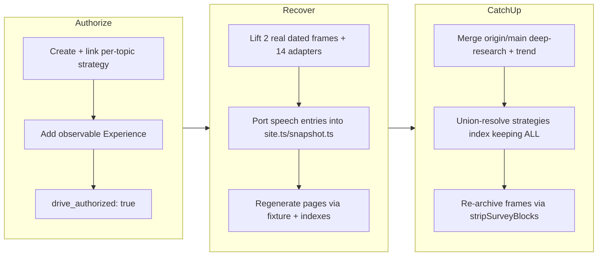

## 1. Overview

This branch **authorizes**, **recovers**, and **integrates** the speech topic — a
recurring instrument that measures API-accessible speech AI across text-to-speech (TTS)
intelligibility and latency, speech-to-text (STT) word accuracy and latency, per-unit
cost, and speech-to-speech (STS) realtime round-trip latency. A prior overnight monitor
had wired the real provider adapters, run the first real trial, and measured STS latency
on an orphan branch (`tts`, `b5f2878`) that was never merged; `main` then advanced past it.
The developer chose recover-first, so this branch ports only the speech-additive artifacts
onto current `main` without re-spending, then catches the branch up with `main` (which had
meanwhile merged the sibling deep-research and trend-recency topics, PRs #60/#61) keeping
all three topics.

**Highlights:**

1. Authorized the mission: created and linked the per-topic strategy
   `periodically-benchmark-speech-ai-capabilities-tts-stt-sts`, added an observable
   `## Experience`, and stamped `drive_authorized: true` — satisfying the drive-auth guard
   without any spend.
2. Recovered a stranded real trial (two dated frames `2026-07-18T15-09-30-905Z` and
   `2026-07-19T02-22-34-606Z`, both `fixture: false`), 14 REST/realtime TTS/STT/STS
   provider adapters, and the STS round-trip-latency metric onto current `main` — a
   spend-free integration with no paid re-run — by porting only speech entries into the
   shared `site.ts`/`snapshot.ts` and regenerating the indexes from metadata.
3. Caught the branch up with `main` after deep-research and trend-recency merged: resolved
   the union conflict on `strategies/index.md` by keeping **all three** strategies, and
   re-archived the speech frames through the merged `stripSurveyBlocks` transform so they
   are pure article snapshots with no dead cross-run navigation links.

## 2. Motivation

The speech topic's real, already-paid-for work — the wired provider adapters, the first
real validation trial, and the STS latency measurement, all built overnight — was left
unreachable on an unmerged orphan branch while `main` moved ahead. Discarding it and
re-running would have wasted the spend; merging the orphan wholesale would have reverted
the newer topics that landed on `main`. The branch exists to salvage that value cleanly:
lift the topic-additive artifacts forward, re-register the topic through the shared
metadata without clobbering anything, close the mission's authorization gate, and — once
the sibling deep-research and trend-recency topics merged to `main` mid-flight — reconcile
with them so all three topics ship together, applying the merged frame-nav fix to leave the
recovered speech frames dead-link-clean.

## 3. Changes

The branch opened by authorizing the mission
([8a9be69](https://github.com/qmu/research/commit/8a9be69),
[88b6917](https://github.com/qmu/research/commit/88b6917)): the drive-auth guard requires a
linked strategy and an observable `## Experience`, so a per-topic strategy was minted and
linked and the Experience bar written before `drive_authorized: true` was stamped. It then
recovered the stranded topic ([d561c6a](https://github.com/qmu/research/commit/d561c6a)):
the two real dated trial frames, the 14 REST/realtime provider adapters, and the STS metric
were lifted onto current `main`, and the topic was re-registered by porting only its speech
hunk into the shared metadata before recomposing the published pages via the keyless
fixture. Finally, after deep-research and trend-recency merged to `main`, the branch caught
up ([c06c51f](https://github.com/qmu/research/commit/c06c51f)), resolving the shared
`strategies/index.md` conflict by keeping all three strategies and re-archiving the speech
frames through the merged `stripSurveyBlocks` transform. The archived tickets whose work
landed in the recovery commit are tracked below.

### 3-1. Wire remaining real adapters and run the first real trial ([d561c6a](https://github.com/qmu/research/commit/d561c6a))

Lifted 14 REST/realtime TTS/STT/STS adapters (`ElevenLabs`, `Google`, `Deepgram`,
`AssemblyAI`, `OpenAI Realtime`, `Gemini Live`, plus the shared `realtime` port) behind the
existing `vendors/speech/` anti-corruption ports, and preserved two real dated trial frames
(`2026-07-18T15-09-30-905Z` and `2026-07-19T02-22-34-606Z`, both `fixture: false`) under
`docs/research-reports/history/speech/`. The published page stays the keyless fixture
snapshot per the fixture-drift invariant (real numbers live only in the dated frames), so
the current pages were recomposed with `research -- speech --fixture` rather than copied
from the orphan's real page. Registration ported only the speech hunk into `site.ts`
(adding the `stsRoundTripLatencyMs` metric) and lifted the speech snapshot extractor into
`snapshot.ts`; `topic.ts`/`run-research.ts` already carried speech from before.

### 3-2. Measure STS round-trip latency ([d561c6a](https://github.com/qmu/research/commit/d561c6a))

Speech-to-speech was upgraded from a cataloged realtime capability row to a timed metric:
`stsRoundTripLatencyMs` (lower-is-better, first-audio-out after last-audio-in) now lives in
the domain types, run aggregation, report, and the `site.ts` `design.metrics`, with a
keyless fixture that returns a deterministic round-trip so the fixture path stays
byte-stable.

### 3-3. Frame-nav dead-link fix via the merged transform ([c06c51f](https://github.com/qmu/research/commit/c06c51f))

The recovered `2026-07-19` JP frame carried a `過去の調査 / Past surveys` block whose
`./history/speech/...` link is doubled-path (dead) from inside a frame directory. The
catch-up merge brought main's `stripSurveyBlocks` archive-runner fix; because the orphan's
real current pages are not present in this worktree (a plain re-archive would overwrite the
measured frames with the current fixture content), the same merged `stripSurveyBlocks`
transform was applied in place to the existing real frames instead — preserving every
measured number and removing only the cross-run survey blocks. An earlier hand-strip
([2c13bb1](https://github.com/qmu/research/commit/2c13bb1)) was intentionally reverted
([96ad522](https://github.com/qmu/research/commit/96ad522)) in favor of this principled,
reproducible code-based fix.

## 4. Outcome

The speech topic is restored on `main`: the two real trial frames (`2026-07-18` and
`2026-07-19`, `fixture: false`), the 14 REST/realtime provider adapters, the STS
round-trip-latency metric, and the topic's `site.ts`/`snapshot.ts` registration, all listed
in both indexes — achieved as a spend-free integration with no paid re-run. The recovery
preserved every newer topic on `main` because the shared files were re-derived by porting
only the speech hunk, never overwritten wholesale from the orphan, and `research -- speech
--fixture` reproduces the current pages byte-identically, proving the ported artifacts are
drift-safe. When deep-research and trend-recency merged to `main` mid-flight, the catch-up
merge resolved the union conflict on `strategies/index.md` by keeping all three strategies.
The recovered frames are now pure article snapshots (no dead survey-nav links) via the
merged `stripSurveyBlocks` transform, applied so that measured data is preserved. The
mission is authorized: the per-topic strategy
`periodically-benchmark-speech-ai-capabilities-tts-stt-sts` is linked, an observable
`## Experience` is written, and `drive_authorized: true` is stamped. Local verification
passed on the merged tree per package (`packages/tech`: `npm test` 618 passed / 1 skipped,
`npm run build`, `npm run lint` all exit 0), plus `check-fixture-drift.sh` exit 0 and a real
VitePress dead-link build exit 0 with zero dead links.

## 5. Historical Analysis

The recovery mirrors the pattern used for the sibling deep-research (PR #60) and
trend-recency (PR #61) topics on the same night: a stranded real trial on an unmerged orphan
is integrated onto advanced `main` by porting only the topic-additive artifacts and
re-deriving shared files, rather than merging the orphan wholesale or re-running the paid
trial. The published-page-stays-fixture / real-runs-live-in-history-frames invariant, and
per-subject error isolation rendering honest unreachable rows rather than fabricated
numbers, both recur directly from the LLM-comparison and RAG topics' prior work (PR #15's
deferred concerns). The element specific to this branch is the frame-nav dead-link fix under
a constraint the deep-research precedent did not hit: with no real current pages present,
the archive-runner's read-from-current-pages path would have destroyed the measured frames,
so the same merged `stripSurveyBlocks` function was applied in place to the committed real
frames — the safe equivalent that preserves the measured data.

## 6. Concerns

### Amazon Polly / Transcribe adapters deferred

- **Severity:** moderate
- **Description:** The recovered adapter set wired every registry subject that fits the instrument's in-memory, single-shot, API-key REST model, but Amazon Polly (TTS) and Transcribe (STT) were deferred: Polly authenticates with AWS SigV4 (not a bearer key) and Transcribe has no synchronous single-shot REST call (batch-to-S3). They remain honest error/fixture rows in the published survey, tracked by icebox ticket `20260718203009-speech-amazon-adapters-sigv4`.
- **How to Fix:** Resolve the SigV4 credential-contract decision (reuse `AwsSigV4Credential` from `bedrock.ts` or sign with `node:crypto`) and the Transcribe async-S3 design, then wire both behind the existing ports.

### Recovered trial does not yet discriminate all subjects on real data

- **Severity:** moderate
- **Description:** The recovered frames carry honest `error`/unreachable rows for subjects whose provider keys were absent at the original run (and for the not-yet-wired Amazon subjects), so the published survey does not yet cover every configured subject with a measured row. The wired providers and the STS metric validate the design — coverage, not the instrument, is the gap.
- **How to Fix:** Run the authorized real trial with the full provider key set present under the now drive-authorized mission (≤$10 ceiling), then re-archive and re-publish so every configured subject is a measured row.

### (carried from PR #15) JSON artifact link resolution deferred

- **Severity:** moderate
- **Description:** Reports link to raw JSON run-artifacts by relative path, but the corporate copy only transfers Markdown, so transparency links will not resolve on the Astro site. The recovered speech topic ships `speech-comparison.data.json` and inherits this same unresolved-link gap.
- **How to Fix:** Extend `scripts/publish-research.sh` to copy `.data.json` alongside `.md`, or point artifact references at stable `raw.githubusercontent.com` URLs.

### (carried from PR #15) Model IDs require periodic live verification

- **Severity:** moderate
- **Description:** Curated speech model/product ids churn (TTS voices, STT models, realtime endpoints); the registry records a `lastVerified` date but the fast-moving realtime surfaces in particular need periodic re-checking.
- **How to Fix:** Schedule periodic verification runs against the providers, refresh `lastVerified`, and document per-provider deprecation policy in `docs/dependency-decisions.md`.

### (carried from PR #15) Real-run credentials and quotas are account-dependent

- **Severity:** low
- **Description:** Real runs depend on account-provisioned provider keys and quotas; the recovered frames record honest error rows where keys were absent, which is consistent with this concern rather than resolving it.
- **How to Fix:** Keep the honest-error rendering and document the account prerequisites beside each subject's reproduction steps.

## 7. Successful Development Patterns

- Recover-first over re-run: integrating a stranded real trial from an unmerged orphan onto advanced `main` by porting only the topic-additive artifacts captured the already-spent value without a paid re-run.
- Re-deriving shared files by porting only the speech hunk (into `site.ts`, `snapshot.ts`) rather than overwriting them wholesale from the orphan preserved every newer topic on `main`.
- Using the fixture path as a drift-safety proof: confirming `research -- speech --fixture` recomposes the recovered pages byte-identically verified the recovery was faithful, and `check-fixture-drift.sh` + a real VitePress dead-link build confirmed the integration end to end.
- Applying the merged `stripSurveyBlocks` transform in place to the committed real frames — rather than the archive-runner's read-from-current-pages path — was the key insight that cleaned the dead frame-nav links without destroying the measured data those frames uniquely hold.
- Satisfying the drive-authorization guard with a purpose-built per-topic strategy plus an observable `## Experience` kept the paid trial gated behind explicit approval while still unblocking the drive.

## 8. Release Preparation

**Verdict**: Ready for release

### 8-1. Concerns

- The branch-safety scan returned two `override`-tier size findings only: the catch-up merge commit [c06c51f](https://github.com/qmu/research/commit/c06c51f) (6793 non-generated changed lines — it pulls the deep-research + trend-recency topics in via the merge) and the recovery commit [d561c6a](https://github.com/qmu/research/commit/d561c6a) (5259 lines — the whole-topic speech recovery: two real trial frames, 14 adapters, pages, and registration). Both are legitimately large; no secret or leak findings.

### 8-2. Pre-release Instructions

- At `/ship`, consciously accept the size override for the two large-but-legitimate commits when prompted (this is exactly the case the `override` tier exists for).
- The merge commit `c06c51f` has two parents (`96ad522`, `2b0e1cd`); merge to `main` normally.

### 8-3. Post-release Instructions

- Reflect the recovered speech JP page and index order onto `qmu-co-jp` via the `/ship` publish-ticket flow (the topic is newly re-registered, so the corporate copy set and navigation must pick it up alongside deep-research and trend-recency).

## 9. Notes

This branch is a spend-free recovery + authorization + catch-up; the paid real trial that
would fill the remaining error rows (including the deferred Amazon subjects) stays gated
behind the now drive-authorized mission and is the natural next `/drive`. The general
frame-nav fix ticket `20260722140000-fix-history-frame-series-nav-dead-link` arrived from
`main` and is topic-wide; this branch applies its result to the speech frames but leaves the
ticket open for the remaining topics. The carried concerns are pre-existing repo-wide
infrastructure notes that this branch does not resolve; they were judged still active and
stay in the corpus.
