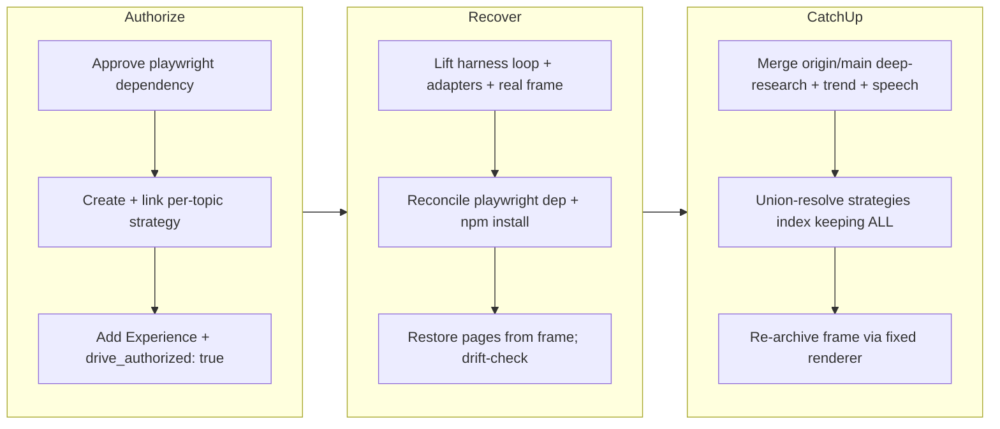

## 1. Overview

This branch **authorizes**, **recovers**, and **integrates** the computer-use topic — a
recurring instrument that measures API-native computer-use agents (a model driving a real
browser to complete a multi-step web task) on task success, step count, latency, wall-clock,
per-task cost, and recovery. A prior overnight monitor had implemented the real Playwright
harness loop, run the first real trial, and added `playwright` as a new dependency on an
orphan branch (`work-20260718-203006`, `9ceb917`) that was never merged; `main` then advanced
past it. The developer chose recover-first, so this branch ports only the computer-use-additive
artifacts onto current `main` without re-spending, then catches the branch up with `main`
(which had meanwhile merged the sibling deep-research, trend-recency, and speech topics, PRs
#60/#61/#62) keeping all topics.

**Highlights:**

1. Authorized the mission: created and linked the per-topic strategy
   `periodically-benchmark-computer-use-browser-agent-capabilities`, added an observable
   `## Experience`, and stamped `drive_authorized: true` — satisfying the drive-auth guard
   without any spend.
2. Recovered the stranded real trial (dated frame `2026-07-18T15-08-10-261Z`, `fixture: false`,
   2 of 3 rows measured), the real Playwright harness loop with its provider-neutral
   `AgentPolicy` seam and keyless oracle self-test, the three provider adapters, and — the
   element unique to this topic — the **new `playwright` dependency** (`^1.61.1`), reconciled
   onto current `main` as a clean add with no paid re-run.
3. Caught the branch up with `main` after deep-research, trend-recency, and speech merged:
   resolved the union conflict on `strategies/index.md` by keeping **all four** strategies, and
   re-archived the computer-use frame through the merged archive-runner fix so it is a pure
   article snapshot with no dead cross-run navigation link.

## 2. Motivation

The computer-use topic's real, already-paid-for work — the wired Playwright harness loop, the
three provider brains, and the first real validation trial, all built overnight — was left
unreachable on an unmerged orphan branch while `main` moved ahead. Discarding it and re-running
would have wasted the spend; merging the orphan wholesale would have reverted the newer topics
that landed on `main`. The branch exists to salvage that value cleanly: lift the topic-additive
artifacts forward (including the new `playwright` dependency, reconciled rather than force-copied),
re-register nothing that was already registered, close the mission's authorization gate, and —
once the sibling deep-research, trend-recency, and speech topics merged to `main` mid-flight —
reconcile with them so all topics ship together, applying the merged frame-nav fix to leave the
recovered computer-use frame dead-link-clean.

## 3. Changes

The branch opened by authorizing the mission
([2e5fc91](https://github.com/qmu/research/commit/2e5fc91),
[a3e69aa](https://github.com/qmu/research/commit/a3e69aa)): the developer approved the
`playwright` dependency and the first real trial, so the dependency decision was recorded and the
gated trial ticket unblocked, then — the drive-auth guard requiring a linked strategy and an
observable `## Experience` — a per-topic strategy was minted and linked and the Experience bar
written before `drive_authorized: true` was stamped. It then recovered the stranded topic
([a3abca4](https://github.com/qmu/research/commit/a3abca4)): the real Playwright harness loop, the
three provider adapters, the dated real trial frame, and the new `playwright` dependency were
lifted onto current `main`; because every shared file was byte-identical to the merge-base, the
lift was a clean copy, and the dependency was reconciled (not force-overwritten) before
`npm install`. Finally, after deep-research, trend-recency, and speech merged to `main`, the
branch caught up ([659cf72](https://github.com/qmu/research/commit/659cf72)), resolving the shared
`strategies/index.md` conflict by keeping all four strategies and re-archiving the computer-use
frame through the merged archive-runner fix. The archived tickets whose work landed in the
recovery commit are tracked below.

### 3-1. Implement the real Playwright harness loop ([a3abca4](https://github.com/qmu/research/commit/a3abca4))

Lifted the fixed Playwright harness (`computer-use/vendors/playwright-harness.ts`), the
provider-neutral `AgentPolicy` think-seam and the keyless oracle policy
(`oracle-policy.ts`), and the three provider brains behind the existing `ComputerUseClient`
port (`vendors/llm/computer-use.ts`), replacing the earlier `HARNESS_PENDING` refusals. The
harness serves the pinned deterministic fixture site, runs the observe→think→act loop with a
fresh browser context per attempt and selector/coordinate actuation, and decides success through
the domain `evaluatePredicate` seam — the scoring is not re-implemented in the vendor layer. A
keyless oracle self-test drives a real chromium and solves 8/8 while the noop control solves 0/8,
proving the suite measures capability, not page-loading. `playwright` (`^1.61.1`) is the only new
dependency; it is imported dynamically (`await import("playwright")`) so the keyless fixture and
estimate paths never load it, and the real-browser self-test is env-gated
(`COMPUTER_USE_BROWSER_TEST=1`) so CI stays browser-free.

### 3-2. Run the first real trial (guideline step 3) ([a3abca4](https://github.com/qmu/research/commit/a3abca4))

Preserved the real dated trial frame `2026-07-18T15-08-10-261Z` (`fixture: false`) with its
design-validation review under `docs/research-reports/history/computer-use/`. Two of three rows
are measured: Anthropic `computer_20251124` on Claude Sonnet 5 at 25% task success; Google
`computer_use` on Gemini 2.5 `measured` at 0%; OpenAI `computer` an honest `error` on a
browser-context crash. A live probe diagnosed the two shortfalls as one root cause — the OpenAI
Responses and Google computer-use tools are stateful multi-turn protocols the memoryless v1 policy
cannot drive — so the OpenAI/Google adapters were hardened to record an honest not-measured error
rather than a fabricated 0%, and the follow-up threaded-loop work was filed as icebox
`20260719003000-computer-use-stateful-provider-loops`. Per the fixture-drift invariant the
published page is restored from the measured frame (real numbers live in the dated frame), and
`research -- computer-use --fixture` recomposes it byte-identically; `topic.ts`/`site.ts`/
`snapshot.ts` already carried computer-use from the keyless build, so no re-registration was
needed.

### 3-3. Frame-nav dead-link fix via the merged renderer ([659cf72](https://github.com/qmu/research/commit/659cf72))

The recovered JP frame carried a `過去の調査 / Past surveys` block whose `./history/computer-use/...`
link is doubled-path (dead) from inside the frame directory. The catch-up merge brought main's
archive-runner fix; because computer-use's real current pages are present in this worktree
(restored from the measured frame), a standard re-archive
(`research:archive -- computer-use --generated-at 2026-07-18T15:08:10.261Z`) regenerated the frame
through the fixed renderer — preserving every measured number and stripping only the dead
cross-run survey block. An earlier hand-strip
([67d5bad](https://github.com/qmu/research/commit/67d5bad)) was intentionally reverted
([8de5c3c](https://github.com/qmu/research/commit/8de5c3c)) in favor of this principled,
reproducible code-based fix.

## 4. Outcome

The computer-use topic is restored on `main`: the real trial frame (`2026-07-18`, `fixture:
false`, 2/3 measured), the real Playwright harness loop with its `AgentPolicy` seam and keyless
oracle self-test, the three provider adapters, and the new `playwright` dependency — achieved as a
spend-free integration with no paid re-run. The recovery preserved every newer topic on `main`
because the dependency and shared files were reconciled rather than force-copied from the orphan,
and `research -- computer-use --fixture` reproduces the current page byte-identically, proving the
ported artifacts are drift-safe. When deep-research, trend-recency, and speech merged to `main`
mid-flight, the catch-up merge resolved the union conflict on `strategies/index.md` by keeping all
four strategies. The recovered frame is now a pure article snapshot (no dead survey-nav link) via
the merged archive-runner fix. The mission is authorized: the per-topic strategy
`periodically-benchmark-computer-use-browser-agent-capabilities` is linked, an observable
`## Experience` is written, and `drive_authorized: true` is stamped. Local verification passed on
the merged tree per package (`packages/tech`: `npm test` 639 passed / 2 skipped, `npm run build`,
`npm run lint` all exit 0, CI kept browser-free), plus `check-fixture-drift.sh` exit 0 and a real
VitePress dead-link build exit 0 with zero dead links.

## 5. Historical Analysis

The recovery mirrors the pattern used for the sibling deep-research (PR #60), trend-recency (PR
#61), and speech (PR #62) topics on the same night: a stranded real trial on an unmerged orphan is
integrated onto advanced `main` by porting only the topic-additive artifacts and re-deriving or
reconciling shared files, rather than merging the orphan wholesale or re-running the paid trial.
The published-page-stays-fixture / real-runs-live-in-history-frames invariant, and per-subject
error isolation rendering honest unreachable rows rather than fabricated numbers, both recur
directly from the LLM-comparison and RAG topics' prior work (PR #15's deferred concerns) and here
catch the two stateful provider tools as honest errors. The element specific to this branch is the
**new dependency**: unlike the sibling recoveries, which added no package, computer-use's harness
needs `playwright`, so the recovery additionally reconciled `package.json`/`package-lock.json` (a
clean add, since main lacked it) and re-ran `npm install`, and isolated the engine behind a
dynamic import + env-gated test so the keyless CI path stays browser-free.

## 6. Concerns

### Stateful multi-turn provider loops deferred (OpenAI + Gemini)

- **Severity:** moderate
- **Description:** The first real trial measured 2 of 3 subjects. The OpenAI Responses `computer`
  tool (first action `screenshot`) and Google `computer_use` (first call `open_web_browser`) are
  stateful, multi-turn protocols the memoryless v1 policy cannot drive, so both render honest
  not-measured `error`/0% rows rather than fabricated numbers. The instrument and the Anthropic
  subject validate the design; full three-way discrimination on real data is the gap.
- **How to Fix:** Implement the threaded, state-carrying provider loops tracked by icebox ticket
  `20260719003000-computer-use-stateful-provider-loops`, then run the authorized real trial (≤$40
  ceiling) and re-archive so every subject is a measured row.

### playwright is a new browser-automation dependency

- **Severity:** low
- **Description:** The topic adds `playwright` (`^1.61.1`), the first browser-automation dependency
  in the repo. It is used only on the owner-triggered `--real` harness path and the env-gated
  self-test; the keyless fixture/estimate paths never load it (dynamic import), so CI stays
  browser-free and keyless. `npm install` reports 2 advisories (1 low, 1 moderate); CI audits at
  `--audit-level=high` with `|| true`, so they are non-blocking.
- **How to Fix:** Track via Dependabot/`npm audit`; the engine stays isolated behind
  `playwright-harness.ts` and the `AgentPolicy` seam, so swapping to `playwright-core` or a CDP
  driver is a one-file change if needed.

### (carried from PR #15) JSON artifact link resolution deferred

- **Severity:** moderate
- **Description:** Reports link to raw JSON run-artifacts by relative path, but the corporate copy
  only transfers Markdown, so transparency links will not resolve on the Astro site. The recovered
  computer-use topic ships `computer-use-comparison.data.json` and inherits this same
  unresolved-link gap.
- **How to Fix:** Extend `scripts/publish-research.sh` to copy `.data.json` alongside `.md`, or
  point artifact references at stable `raw.githubusercontent.com` URLs.

### (carried from PR #15) Model/tool IDs require periodic live verification

- **Severity:** moderate
- **Description:** Curated computer-use tool versions, model ids, and token prices churn (the tools
  are preview-stage); the registry records them correct-as-of-source (2026-07) in `models.ts` but
  the fast-moving preview surfaces need periodic re-checking.
- **How to Fix:** Schedule periodic verification runs against the providers, refresh the cited
  dates, and document per-provider deprecation policy in `docs/dependency-decisions.md`.

### (carried from PR #15) Real-run credentials and quotas are account-dependent

- **Severity:** low
- **Description:** Real runs depend on account-provisioned provider keys and quotas; the recovered
  frame records honest error rows where a provider protocol could not be driven, which is
  consistent with this concern rather than resolving it.
- **How to Fix:** Keep the honest-error rendering and document the account prerequisites beside
  each subject's reproduction steps.

## 7. Successful Development Patterns

- Recover-first over re-run: integrating a stranded real trial from an unmerged orphan onto
  advanced `main` by porting only the topic-additive artifacts captured the already-spent value
  without a paid re-run.
- Reconciling the new `playwright` dependency (porting only the added line + lock entries, since
  main lacked it) rather than force-copying the orphan's `package.json`/lock preserved every newer
  topic's dependency state, and `npm install` then proved the lock consistent.
- Using the fixture path as a drift-safety proof: confirming `research -- computer-use --fixture`
  recomposes the recovered page byte-identically verified the recovery was faithful, and
  `check-fixture-drift.sh` + a real VitePress dead-link build confirmed the integration end to end.
- Preferring a code-based re-archive (through the merged renderer) over the reverted hand-strip
  cleaned the dead frame-nav link reproducibly while preserving the measured data.
- Isolating the browser engine behind a dynamic import and an env-gated self-test kept the keyless
  CI path browser-free even though the topic now carries a heavyweight automation dependency.
- Satisfying the drive-authorization guard with a purpose-built per-topic strategy plus an
  observable `## Experience` kept the paid trial gated behind explicit approval while still
  unblocking the drive.

## 8. Release Preparation

**Verdict**: Ready for release

### 8-1. Concerns

- The branch-safety scan returned two `override`-tier size findings only: the catch-up merge
  commit [659cf72](https://github.com/qmu/research/commit/659cf72) (12203 non-generated changed
  lines — it pulls the deep-research + trend-recency + speech topics in via the merge) and the
  recovery commit [a3abca4](https://github.com/qmu/research/commit/a3abca4) (3323 lines — the
  whole-topic computer-use recovery: the real harness loop, three adapters, the real trial frame,
  pages, and the playwright dependency). Both are legitimately large; no secret or leak findings.

### 8-2. Pre-release Instructions

- At `/ship`, consciously accept the size override for the two large-but-legitimate commits when
  prompted (this is exactly the case the `override` tier exists for).
- The merge commit `659cf72` has two parents (`8de5c3c`, `44a090a`); merge to `main` normally.

### 8-3. Post-release Instructions

- Reflect the recovered computer-use JP page and index order onto `qmu-co-jp` via the `/ship`
  publish-ticket flow (the topic's page/frame is newly upgraded to real data, so the corporate copy
  and navigation must pick it up alongside deep-research, trend-recency, and speech).

## 9. Notes

This branch is a spend-free recovery + authorization + catch-up; the paid real trial that would
fill the remaining `error` rows (the two stateful provider tools) stays gated behind the now
drive-authorized mission and is the natural next `/drive`, after the stateful-loops ticket
`20260719003000-computer-use-stateful-provider-loops` lands. The general frame-nav fix that arrived
from `main` (the archive-runner survey-block strip) is topic-wide; this branch applies its result
to the computer-use frame. The carried concerns are pre-existing repo-wide infrastructure notes
that this branch does not resolve; they were judged still active and stay in the corpus.
