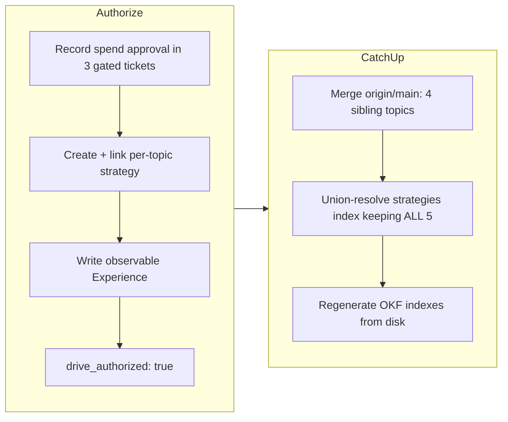

## 1. Overview

This branch **authorizes** the agent-vm mission for an overnight drive and then
**catches it up** with `main`. Agent-vm is a recurring, cost-bounded instrument that
compares agent VM / microVM / sandbox execution platforms (AWS Lambda microVMs, Fly
Machines, E2B, Modal, Daytona, Cloudflare, Vercel, Northflank) on cold-start latency
(p50/p95), warm-reuse time, fixed-task wall-clock, and measured per-task cost against a
keyless reference catalog of each provider's stated isolation model and published pricing.

Unlike its sibling topics (deep-research, trend-recency, speech, computer-use), agent-vm
has **no stranded real trial to recover** — its only orphan carries a keyless Fly/Daytona
adapter and no measured frame — so this branch is purely the authorize half: it records the
developer's spend approval, gives the mission the artifacts the drive-authorization guard
requires (a linked strategy and an observable `## Experience`), and stamps
`drive_authorized: true`. It adds **no topic content** — `site.ts`, `snapshot.ts`, and
`topic.ts` are byte-identical to `main` — so it changes only `.workaholic/` planning
records. The remaining gate on the real trial is environmental credentials only.

**Highlights:**

1. Recorded the developer's spend approval (a@qmu.jp, 2026-07-22, /mission planning
   session) in the three gated tickets — the real cost probe (#024001), the first
   validation trial (#024004), and the Japanese translation + publish (#024005) — leaving
   the implementation steps untouched and noting that the only remaining gate is
   environmental credentials (`FLY_API_TOKEN`+`FLY_APP_NAME` for the Fly.io probe, an LLM
   key for the pipeline translation).
2. Authorized the mission for drive: created and linked the per-topic strategy
   `periodically-benchmark-agent-vm-sandbox-execution-platforms`, wrote an observable
   `## Experience`, and stamped `drive_authorized: true` — satisfying the validate-mission
   floor with no spend.
3. Caught the branch up with `main` after the four sibling topics merged (PRs #60–#63):
   resolved the union conflict on `strategies/index.md` by keeping **all five** strategies,
   regenerated the OKF indexes from disk, and verified the merged tree end to end.

## 2. Motivation

The developer approved the gated agent-vm real cold-start / warm-reuse / fixed-task cost
probe in the /mission planning session, but the mission could not be driven unattended: the
validate-mission floor refuses `drive_authorized: true` unless the mission also links a
strategy and carries a real `## Experience`, and this pre-approval mission had neither (the
repo had no strategies at all). The branch exists to close that authorization gate cleanly
— record the approval where the drive reads it, create the strategy the guard demands, and
describe the demanded behaviour observably — without making any paid call, since the real
trial still waits on environmental credentials. When the four sibling topics merged to
`main` mid-flight, the branch also had to reconcile with them so the shared strategy index
carries every topic's strategy rather than reverting any.

## 3. Changes

The branch opened by recording the spend approval in the three gated tickets
([4d74676](https://github.com/qmu/research/commit/4d74676)), then wrote the mission's
observable `## Experience`
([68ece52](https://github.com/qmu/research/commit/68ece52)), and — once the developer chose
per-topic strategy granularity — created and linked the strategy
`periodically-benchmark-agent-vm-sandbox-execution-platforms` and stamped
`drive_authorized: true` ([7a9aeb7](https://github.com/qmu/research/commit/7a9aeb7)). It
then merged current `main` ([c8267ae](https://github.com/qmu/research/commit/c8267ae)),
resolving the single add/add conflict on `.workaholic/strategies/index.md` as a union that
keeps all five strategies and regenerating the bundle indexes with the OKF refresh script so
no conflict markers remain. No source under `packages/` and no published page was changed by
this branch.

## 4. Outcome

The agent-vm mission is drive-ready and reconciled with `main`. Its frontmatter links the
per-topic strategy `periodically-benchmark-agent-vm-sandbox-execution-platforms`, carries an
observable `## Experience` describing the measured/unreachable rows and the published EN/JP
survey with 推移/history, and is stamped `drive_authorized: true`; the validate-mission hook
passes (exit 0). The three gated tickets (#024001/#024004/#024005) record that spend is
approved and that the only remaining gate is environmental credentials. The catch-up merge
kept all five strategies in the union-resolved index. Because the branch adds no topic
content, verification confirms `main`'s state is intact after the merge: on the merged tree
`packages/tech` `npm test` is **639 passed / 2 skipped, exit 0** (which runs `tsc --noEmit`
first), a real VitePress dead-link build is **exit 0** with zero dead links, and
`check-fixture-drift.sh` is **exit 0** ("keyless fixtures are byte-stable against the
committed artifacts"), including agent-vm's own 8-provider fixture page.

The real cold-start / warm-reuse / fixed-task cost probe itself was deliberately **not** run
here — it stays gated on environmental credentials, so it is the one genuine fresh drive
candidate for a later `/monitor` once `FLY_API_TOKEN`/`FLY_APP_NAME` are present.

## 5. Historical Analysis

This branch is the authorize-only member of the same overnight batch that recovered
deep-research (PR #60), trend-recency (PR #61), speech (PR #62), and computer-use (PR #63).
Those siblings each had a stranded, already-paid real trial to lift onto advanced `main`;
agent-vm had only a keyless adapter orphan and no measured frame, so there was nothing to
recover and no spend to salvage — the branch reduces to closing the authorization gate and
reconciling the shared index. The authorization pattern is identical to the siblings' first
step: a purpose-built per-topic strategy plus an observable `## Experience` satisfies the
drive-authorization guard while keeping the paid trial gated behind explicit approval. The
union resolution of `strategies/index.md` recurs directly from PRs #60–#63, which each
resolved the same generated-index add/add conflict by keeping all strategies.

## 6. Concerns

### Real cost probe unrun — gated on environmental credentials

- **Severity:** moderate
- **Description:** Spend is approved and the mission is drive-authorized, but the real
  cold-start / warm-reuse / fixed-task cost probe has not run: the environment has no
  provider tokens (`FLY_API_TOKEN`+`FLY_APP_NAME` for the Fly.io adapter) and no LLM key for
  the Japanese pipeline translation. The published agent-vm page therefore remains the
  keyless 8-provider reference catalog with no measured rows, and mission acceptance items
  #024001/#024004/#024005 stay unchecked.
- **How to Fix:** With the mission now drive-authorized, run `/monitor` (or an owner-run
  `research -- agent-vm --estimate` ≤ $8 → `--real`) with the provider tokens present; the
  `--real` path records honest unreachable rows for any provider whose credentials are
  absent, then archive the dated frame and run the pipeline translation with an LLM key.

### Fly.io adapter unverified against a live token

- **Severity:** low
- **Description:** The Fly Machines adapter (`vendors/sandbox/fly.ts`) is unit-tested over an
  injectable HTTP transport but its create→poll→started timing and force-delete teardown
  shapes are documented-but-unverified against a live Fly account; no live confirmation has
  run.
- **How to Fix:** On the first credentialed real run, confirm the exec/metric shapes and the
  zero-orphaned-resources teardown guarantee against live Fly, then flip remaining provider
  `apiReachable` flags as their adapters land.

## 7. Successful Development Patterns

- Satisfying the drive-authorization guard with a purpose-built per-topic strategy plus an
  observable `## Experience` unblocked the overnight drive while keeping the paid trial gated
  behind explicit spend approval and credentials.
- Recording spend approval in the gated tickets without touching their implementation steps
  kept the approval auditable at the exact place the drive reads it.
- Re-deriving the conflicted `strategies/index.md` from disk with the OKF refresh script,
  rather than hand-merging, produced the canonical union of all five strategies with no
  conflict markers.
- Treating "adds no topic content" as a verifiable invariant — confirming `site.ts`,
  `snapshot.ts`, and `topic.ts` are byte-identical to `main`, then running the full test /
  dead-link-build / fixture-drift suite — proved the merge left `main`'s state intact.

## 8. Release Preparation

**Verdict**: Ready for release

### 8-1. Concerns

Two concerns are recorded above; both are gated follow-ups (a credentialed real trial and
its live Fly confirmation), not defects in this branch's authorize + catch-up scope. No
concern blocks merge.

### 8-2. Verification

- `packages/tech`: `npm test` — 639 passed / 2 skipped, exit 0 (runs `tsc --noEmit` first).
- Real VitePress dead-link build (`vitepress build`) — exit 0, zero dead links.
- `scripts/check-fixture-drift.sh` on the clean committed tree — exit 0, fixtures byte-stable.

## 9. Notes

This branch makes no paid call and adds no topic content; it changes only `.workaholic/`
planning records (three ticket spend-approval notes, the new strategy, the mission's
Experience + strategy link + `drive_authorized`, and the regenerated OKF indexes). The
agent-vm real trial remains the single genuine fresh `/monitor` candidate, pending
`FLY_API_TOKEN`/`FLY_APP_NAME`.
