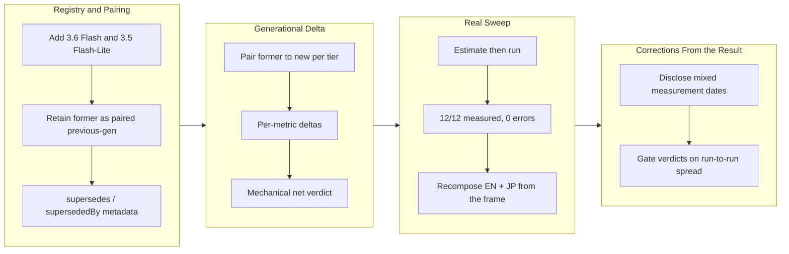

## 1. Overview

Google shipped Gemini 3.6 Flash and 3.5 Flash-Lite, and the published LLM comparison did not show them. This branch refreshed the registry to the new generation, retained each superseded model as an explicitly paired previous-generation entry so both could be swept under identical conditions, built a generational-delta insight that quantifies the former→new change, and ran the real head-to-head — then, on reading the result, corrected two ways the published article claimed more than the measurement supported.

**Highlights:**

1. Gemini 3.6 Flash and 3.5 Flash-Lite added as the current generation, with the models they supersede retained and paired through machine-readable registry metadata rather than a hardcoded list
2. A generational-delta section that states, per tier and per effort, how the new model compares to the one it replaced — with a mechanical net verdict that never nets a faster-but-pricier result into "improved"
3. One real head-to-head sweep: 12 of 12 configurations measured, zero errors, committed as dated frames and recomposed into the EN and JP articles
4. The measured result is **mixed, not an improvement** — the new Flash is consistently slower to first token, and the new Flash-Lite is more expensive
5. Two honesty corrections found by reading the output: the article now reports that its table mixes measurement dates, and withholds directional verdicts that run-to-run noise cannot support

## 2. Motivation

A comparison article's value decays the moment a provider ships a model the table does not show, so the strategy behind this branch is to re-measure on each release rather than to publish a snapshot and let it age. That framing drove the central design choice: rather than swapping the new ids in and losing the old numbers, the superseded models are retained and paired to their successors, so a single sweep under identical conditions can isolate what actually changed between generations. The alternative — comparing the new model against numbers taken weeks earlier under different conditions — would have produced a delta that conflated the generational change with drift in everything else.

The second half of the branch was not planned. Running the sweep produced a result worth publishing, and reading that result carefully showed the surrounding article overstating it in two independent ways. Both were fixed here rather than deferred, because publishing a table that overstates its own freshness and precision is the failure the provenance model exists to prevent.

## 3. Changes

The branch built the instrument before spending on it: registry pairing first, then the delta renderer that consumes that pairing, then one priced sweep. The sweep exposed a merge-base defect that would have cut the published table from 47 rows to 12, which was recovered by restoring the base and re-running. Re-running the identical configurations then became accidental replication data, which showed that per-effort throughput verdicts rested on noise — so the final work was two corrections to the article's own claims rather than more measurement.

### 3-1. Refresh the LLM comparison registry with the newly released Gemini models, pairing each former→new generation ([1b5a2e6](https://github.com/qmu/research/commit/1b5a2e6))

Added Gemini 3.6 Flash and 3.5 Flash-Lite as the current Gemini tier with web-verified prices, effort ladders, and API ids, and retained Gemini 3.5 Flash and 3.1 Flash-Lite as tagged previous-generation entries paired to their successors. The pairing is machine-readable registry metadata (`generation`, `supersedes`, `supersededBy`), so the delta insight generalizes to any future pairing instead of reading a hardcoded list.

### 3-2. Add a dedicated generational-delta insight — quantify how the new Gemini improved over the former, in EN + JP ([85902d6](https://github.com/qmu/research/commit/85902d6))

Added a section that pairs each former→new tier, computes per-metric deltas over speed, accuracy, and curated cost, and derives a net verdict mechanically. A speed or accuracy delta is produced only when both generations were `measured` in the same frame; when they were not, the section says so rather than synthesizing values. Cheaper counts as an improvement, and a faster-but-pricier result reads as mixed rather than being silently netted to improved.

### 3-3. Run the owner-approved real head-to-head Gemini sweep and publish the refreshed comparison + delta ([f97cf8c](https://github.com/qmu/research/commit/f97cf8c))

Priced with `--estimate`, then ran the Gemini-scoped sweep inside the approved ceiling: 12 of 12 configurations measured, zero errors, committed as dated frames. The EN speed and accuracy pages, their Japanese insights, and the generational-delta section were all recomposed from the measured frame. The delta section moved from an H3 to an H4 so it nests under section 7 rather than breaking the shared article outline, which compares every published page's H3 sequence for exact equality.

### 3-4. Disclose measurement vintage and gate verdicts on run-to-run spread ([32d5165](https://github.com/qmu/research/commit/32d5165))

Two corrections driven by reading the published result. Section 3 now reports the frame's actual composition — naming each measurement date and its share, and stating that rows of different dates are not like-for-like — instead of stamping every row with the render date; a single-date frame still renders the original sentence, so other topics are unaffected. And a measured metric now earns a direction only when the gap between the two means clears the two models' combined run-to-run spread, which is shown in its own column; changes inside that spread read as `indistinguishable` and are excluded from the net verdict, which reports how many were dropped.

## 4. Outcome

The published comparison now carries the current Gemini generation alongside the models it replaced, and states the generational change with measured numbers rather than adjectives. The measured answer is genuinely mixed: the new Flash is slower to first token at every effort level (+21% to +29%, reproduced across two independent runs) while its output price fell 17%, and the new Flash-Lite is both slower to first token and materially more expensive (input +20%, output +67%). No verdict claims an improvement the data does not show.

The instrument came out more honest than it went in. It now discloses when a table mixes measurement dates, and it withholds directional verdicts that its own sampling cannot support — on this data withholding five of six throughput directions while keeping every time-to-first-token and total-latency direction. Two defects found along the way that were **not** fixed here are filed as tickets rather than left in the branch (see Concerns).

## 5. Historical Analysis

This branch is the first mission executing the strategy *keep the LLM speed and accuracy comparison current as providers release new models*, created alongside it. It repeats a pattern the repository has settled into for research topics: build the keyless instrument first, price it with `--estimate`, then spend once under an owner-approved ceiling and commit the result as a dated frame that can re-render the article without re-spending.

It also repeats a failure pattern this repository has now hit three times: a gitignored, machine-local file that a fresh worktree does not carry, silently degrading a run rather than failing it. Earlier it was `packages/tech/.env`, where absent credentials made overnight runs defer paid work reporting "no credentials present" while the credentials existed the whole time. Here it was the real comparison record, whose absence turned a scoped sweep from a merge into a replacement. In both cases the code was correct and the *input* was silently missing — which is the generalizable lesson: when the absence of an input changes results rather than stopping the run, that absence must be reported.

## 6. Concerns

### (carried from PR #15) Fixture determinism depends on careful seeding

- **Severity:** moderate
- **Description:** Byte-stable fixture reports require the pinned timestamp plus per-trial-index seeding; a future probe redesign could silently break byte-stability if the seeding strategy is not carried forward (see [679dcfe](https://github.com/qmu/research/commit/679dcfe) in `packages/tech/src/vendors/llm/fixture.ts`)
- **How to Fix:** Document the determinism precondition beside the fixture client and include a two-consecutive-runs byte-stability check in the quality gate of any ticket touching the fixture shape

### (carried from PR #15) JSON artifact link resolution deferred

- **Severity:** moderate
- **Description:** Reports link to raw JSON run-artifacts by relative path, but the corporate copy only transfers Markdown, so the transparency links will not resolve on the published site until artifacts join the copy set or switch to stable GitHub URLs (see [0597161](https://github.com/qmu/research/commit/0597161) in `docs/research-reports/`)
- **How to Fix:** Extend `scripts/publish-research.sh` to copy `.data.json` alongside `.md`, or point artifact references at stable raw.githubusercontent.com URLs

### (carried from PR #15) Model IDs require periodic live verification

- **Severity:** moderate
- **Description:** Curated model ids churn, and prices drift silently (see [c148f4f](https://github.com/qmu/research/commit/c148f4f) in `packages/tech/src/llm-model-comparison/models.ts`). This branch advanced the concern without closing it: a standing strategy now exists to re-verify on each provider release, and the refreshed rows carry verified-at prose. What the concern asked for and still does not exist is a machine-readable last-verified date and a scheduled check — the verification remains a human act at refresh time, so a model nobody refreshes goes stale invisibly.
- **How to Fix:** Record a last-verified date as a field on each registry entry rather than a comment, and add a check that fails when an entry's verification is older than the topic's cadence

### (carried from PR #15) Real-run cloud backend credentials and quotas are account-dependent

- **Severity:** low
- **Description:** S3 Vectors is region-limited, Cloudflare AutoRAG needs a dashboard-provisioned R2 binding, and xAI needs pre-funded credits; all render honest error/fixtured states rather than fake numbers (see [956c066](https://github.com/qmu/research/commit/956c066))
- **How to Fix:** Keep the honest-error rendering and document the account prerequisites beside each backend's reproduction steps

### The real comparison record is machine-local, so a scoped sweep can silently shrink the published table

- **Severity:** urgent
- **Description:** The runner merges a scoped run into the previous record — `previous ? mergeConfigs(previous.configs, fresh) : fresh` — but `previous` is read from `llm-model-comparison.real.data.json`, which is gitignored. A fresh worktree has no `previous`, so the scoped run's output becomes the entire record. On this branch that produced a 12-configuration record where the published pages carry 47; projecting it would have deleted 35 rows from the published speed and accuracy tables, and nothing would have flagged it. Worse, the record cannot be rebuilt from the repository: committed frames are themselves scoped snapshots (the newest holds 6 configurations), so `--render-latest` cannot reconstruct the published article and the only artifact that can is one untracked file on one checkout.
- **How to Fix:** Distinguish "first full run" from "scoped run with no merge base" — they are the same code path today — and refuse to write a narrowed record without an explicit flag; make the projection step refuse an implausible narrowing with both counts reported; and make the record reproducible from committed state. Filed as `.workaholic/tickets/todo/a-qmu-jp/20260727103000-real-comparison-record-is-unreproducible-from-the-repo.md`

### Generational verdicts rest on three trials, which the sampling cannot fully support

- **Severity:** moderate
- **Description:** The dispersion gate added in [32d5165](https://github.com/qmu/research/commit/32d5165) stops unsupportable directions from being published, but it does not improve the measurement. Running the identical 12 configurations twice hours apart moved sustained throughput by up to 88% on the same configuration, and per-effort verdicts are where the sample is thinnest — the gate now suppresses most throughput directions rather than the design being reconsidered.
- **How to Fix:** State the trial count where verdicts are stated, sample paired generational configurations more deeply than the rest of the matrix, and decide whether per-effort verdicts should exist at all or aggregate across effort levels. Filed as `.workaholic/tickets/todo/a-qmu-jp/20260727110000-generational-verdicts-exceed-what-3-trials-support.md`

### The published table mixes measurement dates by construction

- **Severity:** low
- **Description:** A scoped sweep re-measures only the rows it names, so this frame holds 12 configurations measured on 2026-07-27, 1 on 2026-07-20, and 41 on 2026-07-12. The article now discloses this rather than presenting a single date, and the generational comparison is unaffected because it uses only pairs measured in the same frame — but cross-model comparisons between rows of different dates remain not like-for-like.
- **How to Fix:** Either run the full sweep when cross-model claims matter, or render per-row measurement dates in the comparison table itself so the reader sees the vintage per row rather than in a scope note

## 7. Successful Development Patterns

- Building the pairing as machine-readable registry metadata (`supersedes` / `supersededBy`) rather than a hardcoded list meant the delta insight generalizes to the next provider's release with no renderer change — the Claude refresh mission now consumes it unmodified
- Checking three candidate threshold rules against the real artifact before choosing one, instead of picking a statistically conventional value: the t-critical value for three trials would have suppressed the reproducible time-to-first-token findings alongside the noise, which only a comparison against real data revealed
- Reading the published output rather than only the test suite: every gate was green while the article was overstating both its freshness and its precision, and neither defect was the kind a test would catch
- Treating an unplanned re-run as data: re-running the identical sweep for an unrelated recovery produced replication measurements that turned "these verdicts feel shaky" into a quantified 88% swing, which is what justified the threshold change
- Letting an existing test's intent correct the design — the first dispersion implementation checked spread before materiality and would have erased the "saturated metric landing on the same value is a finding" assertion; the test's comment, not the failure itself, showed the check order was wrong

## 8. Release Preparation

**Verdict**: Ready for release

### 8-1. Concerns

- The branch-safety scan returns `block`, but every finding is `override`-tier size only — no secret or leak findings. Four commits exceed the 500-line non-generated threshold (`f97cf8c` at 5440, `5a8c391` at 2872, `32d5165` at 1158, `1b5a2e6` at 892), and three committed artifacts exceed the size thresholds (`llm-model-comparison.data.json` at 1.49 MB, `llm-accuracy-comparison.data.json` at 1.21 MB, and 3312 added lines in `llm-model-comparison.history.json`). These are measurement artifacts and their recomposed articles — the record is deliberately complete so a report can be re-rendered at any detail level without re-spending.
- Two defects found during this branch are filed as tickets rather than fixed here; one of them (`20260727103000`) is graded urgent because it can silently delete rows from a published table.

### 8-2. Pre-release Instructions

- `/ship` will ask for a conscious size-override acceptance for the findings above; there is nothing to remediate first.

### 8-3. Post-release Instructions

- The mission's remaining acceptance item is the qmu-co-jp publish, which `/ship` performs via the publish ticket flow.
- The Claude new-model refresh mission (`support-newly-released-claude-models-in-the-llm-comparison`) depends on the pairing metadata and delta renderer this branch introduces, and can start once this merges.

## 9. Notes

Spend for this round was roughly $11–13 against a $15 per-run ceiling: two scoped sweeps at about $1.67 each (the second recovering the merge-base defect) and two Japanese full-report translations. The second translation was not optional — the dispersion gate changed the verdicts themselves, so leaving the Japanese article as translated would have had it assert regressions the English article no longer claims.

## Deployment Evidence

- **When:** 2026-07-31T11:07:48+09:00
- **By:** a@qmu.jp
- **Target:** release-scan
- **Method:** override
- **Status:** bypassed
- **Observed:** size-tier findings overridden: large-file on llm-model-comparison.data.json and llm-accuracy-comparison.data.json; large-added-lines on llm-model-comparison.history.json; too-large-commit on f97cf8c, 5a8c391, 32d5165, 1b5a2e6. Zero secret or leak findings.

## Deployment Evidence

- **When:** 2026-07-31T11:07:48+09:00
- **By:** a@qmu.jp
- **Target:** Research publishing site (deploy-on-merge)
- **Method:** api-probe
- **Status:** pass
- **Observed:** Pre-merge readiness proof green at branch HEAD: make lint exit 0, make build (VitePress, no dead links) exit 0, packages/tech npm test exit 0 with 659 passed, and llm-model-comparison fixture byte-identical across two consecutive compare:fixture runs.
