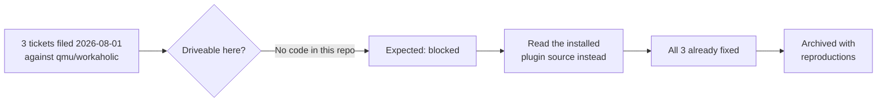

## 1. Overview

Three tooling defects had sat in the queue since 2026-08-01, each describing a
real failure in the workaholic plugin rather than in this repository. All three
were already fixed upstream, and none of the tickets knew it.

**Highlights:**

1. Each defect verified fixed against the installed plugin, with the reproduction recorded
2. No code changed here — the fixes are upstream, and the tickets carry the evidence
3. The queue loses three permanently-undriveable items

## 2. Motivation

These three tickets were unreachable by construction. Their fixes live in
`qmu/workaholic`, so no session driving this repository could ever implement
them, and nothing checked whether they were still open — the queue would have
carried them indefinitely while the defects themselves no longer existed. A
ticket whose problem is gone is not a small piece of debt: it is a standing
claim that a working mechanism is broken.

## 3. Changes

The unit was expected to end `blocked` on cross-repository access. Checking the
installed plugin before recording that verdict turned all three into closable
tickets: one fixed on 2026-08-01, one by a scoped by-filename fallback in the
claim reader, and one resolved twice over by a command retirement plus a
correction to its successor's backstop.

### 3-1. `claim.sh` cannot claim any mission whose slug exceeds 44 characters ([72dceea](https://github.com/qmu/research/commit/72dceea))

Verified fixed: since 2026-08-01 the unit id rides a `Unit:` trailer, the subject
is the fixed `Claim a PR-unit`, and `commit_failed` carries a `detail` so the
refusal names its cause. The 44/45-character boundary still reproduces against
the old shape, and is now unreachable.

### 3-2. A claimed ticket is re-offered when its archive rename falls below git's similarity threshold ([7a3be13](https://github.com/qmu/research/commit/7a3be13))

Verified fixed: the claim reader resolves an artifact by the rename map first and
by exact filename when that misses, scoped to ticket paths and to a single
unambiguous match — with `mission.md` named as the shared-basename case that
forces the scoping.

### 3-3. `/request` can never deliver this repository's publish ticket ([e1506de](https://github.com/qmu/research/commit/e1506de))

Verified resolved twice over: `/request` was retired on 2026-08-05 in favour of
`/fb`, which writes into no checkout at all, and the substring backstop was
separately corrected to match a reference rather than a substring — the exact
repair this ticket asked for.

## 4. Outcome

Three tickets archived with their verification, and the queue no longer asserts
that three working mechanisms are broken.

## 5. Concerns

### Nothing detects a ticket whose upstream fix already landed

- **Severity:** moderate
- **Description:** All three sat driveable-by-nobody for twelve days, and were found only because a run happened to read the plugin source while deciding they were blocked; the queue has no signal for "filed against another repository, may already be fixed" (see [72dceea](https://github.com/qmu/research/commit/72dceea))
- **How to Fix:** When filing a defect whose code is in another repository, record the upstream version observed; a later session can then compare against the installed version instead of re-deriving the whole defect

### The verification is against one installed version, not the whole history

- **Severity:** low
- **Description:** Each Final Report checks plugin v1.0.176 as installed on this machine; it establishes the defect is gone now, not the version in which it went, and two of the three infer the date from an in-source comment (see [e1506de](https://github.com/qmu/research/commit/e1506de))
- **How to Fix:** Treat the recorded dates as the plugin's own account rather than as independently confirmed; nothing downstream depends on them

## 6. Successful Development Patterns

- Reproducing before recording a verdict turned an expected outcome inside out: these were about to be recorded `blocked` on cross-repository access, and reading the source showed all three were already fixed. "Blocked" was a forecast; five minutes of running the actual checker made it a finding.
- Grouping the three into one unit was right for a reason worth reusing: they shared one disposition and one investigation, so three separate PRs would have carried three copies of the same reasoning.
