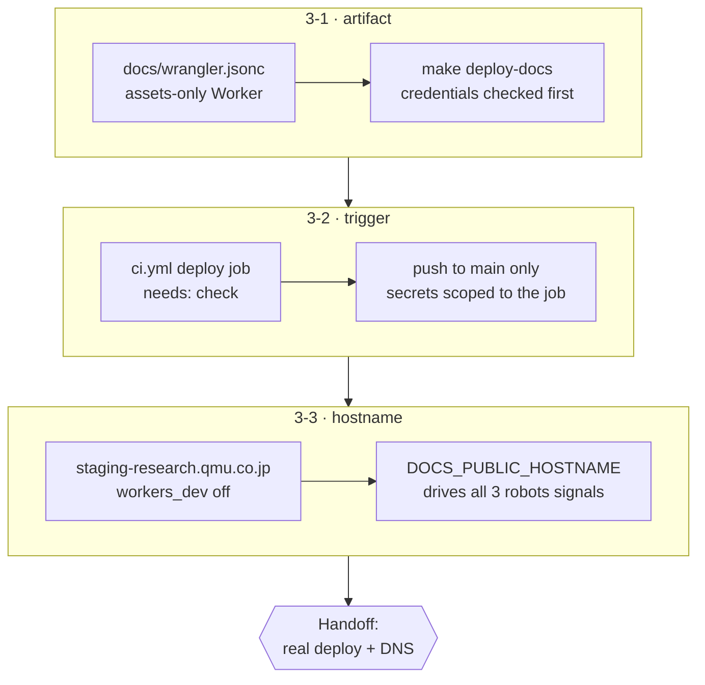

## Handoff

**This branch is complete but unverified here. Someone must verify it before it merges.**

- **Done:** The whole staging-preview path is written and pushed — an
  assets-only Worker (`docs/wrangler.jsonc`) bound to
  `staging-research.qmu.co.jp` and to no other hostname, `make deploy-docs` as
  the single deploy entry point, a `deploy` job in `ci.yml` that runs it on
  every push to `main` after the gates pass, and the `noindex` / `robots.txt` /
  no-sitemap posture. The served behavior was proved locally against the real
  assets runtime (`wrangler dev`): both indexes, a report page, `cleanUrls`
  paths, the built 404 and `robots.txt` all serve correctly.
- **Not done:** "A real deploy needs the qmu Cloudflare account API token and
  account id, which an unattended run does not hold" and "Binding the custom
  hostname and confirming it serves needs Cloudflare account and DNS access for
  `qmu.co.jp`" — quoted from the two tickets' `verification_handoff:`.
- **Next step:** Add repository secrets `CLOUDFLARE_API_TOKEN` (Workers Scripts:
  Edit) and `CLOUDFLARE_ACCOUNT_ID`, merge, then confirm the `deploy` job is
  green and `curl -I https://staging-research.qmu.co.jp/` and one report path
  both return 200. The first deploy creates the DNS record in the `qmu.co.jp`
  zone; if the account cannot host a second Worker there, report that rather
  than falling back to `*.workers.dev` (which this configuration disables).
- **Attempted:** Not attempted — declared unrunnable in an unattended
  environment at ticket creation (`verification_handoff:` on
  `20260818122248-deploy-the-docs-worker-from-ci-on-every-merge-to-main.md` and
  `20260818122249-serve-the-deployed-worker-at-staging-research-qmu-co-jp.md`).
  The failure path was exercised without contacting Cloudflare: with
  `CLOUDFLARE_API_BASE_URL` pointed at a dead local port,
  `make deploy-docs` → `make: *** [Makefile:86: deploy-docs] Error 1`.

## 1. Overview

The VitePress site under `docs/` was a local preview only, so reviewing a report
meant cloning the repository. Every merge to `main` now deploys that same build
to a Cloudflare Worker at `staging-research.qmu.co.jp`, without moving the
publishing boundary: finished articles still travel to qmu.co.jp as Markdown.

**Highlights:**

1. `make deploy-docs` holds the whole deploy path; the workflow only invokes it.
2. Open but not indexable — the repository is public, so the risk was search visibility, not access.
3. Serving proved against the real assets runtime, not `vitepress preview`.

## 2. Motivation

The feedback asked for a hosted surface: reports reviewable by URL, without a
checkout. The constraint was that this must not become a second publishing
surface — ADR 0003 makes this repository the preview and source of truth while
qmu-co-jp renders the published articles, and a site on a `qmu.co.jp` subdomain
could easily be read as promoting the preview into a publication.

The repository already had the pieces: `ci.yml` ran on `push` to `main` and
already built the site, and the corporate site next door already deploys as a
Worker through Wrangler. Missing were the packaging, the trigger, and a decision
about what a hosted draft site should say about itself.

## 3. Changes

Each ticket added one layer and left the next one something to stand on: a
deployable artifact, then the trigger that runs it, then the hostname it answers
on. The order mattered — naming the Worker in the first ticket kept the third to
DNS and search-engine policy, and splitting the trigger out is what made the
secrets question a design decision rather than an afterthought.

### 3-1. Package the docs site as a Cloudflare Worker ([56948b9](https://github.com/qmu/research/commit/56948b9))

Added an assets-only Worker pointed at the built `dist`, plus `make deploy-docs`
as the one entry point CI would later call. The credential check runs before the
build so a missing secret fails in the first second by name, rather than after a
minute as an interactive-login error.

### 3-2. Deploy the docs Worker on merge to main ([f464ccc](https://github.com/qmu/research/commit/f464ccc))

Added a `deploy` job to `ci.yml`, gated on `needs: check` and on a push to
`main` in this repository. It is a separate job rather than more steps on
`check` so that the two secrets exist only in its environment — `check` runs on
every pull request including forks, and must never be a job that holds a token.

### 3-3. Serve the preview at the staging hostname ([9995549](https://github.com/qmu/research/commit/9995549))

Bound the Worker to `staging-research.qmu.co.jp` and turned `workers_dev` off,
so one documented hostname is the whole of what is reachable. Replaced the stale
`research.qmu.dev` sitemap host with a single `DOCS_PUBLIC_HOSTNAME` flag that
drives the sitemap, `robots.txt` and the robots meta tag together.

## 4. Outcome

The staging surface is configured and locally proven; one real deploy by someone
with the Cloudflare account remains (see Handoff). Both Open Decisions — the
trigger surface (3-2) and public access (3-3) — were resolved on evidence, with
the reasoning in the tickets' Final Reports.

## 5. Concerns

### Deployment record still says the merge is the deployment

- **Severity:** moderate
- **Description:** `.workaholic/deployments/research-site.md` states the merge itself is the deployment and confirms it by checking the merge commit on `origin/main`. A merge now also runs a Worker deploy, so that confirmation would report success for a merge whose deploy job went red (see [f464ccc](https://github.com/qmu/research/commit/f464ccc) in `.github/workflows/ci.yml`)
- **How to Fix:** Ticketed as `20260818131500-deployment-record-still-says-the-merge-is-the-deployment.md` — extend the record's Procedure and Confirmation so a merge is confirmed by the deployed site responding, not only by the commit landing. Sequenced after the first real deploy so the probe it describes is one someone has run.

### The staging access rule depends on the repository staying public

- **Severity:** moderate
- **Description:** The surface is open because this repository is public, so it exposes nothing GitHub does not already. Making the repository private would silently turn an open staging site into a leak, and nothing enforces the link (see [9995549](https://github.com/qmu/research/commit/9995549) in `CLAUDE.md`)
- **How to Fix:** The condition is written beside the access rule in CLAUDE.md so it is met by whoever flips visibility. A stronger form would fail the deploy when the repository is private and `DOCS_PUBLIC_HOSTNAME` says otherwise; not built here because it guards a hypothetical.

### Adding wrangler grows the docs lockfile past the size gate

- **Severity:** low
- **Description:** `wrangler` brings 387 packages, so `docs/package-lock.json` gained 4459 lines and the branch-safety scan reports a `size` finding at override severity (see [56948b9](https://github.com/qmu/research/commit/56948b9) in `docs/package-lock.json`)
- **How to Fix:** Nothing to fix — it is the honest cost of the dependency, justified in `docs/dependency-decisions.md`. Noted so the override at ship time is a conscious one rather than a surprise.

## 6. Successful Development Patterns

- `wrangler dev` proves serving behavior offline: the deploy needs an account, the mapping it produces does not.
- Checking the repository's visibility collapsed an "unresolvable" Open Decision — access was a search-visibility question in disguise.
- `CLOUDFLARE_API_BASE_URL` at a dead port proves exit-code propagation without contacting the vendor at all.

## 7. Release Preparation

**Verdict**: Needs attention before release

- **Concern:** The branch-safety scan reports a `size` finding on
  `docs/package-lock.json` (4459 added lines > 3000), at override severity.
- **Before release:** Add the two repository secrets — `CLOUDFLARE_API_TOKEN`
  and `CLOUDFLARE_ACCOUNT_ID` — or the first post-merge deploy job goes red.
- **Before release:** Consciously override the size finding at ship time; it is
  the wrangler dependency's lockfile and nothing else.
- **After release:** Confirm the `deploy` job is green and
  `curl -I https://staging-research.qmu.co.jp/` returns 200, then close the
  mission's two verification-dependent acceptance items on that evidence.
