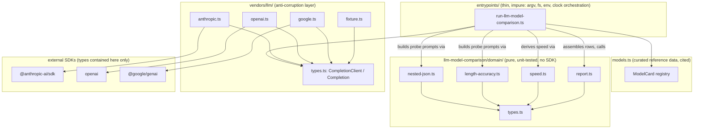

# Architecture Model v1 — Fundamental LLM model comparison

**Role:** Architect (Neutral / structural bridge)
**Phase/Step:** planning / artifact-generation
**Policy lens:** `workaholic:design` ↔ `workaholic:implementation`
(domain-layer separation, vendor neutrality, type-driven design)
**Ticket:** `.workaholic/tickets/todo/a-qmu-jp/20260623215050-llm-model-comparison-poc.md`
**Approved plan:** `/home/ec2-user/.claude/plans/jazzy-fluttering-gray.md`

---

## 1. Business intent → structural intent

The business intent is a **public, reproducible, honest** comparison of frontier
LLMs across eight aspects, shipped as the second foundational-research topic and
the first deliberate step toward a *repeatable* research practice. Two intents
must be carried faithfully by the structure:

1. **Comparison intent** — produce a single 8-column table readers trust.
2. **Pattern intent** — prove the seed's topic anatomy a second time so future
   topics become mechanical (captured as ADR 0004).

The dominant structural force is a **curated-vs-measured boundary**. Five of the
eight aspects are *asserted with a citation* (reference data); three are
*observed from a live system* (measurement). The architecture's primary job is to
keep these two epistemic categories from contaminating each other — in the type
system, in the report, and in the fixture path. This is not merely tidiness: the
objective-documentation policy makes honesty a **hard requirement**, so the
curated/measured seam is the spine of the model, not an implementation detail.

### The eight aspects, classified

| # | Aspect | Category | Carrier in the model |
|---|--------|----------|----------------------|
| 1 | Provider | Curated | `ModelCard.provider` (`Provider` union) |
| 2 | Model Name | Curated | `ModelCard.modelName` |
| 3 | Released | Curated | `ModelCard.released` |
| 4 | Cost | Curated | `ModelCard.inputCostPerMTok` / `outputCostPerMTok` |
| 5 | Effort Level | Curated | `ModelCard.effortLevels` |
| 6 | Speed | **Measured** | `Measurement.tokensPerSecond` |
| 7 | Nested-JSON depth | **Measured** | `Measurement.maxNestedJsonDepth` |
| 8 | Length accuracy | **Measured** | `Measurement.lengthAccuracy` |

`ModelCard` is the curated half (static, cited, human-authored). `Measurement` is
the observed half (live, machine-produced, fixture-or-real). `ComparisonRow =
ModelCard & { measurement: Measurement }` is the *join* — the only place the two
halves meet, and the only type the report consumes. This intersection type is the
structural expression of the business table.

---

## 2. System coherence map (layered architecture)

The topic mirrors the seed's layering verbatim and reuses the shared
`entrypoints/` and `vendors/` folders. Dependencies point **inward** toward the
pure domain; nothing in `domain/` imports a provider SDK.



**Coherence assessment:** the dependency graph is acyclic and inward-pointing.
`domain/` depends only on itself; `vendors/llm/` depends only on the contract +
its own SDK; `entrypoints/` is the single impure orchestrator that knows about
all three. This matches the seed exactly, so the second topic *reinforces* rather
than perturbs the system's shape — the precondition for promoting the pattern to
an ADR.

### Two contracts, side by side (non-breaking extension)

The seed's `LlmClient.generateAnswer(prompt) => Promise<string>` is structurally
too thin for this topic: it discards token counts and timing, which Speed and the
probes need. The model therefore **adds a second contract** in the same ACL file
rather than widening the first:

```
LlmClient      { model; generateAnswer(prompt) => Promise<string> }          // seed, untouched
CompletionClient { model; complete(prompt, opts?) => Promise<Completion> }   // new
Completion     { text; outputTokens; elapsedMs; model }
```

This is the correct structural call: two narrow contracts beat one wide one, the
seed's tests keep passing unchanged, and each topic depends only on the contract
it needs (Interface Segregation at the ACL boundary). Coexistence is a deliberate
boundary decision, recorded so the Constructor does not "unify" them.

---

## 3. Domain model

Pure types, no SDK or entrypoint types. Modeled rich enough that the registry and
report shapes are machine-checked (type-driven-design policy).

```
Provider = "anthropic" | "openai" | "google"          // closed union; widening = a real decision

ModelCard = Readonly<{                                  // CURATED half (cited)
  id: string                  // stable slug, used for anchors/keys
  provider: Provider
  modelName: string           // human label, e.g. "Claude Opus 4.8"
  apiModelId: string          // exact wire id, e.g. "claude-opus-4-8" — ISOLATED here
  released: string            // ISO date or YYYY-MM, curated
  inputCostPerMTok: number    // USD per 1M input tokens
  outputCostPerMTok: number   // USD per 1M output tokens
  effortLevels: ReadonlyArray<string>  // curated metadata, NOT a measured sweep
  source: string              // citation URL — provenance is part of the type
}>

Measurement = Readonly<{                                // MEASURED half (live or fixture)
  measured: boolean           // true = live API; false = fixture (honesty flag)
  tokensPerSecond: number
  maxNestedJsonDepth: number  // deepest correctly-nested depth achieved
  lengthAccuracy: number      // 0..1
  elapsedMs: number           // raw, kept for transparency/reproduction
  outputTokens: number        // raw, kept for transparency/reproduction
}>

ComparisonRow = ModelCard & Readonly<{ measurement: Measurement }>   // the join

ComparisonResult = Readonly<{
  rows: ReadonlyArray<ComparisonRow>
  generatedAt: string
}>
```

**Probe domain functions (pure, declarative, unit-tested):**

- `nested-json.ts`
  - `buildNestedJsonPrompt(targetDepth) => string`
  - `jsonDepth(value) => number` — max object/array nesting depth
  - `gradeNestedJson(target, text) => { parsed; achievedDepth; success }`
- `length-accuracy.ts`
  - `buildLengthPrompt(targetWords, topic) => string`
  - `wordCount(text) => number`
  - `lengthAccuracy(target, actual) => number` (`1 - min(1, |actual-target|/target)`)
- `speed.ts`
  - `tokensPerSecond(outputTokens, elapsedMs) => number`
- `report.ts`
  - `renderComparisonReport(result) => string` (Markdown + YAML frontmatter)

**Key domain-model invariant:** the *probe ladder* (which depths to sweep:
e.g. 3, 5, 8, 12, 16) and the *length targets/topic* are orchestration policy,
not domain truth. The pure functions take a target and grade a response; the
**runner** decides the ladder and folds the per-depth results into
`maxNestedJsonDepth`. This keeps the grader referentially transparent (one target
in, one verdict out) and the sweep testable as a separate concern. The Constructor
should resist pushing the ladder into the grader.

---

## 4. Translation-fidelity analysis

Does the structure faithfully carry the business intent and the eight aspects?

| Business intent | Structural carrier | Fidelity |
|-----------------|--------------------|----------|
| 8-aspect comparison | `ComparisonRow` (5 curated fields + 3 measured) | **Faithful** — every column maps to exactly one field; the table cannot render a column the type lacks. |
| Curated vs measured is *visible to the reader* | `Measurement.measured` flag + report legend + per-probe detail | **Faithful**, conditional on the report renderer surfacing the flag (see risk R1). |
| Honesty: no key-less row presented as live | `measured: false` set by runner when fixtured; report marks it | **Faithful by construction** — the flag is a required field, so a row *cannot* be assembled without stating its provenance. |
| Provider neutrality | `Provider` union + `CompletionClient` + per-provider ACL files | **Faithful** — domain names the provider only as a union tag; SDK types stop at `vendors/llm/{anthropic,openai,google}.ts`. |
| Cited reference data | `ModelCard.source` is a required field | **Faithful** — provenance is non-optional in the type; an uncited card won't compile-clean against the intent. |
| "Minimum for now", aspects slot in later | rows are arrays; aspects are fields; probes are independent modules | **Faithful & extensible** — a 4th provider is a registry row + one ACL file; a 4th probe is one domain module + one runner call. No shape change. |
| Reproducibility | `OUTPUT_PATH`-overridable render; `compare:fixture` keyless path | **Faithful** — same as seed; CI regenerates without credentials. |

**Net:** the translation is high-fidelity. The single point where fidelity is
*earned at render time rather than guaranteed by the type* is the legend/flag
display — that is the one thing the downstream phases must not drop. Everything
else is enforced by the type system.

---

## 5. Boundary-integrity assessment

Three boundaries carry this design. Each is assessed for integrity and for the
specific way it could erode.

### B1 — The `CompletionClient` ACL boundary (vendor neutrality)

- **What it separates:** provider SDK reality (auth, request/response shapes,
  token-usage field names, streaming) from domain reality (text + tokens + time).
- **Integrity:** strong *if* `Completion` is the only thing that crosses. Each of
  the three SDKs names usage differently (Anthropic `usage.output_tokens`; OpenAI
  `usage.completion_tokens`; Google `usageMetadata.candidatesTokenCount`).
  Normalizing all three to `Completion.outputTokens` **inside** the adapter is the
  whole point of the boundary; the domain must never branch on provider.
- **Erosion risk:** a provider-specific field (e.g. a stop-reason, a refusal
  shape, a thinking block) leaking into `entrypoints/` or a probe. **Guard:** the
  adapter returns `Completion` only; `opts` is provider-neutral (`maxTokens`,
  maybe `topic`); the wall-clock `elapsedMs` is measured *inside* each adapter
  around its own SDK call so timing semantics are uniform.

### B2 — Layer segregation (domain / vendors / entrypoints)

- **Integrity:** mirrors the seed; verified acyclic in §2. `domain/` has zero SDK
  imports; `entrypoints/` is the only place `fs`, `env`, argv, and the clock
  appear.
- **Erosion risk:** the runner is where impurity concentrates (provider
  selection, key detection, ladder sweep, fixture fallback, file write). Risk is
  that *grading or scoring* logic drifts into the runner because it is "already
  impure there." **Guard:** the runner may only (a) choose a client, (b) call
  probe prompt-builders, (c) call the SDK via the client, (d) hand raw text to
  pure graders, (e) call the pure renderer. Any `if` about *correctness* belongs
  in `domain/`.

### B3 — The curated-vs-measured boundary (the spine)

- **What it separates:** asserted reference data (`ModelCard`) from observed
  measurement (`Measurement`); and within measurement, live (`measured: true`)
  from fixture (`measured: false`).
- **Integrity:** enforced at the type level by the two-struct split and the
  required `measured` flag — the strongest boundary in the model because it is
  load-bearing for the honesty policy.
- **Erosion risk (highest-stakes):** the **fixture client must be honest by
  shape, not by luck.** Its deterministic `Completion`s should yield *plausible
  but clearly synthetic* numbers, and every row built from it must carry
  `measured: false`. The failure mode the policy forbids is a fixtured row
  rendered indistinguishably from a live one. **Guard:** provenance is set by the
  runner at row-assembly from *which client it used*, not inferred later; the
  report renders the flag in every row.

---

## 6. Component taxonomy

Classified by stability and epistemic role — this tells the Constructor what is
load-bearing vs. mechanical, and what to verify at implementation time.

| Component | Kind | Stability | Notes for downstream |
|-----------|------|-----------|----------------------|
| `domain/types.ts` | Pure types | **Stable spine** | `ModelCard`/`Measurement`/`ComparisonRow` define every other module's contract. Get this right first. |
| `domain/nested-json.ts` | Pure logic | Stable | `jsonDepth` recursion + nesting validity is the subtle one; boundary tests: empty, flat, mixed array/object, malformed JSON. |
| `domain/length-accuracy.ts` | Pure logic | Stable | Clamp at 0; `target = 0` guard; word-tokenization definition is a test boundary. |
| `domain/speed.ts` | Pure logic | Stable | One-liner; guard `elapsedMs = 0`. |
| `domain/report.ts` | Pure rendering | Stable | Reuse seed's `escapeCell`/frontmatter. **Must** emit `description` frontmatter (Astro publish contract) + curated/measured legend + stable anchors (a11y). |
| `models.ts` | **Curated data** | **Volatile** | Model IDs, pricing, release dates uncertain across the cutoff — **verify live (WebFetch provider pages) at implementation time.** `apiModelId` isolated here for cheap correction. |
| `vendors/llm/types.ts` (edit) | ACL contract | Stable | *Add* `Completion`/`CompletionClient`; do not touch `LlmClient`. |
| `vendors/llm/anthropic.ts` (edit) | ACL adapter | Stable | *Add* `createAnthropicCompletionClient`; keep `createAnthropicClient`. final-answer-only, no thinking param, `max_tokens ~2048`, capture `usage.output_tokens` + wall-clock. |
| `vendors/llm/openai.ts` (new) | ACL adapter | New | `openai` SDK; normalize `usage.completion_tokens` → `outputTokens`. |
| `vendors/llm/google.ts` (new) | ACL adapter | New | `@google/genai` SDK; normalize `usageMetadata.candidatesTokenCount` → `outputTokens`. |
| `vendors/llm/fixture.ts` (edit) | ACL adapter | Stable | *Add* `createFixtureCompletionClient`; deterministic, prompt-shape-keyed, honest-by-construction. |
| `entrypoints/run-llm-model-comparison.ts` (new) | Thin orchestrator | New | Impurity sink: provider select, key detect, ladder sweep, fixture fallback + flag, render, write, summary. **No correctness logic.** |
| `src/index.ts` (edit) | Usage text | Trivial | Mention `compare:fixture`. |
| `package.json` (edit) | Config | — | `compare`/`compare:fixture` scripts (`node --env-file-if-exists=.env` via tsx) + `openai`/`@google/genai` deps. |
| CI / VitePress / index / dep-decisions / `.env.example` / ADR 0004 | Ops & docs | — | Wiring; keyless `compare:fixture` step only. |

---

## 7. Risks & boundary notes for downstream phases

- **R1 (highest) — Honesty must be rendered, not just typed.** The
  `measured` flag is guaranteed by the type, but its *visibility* is earned in
  `report.ts`. The legend and a per-row provenance marker are policy-required, not
  cosmetic. Treat a report that hides the flag as a defect, not a polish item.
- **R2 — Token-count normalization is the real work of the ACL.** The three SDKs
  expose output-token counts under different names; `Completion.outputTokens` must
  be uniform. A wrong field here silently corrupts Speed for one provider while
  the table still "looks fine." Each adapter needs its own boundary test or a
  documented manual check.
- **R3 — `models.ts` data is volatile across the knowledge cutoff.** Provider,
  pricing, release-date, and `apiModelId` values **must be verified against live
  provider docs at implementation time** (the ticket and plan both call for
  WebFetch). The structure isolates them so correction is a one-file edit; the
  *values* are a Constructor responsibility, not assumable from training data.
- **R4 — Node `--env-file-if-exists` version assumption.** Local env is Node
  v24.13 (flag confirmed working); `.nvmrc` and CI pin Node **22**, which also
  supports the flag — but `compare:fixture` (CI) needs **no** env file, so CI is
  unaffected regardless. Only the local real `compare` run loads `.env`. No
  `dotenv` dependency is needed; if a contributor's Node predates the flag, the
  fallback is a `dotenv` devDependency (recorded in dep-decisions). Worth a
  one-line note in the runner/script.
- **R5 — Probe ladder belongs to the runner, not the grader (§3).** Keep
  `gradeNestedJson` single-target and pure; fold the sweep in the entrypoint.
- **R6 — Accessibility of the 8-column table.** The generated table is wide;
  `make a11y` (WCAG 2.2 AA) must stay green — semantic headers, stable anchors,
  and a legend that is text, not color-only. A boundary the report renderer owns.
- **R7 — Two-contract coexistence is intentional.** `LlmClient` and
  `CompletionClient` live side by side on purpose (§2); the seed's contract and
  tests are not to be modified. Do not "DRY" them into one wide interface.

---

## 8. Summary

The model carries the business intent with high translation fidelity: the eight
aspects map one-to-one onto a `ModelCard` (curated, cited) ∧ `Measurement`
(observed, provenance-flagged) intersection, and the curated-vs-measured seam —
the design's spine and the honesty policy's anchor — is enforced in the type
system rather than left to discipline. All three boundaries (the
`CompletionClient` ACL, the domain/vendors/entrypoints segregation, and the
curated/measured split) are structurally sound and mirror the proven seed, which
is exactly what justifies promoting the anatomy to ADR 0004. The two places where
correctness is *earned downstream rather than guaranteed by shape* — rendering the
honesty flag/legend (R1) and normalizing each SDK's token-count field (R2) — plus
the volatile `models.ts` values (R3), are the concentration points the Planner and
Constructor should track most closely.
