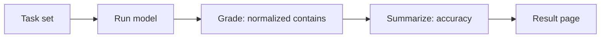

# LLMの完全一致ベンチマーク

このページは、大規模言語モデルに関する小規模な完全一致精度ベンチマークの結果を報告する。研究から公開までのパイプラインをエンドツーエンドで示すために存在しており、タスクセットは読者が数秒で再現できるよう意図的に極小に抑えられている。

## 手法

各タスクは、単一の期待される回答を持つプロンプトである。モデルの回答は正規化され（小文字化、前後の空白除去、内部の空白の圧縮）、期待される文字列を含んでいれば正解としてカウントされる。精度は、正しく回答されたタスクの割合である。



採点およびスコアリングのロジックは純粋関数として実装されており、`packages/tech/src/llm-benchmark/domain/` にてユニットテストされている。モデルへのアクセスは `packages/tech/src/vendors/llm/` にある腐敗防止層（anti-corruption layer）を通じて行われるため、プロバイダーは交換可能である。

## 結果

- **モデル:** `fixture`
- **精度:** 100.0% (5/5)
- **生成日時:** 2026-06-22T11:40:03.095Z

| タスク | 結果 | 期待値 | モデルの出力 |
| ---- | ------- | -------- | ------------ |
| capital-france | 正解 | Paris | Paris |
| capital-japan | 正解 | Tokyo | Tokyo |
| arithmetic-sum | 正解 | 42 | 42 |
| chemical-water | 正解 | H2O | H2O |
| planet-largest | 正解 | Jupiter | Jupiter |

## 再現方法

```sh
git clone https://github.com/qmu/research
cd research/packages/tech
npm install

# パイプラインのセルフテスト、APIキー不要・コストなし（決定論的なfixtureモデル）:
npm run benchmark:fixture

# 実際のモデルに対して実行（デフォルトはclaude-opus-4-8、ANTHROPIC_MODELで上書き可能）:
export ANTHROPIC_API_KEY=sk-ant-...
npm run benchmark
```

この実行により、このページ `docs/research-reports/llm-benchmark.md` が再生成される。各リクエストは数百トークンのコストがかかる。正確な数値についてはモデルの料金表を参照すること。公開する比較においては、結果が時間の経過後も解釈可能であるように、モデルIDを固定しておくこと。
