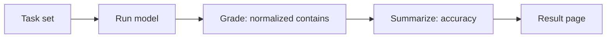

# LLM exact-match benchmark

This page reports a small exact-match accuracy benchmark for large language
models. It exists to demonstrate the research-to-publication pipeline end to
end; the task set is intentionally tiny so a reader can reproduce it in seconds.

## Method

Each task is a prompt with a single expected answer. The model's reply is
normalized (lowercased, trimmed, internal whitespace collapsed) and counted
correct when it contains the expected string. Accuracy is the fraction of tasks
answered correctly.



The grading and scoring logic is pure and unit-tested in
`packages/tech/src/llm-benchmark/domain/`. The model is reached through an
anti-corruption layer in `packages/tech/src/vendors/llm/`, so the provider is
swappable.

## Result

- **Model:** `fixture`
- **Accuracy:** 100.0% (5/5)
- **Generated:** 2026-06-22T11:40:03.095Z

| Task | Outcome | Expected | Model output |
| ---- | ------- | -------- | ------------ |
| capital-france | correct | Paris | Paris |
| capital-japan | correct | Tokyo | Tokyo |
| arithmetic-sum | correct | 42 | 42 |
| chemical-water | correct | H2O | H2O |
| planet-largest | correct | Jupiter | Jupiter |

## Reproduce

```sh
git clone https://github.com/qmu/research
cd research/packages/tech
npm install

# Pipeline self-test, no API key or cost (deterministic fixture model):
npm run benchmark:fixture

# Against a real model (defaults to claude-opus-4-8; override with ANTHROPIC_MODEL):
export ANTHROPIC_API_KEY=sk-ant-...
npm run benchmark
```

The run regenerates this page at `docs/research-reports/llm-benchmark.md`.
Each request costs a few hundred tokens; see the model's pricing for the exact
figure. Pin the model id in any published comparison so the result stays
interpretable over time.
