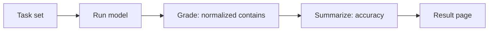

# LLM完全一致ベンチマーク

このページは、大規模言語モデルに対する小さな完全一致精度ベンチマークを日本語で示す。
研究から公開までのパイプラインを end-to-end で確認するためのページであり、タスクセットは
読者が数秒で再現できるよう意図的に小さくしている。

## Method

各タスクは、単一の期待回答を持つプロンプトである。モデルの応答を小文字化し、前後の空白を
取り除き、内部の連続空白を 1 つに畳み込んだうえで、期待文字列を含む場合に正答と数える。
Accuracy は、正答したタスクの割合である。



採点と集計のロジックは `packages/tech/src/llm-benchmark/domain/` にある純粋関数で、
単体テストされている。モデルへの接続は `packages/tech/src/vendors/llm/` の
anti-corruption layer を通すため、プロバイダーは差し替え可能である。

## Result

- **Model:** `fixture`
- **Accuracy:** 100.0% (5/5)
- **Generated:** 2026-06-22T11:40:03.095Z

| Task | Outcome | Expected | Model output |
| ---- | ------- | -------- | ------------ |
| capital-france | correct | Paris | Paris |
| capital-japan | correct | Tokyo | Tokyo |
| arithmetic-sum | correct | 42 | 42 |
| chemical-water | correct | H2O | H2O |
| planet-largest | correct | Jupiter | Jupiter |

## Reproduce

```sh
git clone https://github.com/qmu/research
cd research/packages/tech
npm install

# Pipeline self-test, no API key or cost (deterministic fixture model):
npm run benchmark:fixture

# Against a real model (defaults to claude-opus-4-8; override with ANTHROPIC_MODEL):
export ANTHROPIC_API_KEY=sk-ant-...
npm run benchmark
```

この実行は `docs/research-reports/llm-benchmark.md` を再生成する。各リクエストは数百
トークン程度を消費する。正確な金額は、対象モデルの価格を参照する。公開比較で使う場合は、
結果が解釈可能な状態を保つため、model id を固定する。
