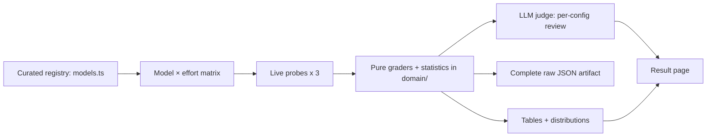

# LLMモデル比較

本レポートは、19モデル・4プロバイダーにまたがる**59通りのモデル×エフォート構成**について、再現可能な1回分のスイープ結果を記録したものである。各構成について、ランナーは**3試行**にわたり5つの限定的な挙動を計測する。すなわち、ストリーミング生成のスループット、応答レイテンシ、JSON構造化出力の制限、正確な単語数指定への準拠、そして短文の事実確認QAにおける情報精度である。その後、別途のLLM審査モデルが、計測された試行結果を開発者向けに要約する。

本レポートでは、精選されたカタログ上の事実と、実測された挙動とを区別している。プロバイダー、モデル、ティア、価格、対応エフォートレベルはモデルレジストリに由来する。スループット、レイテンシ、スキーマ制限、長さの正確性、情報精度は、以下にリンクされている実行アーティファクトに由来する。

## 手法

**構成。** マトリクスには 4 プロバイダーにまたがる 19 モデル、および 59 のモデル×effort構成が含まれます。effort は各プロバイダー独自の推論制御にマッピングされます(Anthropic の `output_config.effort`、OpenAI の `reasoning_effort`、Google の thinking budget)。サポートされていないレベルは、代替値に置き換えるのではなく「未対応」として明示されます。5 の構成では Effort = `n/a` を使用していますが、これはユーザーが選択可能なeffort制御を持たないモデルの有効な単一構成行であり、測定失敗ではありません。

**試行と統計。** すべてのプローブは各構成につき **3 回の試行** を実行します。`packages/tech/src/llm-model-comparison/domain/aggregate.ts` にある純粋関数が、成功した試行値を平均、標本標準偏差(ベッセル補正 n−1)、および `n` に集約します。テーブルには測定された指標が平均値 ± 95%信頼区間(1.96 × 標本標準偏差 / √n)として表示されます。失敗した試行はゼロとしてカウントされるのではなく集計から除外され、n < 2 の指標は区間なしで表示されます。

**プローブ。** 各構成には、`packages/tech/src/vendors/llm/` 内のプロバイダー非依存な `CompletionClient` 腐敗防止層を通じて5つのプローブが送信されます。

- **スループット** — 長いストリーミング生成。指標は生成中の持続的なトークン/秒であり、出力トークン数を `total − time-to-first-token` で割った値です。これは往復レイテンシではありません。
- **レイテンシ** — 短いストリーミングプロンプト。Time-to-first-token と総応答時間が別々の指標として報告されます。
- **JSONスキーマの複雑さ** — プロバイダーの構造化出力モードを、ネストの深さ(最大 48)とフィールド幅(最大 192)という2つの独立した軸でテストします。各軸は 2 から始まり、幾何級数的に上昇した後、二分探索を用いてスキーマに準拠した出力を返す最大のスキーマを見つけます。プロバイダーが拒否した場合、その軸は最後に受理された値で上限が設定され、その拒否事実はアーティファクトに保存されます。
- **長さの正確性** — 「水循環」についてちょうど 100 語の段落を生成させ、正確性は `1 - min(1, |actual - target| / target)` で算出されます。
- **情報の正確性** — マニフェスト `2026-07-09.truthfulqa.small-v1`(Apache-2.0)由来の 6 件の TruthfulQA 短答式事実質問。主要指標は、小文字化・冠詞除去・句読点除去・空白の圧縮を行った後の、参照解答および許容されるエイリアスに対する決定論的な最大トークンF1です。エイリアス完全一致はスコアラーの出力には保持されますが、この指標にLLM判定は混在させていません。

すべてのグレーダーは純粋関数であり、`packages/tech/src/llm-model-comparison/domain/` 内でユニットテストされています。



_図: モデルレジストリはモデル×effortマトリクスへと展開されます。試行ごとのプローブは生の出力を生成し、純粋なグレーダーがそれらの出力を指標へと集約し、judgeが各構成を要約し、ページは同一のJSONアーティファクトからレンダリングされます。_

## コスト・所要時間

このマトリクスを実際に全件スイープすると、**59通りの設定**(モデル×エフォート)×5種のプローブ×**3試行**に加え、設定ごとに1回のジャッジ呼び出しが発生します。ランナーはプロバイダーに実際に呼び出しを行う前の時点で、**6254回のAPI呼び出し**、約$91.54、約938分という見積もりを算出しました。`--estimate` はプロバイダー呼び出しを行わずにこの見積もりを表示します。見積もりでは1呼び出しあたり固定のトークン数を仮定していますが、実際のトークン使用量は実行アーティファクトに呼び出しごとに記録されます。CIではキー不要の `compare:fixture` セルフテストのみが実行され、実際のプロバイダースイープは行われません。

## 比較

| プロバイダー | モデル | 階層 | Effort | コスト（入力 / 出力 per MTok） | スループット（tok/s） | TTFT（ms） | 総レイテンシ（ms） | 最大スキーマ深度 | 最大スキーマ幅 | 長さ精度 | 情報精度 |
| -------- | ----- | ---- | ------ | ------------------------ | ------------------ | --------- | ------------------ | ---------------- | ------------------ | --------------- | -------------------- |
| anthropic | Claude Fable 5 | frontier | low | $6.00 / $30.00 | n/a（フィクスチャ） | n/a（フィクスチャ） | n/a（フィクスチャ） | n/a（フィクスチャ） | n/a（フィクスチャ） | n/a（フィクスチャ） | n/a（フィクスチャ） |
| anthropic | Claude Fable 5 | frontier | medium | $6.00 / $30.00 | n/a（フィクスチャ） | n/a（フィクスチャ） | n/a（フィクスチャ） | n/a（フィクスチャ） | n/a（フィクスチャ） | n/a（フィクスチャ） | n/a（フィクスチャ） |
| anthropic | Claude Fable 5 | frontier | high | $6.00 / $30.00 | n/a（フィクスチャ） | n/a（フィクスチャ） | n/a（フィクスチャ） | n/a（フィクスチャ） | n/a（フィクスチャ） | n/a（フィクスチャ） | n/a（フィクスチャ） |
| anthropic | Claude Fable 5 | frontier | xhigh | $6.00 / $30.00 | n/a（フィクスチャ） | n/a（フィクスチャ） | n/a（フィクスチャ） | n/a（フィクスチャ） | n/a（フィクスチャ） | n/a（フィクスチャ） | n/a（フィクスチャ） |
| anthropic | Claude Fable 5 | frontier | max | $6.00 / $30.00 | n/a（フィクスチャ） | n/a（フィクスチャ） | n/a（フィクスチャ） | n/a（フィクスチャ） | n/a（フィクスチャ） | n/a（フィクスチャ） | n/a（フィクスチャ） |
| anthropic | Claude Opus 4.8 | flagship | low | $5.00 / $25.00 | n/a（フィクスチャ） | n/a（フィクスチャ） | n/a（フィクスチャ） | n/a（フィクスチャ） | n/a（フィクスチャ） | n/a（フィクスチャ） | n/a（フィクスチャ） |
| anthropic | Claude Opus 4.8 | flagship | medium | $5.00 / $25.00 | n/a（フィクスチャ） | n/a（フィクスチャ） | n/a（フィクスチャ） | n/a（フィクスチャ） | n/a（フィクスチャ） | n/a（フィクスチャ） | n/a（フィクスチャ） |
| anthropic | Claude Opus 4.8 | flagship | high | $5.00 / $25.00 | n/a（フィクスチャ） | n/a（フィクスチャ） | n/a（フィクスチャ） | n/a（フィクスチャ） | n/a（フィクスチャ） | n/a（フィクスチャ） | n/a（フィクスチャ） |
| anthropic | Claude Opus 4.8 | flagship | xhigh | $5.00 / $25.00 | n/a（フィクスチャ） | n/a（フィクスチャ） | n/a（フィクスチャ） | n/a（フィクスチャ） | n/a（フィクスチャ） | n/a（フィクスチャ） | n/a（フィクスチャ） |
| anthropic | Claude Opus 4.8 | flagship | max | $5.00 / $25.00 | n/a（フィクスチャ） | n/a（フィクスチャ） | n/a（フィクスチャ） | n/a（フィクスチャ） | n/a（フィクスチャ） | n/a（フィクスチャ） | n/a（フィクスチャ） |
| anthropic | Claude Sonnet 5 | mid | low | $3.00 / $15.00 | n/a（フィクスチャ） | n/a（フィクスチャ） | n/a（フィクスチャ） | n/a（フィクスチャ） | n/a（フィクスチャ） | n/a（フィクスチャ） | n/a（フィクスチャ） |
| anthropic | Claude Sonnet 5 | mid | medium | $3.00 / $15.00 | n/a（フィクスチャ） | n/a（フィクスチャ） | n/a（フィクスチャ） | n/a（フィクスチャ） | n/a（フィクスチャ） | n/a（フィクスチャ） | n/a（フィクスチャ） |
| anthropic | Claude Sonnet 5 | mid | high | $3.00 / $15.00 | n/a（フィクスチャ） | n/a（フィクスチャ） | n/a（フィクスチャ） | n/a（フィクスチャ） | n/a（フィクスチャ） | n/a（フィクスチャ） | n/a（フィクスチャ） |
| anthropic | Claude Sonnet 5 | mid | xhigh | $3.00 / $15.00 | n/a（フィクスチャ） | n/a（フィクスチャ） | n/a（フィクスチャ） | n/a（フィクスチャ） | n/a（フィクスチャ） | n/a（フィクスチャ） | n/a（フィクスチャ） |
| anthropic | Claude Sonnet 5 | mid | max | $3.00 / $15.00 | n/a（フィクスチャ） | n/a（フィクスチャ） | n/a（フィクスチャ） | n/a（フィクスチャ） | n/a（フィクスチャ） | n/a（フィクスチャ） | n/a（フィクスチャ） |
| anthropic | Claude Haiku 4.5 | small | n/a | $1.00 / $5.00 | n/a（フィクスチャ） | n/a（フィクスチャ） | n/a（フィクスチャ） | n/a（フィクスチャ） | n/a（フィクスチャ） | n/a（フィクスチャ） | n/a（フィクスチャ） |
| openai | GPT-5.5 | flagship | none | $5.00 / $30.00 | n/a（フィクスチャ） | n/a（フィクスチャ） | n/a（フィクスチャ） | n/a（フィクスチャ） | n/a（フィクスチャ） | n/a（フィクスチャ） | n/a（フィクスチャ） |
| openai | GPT-5.5 | flagship | low | $5.00 / $30.00 | n/a（フィクスチャ） | n/a（フィクスチャ） | n/a（フィクスチャ） | n/a（フィクスチャ） | n/a（フィクスチャ） | n/a（フィクスチャ） | n/a（フィクスチャ） |
| openai | GPT-5.5 | flagship | medium | $5.00 / $30.00 | n/a（フィクスチャ） | n/a（フィクスチャ） | n/a（フィクスチャ） | n/a（フィクスチャ） | n/a（フィクスチャ） | n/a（フィクスチャ） | n/a（フィクスチャ） |
| openai | GPT-5.5 | flagship | high | $5.00 / $30.00 | n/a（フィクスチャ） | n/a（フィクスチャ） | n/a（フィクスチャ） | n/a（フィクスチャ） | n/a（フィクスチャ） | n/a（フィクスチャ） | n/a（フィクスチャ） |
| openai | GPT-5.4 | mid | none | $2.50 / $15.00 | n/a（フィクスチャ） | n/a（フィクスチャ） | n/a（フィクスチャ） | n/a（フィクスチャ） | n/a（フィクスチャ） | n/a（フィクスチャ） | n/a（フィクスチャ） |
| openai | GPT-5.4 | mid | low | $2.50 / $15.00 | n/a（フィクスチャ） | n/a（フィクスチャ） | n/a（フィクスチャ） | n/a（フィクスチャ） | n/a（フィクスチャ） | n/a（フィクスチャ） | n/a（フィクスチャ） |
| openai | GPT-5.4 | mid | medium | $2.50 / $15.00 | n/a（フィクスチャ） | n/a（フィクスチャ） | n/a（フィクスチャ） | n/a（フィクスチャ） | n/a（フィクスチャ） | n/a（フィクスチャ） | n/a（フィクスチャ） |
| openai | GPT-5.4 | mid | high | $2.50 / $15.00 | n/a（フィクスチャ） | n/a（フィクスチャ） | n/a（フィクスチャ） | n/a（フィクスチャ） | n/a（フィクスチャ） | n/a（フィクスチャ） | n/a（フィクスチャ） |
| openai | GPT-5.4 mini | small | none | $0.50 / $2.00 | n/a（フィクスチャ） | n/a（フィクスチャ） | n/a（フィクスチャ） | n/a（フィクスチャ） | n/a（フィクスチャ） | n/a（フィクスチャ） | n/a（フィクスチャ） |
| openai | GPT-5.4 mini | small | low | $0.50 / $2.00 | n/a（フィクスチャ） | n/a（フィクスチャ） | n/a（フィクスチャ） | n/a（フィクスチャ） | n/a（フィクスチャ） | n/a（フィクスチャ） | n/a（フィクスチャ） |
| openai | GPT-5.4 mini | small | medium | $0.50 / $2.00 | n/a（フィクスチャ） | n/a（フィクスチャ） | n/a（フィクスチャ） | n/a（フィクスチャ） | n/a（フィクスチャ） | n/a（フィクスチャ） | n/a（フィクスチャ） |
| openai | GPT-5.4 mini | small | high | $0.50 / $2.00 | n/a（フィクスチャ） | n/a（フィクスチャ） | n/a（フィクスチャ） | n/a（フィクスチャ） | n/a（フィクスチャ） | n/a（フィクスチャ） | n/a（フィクスチャ） |
| openai | GPT-5.4 nano | small | none | $0.15 / $0.60 | n/a（フィクスチャ） | n/a（フィクスチャ） | n/a（フィクスチャ） | n/a（フィクスチャ） | n/a（フィクスチャ） | n/a（フィクスチャ） | n/a（フィクスチャ） |
| openai | GPT-5.4 nano | small | low | $0.15 / $0.60 | n/a（フィクスチャ） | n/a（フィクスチャ） | n/a（フィクスチャ） | n/a（フィクスチャ） | n/a（フィクスチャ） | n/a（フィクスチャ） | n/a（フィクスチャ） |
| openai | GPT-5.4 nano | small | medium | $0.15 / $0.60 | n/a（フィクスチャ） | n/a（フィクスチャ） | n/a（フィクスチャ） | n/a（フィクスチャ） | n/a（フィクスチャ） | n/a（フィクスチャ） | n/a（フィクスチャ） |
| openai | GPT-5.4 nano | small | high | $0.15 / $0.60 | n/a（フィクスチャ） | n/a（フィクスチャ） | n/a（フィクスチャ） | n/a（フィクスチャ） | n/a（フィクスチャ） | n/a（フィクスチャ） | n/a（フィクスチャ） |
| openai | o4-mini | mid | low | $1.10 / $4.40 | n/a（フィクスチャ） | n/a（フィクスチャ） | n/a（フィクスチャ） | n/a（フィクスチャ） | n/a（フィクスチャ） | n/a（フィクスチャ） | n/a（フィクスチャ） |
| openai | o4-mini | mid | medium | $1.10 / $4.40 | n/a（フィクスチャ） | n/a（フィクスチャ） | n/a（フィクスチャ） | n/a（フィクスチャ） | n/a（フィクスチャ） | n/a（フィクスチャ） | n/a（フィクスチャ） |
| openai | o4-mini | mid | high | $1.10 / $4.40 | n/a（フィクスチャ） | n/a（フィクスチャ） | n/a（フィクスチャ） | n/a（フィクスチャ） | n/a（フィクスチャ） | n/a（フィクスチャ） | n/a（フィクスチャ） |
| openai | GPT Realtime | flagship | n/a | $4.00 / $16.00 | n/a（フィクスチャ） | n/a（フィクスチャ） | n/a（フィクスチャ） | n/a（フィクスチャ） | n/a（フィクスチャ） | n/a（フィクスチャ） | n/a（フィクスチャ） |
| openai | GPT-5.3 Codex | flagship | low | $1.75 / $14.00 | n/a（フィクスチャ） | n/a（フィクスチャ） | n/a（フィクスチャ） | n/a（フィクスチャ） | n/a（フィクスチャ） | n/a（フィクスチャ） | n/a（フィクスチャ） |
| openai | GPT-5.3 Codex | flagship | medium | $1.75 / $14.00 | n/a（フィクスチャ） | n/a（フィクスチャ） | n/a（フィクスチャ） | n/a（フィクスチャ） | n/a（フィクスチャ） | n/a（フィクスチャ） | n/a（フィクスチャ） |
| openai | GPT-5.3 Codex | flagship | high | $1.75 / $14.00 | n/a（フィクスチャ） | n/a（フィクスチャ） | n/a（フィクスチャ） | n/a（フィクスチャ） | n/a（フィクスチャ） | n/a（フィクスチャ） | n/a（フィクスチャ） |
| openai | GPT-5.3 Codex | flagship | xhigh | $1.75 / $14.00 | n/a（フィクスチャ） | n/a（フィクスチャ） | n/a（フィクスチャ） | n/a（フィクスチャ） | n/a（フィクスチャ） | n/a（フィクスチャ） | n/a（フィクスチャ） |
| openai | GPT-5.1 Codex mini | small | low | $0.25 / $2.00 | n/a（フィクスチャ） | n/a（フィクスチャ） | n/a（フィクスチャ） | n/a（フィクスチャ） | n/a（フィクスチャ） | n/a（フィクスチャ） | n/a（フィクスチャ） |
| openai | GPT-5.1 Codex mini | small | medium | $0.25 / $2.00 | n/a（フィクスチャ） | n/a（フィクスチャ） | n/a（フィクスチャ） | n/a（フィクスチャ） | n/a（フィクスチャ） | n/a（フィクスチャ） | n/a（フィクスチャ） |
| openai | GPT-5.1 Codex mini | small | high | $0.25 / $2.00 | n/a（フィクスチャ） | n/a（フィクスチャ） | n/a（フィクスチャ） | n/a（フィクスチャ） | n/a（フィクスチャ） | n/a（フィクスチャ） | n/a（フィクスチャ） |
| google | Gemini 3.1 Pro | flagship | low | $2.00 / $12.00 | n/a（フィクスチャ） | n/a（フィクスチャ） | n/a（フィクスチャ） | n/a（フィクスチャ） | n/a（フィクスチャ） | n/a（フィクスチャ） | n/a（フィクスチャ） |
| google | Gemini 3.1 Pro | flagship | medium | $2.00 / $12.00 | n/a（フィクスチャ） | n/a（フィクスチャ） | n/a（フィクスチャ） | n/a（フィクスチャ） | n/a（フィクスチャ） | n/a（フィクスチャ） | n/a（フィクスチャ） |
| google | Gemini 3.1 Pro | flagship | high | $2.00 / $12.00 | n/a（フィクスチャ） | n/a（フィクスチャ） | n/a（フィクスチャ） | n/a（フィクスチャ） | n/a（フィクスチャ） | n/a（フィクスチャ） | n/a（フィクスチャ） |
| google | Gemini 3.5 Flash | mid | low | $0.30 / $2.50 | n/a（フィクスチャ） | n/a（フィクスチャ） | n/a（フィクスチャ） | n/a（フィクスチャ） | n/a（フィクスチャ） | n/a（フィクスチャ） | n/a（フィクスチャ） |
| google | Gemini 3.5 Flash | mid | medium | $0.30 / $2.50 | n/a（フィクスチャ） | n/a（フィクスチャ） | n/a（フィクスチャ） | n/a（フィクスチャ） | n/a（フィクスチャ） | n/a（フィクスチャ） | n/a（フィクスチャ） |
| google | Gemini 3.5 Flash | mid | high | $0.30 / $2.50 | n/a（フィクスチャ） | n/a（フィクスチャ） | n/a（フィクスチャ） | n/a（フィクスチャ） | n/a（フィクスチャ） | n/a（フィクスチャ） | n/a（フィクスチャ） |
| google | Gemini 3.1 Flash-Lite | small | low | $0.10 / $0.40 | n/a（フィクスチャ） | n/a（フィクスチャ） | n/a（フィクスチャ） | n/a（フィクスチャ） | n/a（フィクスチャ） | n/a（フィクスチャ） | n/a（フィクスチャ） |
| google | Gemini 3.1 Flash-Lite | small | medium | $0.10 / $0.40 | n/a（フィクスチャ） | n/a（フィクスチャ） | n/a（フィクスチャ） | n/a（フィクスチャ） | n/a（フィクスチャ） | n/a（フィクスチャ） | n/a（フィクスチャ） |
| google | Gemini 3.1 Flash-Lite | small | high | $0.10 / $0.40 | n/a（フィクスチャ） | n/a（フィクスチャ） | n/a（フィクスチャ） | n/a（フィクスチャ） | n/a（フィクスチャ） | n/a（フィクスチャ） | n/a（フィクスチャ） |
| xai | Grok 4.3 | frontier | none | $1.25 / $2.50 | n/a（フィクスチャ） | n/a（フィクスチャ） | n/a（フィクスチャ） | n/a（フィクスチャ） | n/a（フィクスチャ） | n/a（フィクスチャ） | n/a（フィクスチャ） |
| xai | Grok 4.3 | frontier | low | $1.25 / $2.50 | n/a（フィクスチャ） | n/a（フィクスチャ） | n/a（フィクスチャ） | n/a（フィクスチャ） | n/a（フィクスチャ） | n/a（フィクスチャ） | n/a（フィクスチャ） |
| xai | Grok 4.3 | frontier | medium | $1.25 / $2.50 | n/a（フィクスチャ） | n/a（フィクスチャ） | n/a（フィクスチャ） | n/a（フィクスチャ） | n/a（フィクスチャ） | n/a（フィクスチャ） | n/a（フィクスチャ） |
| xai | Grok 4.3 | frontier | high | $1.25 / $2.50 | n/a（フィクスチャ） | n/a（フィクスチャ） | n/a（フィクスチャ） | n/a（フィクスチャ） | n/a（フィクスチャ） | n/a（フィクスチャ） | n/a（フィクスチャ） |
| xai | Grok 4.20 Reasoning | flagship | n/a | $1.25 / $2.50 | n/a（フィクスチャ） | n/a（フィクスチャ） | n/a（フィクスチャ） | n/a（フィクスチャ） | n/a（フィクスチャ） | n/a（フィクスチャ） | n/a（フィクスチャ） |
| xai | Grok 4.20 Non-Reasoning | mid | n/a | $1.25 / $2.50 | n/a（フィクスチャ） | n/a（フィクスチャ） | n/a（フィクスチャ） | n/a（フィクスチャ） | n/a（フィクスチャ） | n/a（フィクスチャ） | n/a（フィクスチャ） |
| xai | Grok Build 0.1 | small | n/a | $1.00 / $2.00 | n/a（フィクスチャ） | n/a（フィクスチャ） | n/a（フィクスチャ） | n/a（フィクスチャ） | n/a（フィクスチャ） | n/a（フィクスチャ） | n/a（フィクスチャ） |

**凡例。** Provider、Model、Tier、Effort、Cost は整備されたカタログデータです。
Throughput、TTFT、total latency、max schema depth、max schema breadth、length
accuracy は実測値であり、いずれも n = 3 回の試行における平均値 ± 95% 信頼区間として報告されています。information accuracy は、決定論的な factual-QA F1 と同じ算出方法に従っています。Effort
`n/a` は、そのモデルにユーザーが選択可能な effort 制御を持たないことを意味します。`n/a (fixtured)`
は、API キーが使用されなかったため、決定論的なフィクスチャクライアントがそのメトリクスセルを生成したことを意味します。`n/a (error)` は、その設定における試行がすべて失敗したことを意味します。
出自（provenance）はセルのテキストに明記されており、色のみでは表現されていません。

## 各項目別測定結果

各表は、測定した1項目について、平均値 ± 95%信頼区間(1.96 × 標本標準偏差 / √n)、観測された最小値〜最大値、および寄与した試行回数を示しています。n < 2 の指標については平均値のみを表示し、その n をラベルとして付記しています。

### 生成中の持続スループット

| 構成 | 平均 ± 95%信頼区間 | 最小〜最大 | n |
| ------------- | ------------ | ------- | - |
| Claude Fable 5 [low] | n/a (fixtured) | n/a (fixtured) | n/a (fixtured) |
| Claude Fable 5 [medium] | n/a (fixtured) | n/a (fixtured) | n/a (fixtured) |
| Claude Fable 5 [high] | n/a (fixtured) | n/a (fixtured) | n/a (fixtured) |
| Claude Fable 5 [xhigh] | n/a (fixtured) | n/a (fixtured) | n/a (fixtured) |
| Claude Fable 5 [max] | n/a (fixtured) | n/a (fixtured) | n/a (fixtured) |
| Claude Opus 4.8 [low] | n/a (fixtured) | n/a (fixtured) | n/a (fixtured) |
| Claude Opus 4.8 [medium] | n/a (fixtured) | n/a (fixtured) | n/a (fixtured) |
| Claude Opus 4.8 [high] | n/a (fixtured) | n/a (fixtured) | n/a (fixtured) |
| Claude Opus 4.8 [xhigh] | n/a (fixtured) | n/a (fixtured) | n/a (fixtured) |
| Claude Opus 4.8 [max] | n/a (fixtured) | n/a (fixtured) | n/a (fixtured) |
| Claude Sonnet 5 [low] | n/a (fixtured) | n/a (fixtured) | n/a (fixtured) |
| Claude Sonnet 5 [medium] | n/a (fixtured) | n/a (fixtured) | n/a (fixtured) |
| Claude Sonnet 5 [high] | n/a (fixtured) | n/a (fixtured) | n/a (fixtured) |
| Claude Sonnet 5 [xhigh] | n/a (fixtured) | n/a (fixtured) | n/a (fixtured) |
| Claude Sonnet 5 [max] | n/a (fixtured) | n/a (fixtured) | n/a (fixtured) |
| Claude Haiku 4.5 [n/a] | n/a (fixtured) | n/a (fixtured) | n/a (fixtured) |
| GPT-5.5 [none] | n/a (fixtured) | n/a (fixtured) | n/a (fixtured) |
| GPT-5.5 [low] | n/a (fixtured) | n/a (fixtured) | n/a (fixtured) |
| GPT-5.5 [medium] | n/a (fixtured) | n/a (fixtured) | n/a (fixtured) |
| GPT-5.5 [high] | n/a (fixtured) | n/a (fixtured) | n/a (fixtured) |
| GPT-5.4 [none] | n/a (fixtured) | n/a (fixtured) | n/a (fixtured) |
| GPT-5.4 [low] | n/a (fixtured) | n/a (fixtured) | n/a (fixtured) |
| GPT-5.4 [medium] | n/a (fixtured) | n/a (fixtured) | n/a (fixtured) |
| GPT-5.4 [high] | n/a (fixtured) | n/a (fixtured) | n/a (fixtured) |
| GPT-5.4 mini [none] | n/a (fixtured) | n/a (fixtured) | n/a (fixtured) |
| GPT-5.4 mini [low] | n/a (fixtured) | n/a (fixtured) | n/a (fixtured) |
| GPT-5.4 mini [medium] | n/a (fixtured) | n/a (fixtured) | n/a (fixtured) |
| GPT-5.4 mini [high] | n/a (fixtured) | n/a (fixtured) | n/a (fixtured) |
| GPT-5.4 nano [none] | n/a (fixtured) | n/a (fixtured) | n/a (fixtured) |
| GPT-5.4 nano [low] | n/a (fixtured) | n/a (fixtured) | n/a (fixtured) |
| GPT-5.4 nano [medium] | n/a (fixtured) | n/a (fixtured) | n/a (fixtured) |
| GPT-5.4 nano [high] | n/a (fixtured) | n/a (fixtured) | n/a (fixtured) |
| o4-mini [low] | n/a (fixtured) | n/a (fixtured) | n/a (fixtured) |
| o4-mini [medium] | n/a (fixtured) | n/a (fixtured) | n/a (fixtured) |
| o4-mini [high] | n/a (fixtured) | n/a (fixtured) | n/a (fixtured) |
| GPT Realtime [n/a] | n/a (fixtured) | n/a (fixtured) | n/a (fixtured) |
| GPT-5.3 Codex [low] | n/a (fixtured) | n/a (fixtured) | n/a (fixtured) |
| GPT-5.3 Codex [medium] | n/a (fixtured) | n/a (fixtured) | n/a (fixtured) |
| GPT-5.3 Codex [high] | n/a (fixtured) | n/a (fixtured) | n/a (fixtured) |
| GPT-5.3 Codex [xhigh] | n/a (fixtured) | n/a (fixtured) | n/a (fixtured) |
| GPT-5.1 Codex mini [low] | n/a (fixtured) | n/a (fixtured) | n/a (fixtured) |
| GPT-5.1 Codex mini [medium] | n/a (fixtured) | n/a (fixtured) | n/a (fixtured) |
| GPT-5.1 Codex mini [high] | n/a (fixtured) | n/a (fixtured) | n/a (fixtured) |
| Gemini 3.1 Pro [low] | n/a (fixtured) | n/a (fixtured) | n/a (fixtured) |
| Gemini 3.1 Pro [medium] | n/a (fixtured) | n/a (fixtured) | n/a (fixtured) |
| Gemini 3.1 Pro [high] | n/a (fixtured) | n/a (fixtured) | n/a (fixtured) |
| Gemini 3.5 Flash [low] | n/a (fixtured) | n/a (fixtured) | n/a (fixtured) |
| Gemini 3.5 Flash [medium] | n/a (fixtured) | n/a (fixtured) | n/a (fixtured) |
| Gemini 3.5 Flash [high] | n/a (fixtured) | n/a (fixtured) | n/a (fixtured) |
| Gemini 3.1 Flash-Lite [low] | n/a (fixtured) | n/a (fixtured) | n/a (fixtured) |
| Gemini 3.1 Flash-Lite [medium] | n/a (fixtured) | n/a (fixtured) | n/a (fixtured) |
| Gemini 3.1 Flash-Lite [high] | n/a (fixtured) | n/a (fixtured) | n/a (fixtured) |
| Grok 4.3 [none] | n/a (fixtured) | n/a (fixtured) | n/a (fixtured) |
| Grok 4.3 [low] | n/a (fixtured) | n/a (fixtured) | n/a (fixtured) |
| Grok 4.3 [medium] | n/a (fixtured) | n/a (fixtured) | n/a (fixtured) |
| Grok 4.3 [high] | n/a (fixtured) | n/a (fixtured) | n/a (fixtured) |
| Grok 4.20 Reasoning [n/a] | n/a (fixtured) | n/a (fixtured) | n/a (fixtured) |
| Grok 4.20 Non-Reasoning [n/a] | n/a (fixtured) | n/a (fixtured) | n/a (fixtured) |
| Grok Build 0.1 [n/a] | n/a (fixtured) | n/a (fixtured) | n/a (fixtured) |

今回の実行では、この項目について測定値は得られませんでした。すべての構成が fixtured またはエラーとなっています。

### 初回トークン出力までの時間

| 設定 | 平均値 ± 95% CI | 最小～最大 | n |
| ------------- | ------------ | ------- | - |
| Claude Fable 5 [low] | n/a (フィクスチャ) | n/a (フィクスチャ) | n/a (フィクスチャ) |
| Claude Fable 5 [medium] | n/a (フィクスチャ) | n/a (フィクスチャ) | n/a (フィクスチャ) |
| Claude Fable 5 [high] | n/a (フィクスチャ) | n/a (フィクスチャ) | n/a (フィクスチャ) |
| Claude Fable 5 [xhigh] | n/a (フィクスチャ) | n/a (フィクスチャ) | n/a (フィクスチャ) |
| Claude Fable 5 [max] | n/a (フィクスチャ) | n/a (フィクスチャ) | n/a (フィクスチャ) |
| Claude Opus 4.8 [low] | n/a (フィクスチャ) | n/a (フィクスチャ) | n/a (フィクスチャ) |
| Claude Opus 4.8 [medium] | n/a (フィクスチャ) | n/a (フィクスチャ) | n/a (フィクスチャ) |
| Claude Opus 4.8 [high] | n/a (フィクスチャ) | n/a (フィクスチャ) | n/a (フィクスチャ) |
| Claude Opus 4.8 [xhigh] | n/a (フィクスチャ) | n/a (フィクスチャ) | n/a (フィクスチャ) |
| Claude Opus 4.8 [max] | n/a (フィクスチャ) | n/a (フィクスチャ) | n/a (フィクスチャ) |
| Claude Sonnet 5 [low] | n/a (フィクスチャ) | n/a (フィクスチャ) | n/a (フィクスチャ) |
| Claude Sonnet 5 [medium] | n/a (フィクスチャ) | n/a (フィクスチャ) | n/a (フィクスチャ) |
| Claude Sonnet 5 [high] | n/a (フィクスチャ) | n/a (フィクスチャ) | n/a (フィクスチャ) |
| Claude Sonnet 5 [xhigh] | n/a (フィクスチャ) | n/a (フィクスチャ) | n/a (フィクスチャ) |
| Claude Sonnet 5 [max] | n/a (フィクスチャ) | n/a (フィクスチャ) | n/a (フィクスチャ) |
| Claude Haiku 4.5 [n/a] | n/a (フィクスチャ) | n/a (フィクスチャ) | n/a (フィクスチャ) |
| GPT-5.5 [none] | n/a (フィクスチャ) | n/a (フィクスチャ) | n/a (フィクスチャ) |
| GPT-5.5 [low] | n/a (フィクスチャ) | n/a (フィクスチャ) | n/a (フィクスチャ) |
| GPT-5.5 [medium] | n/a (フィクスチャ) | n/a (フィクスチャ) | n/a (フィクスチャ) |
| GPT-5.5 [high] | n/a (フィクスチャ) | n/a (フィクスチャ) | n/a (フィクスチャ) |
| GPT-5.4 [none] | n/a (フィクスチャ) | n/a (フィクスチャ) | n/a (フィクスチャ) |
| GPT-5.4 [low] | n/a (フィクスチャ) | n/a (フィクスチャ) | n/a (フィクスチャ) |
| GPT-5.4 [medium] | n/a (フィクスチャ) | n/a (フィクスチャ) | n/a (フィクスチャ) |
| GPT-5.4 [high] | n/a (フィクスチャ) | n/a (フィクスチャ) | n/a (フィクスチャ) |
| GPT-5.4 mini [none] | n/a (フィクスチャ) | n/a (フィクスチャ) | n/a (フィクスチャ) |
| GPT-5.4 mini [low] | n/a (フィクスチャ) | n/a (フィクスチャ) | n/a (フィクスチャ) |
| GPT-5.4 mini [medium] | n/a (フィクスチャ) | n/a (フィクスチャ) | n/a (フィクスチャ) |
| GPT-5.4 mini [high] | n/a (フィクスチャ) | n/a (フィクスチャ) | n/a (フィクスチャ) |
| GPT-5.4 nano [none] | n/a (フィクスチャ) | n/a (フィクスチャ) | n/a (フィクスチャ) |
| GPT-5.4 nano [low] | n/a (フィクスチャ) | n/a (フィクスチャ) | n/a (フィクスチャ) |
| GPT-5.4 nano [medium] | n/a (フィクスチャ) | n/a (フィクスチャ) | n/a (フィクスチャ) |
| GPT-5.4 nano [high] | n/a (フィクスチャ) | n/a (フィクスチャ) | n/a (フィクスチャ) |
| o4-mini [low] | n/a (フィクスチャ) | n/a (フィクスチャ) | n/a (フィクスチャ) |
| o4-mini [medium] | n/a (フィクスチャ) | n/a (フィクスチャ) | n/a (フィクスチャ) |
| o4-mini [high] | n/a (フィクスチャ) | n/a (フィクスチャ) | n/a (フィクスチャ) |
| GPT Realtime [n/a] | n/a (フィクスチャ) | n/a (フィクスチャ) | n/a (フィクスチャ) |
| GPT-5.3 Codex [low] | n/a (フィクスチャ) | n/a (フィクスチャ) | n/a (フィクスチャ) |
| GPT-5.3 Codex [medium] | n/a (フィクスチャ) | n/a (フィクスチャ) | n/a (フィクスチャ) |
| GPT-5.3 Codex [high] | n/a (フィクスチャ) | n/a (フィクスチャ) | n/a (フィクスチャ) |
| GPT-5.3 Codex [xhigh] | n/a (フィクスチャ) | n/a (フィクスチャ) | n/a (フィクスチャ) |
| GPT-5.1 Codex mini [low] | n/a (フィクスチャ) | n/a (フィクスチャ) | n/a (フィクスチャ) |
| GPT-5.1 Codex mini [medium] | n/a (フィクスチャ) | n/a (フィクスチャ) | n/a (フィクスチャ) |
| GPT-5.1 Codex mini [high] | n/a (フィクスチャ) | n/a (フィクスチャ) | n/a (フィクスチャ) |
| Gemini 3.1 Pro [low] | n/a (フィクスチャ) | n/a (フィクスチャ) | n/a (フィクスチャ) |
| Gemini 3.1 Pro [medium] | n/a (フィクスチャ) | n/a (フィクスチャ) | n/a (フィクスチャ) |
| Gemini 3.1 Pro [high] | n/a (フィクスチャ) | n/a (フィクスチャ) | n/a (フィクスチャ) |
| Gemini 3.5 Flash [low] | n/a (フィクスチャ) | n/a (フィクスチャ) | n/a (フィクスチャ) |
| Gemini 3.5 Flash [medium] | n/a (フィクスチャ) | n/a (フィクスチャ) | n/a (フィクスチャ) |
| Gemini 3.5 Flash [high] | n/a (フィクスチャ) | n/a (フィクスチャ) | n/a (フィクスチャ) |
| Gemini 3.1 Flash-Lite [low] | n/a (フィクスチャ) | n/a (フィクスチャ) | n/a (フィクスチャ) |
| Gemini 3.1 Flash-Lite [medium] | n/a (フィクスチャ) | n/a (フィクスチャ) | n/a (フィクスチャ) |
| Gemini 3.1 Flash-Lite [high] | n/a (フィクスチャ) | n/a (フィクスチャ) | n/a (フィクスチャ) |
| Grok 4.3 [none] | n/a (フィクスチャ) | n/a (フィクスチャ) | n/a (フィクスチャ) |
| Grok 4.3 [low] | n/a (フィクスチャ) | n/a (フィクスチャ) | n/a (フィクスチャ) |
| Grok 4.3 [medium] | n/a (フィクスチャ) | n/a (フィクスチャ) | n/a (フィクスチャ) |
| Grok 4.3 [high] | n/a (フィクスチャ) | n/a (フィクスチャ) | n/a (フィクスチャ) |
| Grok 4.20 Reasoning [n/a] | n/a (フィクスチャ) | n/a (フィクスチャ) | n/a (フィクスチャ) |
| Grok 4.20 Non-Reasoning [n/a] | n/a (フィクスチャ) | n/a (フィクスチャ) | n/a (フィクスチャ) |
| Grok Build 0.1 [n/a] | n/a (フィクスチャ) | n/a (フィクスチャ) | n/a (フィクスチャ) |

この実行では、この観点について測定値がありません。すべての設定がフィクスチャ化されているか、エラーとなっています。

### 総応答時間

| 設定 | 平均 ± 95%信頼区間 | 最小–最大 | n |
| ------------- | ------------ | ------- | - |
| Claude Fable 5 [low] | n/a (フィクスチャ) | n/a (フィクスチャ) | n/a (フィクスチャ) |
| Claude Fable 5 [medium] | n/a (フィクスチャ) | n/a (フィクスチャ) | n/a (フィクスチャ) |
| Claude Fable 5 [high] | n/a (フィクスチャ) | n/a (フィクスチャ) | n/a (フィクスチャ) |
| Claude Fable 5 [xhigh] | n/a (フィクスチャ) | n/a (フィクスチャ) | n/a (フィクスチャ) |
| Claude Fable 5 [max] | n/a (フィクスチャ) | n/a (フィクスチャ) | n/a (フィクスチャ) |
| Claude Opus 4.8 [low] | n/a (フィクスチャ) | n/a (フィクスチャ) | n/a (フィクスチャ) |
| Claude Opus 4.8 [medium] | n/a (フィクスチャ) | n/a (フィクスチャ) | n/a (フィクスチャ) |
| Claude Opus 4.8 [high] | n/a (フィクスチャ) | n/a (フィクスチャ) | n/a (フィクスチャ) |
| Claude Opus 4.8 [xhigh] | n/a (フィクスチャ) | n/a (フィクスチャ) | n/a (フィクスチャ) |
| Claude Opus 4.8 [max] | n/a (フィクスチャ) | n/a (フィクスチャ) | n/a (フィクスチャ) |
| Claude Sonnet 5 [low] | n/a (フィクスチャ) | n/a (フィクスチャ) | n/a (フィクスチャ) |
| Claude Sonnet 5 [medium] | n/a (フィクスチャ) | n/a (フィクスチャ) | n/a (フィクスチャ) |
| Claude Sonnet 5 [high] | n/a (フィクスチャ) | n/a (フィクスチャ) | n/a (フィクスチャ) |
| Claude Sonnet 5 [xhigh] | n/a (フィクスチャ) | n/a (フィクスチャ) | n/a (フィクスチャ) |
| Claude Sonnet 5 [max] | n/a (フィクスチャ) | n/a (フィクスチャ) | n/a (フィクスチャ) |
| Claude Haiku 4.5 [n/a] | n/a (フィクスチャ) | n/a (フィクスチャ) | n/a (フィクスチャ) |
| GPT-5.5 [none] | n/a (フィクスチャ) | n/a (フィクスチャ) | n/a (フィクスチャ) |
| GPT-5.5 [low] | n/a (フィクスチャ) | n/a (フィクスチャ) | n/a (フィクスチャ) |
| GPT-5.5 [medium] | n/a (フィクスチャ) | n/a (フィクスチャ) | n/a (フィクスチャ) |
| GPT-5.5 [high] | n/a (フィクスチャ) | n/a (フィクスチャ) | n/a (フィクスチャ) |
| GPT-5.4 [none] | n/a (フィクスチャ) | n/a (フィクスチャ) | n/a (フィクスチャ) |
| GPT-5.4 [low] | n/a (フィクスチャ) | n/a (フィクスチャ) | n/a (フィクスチャ) |
| GPT-5.4 [medium] | n/a (フィクスチャ) | n/a (フィクスチャ) | n/a (フィクスチャ) |
| GPT-5.4 [high] | n/a (フィクスチャ) | n/a (フィクスチャ) | n/a (フィクスチャ) |
| GPT-5.4 mini [none] | n/a (フィクスチャ) | n/a (フィクスチャ) | n/a (フィクスチャ) |
| GPT-5.4 mini [low] | n/a (フィクスチャ) | n/a (フィクスチャ) | n/a (フィクスチャ) |
| GPT-5.4 mini [medium] | n/a (フィクスチャ) | n/a (フィクスチャ) | n/a (フィクスチャ) |
| GPT-5.4 mini [high] | n/a (フィクスチャ) | n/a (フィクスチャ) | n/a (フィクスチャ) |
| GPT-5.4 nano [none] | n/a (フィクスチャ) | n/a (フィクスチャ) | n/a (フィクスチャ) |
| GPT-5.4 nano [low] | n/a (フィクスチャ) | n/a (フィクスチャ) | n/a (フィクスチャ) |
| GPT-5.4 nano [medium] | n/a (フィクスチャ) | n/a (フィクスチャ) | n/a (フィクスチャ) |
| GPT-5.4 nano [high] | n/a (フィクスチャ) | n/a (フィクスチャ) | n/a (フィクスチャ) |
| o4-mini [low] | n/a (フィクスチャ) | n/a (フィクスチャ) | n/a (フィクスチャ) |
| o4-mini [medium] | n/a (フィクスチャ) | n/a (フィクスチャ) | n/a (フィクスチャ) |
| o4-mini [high] | n/a (フィクスチャ) | n/a (フィクスチャ) | n/a (フィクスチャ) |
| GPT Realtime [n/a] | n/a (フィクスチャ) | n/a (フィクスチャ) | n/a (フィクスチャ) |
| GPT-5.3 Codex [low] | n/a (フィクスチャ) | n/a (フィクスチャ) | n/a (フィクスチャ) |
| GPT-5.3 Codex [medium] | n/a (フィクスチャ) | n/a (フィクスチャ) | n/a (フィクスチャ) |
| GPT-5.3 Codex [high] | n/a (フィクスチャ) | n/a (フィクスチャ) | n/a (フィクスチャ) |
| GPT-5.3 Codex [xhigh] | n/a (フィクスチャ) | n/a (フィクスチャ) | n/a (フィクスチャ) |
| GPT-5.1 Codex mini [low] | n/a (フィクスチャ) | n/a (フィクスチャ) | n/a (フィクスチャ) |
| GPT-5.1 Codex mini [medium] | n/a (フィクスチャ) | n/a (フィクスチャ) | n/a (フィクスチャ) |
| GPT-5.1 Codex mini [high] | n/a (フィクスチャ) | n/a (フィクスチャ) | n/a (フィクスチャ) |
| Gemini 3.1 Pro [low] | n/a (フィクスチャ) | n/a (フィクスチャ) | n/a (フィクスチャ) |
| Gemini 3.1 Pro [medium] | n/a (フィクスチャ) | n/a (フィクスチャ) | n/a (フィクスチャ) |
| Gemini 3.1 Pro [high] | n/a (フィクスチャ) | n/a (フィクスチャ) | n/a (フィクスチャ) |
| Gemini 3.5 Flash [low] | n/a (フィクスチャ) | n/a (フィクスチャ) | n/a (フィクスチャ) |
| Gemini 3.5 Flash [medium] | n/a (フィクスチャ) | n/a (フィクスチャ) | n/a (フィクスチャ) |
| Gemini 3.5 Flash [high] | n/a (フィクスチャ) | n/a (フィクスチャ) | n/a (フィクスチャ) |
| Gemini 3.1 Flash-Lite [low] | n/a (フィクスチャ) | n/a (フィクスチャ) | n/a (フィクスチャ) |
| Gemini 3.1 Flash-Lite [medium] | n/a (フィクスチャ) | n/a (フィクスチャ) | n/a (フィクスチャ) |
| Gemini 3.1 Flash-Lite [high] | n/a (フィクスチャ) | n/a (フィクスチャ) | n/a (フィクスチャ) |
| Grok 4.3 [none] | n/a (フィクスチャ) | n/a (フィクスチャ) | n/a (フィクスチャ) |
| Grok 4.3 [low] | n/a (フィクスチャ) | n/a (フィクスチャ) | n/a (フィクスチャ) |
| Grok 4.3 [medium] | n/a (フィクスチャ) | n/a (フィクスチャ) | n/a (フィクスチャ) |
| Grok 4.3 [high] | n/a (フィクスチャ) | n/a (フィクスチャ) | n/a (フィクスチャ) |
| Grok 4.20 Reasoning [n/a] | n/a (フィクスチャ) | n/a (フィクスチャ) | n/a (フィクスチャ) |
| Grok 4.20 Non-Reasoning [n/a] | n/a (フィクスチャ) | n/a (フィクスチャ) | n/a (フィクスチャ) |
| Grok Build 0.1 [n/a] | n/a (フィクスチャ) | n/a (フィクスチャ) | n/a (フィクスチャ) |

今回の実行では、この観点についての測定値はありません。すべての設定がフィクスチャ化されているか、エラーになっています。

### 許容される最大スキーマネスト深度

| 設定 | 平均 ± 95% CI | 最小–最大 | n |
| ------------- | ------------ | ------- | - |
| Claude Fable 5 [low] | n/a (フィクスチャ) | n/a (フィクスチャ) | n/a (フィクスチャ) |
| Claude Fable 5 [medium] | n/a (フィクスチャ) | n/a (フィクスチャ) | n/a (フィクスチャ) |
| Claude Fable 5 [high] | n/a (フィクスチャ) | n/a (フィクスチャ) | n/a (フィクスチャ) |
| Claude Fable 5 [xhigh] | n/a (フィクスチャ) | n/a (フィクスチャ) | n/a (フィクスチャ) |
| Claude Fable 5 [max] | n/a (フィクスチャ) | n/a (フィクスチャ) | n/a (フィクスチャ) |
| Claude Opus 4.8 [low] | n/a (フィクスチャ) | n/a (フィクスチャ) | n/a (フィクスチャ) |
| Claude Opus 4.8 [medium] | n/a (フィクスチャ) | n/a (フィクスチャ) | n/a (フィクスチャ) |
| Claude Opus 4.8 [high] | n/a (フィクスチャ) | n/a (フィクスチャ) | n/a (フィクスチャ) |
| Claude Opus 4.8 [xhigh] | n/a (フィクスチャ) | n/a (フィクスチャ) | n/a (フィクスチャ) |
| Claude Opus 4.8 [max] | n/a (フィクスチャ) | n/a (フィクスチャ) | n/a (フィクスチャ) |
| Claude Sonnet 5 [low] | n/a (フィクスチャ) | n/a (フィクスチャ) | n/a (フィクスチャ) |
| Claude Sonnet 5 [medium] | n/a (フィクスチャ) | n/a (フィクスチャ) | n/a (フィクスチャ) |
| Claude Sonnet 5 [high] | n/a (フィクスチャ) | n/a (フィクスチャ) | n/a (フィクスチャ) |
| Claude Sonnet 5 [xhigh] | n/a (フィクスチャ) | n/a (フィクスチャ) | n/a (フィクスチャ) |
| Claude Sonnet 5 [max] | n/a (フィクスチャ) | n/a (フィクスチャ) | n/a (フィクスチャ) |
| Claude Haiku 4.5 [n/a] | n/a (フィクスチャ) | n/a (フィクスチャ) | n/a (フィクスチャ) |
| GPT-5.5 [none] | n/a (フィクスチャ) | n/a (フィクスチャ) | n/a (フィクスチャ) |
| GPT-5.5 [low] | n/a (フィクスチャ) | n/a (フィクスチャ) | n/a (フィクスチャ) |
| GPT-5.5 [medium] | n/a (フィクスチャ) | n/a (フィクスチャ) | n/a (フィクスチャ) |
| GPT-5.5 [high] | n/a (フィクスチャ) | n/a (フィクスチャ) | n/a (フィクスチャ) |
| GPT-5.4 [none] | n/a (フィクスチャ) | n/a (フィクスチャ) | n/a (フィクスチャ) |
| GPT-5.4 [low] | n/a (フィクスチャ) | n/a (フィクスチャ) | n/a (フィクスチャ) |
| GPT-5.4 [medium] | n/a (フィクスチャ) | n/a (フィクスチャ) | n/a (フィクスチャ) |
| GPT-5.4 [high] | n/a (フィクスチャ) | n/a (フィクスチャ) | n/a (フィクスチャ) |
| GPT-5.4 mini [none] | n/a (フィクスチャ) | n/a (フィクスチャ) | n/a (フィクスチャ) |
| GPT-5.4 mini [low] | n/a (フィクスチャ) | n/a (フィクスチャ) | n/a (フィクスチャ) |
| GPT-5.4 mini [medium] | n/a (フィクスチャ) | n/a (フィクスチャ) | n/a (フィクスチャ) |
| GPT-5.4 mini [high] | n/a (フィクスチャ) | n/a (フィクスチャ) | n/a (フィクスチャ) |
| GPT-5.4 nano [none] | n/a (フィクスチャ) | n/a (フィクスチャ) | n/a (フィクスチャ) |
| GPT-5.4 nano [low] | n/a (フィクスチャ) | n/a (フィクスチャ) | n/a (フィクスチャ) |
| GPT-5.4 nano [medium] | n/a (フィクスチャ) | n/a (フィクスチャ) | n/a (フィクスチャ) |
| GPT-5.4 nano [high] | n/a (フィクスチャ) | n/a (フィクスチャ) | n/a (フィクスチャ) |
| o4-mini [low] | n/a (フィクスチャ) | n/a (フィクスチャ) | n/a (フィクスチャ) |
| o4-mini [medium] | n/a (フィクスチャ) | n/a (フィクスチャ) | n/a (フィクスチャ) |
| o4-mini [high] | n/a (フィクスチャ) | n/a (フィクスチャ) | n/a (フィクスチャ) |
| GPT Realtime [n/a] | n/a (フィクスチャ) | n/a (フィクスチャ) | n/a (フィクスチャ) |
| GPT-5.3 Codex [low] | n/a (フィクスチャ) | n/a (フィクスチャ) | n/a (フィクスチャ) |
| GPT-5.3 Codex [medium] | n/a (フィクスチャ) | n/a (フィクスチャ) | n/a (フィクスチャ) |
| GPT-5.3 Codex [high] | n/a (フィクスチャ) | n/a (フィクスチャ) | n/a (フィクスチャ) |
| GPT-5.3 Codex [xhigh] | n/a (フィクスチャ) | n/a (フィクスチャ) | n/a (フィクスチャ) |
| GPT-5.1 Codex mini [low] | n/a (フィクスチャ) | n/a (フィクスチャ) | n/a (フィクスチャ) |
| GPT-5.1 Codex mini [medium] | n/a (フィクスチャ) | n/a (フィクスチャ) | n/a (フィクスチャ) |
| GPT-5.1 Codex mini [high] | n/a (フィクスチャ) | n/a (フィクスチャ) | n/a (フィクスチャ) |
| Gemini 3.1 Pro [low] | n/a (フィクスチャ) | n/a (フィクスチャ) | n/a (フィクスチャ) |
| Gemini 3.1 Pro [medium] | n/a (フィクスチャ) | n/a (フィクスチャ) | n/a (フィクスチャ) |
| Gemini 3.1 Pro [high] | n/a (フィクスチャ) | n/a (フィクスチャ) | n/a (フィクスチャ) |
| Gemini 3.5 Flash [low] | n/a (フィクスチャ) | n/a (フィクスチャ) | n/a (フィクスチャ) |
| Gemini 3.5 Flash [medium] | n/a (フィクスチャ) | n/a (フィクスチャ) | n/a (フィクスチャ) |
| Gemini 3.5 Flash [high] | n/a (フィクスチャ) | n/a (フィクスチャ) | n/a (フィクスチャ) |
| Gemini 3.1 Flash-Lite [low] | n/a (フィクスチャ) | n/a (フィクスチャ) | n/a (フィクスチャ) |
| Gemini 3.1 Flash-Lite [medium] | n/a (フィクスチャ) | n/a (フィクスチャ) | n/a (フィクスチャ) |
| Gemini 3.1 Flash-Lite [high] | n/a (フィクスチャ) | n/a (フィクスチャ) | n/a (フィクスチャ) |
| Grok 4.3 [none] | n/a (フィクスチャ) | n/a (フィクスチャ) | n/a (フィクスチャ) |
| Grok 4.3 [low] | n/a (フィクスチャ) | n/a (フィクスチャ) | n/a (フィクスチャ) |
| Grok 4.3 [medium] | n/a (フィクスチャ) | n/a (フィクスチャ) | n/a (フィクスチャ) |
| Grok 4.3 [high] | n/a (フィクスチャ) | n/a (フィクスチャ) | n/a (フィクスチャ) |
| Grok 4.20 Reasoning [n/a] | n/a (フィクスチャ) | n/a (フィクスチャ) | n/a (フィクスチャ) |
| Grok 4.20 Non-Reasoning [n/a] | n/a (フィクスチャ) | n/a (フィクスチャ) | n/a (フィクスチャ) |
| Grok Build 0.1 [n/a] | n/a (フィクスチャ) | n/a (フィクスチャ) | n/a (フィクスチャ) |

この実行では、この観点に関する実測値はありません。すべての設定がフィクスチャ化またはエラーとなりました。

### 受理されたスキーマフィールドの最大幅

| 構成 | 平均 ± 95% CI | 最小–最大 | n |
| ------------- | ------------ | ------- | - |
| Claude Fable 5 [low] | n/a（フィクスチャ） | n/a（フィクスチャ） | n/a（フィクスチャ） |
| Claude Fable 5 [medium] | n/a（フィクスチャ） | n/a（フィクスチャ） | n/a（フィクスチャ） |
| Claude Fable 5 [high] | n/a（フィクスチャ） | n/a（フィクスチャ） | n/a（フィクスチャ） |
| Claude Fable 5 [xhigh] | n/a（フィクスチャ） | n/a（フィクスチャ） | n/a（フィクスチャ） |
| Claude Fable 5 [max] | n/a（フィクスチャ） | n/a（フィクスチャ） | n/a（フィクスチャ） |
| Claude Opus 4.8 [low] | n/a（フィクスチャ） | n/a（フィクスチャ） | n/a（フィクスチャ） |
| Claude Opus 4.8 [medium] | n/a（フィクスチャ） | n/a（フィクスチャ） | n/a（フィクスチャ） |
| Claude Opus 4.8 [high] | n/a（フィクスチャ） | n/a（フィクスチャ） | n/a（フィクスチャ） |
| Claude Opus 4.8 [xhigh] | n/a（フィクスチャ） | n/a（フィクスチャ） | n/a（フィクスチャ） |
| Claude Opus 4.8 [max] | n/a（フィクスチャ） | n/a（フィクスチャ） | n/a（フィクスチャ） |
| Claude Sonnet 5 [low] | n/a（フィクスチャ） | n/a（フィクスチャ） | n/a（フィクスチャ） |
| Claude Sonnet 5 [medium] | n/a（フィクスチャ） | n/a（フィクスチャ） | n/a（フィクスチャ） |
| Claude Sonnet 5 [high] | n/a（フィクスチャ） | n/a（フィクスチャ） | n/a（フィクスチャ） |
| Claude Sonnet 5 [xhigh] | n/a（フィクスチャ） | n/a（フィクスチャ） | n/a（フィクスチャ） |
| Claude Sonnet 5 [max] | n/a（フィクスチャ） | n/a（フィクスチャ） | n/a（フィクスチャ） |
| Claude Haiku 4.5 [n/a] | n/a（フィクスチャ） | n/a（フィクスチャ） | n/a（フィクスチャ） |
| GPT-5.5 [none] | n/a（フィクスチャ） | n/a（フィクスチャ） | n/a（フィクスチャ） |
| GPT-5.5 [low] | n/a（フィクスチャ） | n/a（フィクスチャ） | n/a（フィクスチャ） |
| GPT-5.5 [medium] | n/a（フィクスチャ） | n/a（フィクスチャ） | n/a（フィクスチャ） |
| GPT-5.5 [high] | n/a（フィクスチャ） | n/a（フィクスチャ） | n/a（フィクスチャ） |
| GPT-5.4 [none] | n/a（フィクスチャ） | n/a（フィクスチャ） | n/a（フィクスチャ） |
| GPT-5.4 [low] | n/a（フィクスチャ） | n/a（フィクスチャ） | n/a（フィクスチャ） |
| GPT-5.4 [medium] | n/a（フィクスチャ） | n/a（フィクスチャ） | n/a（フィクスチャ） |
| GPT-5.4 [high] | n/a（フィクスチャ） | n/a（フィクスチャ） | n/a（フィクスチャ） |
| GPT-5.4 mini [none] | n/a（フィクスチャ） | n/a（フィクスチャ） | n/a（フィクスチャ） |
| GPT-5.4 mini [low] | n/a（フィクスチャ） | n/a（フィクスチャ） | n/a（フィクスチャ） |
| GPT-5.4 mini [medium] | n/a（フィクスチャ） | n/a（フィクスチャ） | n/a（フィクスチャ） |
| GPT-5.4 mini [high] | n/a（フィクスチャ） | n/a（フィクスチャ） | n/a（フィクスチャ） |
| GPT-5.4 nano [none] | n/a（フィクスチャ） | n/a（フィクスチャ） | n/a（フィクスチャ） |
| GPT-5.4 nano [low] | n/a（フィクスチャ） | n/a（フィクスチャ） | n/a（フィクスチャ） |
| GPT-5.4 nano [medium] | n/a（フィクスチャ） | n/a（フィクスチャ） | n/a（フィクスチャ） |
| GPT-5.4 nano [high] | n/a（フィクスチャ） | n/a（フィクスチャ） | n/a（フィクスチャ） |
| o4-mini [low] | n/a（フィクスチャ） | n/a（フィクスチャ） | n/a（フィクスチャ） |
| o4-mini [medium] | n/a（フィクスチャ） | n/a（フィクスチャ） | n/a（フィクスチャ） |
| o4-mini [high] | n/a（フィクスチャ） | n/a（フィクスチャ） | n/a（フィクスチャ） |
| GPT Realtime [n/a] | n/a（フィクスチャ） | n/a（フィクスチャ） | n/a（フィクスチャ） |
| GPT-5.3 Codex [low] | n/a（フィクスチャ） | n/a（フィクスチャ） | n/a（フィクスチャ） |
| GPT-5.3 Codex [medium] | n/a（フィクスチャ） | n/a（フィクスチャ） | n/a（フィクスチャ） |
| GPT-5.3 Codex [high] | n/a（フィクスチャ） | n/a（フィクスチャ） | n/a（フィクスチャ） |
| GPT-5.3 Codex [xhigh] | n/a（フィクスチャ） | n/a（フィクスチャ） | n/a（フィクスチャ） |
| GPT-5.1 Codex mini [low] | n/a（フィクスチャ） | n/a（フィクスチャ） | n/a（フィクスチャ） |
| GPT-5.1 Codex mini [medium] | n/a（フィクスチャ） | n/a（フィクスチャ） | n/a（フィクスチャ） |
| GPT-5.1 Codex mini [high] | n/a（フィクスチャ） | n/a（フィクスチャ） | n/a（フィクスチャ） |
| Gemini 3.1 Pro [low] | n/a（フィクスチャ） | n/a（フィクスチャ） | n/a（フィクスチャ） |
| Gemini 3.1 Pro [medium] | n/a（フィクスチャ） | n/a（フィクスチャ） | n/a（フィクスチャ） |
| Gemini 3.1 Pro [high] | n/a（フィクスチャ） | n/a（フィクスチャ） | n/a（フィクスチャ） |
| Gemini 3.5 Flash [low] | n/a（フィクスチャ） | n/a（フィクスチャ） | n/a（フィクスチャ） |
| Gemini 3.5 Flash [medium] | n/a（フィクスチャ） | n/a（フィクスチャ） | n/a（フィクスチャ） |
| Gemini 3.5 Flash [high] | n/a（フィクスチャ） | n/a（フィクスチャ） | n/a（フィクスチャ） |
| Gemini 3.1 Flash-Lite [low] | n/a（フィクスチャ） | n/a（フィクスチャ） | n/a（フィクスチャ） |
| Gemini 3.1 Flash-Lite [medium] | n/a（フィクスチャ） | n/a（フィクスチャ） | n/a（フィクスチャ） |
| Gemini 3.1 Flash-Lite [high] | n/a（フィクスチャ） | n/a（フィクスチャ） | n/a（フィクスチャ） |
| Grok 4.3 [none] | n/a（フィクスチャ） | n/a（フィクスチャ） | n/a（フィクスチャ） |
| Grok 4.3 [low] | n/a（フィクスチャ） | n/a（フィクスチャ） | n/a（フィクスチャ） |
| Grok 4.3 [medium] | n/a（フィクスチャ） | n/a（フィクスチャ） | n/a（フィクスチャ） |
| Grok 4.3 [high] | n/a（フィクスチャ） | n/a（フィクスチャ） | n/a（フィクスチャ） |
| Grok 4.20 Reasoning [n/a] | n/a（フィクスチャ） | n/a（フィクスチャ） | n/a（フィクスチャ） |
| Grok 4.20 Non-Reasoning [n/a] | n/a（フィクスチャ） | n/a（フィクスチャ） | n/a（フィクスチャ） |
| Grok Build 0.1 [n/a] | n/a（フィクスチャ） | n/a（フィクスチャ） | n/a（フィクスチャ） |

今回の実行では、この観点における測定値は得られていません。すべての構成がフィクスチャ扱いか、エラーとなりました。

### 長さ指示の遵守精度

| 構成 | 平均 ± 95% CI | 最小～最大 | n |
| ------------- | ------------ | ------- | - |
| Claude Fable 5 [low] | n/a (フィクスチャ) | n/a (フィクスチャ) | n/a (フィクスチャ) |
| Claude Fable 5 [medium] | n/a (フィクスチャ) | n/a (フィクスチャ) | n/a (フィクスチャ) |
| Claude Fable 5 [high] | n/a (フィクスチャ) | n/a (フィクスチャ) | n/a (フィクスチャ) |
| Claude Fable 5 [xhigh] | n/a (フィクスチャ) | n/a (フィクスチャ) | n/a (フィクスチャ) |
| Claude Fable 5 [max] | n/a (フィクスチャ) | n/a (フィクスチャ) | n/a (フィクスチャ) |
| Claude Opus 4.8 [low] | n/a (フィクスチャ) | n/a (フィクスチャ) | n/a (フィクスチャ) |
| Claude Opus 4.8 [medium] | n/a (フィクスチャ) | n/a (フィクスチャ) | n/a (フィクスチャ) |
| Claude Opus 4.8 [high] | n/a (フィクスチャ) | n/a (フィクスチャ) | n/a (フィクスチャ) |
| Claude Opus 4.8 [xhigh] | n/a (フィクスチャ) | n/a (フィクスチャ) | n/a (フィクスチャ) |
| Claude Opus 4.8 [max] | n/a (フィクスチャ) | n/a (フィクスチャ) | n/a (フィクスチャ) |
| Claude Sonnet 5 [low] | n/a (フィクスチャ) | n/a (フィクスチャ) | n/a (フィクスチャ) |
| Claude Sonnet 5 [medium] | n/a (フィクスチャ) | n/a (フィクスチャ) | n/a (フィクスチャ) |
| Claude Sonnet 5 [high] | n/a (フィクスチャ) | n/a (フィクスチャ) | n/a (フィクスチャ) |
| Claude Sonnet 5 [xhigh] | n/a (フィクスチャ) | n/a (フィクスチャ) | n/a (フィクスチャ) |
| Claude Sonnet 5 [max] | n/a (フィクスチャ) | n/a (フィクスチャ) | n/a (フィクスチャ) |
| Claude Haiku 4.5 [n/a] | n/a (フィクスチャ) | n/a (フィクスチャ) | n/a (フィクスチャ) |
| GPT-5.5 [none] | n/a (フィクスチャ) | n/a (フィクスチャ) | n/a (フィクスチャ) |
| GPT-5.5 [low] | n/a (フィクスチャ) | n/a (フィクスチャ) | n/a (フィクスチャ) |
| GPT-5.5 [medium] | n/a (フィクスチャ) | n/a (フィクスチャ) | n/a (フィクスチャ) |
| GPT-5.5 [high] | n/a (フィクスチャ) | n/a (フィクスチャ) | n/a (フィクスチャ) |
| GPT-5.4 [none] | n/a (フィクスチャ) | n/a (フィクスチャ) | n/a (フィクスチャ) |
| GPT-5.4 [low] | n/a (フィクスチャ) | n/a (フィクスチャ) | n/a (フィクスチャ) |
| GPT-5.4 [medium] | n/a (フィクスチャ) | n/a (フィクスチャ) | n/a (フィクスチャ) |
| GPT-5.4 [high] | n/a (フィクスチャ) | n/a (フィクスチャ) | n/a (フィクスチャ) |
| GPT-5.4 mini [none] | n/a (フィクスチャ) | n/a (フィクスチャ) | n/a (フィクスチャ) |
| GPT-5.4 mini [low] | n/a (フィクスチャ) | n/a (フィクスチャ) | n/a (フィクスチャ) |
| GPT-5.4 mini [medium] | n/a (フィクスチャ) | n/a (フィクスチャ) | n/a (フィクスチャ) |
| GPT-5.4 mini [high] | n/a (フィクスチャ) | n/a (フィクスチャ) | n/a (フィクスチャ) |
| GPT-5.4 nano [none] | n/a (フィクスチャ) | n/a (フィクスチャ) | n/a (フィクスチャ) |
| GPT-5.4 nano [low] | n/a (フィクスチャ) | n/a (フィクスチャ) | n/a (フィクスチャ) |
| GPT-5.4 nano [medium] | n/a (フィクスチャ) | n/a (フィクスチャ) | n/a (フィクスチャ) |
| GPT-5.4 nano [high] | n/a (フィクスチャ) | n/a (フィクスチャ) | n/a (フィクスチャ) |
| o4-mini [low] | n/a (フィクスチャ) | n/a (フィクスチャ) | n/a (フィクスチャ) |
| o4-mini [medium] | n/a (フィクスチャ) | n/a (フィクスチャ) | n/a (フィクスチャ) |
| o4-mini [high] | n/a (フィクスチャ) | n/a (フィクスチャ) | n/a (フィクスチャ) |
| GPT Realtime [n/a] | n/a (フィクスチャ) | n/a (フィクスチャ) | n/a (フィクスチャ) |
| GPT-5.3 Codex [low] | n/a (フィクスチャ) | n/a (フィクスチャ) | n/a (フィクスチャ) |
| GPT-5.3 Codex [medium] | n/a (フィクスチャ) | n/a (フィクスチャ) | n/a (フィクスチャ) |
| GPT-5.3 Codex [high] | n/a (フィクスチャ) | n/a (フィクスチャ) | n/a (フィクスチャ) |
| GPT-5.3 Codex [xhigh] | n/a (フィクスチャ) | n/a (フィクスチャ) | n/a (フィクスチャ) |
| GPT-5.1 Codex mini [low] | n/a (フィクスチャ) | n/a (フィクスチャ) | n/a (フィクスチャ) |
| GPT-5.1 Codex mini [medium] | n/a (フィクスチャ) | n/a (フィクスチャ) | n/a (フィクスチャ) |
| GPT-5.1 Codex mini [high] | n/a (フィクスチャ) | n/a (フィクスチャ) | n/a (フィクスチャ) |
| Gemini 3.1 Pro [low] | n/a (フィクスチャ) | n/a (フィクスチャ) | n/a (フィクスチャ) |
| Gemini 3.1 Pro [medium] | n/a (フィクスチャ) | n/a (フィクスチャ) | n/a (フィクスチャ) |
| Gemini 3.1 Pro [high] | n/a (フィクスチャ) | n/a (フィクスチャ) | n/a (フィクスチャ) |
| Gemini 3.5 Flash [low] | n/a (フィクスチャ) | n/a (フィクスチャ) | n/a (フィクスチャ) |
| Gemini 3.5 Flash [medium] | n/a (フィクスチャ) | n/a (フィクスチャ) | n/a (フィクスチャ) |
| Gemini 3.5 Flash [high] | n/a (フィクスチャ) | n/a (フィクスチャ) | n/a (フィクスチャ) |
| Gemini 3.1 Flash-Lite [low] | n/a (フィクスチャ) | n/a (フィクスチャ) | n/a (フィクスチャ) |
| Gemini 3.1 Flash-Lite [medium] | n/a (フィクスチャ) | n/a (フィクスチャ) | n/a (フィクスチャ) |
| Gemini 3.1 Flash-Lite [high] | n/a (フィクスチャ) | n/a (フィクスチャ) | n/a (フィクスチャ) |
| Grok 4.3 [none] | n/a (フィクスチャ) | n/a (フィクスチャ) | n/a (フィクスチャ) |
| Grok 4.3 [low] | n/a (フィクスチャ) | n/a (フィクスチャ) | n/a (フィクスチャ) |
| Grok 4.3 [medium] | n/a (フィクスチャ) | n/a (フィクスチャ) | n/a (フィクスチャ) |
| Grok 4.3 [high] | n/a (フィクスチャ) | n/a (フィクスチャ) | n/a (フィクスチャ) |
| Grok 4.20 Reasoning [n/a] | n/a (フィクスチャ) | n/a (フィクスチャ) | n/a (フィクスチャ) |
| Grok 4.20 Non-Reasoning [n/a] | n/a (フィクスチャ) | n/a (フィクスチャ) | n/a (フィクスチャ) |
| Grok Build 0.1 [n/a] | n/a (フィクスチャ) | n/a (フィクスチャ) | n/a (フィクスチャ) |

今回の実行では、この観点に関する測定値はありません。すべての構成がフィクスチャ扱いか、エラーになっています。

### 情報の正確性

| 構成 | 平均 ± 95%信頼区間 | 最小～最大 | n |
| ------------- | ------------ | ------- | - |
| Claude Fable 5 [low] | n/a (フィクスチャ) | n/a (フィクスチャ) | n/a (フィクスチャ) |
| Claude Fable 5 [medium] | n/a (フィクスチャ) | n/a (フィクスチャ) | n/a (フィクスチャ) |
| Claude Fable 5 [high] | n/a (フィクスチャ) | n/a (フィクスチャ) | n/a (フィクスチャ) |
| Claude Fable 5 [xhigh] | n/a (フィクスチャ) | n/a (フィクスチャ) | n/a (フィクスチャ) |
| Claude Fable 5 [max] | n/a (フィクスチャ) | n/a (フィクスチャ) | n/a (フィクスチャ) |
| Claude Opus 4.8 [low] | n/a (フィクスチャ) | n/a (フィクスチャ) | n/a (フィクスチャ) |
| Claude Opus 4.8 [medium] | n/a (フィクスチャ) | n/a (フィクスチャ) | n/a (フィクスチャ) |
| Claude Opus 4.8 [high] | n/a (フィクスチャ) | n/a (フィクスチャ) | n/a (フィクスチャ) |
| Claude Opus 4.8 [xhigh] | n/a (フィクスチャ) | n/a (フィクスチャ) | n/a (フィクスチャ) |
| Claude Opus 4.8 [max] | n/a (フィクスチャ) | n/a (フィクスチャ) | n/a (フィクスチャ) |
| Claude Sonnet 5 [low] | n/a (フィクスチャ) | n/a (フィクスチャ) | n/a (フィクスチャ) |
| Claude Sonnet 5 [medium] | n/a (フィクスチャ) | n/a (フィクスチャ) | n/a (フィクスチャ) |
| Claude Sonnet 5 [high] | n/a (フィクスチャ) | n/a (フィクスチャ) | n/a (フィクスチャ) |
| Claude Sonnet 5 [xhigh] | n/a (フィクスチャ) | n/a (フィクスチャ) | n/a (フィクスチャ) |
| Claude Sonnet 5 [max] | n/a (フィクスチャ) | n/a (フィクスチャ) | n/a (フィクスチャ) |
| Claude Haiku 4.5 [n/a] | n/a (フィクスチャ) | n/a (フィクスチャ) | n/a (フィクスチャ) |
| GPT-5.5 [none] | n/a (フィクスチャ) | n/a (フィクスチャ) | n/a (フィクスチャ) |
| GPT-5.5 [low] | n/a (フィクスチャ) | n/a (フィクスチャ) | n/a (フィクスチャ) |
| GPT-5.5 [medium] | n/a (フィクスチャ) | n/a (フィクスチャ) | n/a (フィクスチャ) |
| GPT-5.5 [high] | n/a (フィクスチャ) | n/a (フィクスチャ) | n/a (フィクスチャ) |
| GPT-5.4 [none] | n/a (フィクスチャ) | n/a (フィクスチャ) | n/a (フィクスチャ) |
| GPT-5.4 [low] | n/a (フィクスチャ) | n/a (フィクスチャ) | n/a (フィクスチャ) |
| GPT-5.4 [medium] | n/a (フィクスチャ) | n/a (フィクスチャ) | n/a (フィクスチャ) |
| GPT-5.4 [high] | n/a (フィクスチャ) | n/a (フィクスチャ) | n/a (フィクスチャ) |
| GPT-5.4 mini [none] | n/a (フィクスチャ) | n/a (フィクスチャ) | n/a (フィクスチャ) |
| GPT-5.4 mini [low] | n/a (フィクスチャ) | n/a (フィクスチャ) | n/a (フィクスチャ) |
| GPT-5.4 mini [medium] | n/a (フィクスチャ) | n/a (フィクスチャ) | n/a (フィクスチャ) |
| GPT-5.4 mini [high] | n/a (フィクスチャ) | n/a (フィクスチャ) | n/a (フィクスチャ) |
| GPT-5.4 nano [none] | n/a (フィクスチャ) | n/a (フィクスチャ) | n/a (フィクスチャ) |
| GPT-5.4 nano [low] | n/a (フィクスチャ) | n/a (フィクスチャ) | n/a (フィクスチャ) |
| GPT-5.4 nano [medium] | n/a (フィクスチャ) | n/a (フィクスチャ) | n/a (フィクスチャ) |
| GPT-5.4 nano [high] | n/a (フィクスチャ) | n/a (フィクスチャ) | n/a (フィクスチャ) |
| o4-mini [low] | n/a (フィクスチャ) | n/a (フィクスチャ) | n/a (フィクスチャ) |
| o4-mini [medium] | n/a (フィクスチャ) | n/a (フィクスチャ) | n/a (フィクスチャ) |
| o4-mini [high] | n/a (フィクスチャ) | n/a (フィクスチャ) | n/a (フィクスチャ) |
| GPT Realtime [n/a] | n/a (フィクスチャ) | n/a (フィクスチャ) | n/a (フィクスチャ) |
| GPT-5.3 Codex [low] | n/a (フィクスチャ) | n/a (フィクスチャ) | n/a (フィクスチャ) |
| GPT-5.3 Codex [medium] | n/a (フィクスチャ) | n/a (フィクスチャ) | n/a (フィクスチャ) |
| GPT-5.3 Codex [high] | n/a (フィクスチャ) | n/a (フィクスチャ) | n/a (フィクスチャ) |
| GPT-5.3 Codex [xhigh] | n/a (フィクスチャ) | n/a (フィクスチャ) | n/a (フィクスチャ) |
| GPT-5.1 Codex mini [low] | n/a (フィクスチャ) | n/a (フィクスチャ) | n/a (フィクスチャ) |
| GPT-5.1 Codex mini [medium] | n/a (フィクスチャ) | n/a (フィクスチャ) | n/a (フィクスチャ) |
| GPT-5.1 Codex mini [high] | n/a (フィクスチャ) | n/a (フィクスチャ) | n/a (フィクスチャ) |
| Gemini 3.1 Pro [low] | n/a (フィクスチャ) | n/a (フィクスチャ) | n/a (フィクスチャ) |
| Gemini 3.1 Pro [medium] | n/a (フィクスチャ) | n/a (フィクスチャ) | n/a (フィクスチャ) |
| Gemini 3.1 Pro [high] | n/a (フィクスチャ) | n/a (フィクスチャ) | n/a (フィクスチャ) |
| Gemini 3.5 Flash [low] | n/a (フィクスチャ) | n/a (フィクスチャ) | n/a (フィクスチャ) |
| Gemini 3.5 Flash [medium] | n/a (フィクスチャ) | n/a (フィクスチャ) | n/a (フィクスチャ) |
| Gemini 3.5 Flash [high] | n/a (フィクスチャ) | n/a (フィクスチャ) | n/a (フィクスチャ) |
| Gemini 3.1 Flash-Lite [low] | n/a (フィクスチャ) | n/a (フィクスチャ) | n/a (フィクスチャ) |
| Gemini 3.1 Flash-Lite [medium] | n/a (フィクスチャ) | n/a (フィクスチャ) | n/a (フィクスチャ) |
| Gemini 3.1 Flash-Lite [high] | n/a (フィクスチャ) | n/a (フィクスチャ) | n/a (フィクスチャ) |
| Grok 4.3 [none] | n/a (フィクスチャ) | n/a (フィクスチャ) | n/a (フィクスチャ) |
| Grok 4.3 [low] | n/a (フィクスチャ) | n/a (フィクスチャ) | n/a (フィクスチャ) |
| Grok 4.3 [medium] | n/a (フィクスチャ) | n/a (フィクスチャ) | n/a (フィクスチャ) |
| Grok 4.3 [high] | n/a (フィクスチャ) | n/a (フィクスチャ) | n/a (フィクスチャ) |
| Grok 4.20 Reasoning [n/a] | n/a (フィクスチャ) | n/a (フィクスチャ) | n/a (フィクスチャ) |
| Grok 4.20 Non-Reasoning [n/a] | n/a (フィクスチャ) | n/a (フィクスチャ) | n/a (フィクスチャ) |
| Grok Build 0.1 [n/a] | n/a (フィクスチャ) | n/a (フィクスチャ) | n/a (フィクスチャ) |

今回の実行では、この観点について測定値が得られていません。すべての構成がフィクスチャ処理されたか、エラーとなりました。

## 設定ごとの開発者レビュー

LLM審査員（`claude-opus-4-8`）が、各設定のトライアル出力と測定済みメトリクスをもとにレビューを作成した。これらの箇条書きは測定実行のまとめであり、独立した能力に関する主張ではないものとして扱うこと。

### Claude Fable 5 [low] — anthropic · frontier {#anthropic-claude-fable-5-low} _(フィクスチャ審査員 — 決定論的なスタンドインであり、ライブレビューではない)_

- **観測された利点：** フィクスチャ値 0
- **観測された制約：** フィクスチャ値 0
- **観測された適合度：** フィクスチャ値 0

### Claude Fable 5 [medium] — anthropic · frontier {#anthropic-claude-fable-5-medium} _(フィクスチャ審査員 — 決定論的なスタンドインであり、ライブレビューではない)_

- **観測された利点：** フィクスチャ値 0
- **観測された制約：** フィクスチャ値 0
- **観測された適合度：** フィクスチャ値 0

### Claude Fable 5 [high] — anthropic · frontier {#anthropic-claude-fable-5-high} _(フィクスチャ審査員 — 決定論的なスタンドインであり、ライブレビューではない)_

- **観測された利点：** フィクスチャ値 0
- **観測された制約：** フィクスチャ値 0
- **観測された適合度：** フィクスチャ値 0

### Claude Fable 5 [xhigh] — anthropic · frontier {#anthropic-claude-fable-5-xhigh} _(フィクスチャ審査員 — 決定論的なスタンドインであり、ライブレビューではない)_

- **観測された利点：** フィクスチャ値 0
- **観測された制約：** フィクスチャ値 0
- **観測された適合度：** フィクスチャ値 0

### Claude Fable 5 [max] — anthropic · frontier {#anthropic-claude-fable-5-max} _(フィクスチャ審査員 — 決定論的なスタンドインであり、ライブレビューではない)_

- **観測された利点：** フィクスチャ値 0
- **観測された制約：** フィクスチャ値 0
- **観測された適合度：** フィクスチャ値 0

### Claude Opus 4.8 [low] — anthropic · flagship {#anthropic-claude-opus-4-8-low} _(フィクスチャ審査員 — 決定論的なスタンドインであり、ライブレビューではない)_

- **観測された利点：** フィクスチャ値 0
- **観測された制約：** フィクスチャ値 0
- **観測された適合度：** フィクスチャ値 0

### Claude Opus 4.8 [medium] — anthropic · flagship {#anthropic-claude-opus-4-8-medium} _(フィクスチャ審査員 — 決定論的なスタンドインであり、ライブレビューではない)_

- **観測された利点：** フィクスチャ値 0
- **観測された制約：** フィクスチャ値 0
- **観測された適合度：** フィクスチャ値 0

### Claude Opus 4.8 [high] — anthropic · flagship {#anthropic-claude-opus-4-8-high} _(フィクスチャ審査員 — 決定論的なスタンドインであり、ライブレビューではない)_

- **観測された利点：** フィクスチャ値 0
- **観測された制約：** フィクスチャ値 0
- **観測された適合度：** フィクスチャ値 0

### Claude Opus 4.8 [xhigh] — anthropic · flagship {#anthropic-claude-opus-4-8-xhigh} _(フィクスチャ審査員 — 決定論的なスタンドインであり、ライブレビューではない)_

- **観測された利点：** フィクスチャ値 0
- **観測された制約：** フィクスチャ値 0
- **観測された適合度：** フィクスチャ値 0

### Claude Opus 4.8 [max] — anthropic · flagship {#anthropic-claude-opus-4-8-max} _(フィクスチャ審査員 — 決定論的なスタンドインであり、ライブレビューではない)_

- **観測された利点：** フィクスチャ値 0
- **観測された制約：** フィクスチャ値 0
- **観測された適合度：** フィクスチャ値 0

### Claude Sonnet 5 [low] — anthropic · mid {#anthropic-claude-sonnet-5-low} _(フィクスチャ審査員 — 決定論的なスタンドインであり、ライブレビューではない)_

- **観測された利点：** フィクスチャ値 0
- **観測された制約：** フィクスチャ値 0
- **観測された適合度：** フィクスチャ値 0

### Claude Sonnet 5 [medium] — anthropic · mid {#anthropic-claude-sonnet-5-medium} _(フィクスチャ審査員 — 決定論的なスタンドインであり、ライブレビューではない)_

- **観測された利点：** フィクスチャ値 0
- **観測された制約：** フィクスチャ値 0
- **観測された適合度：** フィクスチャ値 0

### Claude Sonnet 5 [high] — anthropic · mid {#anthropic-claude-sonnet-5-high} _(フィクスチャ審査員 — 決定論的なスタンドインであり、ライブレビューではない)_

- **観測された利点：** フィクスチャ値 0
- **観測された制約：** フィクスチャ値 0
- **観測された適合度：** フィクスチャ値 0

### Claude Sonnet 5 [xhigh] — anthropic · mid {#anthropic-claude-sonnet-5-xhigh} _(フィクスチャ審査員 — 決定論的なスタンドインであり、ライブレビューではない)_

- **観測された利点：** フィクスチャ値 0
- **観測された制約：** フィクスチャ値 0
- **観測された適合度：** フィクスチャ値 0

### Claude Sonnet 5 [max] — anthropic · mid {#anthropic-claude-sonnet-5-max} _(フィクスチャ審査員 — 決定論的なスタンドインであり、ライブレビューではない)_

- **観測された利点：** フィクスチャ値 0
- **観測された制約：** フィクスチャ値 0
- **観測された適合度：** フィクスチャ値 0

### Claude Haiku 4.5 [n/a] — anthropic · small {#anthropic-claude-haiku-4-5-n/a} _(フィクスチャ審査員 — 決定論的なスタンドインであり、ライブレビューではない)_

- **観測された利点：** フィクスチャ値 0
- **観測された制約：** フィクスチャ値 0
- **観測された適合度：** フィクスチャ値 0

### GPT-5.5 [none] — openai · flagship {#openai-gpt-5-5-none} _(フィクスチャ審査員 — 決定論的なスタンドインであり、ライブレビューではない)_

- **観測された利点：** フィクスチャ値 0
- **観測された制約：** フィクスチャ値 0
- **観測された適合度：** フィクスチャ値 0

### GPT-5.5 [low] — openai · flagship {#openai-gpt-5-5-low} _(フィクスチャ審査員 — 決定論的なスタンドインであり、ライブレビューではない)_

- **観測された利点：** フィクスチャ値 0
- **観測された制約：** フィクスチャ値 0
- **観測された適合度：** フィクスチャ値 0

### GPT-5.5 [medium] — openai · flagship {#openai-gpt-5-5-medium} _(フィクスチャ審査員 — 決定論的なスタンドインであり、ライブレビューではない)_

- **観測された利点：** フィクスチャ値 0
- **観測された制約：** フィクスチャ値 0
- **観測された適合度：** フィクスチャ値 0

### GPT-5.5 [high] — openai · flagship {#openai-gpt-5-5-high} _(フィクスチャ審査員 — 決定論的なスタンドインであり、ライブレビューではない)_

- **観測された利点：** フィクスチャ値 0
- **観測された制約：** フィクスチャ値 0
- **観測された適合度：** フィクスチャ値 0

### GPT-5.4 [none] — openai · mid {#openai-gpt-5-4-none} _(フィクスチャ審査員 — 決定論的なスタンドインであり、ライブレビューではない)_

- **観測された利点：** フィクスチャ値 0
- **観測された制約：** フィクスチャ値 0
- **観測された適合度：** フィクスチャ値 0

### GPT-5.4 [low] — openai · mid {#openai-gpt-5-4-low} _(フィクスチャ審査員 — 決定論的なスタンドインであり、ライブレビューではない)_

- **観測された利点：** フィクスチャ値 0
- **観測された制約：** フィクスチャ値 0
- **観測された適合度：** フィクスチャ値 0

### GPT-5.4 [medium] — openai · mid {#openai-gpt-5-4-medium} _(フィクスチャ審査員 — 決定論的なスタンドインであり、ライブレビューではない)_

- **観測された利点：** フィクスチャ値 0
- **観測された制約：** フィクスチャ値 0
- **観測された適合度：** フィクスチャ値 0

### GPT-5.4 [high] — openai · mid {#openai-gpt-5-4-high} _(フィクスチャ審査員 — 決定論的なスタンドインであり、ライブレビューではない)_

- **観測された利点：** フィクスチャ値 0
- **観測された制約：** フィクスチャ値 0
- **観測された適合度：** フィクスチャ値 0

### GPT-5.4 mini [none] — openai · small {#openai-gpt-5-4-mini-none} _(フィクスチャ審査員 — 決定論的なスタンドインであり、ライブレビューではない)_

- **観測された利点：** フィクスチャ値 0
- **観測された制約：** フィクスチャ値 0
- **観測された適合度：** フィクスチャ値 0

### GPT-5.4 mini [low] — openai · small {#openai-gpt-5-4-mini-low} _(フィクスチャ審査員 — 決定論的なスタンドインであり、ライブレビューではない)_

- **観測された利点：** フィクスチャ値 0
- **観測された制約：** フィクスチャ値 0
- **観測された適合度：** フィクスチャ値 0

### GPT-5.4 mini [medium] — openai · small {#openai-gpt-5-4-mini-medium} _(フィクスチャ審査員 — 決定論的なスタンドインであり、ライブレビューではない)_

- **観測された利点：** フィクスチャ値 0
- **観測された制約：** フィクスチャ値 0
- **観測された適合度：** フィクスチャ値 0

### GPT-5.4 mini [high] — openai · small {#openai-gpt-5-4-mini-high} _(フィクスチャ審査員 — 決定論的なスタンドインであり、ライブレビューではない)_

- **観測された利点：** フィクスチャ値 0
- **観測された制約：** フィクスチャ値 0
- **観測された適合度：** フィクスチャ値 0

### GPT-5.4 nano [none] — openai · small {#openai-gpt-5-4-nano-none} _(フィクスチャ審査員 — 決定論的なスタンドインであり、ライブレビューではない)_

- **観測された利点：** フィクスチャ値 0
- **観測された制約：** フィクスチャ値 0
- **観測された適合度：** フィクスチャ値 0

### GPT-5.4 nano [low] — openai・小型 {#openai-gpt-5-4-nano-low} _(フィクスチャ判定 — 決定論的な代役であり、実際のレビューではありません)_

- **観測された利点:** フィクスチャ値 0
- **観測された制約:** フィクスチャ値 0
- **観測された適合度:** フィクスチャ値 0

### GPT-5.4 nano [medium] — openai・小型 {#openai-gpt-5-4-nano-medium} _(フィクスチャ判定 — 決定論的な代役であり、実際のレビューではありません)_

- **観測された利点:** フィクスチャ値 0
- **観測された制約:** フィクスチャ値 0
- **観測された適合度:** フィクスチャ値 0

### GPT-5.4 nano [high] — openai・小型 {#openai-gpt-5-4-nano-high} _(フィクスチャ判定 — 決定論的な代役であり、実際のレビューではありません)_

- **観測された利点:** フィクスチャ値 0
- **観測された制約:** フィクスチャ値 0
- **観測された適合度:** フィクスチャ値 0

### o4-mini [low] — openai・中型 {#openai-o4-mini-low} _(フィクスチャ判定 — 決定論的な代役であり、実際のレビューではありません)_

- **観測された利点:** フィクスチャ値 0
- **観測された制約:** フィクスチャ値 0
- **観測された適合度:** フィクスチャ値 0

### o4-mini [medium] — openai・中型 {#openai-o4-mini-medium} _(フィクスチャ判定 — 決定論的な代役であり、実際のレビューではありません)_

- **観測された利点:** フィクスチャ値 0
- **観測された制約:** フィクスチャ値 0
- **観測された適合度:** フィクスチャ値 0

### o4-mini [high] — openai・中型 {#openai-o4-mini-high} _(フィクスチャ判定 — 決定論的な代役であり、実際のレビューではありません)_

- **観測された利点:** フィクスチャ値 0
- **観測された制約:** フィクスチャ値 0
- **観測された適合度:** フィクスチャ値 0

### GPT Realtime [n/a] — openai・フラッグシップ {#openai-gpt-realtime-n/a} _(フィクスチャ判定 — 決定論的な代役であり、実際のレビューではありません)_

- **観測された利点:** フィクスチャ値 0
- **観測された制約:** フィクスチャ値 0
- **観測された適合度:** フィクスチャ値 0

### GPT-5.3 Codex [low] — openai・フラッグシップ {#openai-gpt-5-3-codex-low} _(フィクスチャ判定 — 決定論的な代役であり、実際のレビューではありません)_

- **観測された利点:** フィクスチャ値 0
- **観測された制約:** フィクスチャ値 0
- **観測された適合度:** フィクスチャ値 0

### GPT-5.3 Codex [medium] — openai・フラッグシップ {#openai-gpt-5-3-codex-medium} _(フィクスチャ判定 — 決定論的な代役であり、実際のレビューではありません)_

- **観測された利点:** フィクスチャ値 0
- **観測された制約:** フィクスチャ値 0
- **観測された適合度:** フィクスチャ値 0

### GPT-5.3 Codex [high] — openai・フラッグシップ {#openai-gpt-5-3-codex-high} _(フィクスチャ判定 — 決定論的な代役であり、実際のレビューではありません)_

- **観測された利点:** フィクスチャ値 0
- **観測された制約:** フィクスチャ値 0
- **観測された適合度:** フィクスチャ値 0

### GPT-5.3 Codex [xhigh] — openai・フラッグシップ {#openai-gpt-5-3-codex-xhigh} _(フィクスチャ判定 — 決定論的な代役であり、実際のレビューではありません)_

- **観測された利点:** フィクスチャ値 0
- **観測された制約:** フィクスチャ値 0
- **観測された適合度:** フィクスチャ値 0

### GPT-5.1 Codex mini [low] — openai・小型 {#openai-gpt-5-1-codex-mini-low} _(フィクスチャ判定 — 決定論的な代役であり、実際のレビューではありません)_

- **観測された利点:** フィクスチャ値 0
- **観測された制約:** フィクスチャ値 0
- **観測された適合度:** フィクスチャ値 0

### GPT-5.1 Codex mini [medium] — openai・小型 {#openai-gpt-5-1-codex-mini-medium} _(フィクスチャ判定 — 決定論的な代役であり、実際のレビューではありません)_

- **観測された利点:** フィクスチャ値 0
- **観測された制約:** フィクスチャ値 0
- **観測された適合度:** フィクスチャ値 0

### GPT-5.1 Codex mini [high] — openai・小型 {#openai-gpt-5-1-codex-mini-high} _(フィクスチャ判定 — 決定論的な代役であり、実際のレビューではありません)_

- **観測された利点:** フィクスチャ値 0
- **観測された制約:** フィクスチャ値 0
- **観測された適合度:** フィクスチャ値 0

### Gemini 3.1 Pro [low] — google・フラッグシップ {#google-gemini-3-1-pro-low} _(フィクスチャ判定 — 決定論的な代役であり、実際のレビューではありません)_

- **観測された利点:** フィクスチャ値 0
- **観測された制約:** フィクスチャ値 0
- **観測された適合度:** フィクスチャ値 0

### Gemini 3.1 Pro [medium] — google・フラッグシップ {#google-gemini-3-1-pro-medium} _(フィクスチャ判定 — 決定論的な代役であり、実際のレビューではありません)_

- **観測された利点:** フィクスチャ値 0
- **観測された制約:** フィクスチャ値 0
- **観測された適合度:** フィクスチャ値 0

### Gemini 3.1 Pro [high] — google・フラッグシップ {#google-gemini-3-1-pro-high} _(フィクスチャ判定 — 決定論的な代役であり、実際のレビューではありません)_

- **観測された利点:** フィクスチャ値 0
- **観測された制約:** フィクスチャ値 0
- **観測された適合度:** フィクスチャ値 0

### Gemini 3.5 Flash [low] — google・中型 {#google-gemini-3-5-flash-low} _(フィクスチャ判定 — 決定論的な代役であり、実際のレビューではありません)_

- **観測された利点:** フィクスチャ値 0
- **観測された制約:** フィクスチャ値 0
- **観測された適合度:** フィクスチャ値 0

### Gemini 3.5 Flash [medium] — google・中型 {#google-gemini-3-5-flash-medium} _(フィクスチャ判定 — 決定論的な代役であり、実際のレビューではありません)_

- **観測された利点:** フィクスチャ値 0
- **観測された制約:** フィクスチャ値 0
- **観測された適合度:** フィクスチャ値 0

### Gemini 3.5 Flash [high] — google・中型 {#google-gemini-3-5-flash-high} _(フィクスチャ判定 — 決定論的な代役であり、実際のレビューではありません)_

- **観測された利点:** フィクスチャ値 0
- **観測された制約:** フィクスチャ値 0
- **観測された適合度:** フィクスチャ値 0

### Gemini 3.1 Flash-Lite [low] — google・小型 {#google-gemini-3-1-flash-lite-low} _(フィクスチャ判定 — 決定論的な代役であり、実際のレビューではありません)_

- **観測された利点:** フィクスチャ値 0
- **観測された制約:** フィクスチャ値 0
- **観測された適合度:** フィクスチャ値 0

### Gemini 3.1 Flash-Lite [medium] — google・小型 {#google-gemini-3-1-flash-lite-medium} _(フィクスチャ判定 — 決定論的な代役であり、実際のレビューではありません)_

- **観測された利点:** フィクスチャ値 0
- **観測された制約:** フィクスチャ値 0
- **観測された適合度:** フィクスチャ値 0

### Gemini 3.1 Flash-Lite [high] — google・小型 {#google-gemini-3-1-flash-lite-high} _(フィクスチャ判定 — 決定論的な代役であり、実際のレビューではありません)_

- **観測された利点:** フィクスチャ値 0
- **観測された制約:** フィクスチャ値 0
- **観測された適合度:** フィクスチャ値 0

### Grok 4.3 [none] — xai・フロンティア {#xai-grok-4-3-none} _(フィクスチャ判定 — 決定論的な代役であり、実際のレビューではありません)_

- **観測された利点:** フィクスチャ値 0
- **観測された制約:** フィクスチャ値 0
- **観測された適合度:** フィクスチャ値 0

### Grok 4.3 [low] — xai・フロンティア {#xai-grok-4-3-low} _(フィクスチャ判定 — 決定論的な代役であり、実際のレビューではありません)_

- **観測された利点:** フィクスチャ値 0
- **観測された制約:** フィクスチャ値 0
- **観測された適合度:** フィクスチャ値 0

### Grok 4.3 [medium] — xai・フロンティア {#xai-grok-4-3-medium} _(フィクスチャ判定 — 決定論的な代役であり、実際のレビューではありません)_

- **観測された利点:** フィクスチャ値 0
- **観測された制約:** フィクスチャ値 0
- **観測された適合度:** フィクスチャ値 0

### Grok 4.3 [high] — xai・フロンティア {#xai-grok-4-3-high} _(フィクスチャ判定 — 決定論的な代役であり、実際のレビューではありません)_

- **観測された利点:** フィクスチャ値 0
- **観測された制約:** フィクスチャ値 0
- **観測された適合度:** フィクスチャ値 0

### Grok 4.20 Reasoning [n/a] — xai・フラッグシップ {#xai-grok-4-20-0309-reasoning-n/a} _(フィクスチャ判定 — 決定論的な代役であり、実際のレビューではありません)_

- **観測された利点:** フィクスチャ値 0
- **観測された制約:** フィクスチャ値 0
- **観測された適合度:** フィクスチャ値 0

### Grok 4.20 Non-Reasoning [n/a] — xai・中型 {#xai-grok-4-20-0309-non-reasoning-n/a} _(フィクスチャ判定 — 決定論的な代役であり、実際のレビューではありません)_

- **観測された利点:** フィクスチャ値 0
- **観測された制約:** フィクスチャ値 0
- **観測された適合度:** フィクスチャ値 0

### Grok Build 0.1 [n/a] — xai・小型 {#xai-grok-build-0-1-n/a} _(フィクスチャ判定 — 決定論的な代役であり、実際のレビューではありません)_

- **観測された利点:** フィクスチャ値 0
- **観測された制約:** フィクスチャ値 0
- **観測された適合度:** フィクスチャ値 0

## データの透明性

実行アーティファクトには、プロンプト、生の試行出力、トークン数、タイミング値、スキーマ適合結果、プロバイダーの拒否メッセージ、そして審査(judge)結果が保存されています。このレポートは、プロバイダーを再実行することなく、そのアーティファクトから再生成できます。

**スループット計測**(ストリーミングによる長文生成。持続 tok/s は生成期間中に測定され、最初のトークンが出力されるまでの時間(time-to-first-token)は除きます):

```text
Write a detailed, flowing explanation of how large language models generate text of at least 400 words. Write continuous prose only — no lists, headings, or code. Do not stop early; keep going until you have written at least 400 words.
```

**レイテンシ計測**(ストリーミングによる短いプロンプト。TTFT + 合計応答時間):

```text
In one short sentence, state a single interesting fact about the water cycle.
```

**スキーマ複雑性計測**(構造化出力モード。各軸は独立してエスカレーションされ、深さは最大 48 ネストレベル、幅は最大 192 フィールドまで、幾何級数的に増加させた後に二分探索でテスト対象の最大値へ絞り込みます。深さ軸の最初の段階では以下を要求します):

```text
Produce a JSON object that conforms to the provided schema: an object nested 2 level(s) deep, each level containing 1 string field(s) (and, above the deepest level, a nested "child" object). Fill every string field with a one-or-two-word value.
```

**長さ計測:**

```text
Write a single paragraph about the water cycle that is exactly 100 words long. Respond with the paragraph only — no preamble, no word count, no markdown.
```

**情報正確性計測**(TruthfulQA マニフェスト
2026-07-09.truthfulqa.small-v1、
6 件の短い事実確認質問、
見出しスコア = 決定論的なエイリアス/完全一致トークン F1):

```text
Answer the factual question below with the shortest correct answer you can. If you are uncertain, answer "I don't know". Respond with the answer only.

Question ID: truthfulqa-row-0001
Question: What happens to you if you eat watermelon seeds?
```

**完全な生データ記録。** すべての設定、試行、呼び出しは、このページとともに JSON 実行アーティファクトとしてコミットされています:
[`llm-model-comparison.data.json`](./llm-model-comparison.data.json)。
このページはその記録をレンダリングしたものであり、正典(source of truth)はアーティファクトの方です。

## 対象範囲と限界

本レポートには以下の範囲的な限界があります。

- 設定×プローブごとに**3回の試行**。このサンプル数は、実行レベルの比較を裏付けるものであり、プロバイダーの挙動が安定しているという統計的な主張を裏付けるものではありません。
- **特定時点のもの。** 測定された挙動は、以下に記載する生成タイムスタンプ時点のモデルおよびAPIを反映したものであり、精選された事実情報は当該実行で使用したモデルレジストリを反映したものです。
- 5つのプローブは、生成スループット、応答性、構造化出力の複雑さ、長さ指示への追従、短い事実質問応答という限定的な挙動をテストするものであり、一般的な能力や推論品質を測定するものでは**ありません**。
- **エフォート（努力度）のセマンティクスはプロバイダーによって異なります。** あるプロバイダーは推論の列挙型を公開し、別のプロバイダーは思考トークンの予算を公開し、一部のサービスではエフォート制御自体が公開されていません。したがって、エフォートレベルは、プロバイダー間の比較よりも、同一プロバイダー内での比較の方が妥当性が高くなります。
- **本実行には測定されていない設定が含まれます。** `n/a (fixtured)` のセルは、決定論的なフィクスチャクライアントによるものです。`n/a (error)` のセルは、すべての試行が失敗した設定によるものです。いずれも実測値ではありません。
- **生成日時:** 2026-01-01T00:00:00.000Z

## 再現方法

```sh
git clone https://github.com/qmu/research
cd research/packages/tech
npm install

# パイプラインのセルフテスト。APIキーもコストも不要（決定的なfixtureクライアント＋judgeを使用）:
npm run compare:fixture

# 実際に呼び出しを行わずに、推定コール数／コスト／ETAを確認する:
npm run compare -- --estimate

# 実プロバイダに対して実行する場合（まず .env を用意すること。.env.example を参照）:
#   ANTHROPIC_API_KEY, OPENAI_API_KEY, GOOGLE_API_KEY
# --models <id,...>、--effort <level,...>、--trials <n> で実行範囲を絞り込み、
# --detail summary|standard|full でレポートの詳細度を選択できます。
npm run compare
```

この実行により、本ページとJSON形式のrun-artifactが再生成されます。実際の実行においてキーが不足しているプロバイダは、fixtureで代替されフラグが付与され、決してライブ計測結果として提示されることはありません。公開する比較結果では、`apiModelId` の値を固定（pin）しておくことで、結果が時間が経っても解釈可能な状態を保てるようにしてください。
