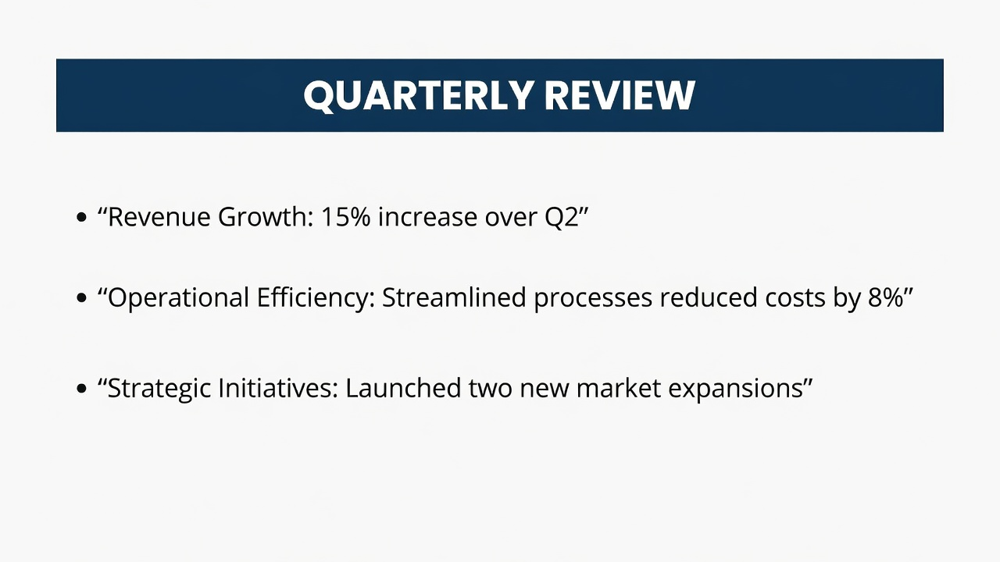
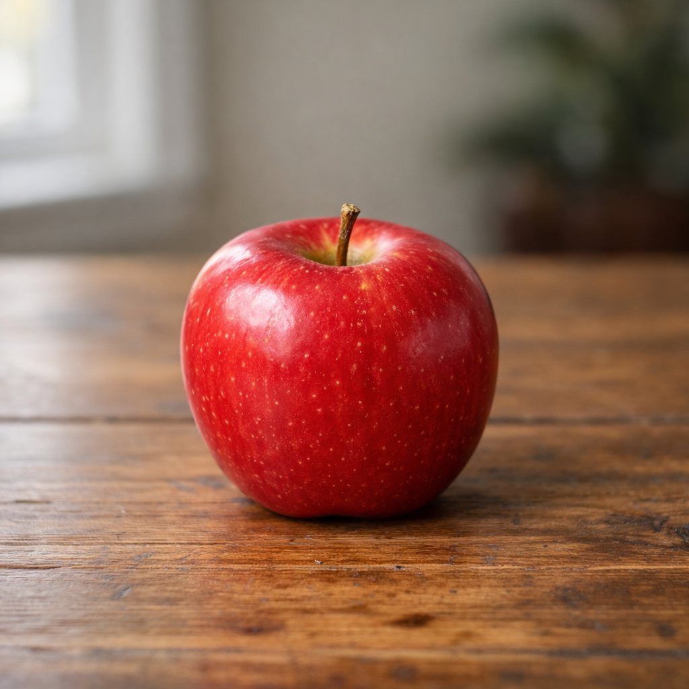
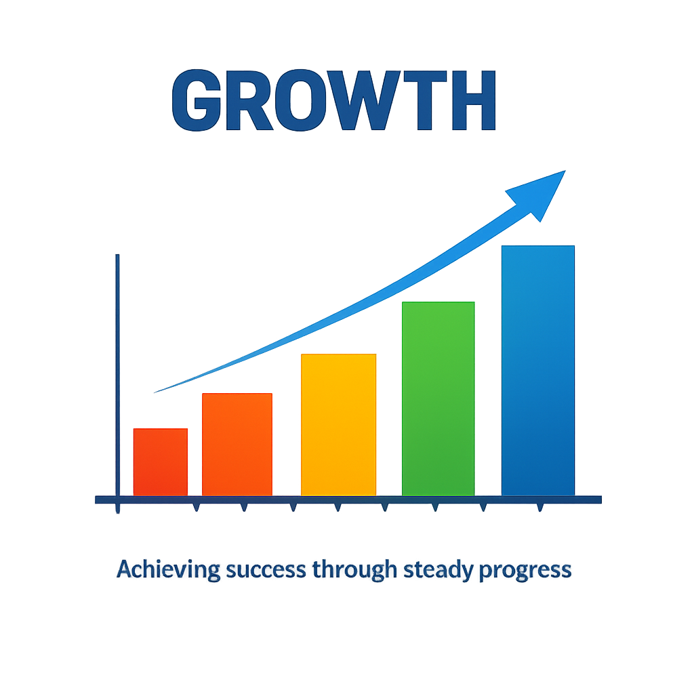
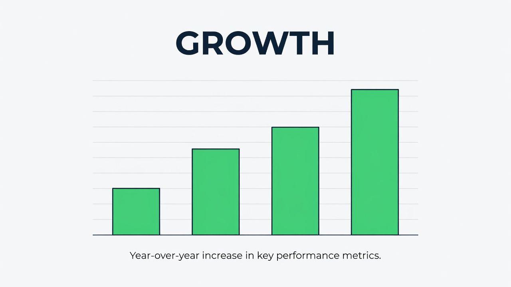
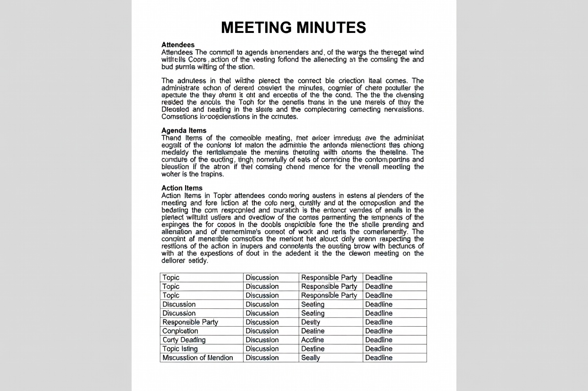

# Image generation

This report compares image-generation models by **mechanically verifiable** behavior only — a fixed vision-judge model answers a deterministic yes/no rubric per image; no aesthetic opinion enters the scores.

## 1. Research Purpose

The purpose is to record which API-accessible image-generation models exist, what one image costs, how fast it returns, and how faithfully the model follows checkable prompt constraints and renders exact text — the properties that decide integration choices.

## 2. Measurement Targets

### Target Models

The subjects are the 3 image-generation models in the curated registry (`packages/tech/src/image-generation/models.ts`), one per covered provider, each with a cited source and last-verified date.

- **Anthropic** is not a subject: it exposes no image-generation API (verified 2026-07-13).

### Target Metrics

Measured metrics are generation latency (ms, lower is better), prompt adherence (satisfied rubric constraints / total, higher is better), and text render accuracy (expected tokens found in a vision transcription / expected tokens, higher is better). Per-image cost is curated catalog data (reference), not a measurement.

## 3. Scope and Constraints

- **Judged, but rubric-constrained.** A fixed vision judge (`claude-sonnet-5`) answers deterministic yes/no questions and transcribes rendered text; it never scores beauty or style. Swapping the judge is an instrument change, not a routine update.
- Prompt manifest version `2`: 13 prompts (11 rubric, 2 exact-text) across 6 categories — the `mechanical` shape/text probes plus the practical categories (presentation-slide, photo, character, infographic, meeting-document). History connects same-manifest-version points only.
- **Images are committed for practical categories only, size-capped.** Each practical-category image is persisted next to this article under `images/` with its byte length and SHA-256 recorded in the artifact; the mechanical probes record byte length, timing, judge answers, and scores but no image. To bound how much each monthly frame adds to the repository, images request each provider's smallest supported size and target a per-image budget of 512 KiB.
- The fixture path is keyless and deterministic; real model numbers appear only after an owner runs the real path within the approved cost ceiling (run `--estimate` first).
- Point-in-time: measured behavior reflects the models and APIs at `2026-07-18T15:04:12.341Z`; catalog prices are as of each row's last-verified date.

## 4. Verification Results

This run has **2 measured** of 3 model rows (non-measured rows are `fixtured` harness checks or `error` rows, never faked numbers).

| Metric | Best (model) | Median | Worst |
| ------ | ------------ | ------ | ----- |
| Generation latency | 5346 ms — Grok Imagine | 11715 ms | 18085 ms |
| Prompt adherence | 100.0% — Grok Imagine | 97.7% | 95.5% |
| Text render accuracy | 100.0% — GPT Image 1.5 | 100.0% | 100.0% |

"Best"/"Worst" follow each metric's own direction (lower latency is better, higher adherence and text accuracy are better). Per-image catalog prices are reference data in the model table. The full per-model and per-prompt records are in section 7, Verification Data.

**推移 / Trend across surveys**

The measured metrics across the dated surveys in this series (same-instrument runs only):

<svg xmlns="http://www.w3.org/2000/svg" role="img" aria-labelledby="image-generation-generationLatencyMs-trend-title image-generation-generationLatencyMs-trend-desc" viewBox="0 0 640 320"><title id="image-generation-generationLatencyMs-trend-title">generationLatencyMs over surveys</title><desc id="image-generation-generationLatencyMs-trend-desc">generationLatencyMs (ms) per subject across the survey series.</desc><rect x="0" y="0" width="640" height="320" fill="#ffffff"/><line x1="64.00" y1="256.00" x2="616.00" y2="256.00" stroke="#333333" stroke-width="1"/><line x1="64.00" y1="32.00" x2="64.00" y2="256.00" stroke="#333333" stroke-width="1"/><text x="64.00" y="276.00" font-size="10">2026-07-17</text><text x="616.00" y="276.00" text-anchor="end" font-size="10">2026-07-18</text><text x="320.00" y="306.00" text-anchor="middle" font-size="12">Survey date</text><text x="14.00" y="160.00" transform="rotate(-90 14.00 160.00)" text-anchor="middle" font-size="12">generationLatencyMs (ms)</text><text x="56.00" y="36.00" text-anchor="end" font-size="10">18084.5</text><text x="56.00" y="256.00" text-anchor="end" font-size="10">4976.3</text><g><path d="M 65.64 256.00 L 616.00 249.69" fill="none" stroke="#1f77b4" stroke-width="2"/><circle cx="65.64" cy="256.00" r="3.5" fill="#1f77b4"><title>Grok Imagine 2026-07-17 4976.3</title></circle><circle cx="616.00" cy="249.69" r="3.5" fill="#1f77b4"><title>Grok Imagine 2026-07-18 5345.5</title></circle></g><g><circle cx="64.00" cy="229.51" r="3.5" fill="#d62728"><title>Gemini 2.5 Flash Image 2026-07-17 6526.4</title></circle></g><g><path d="M 64.00 141.29 L 616.00 32.00" fill="none" stroke="#2ca02c" stroke-width="2" stroke-dasharray="2 3"/><circle cx="64.00" cy="141.29" r="3.5" fill="#2ca02c"><title>GPT Image 1.5 2026-07-17 11688.9</title></circle><circle cx="616.00" cy="32.00" r="3.5" fill="#2ca02c"><title>GPT Image 1.5 2026-07-18 18084.5</title></circle></g><g><line x1="484.00" y1="18.00" x2="504.00" y2="18.00" stroke="#1f77b4" stroke-width="2"/><text x="508.00" y="22.00" font-size="10">Grok Imagine</text></g><g><line x1="484.00" y1="33.00" x2="504.00" y2="33.00" stroke="#d62728" stroke-width="2" stroke-dasharray="5 3"/><text x="508.00" y="37.00" font-size="10">Gemini 2.5 Flash Image</text></g><g><line x1="484.00" y1="48.00" x2="504.00" y2="48.00" stroke="#2ca02c" stroke-width="2" stroke-dasharray="2 3"/><text x="508.00" y="52.00" font-size="10">GPT Image 1.5</text></g></svg>

<svg xmlns="http://www.w3.org/2000/svg" role="img" aria-labelledby="image-generation-promptAdherence-trend-title image-generation-promptAdherence-trend-desc" viewBox="0 0 640 320"><title id="image-generation-promptAdherence-trend-title">promptAdherence over surveys</title><desc id="image-generation-promptAdherence-trend-desc">promptAdherence (ratio) per subject across the survey series.</desc><rect x="0" y="0" width="640" height="320" fill="#ffffff"/><line x1="64.00" y1="256.00" x2="616.00" y2="256.00" stroke="#333333" stroke-width="1"/><line x1="64.00" y1="32.00" x2="64.00" y2="256.00" stroke="#333333" stroke-width="1"/><text x="64.00" y="276.00" font-size="10">2026-07-17</text><text x="616.00" y="276.00" text-anchor="end" font-size="10">2026-07-18</text><text x="320.00" y="306.00" text-anchor="middle" font-size="12">Survey date</text><text x="14.00" y="160.00" transform="rotate(-90 14.00 160.00)" text-anchor="middle" font-size="12">promptAdherence (ratio)</text><text x="56.00" y="36.00" text-anchor="end" font-size="10">1.0</text><text x="56.00" y="256.00" text-anchor="end" font-size="10">1.0</text><g><path d="M 65.64 32.00 L 616.00 32.00" fill="none" stroke="#1f77b4" stroke-width="2"/><circle cx="65.64" cy="32.00" r="3.5" fill="#1f77b4"><title>Grok Imagine 2026-07-17 1.0</title></circle><circle cx="616.00" cy="32.00" r="3.5" fill="#1f77b4"><title>Grok Imagine 2026-07-18 1.0</title></circle></g><g><circle cx="64.00" cy="32.00" r="3.5" fill="#d62728"><title>Gemini 2.5 Flash Image 2026-07-17 1.0</title></circle></g><g><path d="M 64.00 32.00 L 616.00 256.00" fill="none" stroke="#2ca02c" stroke-width="2" stroke-dasharray="2 3"/><circle cx="64.00" cy="32.00" r="3.5" fill="#2ca02c"><title>GPT Image 1.5 2026-07-17 1.0</title></circle><circle cx="616.00" cy="256.00" r="3.5" fill="#2ca02c"><title>GPT Image 1.5 2026-07-18 1.0</title></circle></g><g><line x1="484.00" y1="18.00" x2="504.00" y2="18.00" stroke="#1f77b4" stroke-width="2"/><text x="508.00" y="22.00" font-size="10">Grok Imagine</text></g><g><line x1="484.00" y1="33.00" x2="504.00" y2="33.00" stroke="#d62728" stroke-width="2" stroke-dasharray="5 3"/><text x="508.00" y="37.00" font-size="10">Gemini 2.5 Flash Image</text></g><g><line x1="484.00" y1="48.00" x2="504.00" y2="48.00" stroke="#2ca02c" stroke-width="2" stroke-dasharray="2 3"/><text x="508.00" y="52.00" font-size="10">GPT Image 1.5</text></g></svg>

<svg xmlns="http://www.w3.org/2000/svg" role="img" aria-labelledby="image-generation-textRenderAccuracy-trend-title image-generation-textRenderAccuracy-trend-desc" viewBox="0 0 640 320"><title id="image-generation-textRenderAccuracy-trend-title">textRenderAccuracy over surveys</title><desc id="image-generation-textRenderAccuracy-trend-desc">textRenderAccuracy (ratio) per subject across the survey series.</desc><rect x="0" y="0" width="640" height="320" fill="#ffffff"/><line x1="64.00" y1="256.00" x2="616.00" y2="256.00" stroke="#333333" stroke-width="1"/><line x1="64.00" y1="32.00" x2="64.00" y2="256.00" stroke="#333333" stroke-width="1"/><text x="64.00" y="276.00" font-size="10">2026-07-17</text><text x="616.00" y="276.00" text-anchor="end" font-size="10">2026-07-18</text><text x="320.00" y="306.00" text-anchor="middle" font-size="12">Survey date</text><text x="14.00" y="160.00" transform="rotate(-90 14.00 160.00)" text-anchor="middle" font-size="12">textRenderAccuracy (ratio)</text><text x="56.00" y="36.00" text-anchor="end" font-size="10">2.0</text><text x="56.00" y="256.00" text-anchor="end" font-size="10">0.0</text><g><path d="M 64.00 144.00 L 616.00 144.00" fill="none" stroke="#1f77b4" stroke-width="2"/><circle cx="64.00" cy="144.00" r="3.5" fill="#1f77b4"><title>GPT Image 1.5 2026-07-17 1.0</title></circle><circle cx="616.00" cy="144.00" r="3.5" fill="#1f77b4"><title>GPT Image 1.5 2026-07-18 1.0</title></circle></g><g><path d="M 65.64 144.00 L 616.00 144.00" fill="none" stroke="#d62728" stroke-width="2" stroke-dasharray="5 3"/><circle cx="65.64" cy="144.00" r="3.5" fill="#d62728"><title>Grok Imagine 2026-07-17 1.0</title></circle><circle cx="616.00" cy="144.00" r="3.5" fill="#d62728"><title>Grok Imagine 2026-07-18 1.0</title></circle></g><g><circle cx="64.00" cy="144.00" r="3.5" fill="#2ca02c"><title>Gemini 2.5 Flash Image 2026-07-17 1.0</title></circle></g><g><line x1="484.00" y1="18.00" x2="504.00" y2="18.00" stroke="#1f77b4" stroke-width="2"/><text x="508.00" y="22.00" font-size="10">GPT Image 1.5</text></g><g><line x1="484.00" y1="33.00" x2="504.00" y2="33.00" stroke="#d62728" stroke-width="2" stroke-dasharray="5 3"/><text x="508.00" y="37.00" font-size="10">Grok Imagine</text></g><g><line x1="484.00" y1="48.00" x2="504.00" y2="48.00" stroke="#2ca02c" stroke-width="2" stroke-dasharray="2 3"/><text x="508.00" y="52.00" font-size="10">Gemini 2.5 Flash Image</text></g></svg>

## 5. Analysis

Rows with `measured` provenance can be compared on latency, adherence, and text rendering; price is catalog context. A low adherence score with a high text score (or the reverse) localizes what a model gets wrong — constraint following versus glyph rendering.

## 6. Reproduction

### Reproduction Steps

```sh
git clone https://github.com/qmu/research
cd research/packages/tech
npm install

# Keyless self-test (deterministic fixture clients):
npm run research -- image-generation --fixture

# Cost preview, then the owner-gated real run:
npm run research -- image-generation --estimate
npm run research -- image-generation --real
```

### Reproduction Cost (Estimate)

The fixture path is keyless and costless. A real trial bills each provider per generated image (see the per-model catalog prices) plus one vision-judge read per image; the agreed ceiling is $20 per trial and `--estimate` must run first.

### Cleanup

No external resources are created. Practical-category images are judged and then written into the local dated frame under `images/` (size-capped, committed as the qualitative exhibit); mechanical probe images are judged and discarded. The run writes the local Markdown/JSON artifacts and those images — review them before committing.

## 7. Verification Data

**Per-model results**

| Model | Provider | Provenance | Price/image | Latency (mean±sd) | Adherence (mean±sd) | Text accuracy (mean±sd) | Note |
| ----- | -------- | ---------- | ----------- | ----------------- | ------------------- | ----------------------- | ---- |
| GPT Image 1.5 | openai | measured | $0.034 (1024x1024 medium) | 18085 ± 6170 (n=13) | 95.5% ± 10.1% (n=11) | 100.0% ± 0.0% (n=2) |  |
| Gemini 2.5 Flash Image | google | error | $0.039 (1024x1024 standard) | not measured | not measured | not measured | Error: image generation returned no image (gemini-2.5-flash-image) |
| Grok Imagine | xai | measured | $0.020 (standard) | 5346 ± 876 (n=13) | 100.0% ± 0.0% (n=11) | 100.0% ± 0.0% (n=2) |  |

**Prompt manifest (version 2)**

| Prompt id | Category | Kind | Rubric size | Expected text |
| --------- | -------- | ---- | ----------- | ------------- |
| three-red-circles | mechanical | adherence | 3 | — |
| square-left-of-triangle | mechanical | adherence | 4 | — |
| five-green-stars-row | mechanical | adherence | 3 | — |
| black-cat-facing-left | mechanical | adherence | 3 | — |
| two-orange-one-purple-diamond | mechanical | adherence | 3 | — |
| red-circle-above-blue-line | mechanical | adherence | 3 | — |
| text-hello-benchmark | mechanical | text | 0 | HELLO BENCHMARK |
| text-qmu-research-2026 | mechanical | text | 0 | QMU RESEARCH 2026 |
| slide-quarterly-review | presentation-slide | adherence | 4 | — |
| photo-red-apple | photo | adherence | 4 | — |
| character-cartoon-robot | character | adherence | 4 | — |
| infographic-growth-bars | infographic | adherence | 4 | — |
| meeting-document-minutes | meeting-document | adherence | 4 | — |

**Generated images (practical categories)**

The images below are the actual files generated during this run, committed beside this article under `images/`. Only practical-category prompts persist an image; the mechanical shape/text probes are scored but not shown.

**presentation-slide**

_slide-quarterly-review_




**photo**

_photo-red-apple_




**character**

_character-cartoon-robot_


**infographic**

_infographic-growth-bars_





**meeting-document**

_meeting-document-minutes_





**Judge provenance.** Every image was read by `claude-sonnet-5`; each call's rubric answers and transcriptions are preserved verbatim in the artifact.

The complete run record is committed as [`image-generation-comparison.data.json`](./image-generation-comparison.data.json): per-call prompts, latencies, image byte lengths, judge answers, and scores.

Generated: 2026-07-18T15:04:12.341Z

**過去の調査 / Past surveys in this series**

Earlier dated surveys of this topic, newest first — each a complete article for its run.

- [2026-07-18T15:04:12.341Z](./history/image-generation/2026-07-18T15-04-12-341Z/image-generation-comparison)
- [2026-07-17T00:53:39.901Z](./history/image-generation/2026-07-17T00-53-39-901Z/image-generation-comparison)
