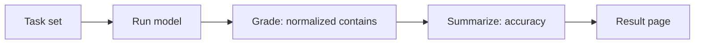

# LLMの完全一致ベンチマーク

このページは、大規模言語モデルに関する小規模な完全一致精度ベンチマークの結果を報告する。研究から公開までのパイプラインをエンドツーエンドで示すために存在しており、タスクセットは読者が数秒で再現できるよう意図的に極小に抑えられている。

## 1. 調査の目的

研究から公開までのパイプラインをエンドツーエンドで示すため、小規模な完全一致精度ベンチマークを再現可能な形で記録する。

## 2. 測定対象

### 対象モデル

コミット済みの公開結果では決定論的な `fixture` モデルを対象とする。実行時はデフォルトで `claude-opus-4-8` を使い、`ANTHROPIC_MODEL` で上書きできる。

### 対象メトリクス

対象メトリクスは完全一致に基づく精度である。回答は正規化され、小文字化、前後空白除去、内部空白の圧縮後、期待文字列を含むかで採点される。

## 3. 範囲と制約

各タスクは、単一の期待される回答を持つプロンプトである。モデルの回答は正規化され（小文字化、前後の空白除去、内部の空白の圧縮）、期待される文字列を含んでいれば正解としてカウントされる。精度は、正しく回答されたタスクの割合である。



採点およびスコアリングのロジックは純粋関数として実装されており、`packages/tech/src/llm-benchmark/domain/` にてユニットテストされている。モデルへのアクセスは `packages/tech/src/vendors/llm/` にある腐敗防止層（anti-corruption layer）を通じて行われるため、プロバイダーは交換可能である。

## 4. 検証結果

- **モデル:** `fixture`
- **精度:** 100.0% (5/5)
- **生成日時:** 2026-06-22T11:40:03.095Z

| タスク | 結果 | 期待値 | モデルの出力 |
| ---- | ------- | -------- | ------------ |
| capital-france | 正解 | Paris | Paris |
| capital-japan | 正解 | Tokyo | Tokyo |
| arithmetic-sum | 正解 | 42 | 42 |
| chemical-water | 正解 | H2O | H2O |
| planet-largest | 正解 | Jupiter | Jupiter |

## 5. 考察

タスクセットは意図的に極小であり、モデル能力の一般的な優劣を示すものではない。主な目的は、タスク定義、モデル実行、採点、レポート生成、翻訳、公開までのパイプラインが検査可能であることを示す点にある。

## 6. 再現方法

### 再現手順

```sh
git clone https://github.com/qmu/research
cd research/packages/tech
npm install

# パイプラインのセルフテスト、APIキー不要・コストなし（決定論的なfixtureモデル）:
npm run benchmark:fixture

# 実際のモデルに対して実行（デフォルトはclaude-opus-4-8、ANTHROPIC_MODELで上書き可能）:
export ANTHROPIC_API_KEY=sk-ant-...
npm run benchmark
```

この実行により、このページ `docs/research-reports/llm-benchmark.md` が再生成される。各リクエストは数百トークンのコストがかかる。正確な数値についてはモデルの料金表を参照すること。公開する比較においては、結果が時間の経過後も解釈可能であるように、モデルIDを固定しておくこと。

### 再現コスト（目安）

`npm run benchmark:fixture` はAPIキー不要でコストなし。実モデルで `npm run benchmark` を実行する場合、各リクエストは数百トークン程度の費用がかかる。

### クリーンアップ

外部リソースは作成しない。実行後はこのページと関連アーティファクトの差分を確認し、公開比較では結果が後から解釈できるようモデルIDを固定する。

## 7. 検証データ

採点およびスコアリングのロジックは `packages/tech/src/llm-benchmark/domain/` に実装され、ユニットテストされている。モデルアクセスは `packages/tech/src/vendors/llm/` の腐敗防止層を通すため、プロバイダーを交換できる。
