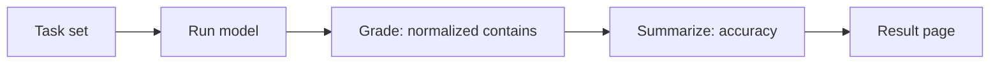

# LLM exact-match benchmark

This page reports a small exact-match accuracy benchmark for large language models.

## 1. Research Purpose

The benchmark demonstrates the research-to-publication pipeline end to end with a tiny task set that can be reproduced in seconds.

## 2. Measurement Targets

### Target Models

The current run targets `fixture`. The real path defaults to `claude-opus-4-8` unless `ANTHROPIC_MODEL` overrides it.

### Target Metrics

The metric is exact-match accuracy after normalizing the model reply: lowercased, trimmed, and internal whitespace collapsed. A task is correct when the normalized reply contains the expected string.

## 3. Scope and Constraints

The task set is intentionally tiny and exists as a pipeline self-test. It should not be read as a general model-quality benchmark or as a statistically meaningful evaluation.

## 4. Verification Results

- **Model:** `fixture`
- **Accuracy:** 100.0% (5/5)
- **Generated:** 2026-07-09T15:31:54.407Z

| Task | Outcome | Expected | Model output |
| ---- | ------- | -------- | ------------ |
| capital-france | correct | Paris | Paris |
| capital-japan | correct | Tokyo | Tokyo |
| arithmetic-sum | correct | 42 | 42 |
| chemical-water | correct | H2O | H2O |
| planet-largest | correct | Jupiter | Jupiter |

## 5. Analysis

Use this page to verify that grading, report rendering, and publication wiring work. For model selection, use the larger speed, accuracy, OCR, RAG, and availability topics.

## 6. Reproduction

### Reproduction Steps

```sh
git clone https://github.com/qmu/research
cd research/packages/tech
npm install

npm run benchmark:fixture

export ANTHROPIC_API_KEY=sk-ant-...
npm run benchmark
```

### Reproduction Cost (Estimate)

The fixture run is keyless and costless. A real run sends the small task set to the configured model; each request costs a few hundred tokens, so exact cost follows the selected model's pricing.

### Cleanup

No external resources are created. The run regenerates the Markdown report and data artifact under `docs/research-reports/`.

## 7. Verification Data



The grading and scoring logic is pure and unit-tested in `packages/tech/src/llm-benchmark/domain/`. The model is reached through an anti-corruption layer in `packages/tech/src/vendors/llm/`, so the provider is swappable. Pin the model id in any published comparison so the result stays interpretable over time.
