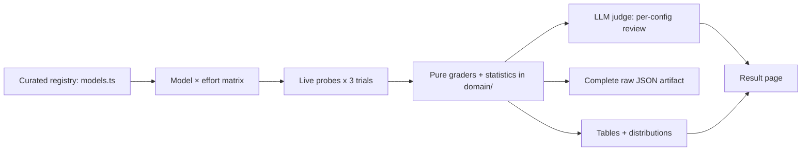

# Fundamental LLM model comparison

A routine, reproducible snapshot of how current large language models from
Anthropic, OpenAI, and Google behave across a **matrix of configurations**: each
model is swept over every one of its **effort levels**, and each configuration is
measured on four narrow, auto-gradable behaviors over **3 trials**,
then read by an LLM judge that writes a developer-facing review. Curated catalog
facts (provider, model, tier, cost, effort levels) stay separated from measured
behavior by the type system.

## Methodology

**Configurations.** 19 models across 4 providers, each swept
over its effort levels — 59 model×effort configurations. Effort maps
to each provider's own reasoning knob (Anthropic `output_config.effort`, OpenAI
`reasoning_effort`, Google thinking budget); a level a model does not support is
flagged, never faked.

**Trials & statistics.** Every probe runs **3 times** per
configuration; the per-trial values are reduced to a **mean and sample standard
deviation** (Bessel's n−1) by the pure functions in
`packages/tech/src/llm-model-comparison/domain/aggregate.ts`. A failed trial is
excluded from the aggregates, never counted as a zero, and `n` is reported
alongside every mean.

**Probes.** Each configuration is sent four probes through a provider-neutral
`CompletionClient` anti-corruption layer in `packages/tech/src/vendors/llm/`:

- **Throughput** — a long streamed generation; **sustained tokens/second during
  generation** (output tokens over `total − time-to-first-token`). This is
  generation speed, not round-trip latency.
- **Latency** — a short streamed prompt; **time-to-first-token and total response
  time**, reported separately from throughput.
- **JSON-schema complexity** — the provider's **structured-output mode** is driven
  up **two independent axes** — nesting depth (up to 48) and field
  breadth (up to 192) — each climbing geometrically from
  2 then bisecting to pin the **maximum that still returns
  schema-conforming output**. A fixed short ladder only measured its own ceiling;
  this finds the model's. A provider that rejects a schema at some size caps that
  axis there — a tested affordance, recorded verbatim, not the paper spec.
- **Length accuracy** — a paragraph of exactly 100
  words on "the water cycle"; accuracy is
  `1 - min(1, |actual - target| / target)`.

Every grader is pure and unit-tested in
`packages/tech/src/llm-model-comparison/domain/`.



_Diagram: the curated registry expands into a model×effort matrix; the live
per-trial probes are reduced by the pure graders and statistics, reviewed by the
judge, and rendered both as this page and as the complete raw JSON artifact._

## Cost & time

A full real sweep of this matrix is **59 configurations** (model ×
effort) × the four probes × **3 trials**, plus one judge call per
configuration — about **5192 API calls**. The runner prints an
**estimated** call count, rough USD cost (~$75.98), and ETA
(~779 min) *before* making any call, and supports a
`--estimate` dry run that prints the estimate without calling any provider. The
estimate uses rough per-call token assumptions; **actual** token usage is captured
per call in the run-artifact. CI never runs the real sweep — only the keyless
`compare:fixture` self-test.

## Comparison

| Provider | Model | Tier | Effort | Cost (in / out per MTok) | Throughput (tok/s) | TTFT (ms) | Total latency (ms) | Max schema depth | Max schema breadth | Length accuracy |
| -------- | ----- | ---- | ------ | ------------------------ | ------------------ | --------- | ------------------ | ---------------- | ------------------ | --------------- |
| anthropic | Claude Fable 5 | frontier | low | $6.00 / $30.00 | n/a (fixtured) | n/a (fixtured) | n/a (fixtured) | n/a (fixtured) | n/a (fixtured) | n/a (fixtured) |
| anthropic | Claude Fable 5 | frontier | medium | $6.00 / $30.00 | n/a (fixtured) | n/a (fixtured) | n/a (fixtured) | n/a (fixtured) | n/a (fixtured) | n/a (fixtured) |
| anthropic | Claude Fable 5 | frontier | high | $6.00 / $30.00 | n/a (fixtured) | n/a (fixtured) | n/a (fixtured) | n/a (fixtured) | n/a (fixtured) | n/a (fixtured) |
| anthropic | Claude Fable 5 | frontier | xhigh | $6.00 / $30.00 | n/a (fixtured) | n/a (fixtured) | n/a (fixtured) | n/a (fixtured) | n/a (fixtured) | n/a (fixtured) |
| anthropic | Claude Fable 5 | frontier | max | $6.00 / $30.00 | n/a (fixtured) | n/a (fixtured) | n/a (fixtured) | n/a (fixtured) | n/a (fixtured) | n/a (fixtured) |
| anthropic | Claude Opus 4.8 | flagship | low | $5.00 / $25.00 | n/a (fixtured) | n/a (fixtured) | n/a (fixtured) | n/a (fixtured) | n/a (fixtured) | n/a (fixtured) |
| anthropic | Claude Opus 4.8 | flagship | medium | $5.00 / $25.00 | n/a (fixtured) | n/a (fixtured) | n/a (fixtured) | n/a (fixtured) | n/a (fixtured) | n/a (fixtured) |
| anthropic | Claude Opus 4.8 | flagship | high | $5.00 / $25.00 | n/a (fixtured) | n/a (fixtured) | n/a (fixtured) | n/a (fixtured) | n/a (fixtured) | n/a (fixtured) |
| anthropic | Claude Opus 4.8 | flagship | xhigh | $5.00 / $25.00 | n/a (fixtured) | n/a (fixtured) | n/a (fixtured) | n/a (fixtured) | n/a (fixtured) | n/a (fixtured) |
| anthropic | Claude Opus 4.8 | flagship | max | $5.00 / $25.00 | n/a (fixtured) | n/a (fixtured) | n/a (fixtured) | n/a (fixtured) | n/a (fixtured) | n/a (fixtured) |
| anthropic | Claude Sonnet 5 | mid | low | $3.00 / $15.00 | n/a (fixtured) | n/a (fixtured) | n/a (fixtured) | n/a (fixtured) | n/a (fixtured) | n/a (fixtured) |
| anthropic | Claude Sonnet 5 | mid | medium | $3.00 / $15.00 | n/a (fixtured) | n/a (fixtured) | n/a (fixtured) | n/a (fixtured) | n/a (fixtured) | n/a (fixtured) |
| anthropic | Claude Sonnet 5 | mid | high | $3.00 / $15.00 | n/a (fixtured) | n/a (fixtured) | n/a (fixtured) | n/a (fixtured) | n/a (fixtured) | n/a (fixtured) |
| anthropic | Claude Sonnet 5 | mid | xhigh | $3.00 / $15.00 | n/a (fixtured) | n/a (fixtured) | n/a (fixtured) | n/a (fixtured) | n/a (fixtured) | n/a (fixtured) |
| anthropic | Claude Sonnet 5 | mid | max | $3.00 / $15.00 | n/a (fixtured) | n/a (fixtured) | n/a (fixtured) | n/a (fixtured) | n/a (fixtured) | n/a (fixtured) |
| anthropic | Claude Haiku 4.5 | small | n/a | $1.00 / $5.00 | n/a (fixtured) | n/a (fixtured) | n/a (fixtured) | n/a (fixtured) | n/a (fixtured) | n/a (fixtured) |
| openai | GPT-5.5 | flagship | none | $5.00 / $30.00 | n/a (fixtured) | n/a (fixtured) | n/a (fixtured) | n/a (fixtured) | n/a (fixtured) | n/a (fixtured) |
| openai | GPT-5.5 | flagship | low | $5.00 / $30.00 | n/a (fixtured) | n/a (fixtured) | n/a (fixtured) | n/a (fixtured) | n/a (fixtured) | n/a (fixtured) |
| openai | GPT-5.5 | flagship | medium | $5.00 / $30.00 | n/a (fixtured) | n/a (fixtured) | n/a (fixtured) | n/a (fixtured) | n/a (fixtured) | n/a (fixtured) |
| openai | GPT-5.5 | flagship | high | $5.00 / $30.00 | n/a (fixtured) | n/a (fixtured) | n/a (fixtured) | n/a (fixtured) | n/a (fixtured) | n/a (fixtured) |
| openai | GPT-5.4 | mid | none | $2.50 / $15.00 | n/a (fixtured) | n/a (fixtured) | n/a (fixtured) | n/a (fixtured) | n/a (fixtured) | n/a (fixtured) |
| openai | GPT-5.4 | mid | low | $2.50 / $15.00 | n/a (fixtured) | n/a (fixtured) | n/a (fixtured) | n/a (fixtured) | n/a (fixtured) | n/a (fixtured) |
| openai | GPT-5.4 | mid | medium | $2.50 / $15.00 | n/a (fixtured) | n/a (fixtured) | n/a (fixtured) | n/a (fixtured) | n/a (fixtured) | n/a (fixtured) |
| openai | GPT-5.4 | mid | high | $2.50 / $15.00 | n/a (fixtured) | n/a (fixtured) | n/a (fixtured) | n/a (fixtured) | n/a (fixtured) | n/a (fixtured) |
| openai | GPT-5.4 mini | small | none | $0.50 / $2.00 | n/a (fixtured) | n/a (fixtured) | n/a (fixtured) | n/a (fixtured) | n/a (fixtured) | n/a (fixtured) |
| openai | GPT-5.4 mini | small | low | $0.50 / $2.00 | n/a (fixtured) | n/a (fixtured) | n/a (fixtured) | n/a (fixtured) | n/a (fixtured) | n/a (fixtured) |
| openai | GPT-5.4 mini | small | medium | $0.50 / $2.00 | n/a (fixtured) | n/a (fixtured) | n/a (fixtured) | n/a (fixtured) | n/a (fixtured) | n/a (fixtured) |
| openai | GPT-5.4 mini | small | high | $0.50 / $2.00 | n/a (fixtured) | n/a (fixtured) | n/a (fixtured) | n/a (fixtured) | n/a (fixtured) | n/a (fixtured) |
| openai | GPT-5.4 nano | small | none | $0.15 / $0.60 | n/a (fixtured) | n/a (fixtured) | n/a (fixtured) | n/a (fixtured) | n/a (fixtured) | n/a (fixtured) |
| openai | GPT-5.4 nano | small | low | $0.15 / $0.60 | n/a (fixtured) | n/a (fixtured) | n/a (fixtured) | n/a (fixtured) | n/a (fixtured) | n/a (fixtured) |
| openai | GPT-5.4 nano | small | medium | $0.15 / $0.60 | n/a (fixtured) | n/a (fixtured) | n/a (fixtured) | n/a (fixtured) | n/a (fixtured) | n/a (fixtured) |
| openai | GPT-5.4 nano | small | high | $0.15 / $0.60 | n/a (fixtured) | n/a (fixtured) | n/a (fixtured) | n/a (fixtured) | n/a (fixtured) | n/a (fixtured) |
| openai | o4-mini | mid | low | $1.10 / $4.40 | n/a (fixtured) | n/a (fixtured) | n/a (fixtured) | n/a (fixtured) | n/a (fixtured) | n/a (fixtured) |
| openai | o4-mini | mid | medium | $1.10 / $4.40 | n/a (fixtured) | n/a (fixtured) | n/a (fixtured) | n/a (fixtured) | n/a (fixtured) | n/a (fixtured) |
| openai | o4-mini | mid | high | $1.10 / $4.40 | n/a (fixtured) | n/a (fixtured) | n/a (fixtured) | n/a (fixtured) | n/a (fixtured) | n/a (fixtured) |
| openai | GPT Realtime | flagship | n/a | $4.00 / $16.00 | n/a (fixtured) | n/a (fixtured) | n/a (fixtured) | n/a (fixtured) | n/a (fixtured) | n/a (fixtured) |
| openai | GPT-5.3 Codex | flagship | low | $1.75 / $14.00 | n/a (fixtured) | n/a (fixtured) | n/a (fixtured) | n/a (fixtured) | n/a (fixtured) | n/a (fixtured) |
| openai | GPT-5.3 Codex | flagship | medium | $1.75 / $14.00 | n/a (fixtured) | n/a (fixtured) | n/a (fixtured) | n/a (fixtured) | n/a (fixtured) | n/a (fixtured) |
| openai | GPT-5.3 Codex | flagship | high | $1.75 / $14.00 | n/a (fixtured) | n/a (fixtured) | n/a (fixtured) | n/a (fixtured) | n/a (fixtured) | n/a (fixtured) |
| openai | GPT-5.3 Codex | flagship | xhigh | $1.75 / $14.00 | n/a (fixtured) | n/a (fixtured) | n/a (fixtured) | n/a (fixtured) | n/a (fixtured) | n/a (fixtured) |
| openai | GPT-5.1 Codex mini | small | low | $0.25 / $2.00 | n/a (fixtured) | n/a (fixtured) | n/a (fixtured) | n/a (fixtured) | n/a (fixtured) | n/a (fixtured) |
| openai | GPT-5.1 Codex mini | small | medium | $0.25 / $2.00 | n/a (fixtured) | n/a (fixtured) | n/a (fixtured) | n/a (fixtured) | n/a (fixtured) | n/a (fixtured) |
| openai | GPT-5.1 Codex mini | small | high | $0.25 / $2.00 | n/a (fixtured) | n/a (fixtured) | n/a (fixtured) | n/a (fixtured) | n/a (fixtured) | n/a (fixtured) |
| google | Gemini 3.1 Pro | flagship | low | $2.00 / $12.00 | n/a (fixtured) | n/a (fixtured) | n/a (fixtured) | n/a (fixtured) | n/a (fixtured) | n/a (fixtured) |
| google | Gemini 3.1 Pro | flagship | medium | $2.00 / $12.00 | n/a (fixtured) | n/a (fixtured) | n/a (fixtured) | n/a (fixtured) | n/a (fixtured) | n/a (fixtured) |
| google | Gemini 3.1 Pro | flagship | high | $2.00 / $12.00 | n/a (fixtured) | n/a (fixtured) | n/a (fixtured) | n/a (fixtured) | n/a (fixtured) | n/a (fixtured) |
| google | Gemini 3.5 Flash | mid | low | $0.30 / $2.50 | n/a (fixtured) | n/a (fixtured) | n/a (fixtured) | n/a (fixtured) | n/a (fixtured) | n/a (fixtured) |
| google | Gemini 3.5 Flash | mid | medium | $0.30 / $2.50 | n/a (fixtured) | n/a (fixtured) | n/a (fixtured) | n/a (fixtured) | n/a (fixtured) | n/a (fixtured) |
| google | Gemini 3.5 Flash | mid | high | $0.30 / $2.50 | n/a (fixtured) | n/a (fixtured) | n/a (fixtured) | n/a (fixtured) | n/a (fixtured) | n/a (fixtured) |
| google | Gemini 3.1 Flash-Lite | small | low | $0.10 / $0.40 | n/a (fixtured) | n/a (fixtured) | n/a (fixtured) | n/a (fixtured) | n/a (fixtured) | n/a (fixtured) |
| google | Gemini 3.1 Flash-Lite | small | medium | $0.10 / $0.40 | n/a (fixtured) | n/a (fixtured) | n/a (fixtured) | n/a (fixtured) | n/a (fixtured) | n/a (fixtured) |
| google | Gemini 3.1 Flash-Lite | small | high | $0.10 / $0.40 | n/a (fixtured) | n/a (fixtured) | n/a (fixtured) | n/a (fixtured) | n/a (fixtured) | n/a (fixtured) |
| xai | Grok 4.3 | frontier | none | $1.25 / $2.50 | n/a (fixtured) | n/a (fixtured) | n/a (fixtured) | n/a (fixtured) | n/a (fixtured) | n/a (fixtured) |
| xai | Grok 4.3 | frontier | low | $1.25 / $2.50 | n/a (fixtured) | n/a (fixtured) | n/a (fixtured) | n/a (fixtured) | n/a (fixtured) | n/a (fixtured) |
| xai | Grok 4.3 | frontier | medium | $1.25 / $2.50 | n/a (fixtured) | n/a (fixtured) | n/a (fixtured) | n/a (fixtured) | n/a (fixtured) | n/a (fixtured) |
| xai | Grok 4.3 | frontier | high | $1.25 / $2.50 | n/a (fixtured) | n/a (fixtured) | n/a (fixtured) | n/a (fixtured) | n/a (fixtured) | n/a (fixtured) |
| xai | Grok 4.20 Reasoning | flagship | n/a | $1.25 / $2.50 | n/a (fixtured) | n/a (fixtured) | n/a (fixtured) | n/a (fixtured) | n/a (fixtured) | n/a (fixtured) |
| xai | Grok 4.20 Non-Reasoning | mid | n/a | $1.25 / $2.50 | n/a (fixtured) | n/a (fixtured) | n/a (fixtured) | n/a (fixtured) | n/a (fixtured) | n/a (fixtured) |
| xai | Grok Build 0.1 | small | n/a | $1.00 / $2.00 | n/a (fixtured) | n/a (fixtured) | n/a (fixtured) | n/a (fixtured) | n/a (fixtured) | n/a (fixtured) |

**Legend.** Provider, Model, Tier, Effort, and Cost are **curated** catalog data
(cited). Throughput, TTFT, total latency, max schema complexity, and length
accuracy are **measured** live, each a mean over 3 trials. A cell
reading `n/a (fixtured)` was produced by the deterministic fixture client (no
API key) and is **not** a live measurement; `n/a (error)` means every trial for
that configuration failed. Provenance is stated in words, never by colour.

## Per-aspect analysis

Each aspect as a distribution across the configurations — mean ± sample standard
deviation, the observed min–max, and the number of contributing trials.

### Sustained throughput (tokens / second during generation)

| Configuration | Mean ± SD | Min–Max | n |
| ------------- | --------- | ------- | - |
| Claude Fable 5 [low] | n/a (fixtured) | n/a (fixtured) | n/a (fixtured) |
| Claude Fable 5 [medium] | n/a (fixtured) | n/a (fixtured) | n/a (fixtured) |
| Claude Fable 5 [high] | n/a (fixtured) | n/a (fixtured) | n/a (fixtured) |
| Claude Fable 5 [xhigh] | n/a (fixtured) | n/a (fixtured) | n/a (fixtured) |
| Claude Fable 5 [max] | n/a (fixtured) | n/a (fixtured) | n/a (fixtured) |
| Claude Opus 4.8 [low] | n/a (fixtured) | n/a (fixtured) | n/a (fixtured) |
| Claude Opus 4.8 [medium] | n/a (fixtured) | n/a (fixtured) | n/a (fixtured) |
| Claude Opus 4.8 [high] | n/a (fixtured) | n/a (fixtured) | n/a (fixtured) |
| Claude Opus 4.8 [xhigh] | n/a (fixtured) | n/a (fixtured) | n/a (fixtured) |
| Claude Opus 4.8 [max] | n/a (fixtured) | n/a (fixtured) | n/a (fixtured) |
| Claude Sonnet 5 [low] | n/a (fixtured) | n/a (fixtured) | n/a (fixtured) |
| Claude Sonnet 5 [medium] | n/a (fixtured) | n/a (fixtured) | n/a (fixtured) |
| Claude Sonnet 5 [high] | n/a (fixtured) | n/a (fixtured) | n/a (fixtured) |
| Claude Sonnet 5 [xhigh] | n/a (fixtured) | n/a (fixtured) | n/a (fixtured) |
| Claude Sonnet 5 [max] | n/a (fixtured) | n/a (fixtured) | n/a (fixtured) |
| Claude Haiku 4.5 [n/a] | n/a (fixtured) | n/a (fixtured) | n/a (fixtured) |
| GPT-5.5 [none] | n/a (fixtured) | n/a (fixtured) | n/a (fixtured) |
| GPT-5.5 [low] | n/a (fixtured) | n/a (fixtured) | n/a (fixtured) |
| GPT-5.5 [medium] | n/a (fixtured) | n/a (fixtured) | n/a (fixtured) |
| GPT-5.5 [high] | n/a (fixtured) | n/a (fixtured) | n/a (fixtured) |
| GPT-5.4 [none] | n/a (fixtured) | n/a (fixtured) | n/a (fixtured) |
| GPT-5.4 [low] | n/a (fixtured) | n/a (fixtured) | n/a (fixtured) |
| GPT-5.4 [medium] | n/a (fixtured) | n/a (fixtured) | n/a (fixtured) |
| GPT-5.4 [high] | n/a (fixtured) | n/a (fixtured) | n/a (fixtured) |
| GPT-5.4 mini [none] | n/a (fixtured) | n/a (fixtured) | n/a (fixtured) |
| GPT-5.4 mini [low] | n/a (fixtured) | n/a (fixtured) | n/a (fixtured) |
| GPT-5.4 mini [medium] | n/a (fixtured) | n/a (fixtured) | n/a (fixtured) |
| GPT-5.4 mini [high] | n/a (fixtured) | n/a (fixtured) | n/a (fixtured) |
| GPT-5.4 nano [none] | n/a (fixtured) | n/a (fixtured) | n/a (fixtured) |
| GPT-5.4 nano [low] | n/a (fixtured) | n/a (fixtured) | n/a (fixtured) |
| GPT-5.4 nano [medium] | n/a (fixtured) | n/a (fixtured) | n/a (fixtured) |
| GPT-5.4 nano [high] | n/a (fixtured) | n/a (fixtured) | n/a (fixtured) |
| o4-mini [low] | n/a (fixtured) | n/a (fixtured) | n/a (fixtured) |
| o4-mini [medium] | n/a (fixtured) | n/a (fixtured) | n/a (fixtured) |
| o4-mini [high] | n/a (fixtured) | n/a (fixtured) | n/a (fixtured) |
| GPT Realtime [n/a] | n/a (fixtured) | n/a (fixtured) | n/a (fixtured) |
| GPT-5.3 Codex [low] | n/a (fixtured) | n/a (fixtured) | n/a (fixtured) |
| GPT-5.3 Codex [medium] | n/a (fixtured) | n/a (fixtured) | n/a (fixtured) |
| GPT-5.3 Codex [high] | n/a (fixtured) | n/a (fixtured) | n/a (fixtured) |
| GPT-5.3 Codex [xhigh] | n/a (fixtured) | n/a (fixtured) | n/a (fixtured) |
| GPT-5.1 Codex mini [low] | n/a (fixtured) | n/a (fixtured) | n/a (fixtured) |
| GPT-5.1 Codex mini [medium] | n/a (fixtured) | n/a (fixtured) | n/a (fixtured) |
| GPT-5.1 Codex mini [high] | n/a (fixtured) | n/a (fixtured) | n/a (fixtured) |
| Gemini 3.1 Pro [low] | n/a (fixtured) | n/a (fixtured) | n/a (fixtured) |
| Gemini 3.1 Pro [medium] | n/a (fixtured) | n/a (fixtured) | n/a (fixtured) |
| Gemini 3.1 Pro [high] | n/a (fixtured) | n/a (fixtured) | n/a (fixtured) |
| Gemini 3.5 Flash [low] | n/a (fixtured) | n/a (fixtured) | n/a (fixtured) |
| Gemini 3.5 Flash [medium] | n/a (fixtured) | n/a (fixtured) | n/a (fixtured) |
| Gemini 3.5 Flash [high] | n/a (fixtured) | n/a (fixtured) | n/a (fixtured) |
| Gemini 3.1 Flash-Lite [low] | n/a (fixtured) | n/a (fixtured) | n/a (fixtured) |
| Gemini 3.1 Flash-Lite [medium] | n/a (fixtured) | n/a (fixtured) | n/a (fixtured) |
| Gemini 3.1 Flash-Lite [high] | n/a (fixtured) | n/a (fixtured) | n/a (fixtured) |
| Grok 4.3 [none] | n/a (fixtured) | n/a (fixtured) | n/a (fixtured) |
| Grok 4.3 [low] | n/a (fixtured) | n/a (fixtured) | n/a (fixtured) |
| Grok 4.3 [medium] | n/a (fixtured) | n/a (fixtured) | n/a (fixtured) |
| Grok 4.3 [high] | n/a (fixtured) | n/a (fixtured) | n/a (fixtured) |
| Grok 4.20 Reasoning [n/a] | n/a (fixtured) | n/a (fixtured) | n/a (fixtured) |
| Grok 4.20 Non-Reasoning [n/a] | n/a (fixtured) | n/a (fixtured) | n/a (fixtured) |
| Grok Build 0.1 [n/a] | n/a (fixtured) | n/a (fixtured) | n/a (fixtured) |

No live measurements in this run — every configuration was fixtured or errored, so this aspect has no comparison.

### Latency — time to first token (ms)

| Configuration | Mean ± SD | Min–Max | n |
| ------------- | --------- | ------- | - |
| Claude Fable 5 [low] | n/a (fixtured) | n/a (fixtured) | n/a (fixtured) |
| Claude Fable 5 [medium] | n/a (fixtured) | n/a (fixtured) | n/a (fixtured) |
| Claude Fable 5 [high] | n/a (fixtured) | n/a (fixtured) | n/a (fixtured) |
| Claude Fable 5 [xhigh] | n/a (fixtured) | n/a (fixtured) | n/a (fixtured) |
| Claude Fable 5 [max] | n/a (fixtured) | n/a (fixtured) | n/a (fixtured) |
| Claude Opus 4.8 [low] | n/a (fixtured) | n/a (fixtured) | n/a (fixtured) |
| Claude Opus 4.8 [medium] | n/a (fixtured) | n/a (fixtured) | n/a (fixtured) |
| Claude Opus 4.8 [high] | n/a (fixtured) | n/a (fixtured) | n/a (fixtured) |
| Claude Opus 4.8 [xhigh] | n/a (fixtured) | n/a (fixtured) | n/a (fixtured) |
| Claude Opus 4.8 [max] | n/a (fixtured) | n/a (fixtured) | n/a (fixtured) |
| Claude Sonnet 5 [low] | n/a (fixtured) | n/a (fixtured) | n/a (fixtured) |
| Claude Sonnet 5 [medium] | n/a (fixtured) | n/a (fixtured) | n/a (fixtured) |
| Claude Sonnet 5 [high] | n/a (fixtured) | n/a (fixtured) | n/a (fixtured) |
| Claude Sonnet 5 [xhigh] | n/a (fixtured) | n/a (fixtured) | n/a (fixtured) |
| Claude Sonnet 5 [max] | n/a (fixtured) | n/a (fixtured) | n/a (fixtured) |
| Claude Haiku 4.5 [n/a] | n/a (fixtured) | n/a (fixtured) | n/a (fixtured) |
| GPT-5.5 [none] | n/a (fixtured) | n/a (fixtured) | n/a (fixtured) |
| GPT-5.5 [low] | n/a (fixtured) | n/a (fixtured) | n/a (fixtured) |
| GPT-5.5 [medium] | n/a (fixtured) | n/a (fixtured) | n/a (fixtured) |
| GPT-5.5 [high] | n/a (fixtured) | n/a (fixtured) | n/a (fixtured) |
| GPT-5.4 [none] | n/a (fixtured) | n/a (fixtured) | n/a (fixtured) |
| GPT-5.4 [low] | n/a (fixtured) | n/a (fixtured) | n/a (fixtured) |
| GPT-5.4 [medium] | n/a (fixtured) | n/a (fixtured) | n/a (fixtured) |
| GPT-5.4 [high] | n/a (fixtured) | n/a (fixtured) | n/a (fixtured) |
| GPT-5.4 mini [none] | n/a (fixtured) | n/a (fixtured) | n/a (fixtured) |
| GPT-5.4 mini [low] | n/a (fixtured) | n/a (fixtured) | n/a (fixtured) |
| GPT-5.4 mini [medium] | n/a (fixtured) | n/a (fixtured) | n/a (fixtured) |
| GPT-5.4 mini [high] | n/a (fixtured) | n/a (fixtured) | n/a (fixtured) |
| GPT-5.4 nano [none] | n/a (fixtured) | n/a (fixtured) | n/a (fixtured) |
| GPT-5.4 nano [low] | n/a (fixtured) | n/a (fixtured) | n/a (fixtured) |
| GPT-5.4 nano [medium] | n/a (fixtured) | n/a (fixtured) | n/a (fixtured) |
| GPT-5.4 nano [high] | n/a (fixtured) | n/a (fixtured) | n/a (fixtured) |
| o4-mini [low] | n/a (fixtured) | n/a (fixtured) | n/a (fixtured) |
| o4-mini [medium] | n/a (fixtured) | n/a (fixtured) | n/a (fixtured) |
| o4-mini [high] | n/a (fixtured) | n/a (fixtured) | n/a (fixtured) |
| GPT Realtime [n/a] | n/a (fixtured) | n/a (fixtured) | n/a (fixtured) |
| GPT-5.3 Codex [low] | n/a (fixtured) | n/a (fixtured) | n/a (fixtured) |
| GPT-5.3 Codex [medium] | n/a (fixtured) | n/a (fixtured) | n/a (fixtured) |
| GPT-5.3 Codex [high] | n/a (fixtured) | n/a (fixtured) | n/a (fixtured) |
| GPT-5.3 Codex [xhigh] | n/a (fixtured) | n/a (fixtured) | n/a (fixtured) |
| GPT-5.1 Codex mini [low] | n/a (fixtured) | n/a (fixtured) | n/a (fixtured) |
| GPT-5.1 Codex mini [medium] | n/a (fixtured) | n/a (fixtured) | n/a (fixtured) |
| GPT-5.1 Codex mini [high] | n/a (fixtured) | n/a (fixtured) | n/a (fixtured) |
| Gemini 3.1 Pro [low] | n/a (fixtured) | n/a (fixtured) | n/a (fixtured) |
| Gemini 3.1 Pro [medium] | n/a (fixtured) | n/a (fixtured) | n/a (fixtured) |
| Gemini 3.1 Pro [high] | n/a (fixtured) | n/a (fixtured) | n/a (fixtured) |
| Gemini 3.5 Flash [low] | n/a (fixtured) | n/a (fixtured) | n/a (fixtured) |
| Gemini 3.5 Flash [medium] | n/a (fixtured) | n/a (fixtured) | n/a (fixtured) |
| Gemini 3.5 Flash [high] | n/a (fixtured) | n/a (fixtured) | n/a (fixtured) |
| Gemini 3.1 Flash-Lite [low] | n/a (fixtured) | n/a (fixtured) | n/a (fixtured) |
| Gemini 3.1 Flash-Lite [medium] | n/a (fixtured) | n/a (fixtured) | n/a (fixtured) |
| Gemini 3.1 Flash-Lite [high] | n/a (fixtured) | n/a (fixtured) | n/a (fixtured) |
| Grok 4.3 [none] | n/a (fixtured) | n/a (fixtured) | n/a (fixtured) |
| Grok 4.3 [low] | n/a (fixtured) | n/a (fixtured) | n/a (fixtured) |
| Grok 4.3 [medium] | n/a (fixtured) | n/a (fixtured) | n/a (fixtured) |
| Grok 4.3 [high] | n/a (fixtured) | n/a (fixtured) | n/a (fixtured) |
| Grok 4.20 Reasoning [n/a] | n/a (fixtured) | n/a (fixtured) | n/a (fixtured) |
| Grok 4.20 Non-Reasoning [n/a] | n/a (fixtured) | n/a (fixtured) | n/a (fixtured) |
| Grok Build 0.1 [n/a] | n/a (fixtured) | n/a (fixtured) | n/a (fixtured) |

No live measurements in this run — every configuration was fixtured or errored, so this aspect has no comparison.

### Latency — total response time (ms)

| Configuration | Mean ± SD | Min–Max | n |
| ------------- | --------- | ------- | - |
| Claude Fable 5 [low] | n/a (fixtured) | n/a (fixtured) | n/a (fixtured) |
| Claude Fable 5 [medium] | n/a (fixtured) | n/a (fixtured) | n/a (fixtured) |
| Claude Fable 5 [high] | n/a (fixtured) | n/a (fixtured) | n/a (fixtured) |
| Claude Fable 5 [xhigh] | n/a (fixtured) | n/a (fixtured) | n/a (fixtured) |
| Claude Fable 5 [max] | n/a (fixtured) | n/a (fixtured) | n/a (fixtured) |
| Claude Opus 4.8 [low] | n/a (fixtured) | n/a (fixtured) | n/a (fixtured) |
| Claude Opus 4.8 [medium] | n/a (fixtured) | n/a (fixtured) | n/a (fixtured) |
| Claude Opus 4.8 [high] | n/a (fixtured) | n/a (fixtured) | n/a (fixtured) |
| Claude Opus 4.8 [xhigh] | n/a (fixtured) | n/a (fixtured) | n/a (fixtured) |
| Claude Opus 4.8 [max] | n/a (fixtured) | n/a (fixtured) | n/a (fixtured) |
| Claude Sonnet 5 [low] | n/a (fixtured) | n/a (fixtured) | n/a (fixtured) |
| Claude Sonnet 5 [medium] | n/a (fixtured) | n/a (fixtured) | n/a (fixtured) |
| Claude Sonnet 5 [high] | n/a (fixtured) | n/a (fixtured) | n/a (fixtured) |
| Claude Sonnet 5 [xhigh] | n/a (fixtured) | n/a (fixtured) | n/a (fixtured) |
| Claude Sonnet 5 [max] | n/a (fixtured) | n/a (fixtured) | n/a (fixtured) |
| Claude Haiku 4.5 [n/a] | n/a (fixtured) | n/a (fixtured) | n/a (fixtured) |
| GPT-5.5 [none] | n/a (fixtured) | n/a (fixtured) | n/a (fixtured) |
| GPT-5.5 [low] | n/a (fixtured) | n/a (fixtured) | n/a (fixtured) |
| GPT-5.5 [medium] | n/a (fixtured) | n/a (fixtured) | n/a (fixtured) |
| GPT-5.5 [high] | n/a (fixtured) | n/a (fixtured) | n/a (fixtured) |
| GPT-5.4 [none] | n/a (fixtured) | n/a (fixtured) | n/a (fixtured) |
| GPT-5.4 [low] | n/a (fixtured) | n/a (fixtured) | n/a (fixtured) |
| GPT-5.4 [medium] | n/a (fixtured) | n/a (fixtured) | n/a (fixtured) |
| GPT-5.4 [high] | n/a (fixtured) | n/a (fixtured) | n/a (fixtured) |
| GPT-5.4 mini [none] | n/a (fixtured) | n/a (fixtured) | n/a (fixtured) |
| GPT-5.4 mini [low] | n/a (fixtured) | n/a (fixtured) | n/a (fixtured) |
| GPT-5.4 mini [medium] | n/a (fixtured) | n/a (fixtured) | n/a (fixtured) |
| GPT-5.4 mini [high] | n/a (fixtured) | n/a (fixtured) | n/a (fixtured) |
| GPT-5.4 nano [none] | n/a (fixtured) | n/a (fixtured) | n/a (fixtured) |
| GPT-5.4 nano [low] | n/a (fixtured) | n/a (fixtured) | n/a (fixtured) |
| GPT-5.4 nano [medium] | n/a (fixtured) | n/a (fixtured) | n/a (fixtured) |
| GPT-5.4 nano [high] | n/a (fixtured) | n/a (fixtured) | n/a (fixtured) |
| o4-mini [low] | n/a (fixtured) | n/a (fixtured) | n/a (fixtured) |
| o4-mini [medium] | n/a (fixtured) | n/a (fixtured) | n/a (fixtured) |
| o4-mini [high] | n/a (fixtured) | n/a (fixtured) | n/a (fixtured) |
| GPT Realtime [n/a] | n/a (fixtured) | n/a (fixtured) | n/a (fixtured) |
| GPT-5.3 Codex [low] | n/a (fixtured) | n/a (fixtured) | n/a (fixtured) |
| GPT-5.3 Codex [medium] | n/a (fixtured) | n/a (fixtured) | n/a (fixtured) |
| GPT-5.3 Codex [high] | n/a (fixtured) | n/a (fixtured) | n/a (fixtured) |
| GPT-5.3 Codex [xhigh] | n/a (fixtured) | n/a (fixtured) | n/a (fixtured) |
| GPT-5.1 Codex mini [low] | n/a (fixtured) | n/a (fixtured) | n/a (fixtured) |
| GPT-5.1 Codex mini [medium] | n/a (fixtured) | n/a (fixtured) | n/a (fixtured) |
| GPT-5.1 Codex mini [high] | n/a (fixtured) | n/a (fixtured) | n/a (fixtured) |
| Gemini 3.1 Pro [low] | n/a (fixtured) | n/a (fixtured) | n/a (fixtured) |
| Gemini 3.1 Pro [medium] | n/a (fixtured) | n/a (fixtured) | n/a (fixtured) |
| Gemini 3.1 Pro [high] | n/a (fixtured) | n/a (fixtured) | n/a (fixtured) |
| Gemini 3.5 Flash [low] | n/a (fixtured) | n/a (fixtured) | n/a (fixtured) |
| Gemini 3.5 Flash [medium] | n/a (fixtured) | n/a (fixtured) | n/a (fixtured) |
| Gemini 3.5 Flash [high] | n/a (fixtured) | n/a (fixtured) | n/a (fixtured) |
| Gemini 3.1 Flash-Lite [low] | n/a (fixtured) | n/a (fixtured) | n/a (fixtured) |
| Gemini 3.1 Flash-Lite [medium] | n/a (fixtured) | n/a (fixtured) | n/a (fixtured) |
| Gemini 3.1 Flash-Lite [high] | n/a (fixtured) | n/a (fixtured) | n/a (fixtured) |
| Grok 4.3 [none] | n/a (fixtured) | n/a (fixtured) | n/a (fixtured) |
| Grok 4.3 [low] | n/a (fixtured) | n/a (fixtured) | n/a (fixtured) |
| Grok 4.3 [medium] | n/a (fixtured) | n/a (fixtured) | n/a (fixtured) |
| Grok 4.3 [high] | n/a (fixtured) | n/a (fixtured) | n/a (fixtured) |
| Grok 4.20 Reasoning [n/a] | n/a (fixtured) | n/a (fixtured) | n/a (fixtured) |
| Grok 4.20 Non-Reasoning [n/a] | n/a (fixtured) | n/a (fixtured) | n/a (fixtured) |
| Grok Build 0.1 [n/a] | n/a (fixtured) | n/a (fixtured) | n/a (fixtured) |

No live measurements in this run — every configuration was fixtured or errored, so this aspect has no comparison.

### Tested maximum JSON-schema nesting depth

| Configuration | Mean ± SD | Min–Max | n |
| ------------- | --------- | ------- | - |
| Claude Fable 5 [low] | n/a (fixtured) | n/a (fixtured) | n/a (fixtured) |
| Claude Fable 5 [medium] | n/a (fixtured) | n/a (fixtured) | n/a (fixtured) |
| Claude Fable 5 [high] | n/a (fixtured) | n/a (fixtured) | n/a (fixtured) |
| Claude Fable 5 [xhigh] | n/a (fixtured) | n/a (fixtured) | n/a (fixtured) |
| Claude Fable 5 [max] | n/a (fixtured) | n/a (fixtured) | n/a (fixtured) |
| Claude Opus 4.8 [low] | n/a (fixtured) | n/a (fixtured) | n/a (fixtured) |
| Claude Opus 4.8 [medium] | n/a (fixtured) | n/a (fixtured) | n/a (fixtured) |
| Claude Opus 4.8 [high] | n/a (fixtured) | n/a (fixtured) | n/a (fixtured) |
| Claude Opus 4.8 [xhigh] | n/a (fixtured) | n/a (fixtured) | n/a (fixtured) |
| Claude Opus 4.8 [max] | n/a (fixtured) | n/a (fixtured) | n/a (fixtured) |
| Claude Sonnet 5 [low] | n/a (fixtured) | n/a (fixtured) | n/a (fixtured) |
| Claude Sonnet 5 [medium] | n/a (fixtured) | n/a (fixtured) | n/a (fixtured) |
| Claude Sonnet 5 [high] | n/a (fixtured) | n/a (fixtured) | n/a (fixtured) |
| Claude Sonnet 5 [xhigh] | n/a (fixtured) | n/a (fixtured) | n/a (fixtured) |
| Claude Sonnet 5 [max] | n/a (fixtured) | n/a (fixtured) | n/a (fixtured) |
| Claude Haiku 4.5 [n/a] | n/a (fixtured) | n/a (fixtured) | n/a (fixtured) |
| GPT-5.5 [none] | n/a (fixtured) | n/a (fixtured) | n/a (fixtured) |
| GPT-5.5 [low] | n/a (fixtured) | n/a (fixtured) | n/a (fixtured) |
| GPT-5.5 [medium] | n/a (fixtured) | n/a (fixtured) | n/a (fixtured) |
| GPT-5.5 [high] | n/a (fixtured) | n/a (fixtured) | n/a (fixtured) |
| GPT-5.4 [none] | n/a (fixtured) | n/a (fixtured) | n/a (fixtured) |
| GPT-5.4 [low] | n/a (fixtured) | n/a (fixtured) | n/a (fixtured) |
| GPT-5.4 [medium] | n/a (fixtured) | n/a (fixtured) | n/a (fixtured) |
| GPT-5.4 [high] | n/a (fixtured) | n/a (fixtured) | n/a (fixtured) |
| GPT-5.4 mini [none] | n/a (fixtured) | n/a (fixtured) | n/a (fixtured) |
| GPT-5.4 mini [low] | n/a (fixtured) | n/a (fixtured) | n/a (fixtured) |
| GPT-5.4 mini [medium] | n/a (fixtured) | n/a (fixtured) | n/a (fixtured) |
| GPT-5.4 mini [high] | n/a (fixtured) | n/a (fixtured) | n/a (fixtured) |
| GPT-5.4 nano [none] | n/a (fixtured) | n/a (fixtured) | n/a (fixtured) |
| GPT-5.4 nano [low] | n/a (fixtured) | n/a (fixtured) | n/a (fixtured) |
| GPT-5.4 nano [medium] | n/a (fixtured) | n/a (fixtured) | n/a (fixtured) |
| GPT-5.4 nano [high] | n/a (fixtured) | n/a (fixtured) | n/a (fixtured) |
| o4-mini [low] | n/a (fixtured) | n/a (fixtured) | n/a (fixtured) |
| o4-mini [medium] | n/a (fixtured) | n/a (fixtured) | n/a (fixtured) |
| o4-mini [high] | n/a (fixtured) | n/a (fixtured) | n/a (fixtured) |
| GPT Realtime [n/a] | n/a (fixtured) | n/a (fixtured) | n/a (fixtured) |
| GPT-5.3 Codex [low] | n/a (fixtured) | n/a (fixtured) | n/a (fixtured) |
| GPT-5.3 Codex [medium] | n/a (fixtured) | n/a (fixtured) | n/a (fixtured) |
| GPT-5.3 Codex [high] | n/a (fixtured) | n/a (fixtured) | n/a (fixtured) |
| GPT-5.3 Codex [xhigh] | n/a (fixtured) | n/a (fixtured) | n/a (fixtured) |
| GPT-5.1 Codex mini [low] | n/a (fixtured) | n/a (fixtured) | n/a (fixtured) |
| GPT-5.1 Codex mini [medium] | n/a (fixtured) | n/a (fixtured) | n/a (fixtured) |
| GPT-5.1 Codex mini [high] | n/a (fixtured) | n/a (fixtured) | n/a (fixtured) |
| Gemini 3.1 Pro [low] | n/a (fixtured) | n/a (fixtured) | n/a (fixtured) |
| Gemini 3.1 Pro [medium] | n/a (fixtured) | n/a (fixtured) | n/a (fixtured) |
| Gemini 3.1 Pro [high] | n/a (fixtured) | n/a (fixtured) | n/a (fixtured) |
| Gemini 3.5 Flash [low] | n/a (fixtured) | n/a (fixtured) | n/a (fixtured) |
| Gemini 3.5 Flash [medium] | n/a (fixtured) | n/a (fixtured) | n/a (fixtured) |
| Gemini 3.5 Flash [high] | n/a (fixtured) | n/a (fixtured) | n/a (fixtured) |
| Gemini 3.1 Flash-Lite [low] | n/a (fixtured) | n/a (fixtured) | n/a (fixtured) |
| Gemini 3.1 Flash-Lite [medium] | n/a (fixtured) | n/a (fixtured) | n/a (fixtured) |
| Gemini 3.1 Flash-Lite [high] | n/a (fixtured) | n/a (fixtured) | n/a (fixtured) |
| Grok 4.3 [none] | n/a (fixtured) | n/a (fixtured) | n/a (fixtured) |
| Grok 4.3 [low] | n/a (fixtured) | n/a (fixtured) | n/a (fixtured) |
| Grok 4.3 [medium] | n/a (fixtured) | n/a (fixtured) | n/a (fixtured) |
| Grok 4.3 [high] | n/a (fixtured) | n/a (fixtured) | n/a (fixtured) |
| Grok 4.20 Reasoning [n/a] | n/a (fixtured) | n/a (fixtured) | n/a (fixtured) |
| Grok 4.20 Non-Reasoning [n/a] | n/a (fixtured) | n/a (fixtured) | n/a (fixtured) |
| Grok Build 0.1 [n/a] | n/a (fixtured) | n/a (fixtured) | n/a (fixtured) |

No live measurements in this run — every configuration was fixtured or errored, so this aspect has no comparison.

### Tested maximum JSON-schema field breadth

| Configuration | Mean ± SD | Min–Max | n |
| ------------- | --------- | ------- | - |
| Claude Fable 5 [low] | n/a (fixtured) | n/a (fixtured) | n/a (fixtured) |
| Claude Fable 5 [medium] | n/a (fixtured) | n/a (fixtured) | n/a (fixtured) |
| Claude Fable 5 [high] | n/a (fixtured) | n/a (fixtured) | n/a (fixtured) |
| Claude Fable 5 [xhigh] | n/a (fixtured) | n/a (fixtured) | n/a (fixtured) |
| Claude Fable 5 [max] | n/a (fixtured) | n/a (fixtured) | n/a (fixtured) |
| Claude Opus 4.8 [low] | n/a (fixtured) | n/a (fixtured) | n/a (fixtured) |
| Claude Opus 4.8 [medium] | n/a (fixtured) | n/a (fixtured) | n/a (fixtured) |
| Claude Opus 4.8 [high] | n/a (fixtured) | n/a (fixtured) | n/a (fixtured) |
| Claude Opus 4.8 [xhigh] | n/a (fixtured) | n/a (fixtured) | n/a (fixtured) |
| Claude Opus 4.8 [max] | n/a (fixtured) | n/a (fixtured) | n/a (fixtured) |
| Claude Sonnet 5 [low] | n/a (fixtured) | n/a (fixtured) | n/a (fixtured) |
| Claude Sonnet 5 [medium] | n/a (fixtured) | n/a (fixtured) | n/a (fixtured) |
| Claude Sonnet 5 [high] | n/a (fixtured) | n/a (fixtured) | n/a (fixtured) |
| Claude Sonnet 5 [xhigh] | n/a (fixtured) | n/a (fixtured) | n/a (fixtured) |
| Claude Sonnet 5 [max] | n/a (fixtured) | n/a (fixtured) | n/a (fixtured) |
| Claude Haiku 4.5 [n/a] | n/a (fixtured) | n/a (fixtured) | n/a (fixtured) |
| GPT-5.5 [none] | n/a (fixtured) | n/a (fixtured) | n/a (fixtured) |
| GPT-5.5 [low] | n/a (fixtured) | n/a (fixtured) | n/a (fixtured) |
| GPT-5.5 [medium] | n/a (fixtured) | n/a (fixtured) | n/a (fixtured) |
| GPT-5.5 [high] | n/a (fixtured) | n/a (fixtured) | n/a (fixtured) |
| GPT-5.4 [none] | n/a (fixtured) | n/a (fixtured) | n/a (fixtured) |
| GPT-5.4 [low] | n/a (fixtured) | n/a (fixtured) | n/a (fixtured) |
| GPT-5.4 [medium] | n/a (fixtured) | n/a (fixtured) | n/a (fixtured) |
| GPT-5.4 [high] | n/a (fixtured) | n/a (fixtured) | n/a (fixtured) |
| GPT-5.4 mini [none] | n/a (fixtured) | n/a (fixtured) | n/a (fixtured) |
| GPT-5.4 mini [low] | n/a (fixtured) | n/a (fixtured) | n/a (fixtured) |
| GPT-5.4 mini [medium] | n/a (fixtured) | n/a (fixtured) | n/a (fixtured) |
| GPT-5.4 mini [high] | n/a (fixtured) | n/a (fixtured) | n/a (fixtured) |
| GPT-5.4 nano [none] | n/a (fixtured) | n/a (fixtured) | n/a (fixtured) |
| GPT-5.4 nano [low] | n/a (fixtured) | n/a (fixtured) | n/a (fixtured) |
| GPT-5.4 nano [medium] | n/a (fixtured) | n/a (fixtured) | n/a (fixtured) |
| GPT-5.4 nano [high] | n/a (fixtured) | n/a (fixtured) | n/a (fixtured) |
| o4-mini [low] | n/a (fixtured) | n/a (fixtured) | n/a (fixtured) |
| o4-mini [medium] | n/a (fixtured) | n/a (fixtured) | n/a (fixtured) |
| o4-mini [high] | n/a (fixtured) | n/a (fixtured) | n/a (fixtured) |
| GPT Realtime [n/a] | n/a (fixtured) | n/a (fixtured) | n/a (fixtured) |
| GPT-5.3 Codex [low] | n/a (fixtured) | n/a (fixtured) | n/a (fixtured) |
| GPT-5.3 Codex [medium] | n/a (fixtured) | n/a (fixtured) | n/a (fixtured) |
| GPT-5.3 Codex [high] | n/a (fixtured) | n/a (fixtured) | n/a (fixtured) |
| GPT-5.3 Codex [xhigh] | n/a (fixtured) | n/a (fixtured) | n/a (fixtured) |
| GPT-5.1 Codex mini [low] | n/a (fixtured) | n/a (fixtured) | n/a (fixtured) |
| GPT-5.1 Codex mini [medium] | n/a (fixtured) | n/a (fixtured) | n/a (fixtured) |
| GPT-5.1 Codex mini [high] | n/a (fixtured) | n/a (fixtured) | n/a (fixtured) |
| Gemini 3.1 Pro [low] | n/a (fixtured) | n/a (fixtured) | n/a (fixtured) |
| Gemini 3.1 Pro [medium] | n/a (fixtured) | n/a (fixtured) | n/a (fixtured) |
| Gemini 3.1 Pro [high] | n/a (fixtured) | n/a (fixtured) | n/a (fixtured) |
| Gemini 3.5 Flash [low] | n/a (fixtured) | n/a (fixtured) | n/a (fixtured) |
| Gemini 3.5 Flash [medium] | n/a (fixtured) | n/a (fixtured) | n/a (fixtured) |
| Gemini 3.5 Flash [high] | n/a (fixtured) | n/a (fixtured) | n/a (fixtured) |
| Gemini 3.1 Flash-Lite [low] | n/a (fixtured) | n/a (fixtured) | n/a (fixtured) |
| Gemini 3.1 Flash-Lite [medium] | n/a (fixtured) | n/a (fixtured) | n/a (fixtured) |
| Gemini 3.1 Flash-Lite [high] | n/a (fixtured) | n/a (fixtured) | n/a (fixtured) |
| Grok 4.3 [none] | n/a (fixtured) | n/a (fixtured) | n/a (fixtured) |
| Grok 4.3 [low] | n/a (fixtured) | n/a (fixtured) | n/a (fixtured) |
| Grok 4.3 [medium] | n/a (fixtured) | n/a (fixtured) | n/a (fixtured) |
| Grok 4.3 [high] | n/a (fixtured) | n/a (fixtured) | n/a (fixtured) |
| Grok 4.20 Reasoning [n/a] | n/a (fixtured) | n/a (fixtured) | n/a (fixtured) |
| Grok 4.20 Non-Reasoning [n/a] | n/a (fixtured) | n/a (fixtured) | n/a (fixtured) |
| Grok Build 0.1 [n/a] | n/a (fixtured) | n/a (fixtured) | n/a (fixtured) |

No live measurements in this run — every configuration was fixtured or errored, so this aspect has no comparison.

### Length-instruction accuracy

| Configuration | Mean ± SD | Min–Max | n |
| ------------- | --------- | ------- | - |
| Claude Fable 5 [low] | n/a (fixtured) | n/a (fixtured) | n/a (fixtured) |
| Claude Fable 5 [medium] | n/a (fixtured) | n/a (fixtured) | n/a (fixtured) |
| Claude Fable 5 [high] | n/a (fixtured) | n/a (fixtured) | n/a (fixtured) |
| Claude Fable 5 [xhigh] | n/a (fixtured) | n/a (fixtured) | n/a (fixtured) |
| Claude Fable 5 [max] | n/a (fixtured) | n/a (fixtured) | n/a (fixtured) |
| Claude Opus 4.8 [low] | n/a (fixtured) | n/a (fixtured) | n/a (fixtured) |
| Claude Opus 4.8 [medium] | n/a (fixtured) | n/a (fixtured) | n/a (fixtured) |
| Claude Opus 4.8 [high] | n/a (fixtured) | n/a (fixtured) | n/a (fixtured) |
| Claude Opus 4.8 [xhigh] | n/a (fixtured) | n/a (fixtured) | n/a (fixtured) |
| Claude Opus 4.8 [max] | n/a (fixtured) | n/a (fixtured) | n/a (fixtured) |
| Claude Sonnet 5 [low] | n/a (fixtured) | n/a (fixtured) | n/a (fixtured) |
| Claude Sonnet 5 [medium] | n/a (fixtured) | n/a (fixtured) | n/a (fixtured) |
| Claude Sonnet 5 [high] | n/a (fixtured) | n/a (fixtured) | n/a (fixtured) |
| Claude Sonnet 5 [xhigh] | n/a (fixtured) | n/a (fixtured) | n/a (fixtured) |
| Claude Sonnet 5 [max] | n/a (fixtured) | n/a (fixtured) | n/a (fixtured) |
| Claude Haiku 4.5 [n/a] | n/a (fixtured) | n/a (fixtured) | n/a (fixtured) |
| GPT-5.5 [none] | n/a (fixtured) | n/a (fixtured) | n/a (fixtured) |
| GPT-5.5 [low] | n/a (fixtured) | n/a (fixtured) | n/a (fixtured) |
| GPT-5.5 [medium] | n/a (fixtured) | n/a (fixtured) | n/a (fixtured) |
| GPT-5.5 [high] | n/a (fixtured) | n/a (fixtured) | n/a (fixtured) |
| GPT-5.4 [none] | n/a (fixtured) | n/a (fixtured) | n/a (fixtured) |
| GPT-5.4 [low] | n/a (fixtured) | n/a (fixtured) | n/a (fixtured) |
| GPT-5.4 [medium] | n/a (fixtured) | n/a (fixtured) | n/a (fixtured) |
| GPT-5.4 [high] | n/a (fixtured) | n/a (fixtured) | n/a (fixtured) |
| GPT-5.4 mini [none] | n/a (fixtured) | n/a (fixtured) | n/a (fixtured) |
| GPT-5.4 mini [low] | n/a (fixtured) | n/a (fixtured) | n/a (fixtured) |
| GPT-5.4 mini [medium] | n/a (fixtured) | n/a (fixtured) | n/a (fixtured) |
| GPT-5.4 mini [high] | n/a (fixtured) | n/a (fixtured) | n/a (fixtured) |
| GPT-5.4 nano [none] | n/a (fixtured) | n/a (fixtured) | n/a (fixtured) |
| GPT-5.4 nano [low] | n/a (fixtured) | n/a (fixtured) | n/a (fixtured) |
| GPT-5.4 nano [medium] | n/a (fixtured) | n/a (fixtured) | n/a (fixtured) |
| GPT-5.4 nano [high] | n/a (fixtured) | n/a (fixtured) | n/a (fixtured) |
| o4-mini [low] | n/a (fixtured) | n/a (fixtured) | n/a (fixtured) |
| o4-mini [medium] | n/a (fixtured) | n/a (fixtured) | n/a (fixtured) |
| o4-mini [high] | n/a (fixtured) | n/a (fixtured) | n/a (fixtured) |
| GPT Realtime [n/a] | n/a (fixtured) | n/a (fixtured) | n/a (fixtured) |
| GPT-5.3 Codex [low] | n/a (fixtured) | n/a (fixtured) | n/a (fixtured) |
| GPT-5.3 Codex [medium] | n/a (fixtured) | n/a (fixtured) | n/a (fixtured) |
| GPT-5.3 Codex [high] | n/a (fixtured) | n/a (fixtured) | n/a (fixtured) |
| GPT-5.3 Codex [xhigh] | n/a (fixtured) | n/a (fixtured) | n/a (fixtured) |
| GPT-5.1 Codex mini [low] | n/a (fixtured) | n/a (fixtured) | n/a (fixtured) |
| GPT-5.1 Codex mini [medium] | n/a (fixtured) | n/a (fixtured) | n/a (fixtured) |
| GPT-5.1 Codex mini [high] | n/a (fixtured) | n/a (fixtured) | n/a (fixtured) |
| Gemini 3.1 Pro [low] | n/a (fixtured) | n/a (fixtured) | n/a (fixtured) |
| Gemini 3.1 Pro [medium] | n/a (fixtured) | n/a (fixtured) | n/a (fixtured) |
| Gemini 3.1 Pro [high] | n/a (fixtured) | n/a (fixtured) | n/a (fixtured) |
| Gemini 3.5 Flash [low] | n/a (fixtured) | n/a (fixtured) | n/a (fixtured) |
| Gemini 3.5 Flash [medium] | n/a (fixtured) | n/a (fixtured) | n/a (fixtured) |
| Gemini 3.5 Flash [high] | n/a (fixtured) | n/a (fixtured) | n/a (fixtured) |
| Gemini 3.1 Flash-Lite [low] | n/a (fixtured) | n/a (fixtured) | n/a (fixtured) |
| Gemini 3.1 Flash-Lite [medium] | n/a (fixtured) | n/a (fixtured) | n/a (fixtured) |
| Gemini 3.1 Flash-Lite [high] | n/a (fixtured) | n/a (fixtured) | n/a (fixtured) |
| Grok 4.3 [none] | n/a (fixtured) | n/a (fixtured) | n/a (fixtured) |
| Grok 4.3 [low] | n/a (fixtured) | n/a (fixtured) | n/a (fixtured) |
| Grok 4.3 [medium] | n/a (fixtured) | n/a (fixtured) | n/a (fixtured) |
| Grok 4.3 [high] | n/a (fixtured) | n/a (fixtured) | n/a (fixtured) |
| Grok 4.20 Reasoning [n/a] | n/a (fixtured) | n/a (fixtured) | n/a (fixtured) |
| Grok 4.20 Non-Reasoning [n/a] | n/a (fixtured) | n/a (fixtured) | n/a (fixtured) |
| Grok Build 0.1 [n/a] | n/a (fixtured) | n/a (fixtured) | n/a (fixtured) |

No live measurements in this run — every configuration was fixtured or errored, so this aspect has no comparison.

## Per-configuration developer reviews

Each review is written by the LLM judge (`claude-opus-4-8`) from the configuration's actual trial outputs and measured metrics.

### Claude Fable 5 [low] — anthropic · frontier {#anthropic-claude-fable-5-low} _(fixtured judge — a deterministic stand-in, not a live review)_

- **Strengths:** fixtured value 0
- **Weaknesses:** fixtured value 0
- **Best for:** fixtured value 0

### Claude Fable 5 [medium] — anthropic · frontier {#anthropic-claude-fable-5-medium} _(fixtured judge — a deterministic stand-in, not a live review)_

- **Strengths:** fixtured value 0
- **Weaknesses:** fixtured value 0
- **Best for:** fixtured value 0

### Claude Fable 5 [high] — anthropic · frontier {#anthropic-claude-fable-5-high} _(fixtured judge — a deterministic stand-in, not a live review)_

- **Strengths:** fixtured value 0
- **Weaknesses:** fixtured value 0
- **Best for:** fixtured value 0

### Claude Fable 5 [xhigh] — anthropic · frontier {#anthropic-claude-fable-5-xhigh} _(fixtured judge — a deterministic stand-in, not a live review)_

- **Strengths:** fixtured value 0
- **Weaknesses:** fixtured value 0
- **Best for:** fixtured value 0

### Claude Fable 5 [max] — anthropic · frontier {#anthropic-claude-fable-5-max} _(fixtured judge — a deterministic stand-in, not a live review)_

- **Strengths:** fixtured value 0
- **Weaknesses:** fixtured value 0
- **Best for:** fixtured value 0

### Claude Opus 4.8 [low] — anthropic · flagship {#anthropic-claude-opus-4-8-low} _(fixtured judge — a deterministic stand-in, not a live review)_

- **Strengths:** fixtured value 0
- **Weaknesses:** fixtured value 0
- **Best for:** fixtured value 0

### Claude Opus 4.8 [medium] — anthropic · flagship {#anthropic-claude-opus-4-8-medium} _(fixtured judge — a deterministic stand-in, not a live review)_

- **Strengths:** fixtured value 0
- **Weaknesses:** fixtured value 0
- **Best for:** fixtured value 0

### Claude Opus 4.8 [high] — anthropic · flagship {#anthropic-claude-opus-4-8-high} _(fixtured judge — a deterministic stand-in, not a live review)_

- **Strengths:** fixtured value 0
- **Weaknesses:** fixtured value 0
- **Best for:** fixtured value 0

### Claude Opus 4.8 [xhigh] — anthropic · flagship {#anthropic-claude-opus-4-8-xhigh} _(fixtured judge — a deterministic stand-in, not a live review)_

- **Strengths:** fixtured value 0
- **Weaknesses:** fixtured value 0
- **Best for:** fixtured value 0

### Claude Opus 4.8 [max] — anthropic · flagship {#anthropic-claude-opus-4-8-max} _(fixtured judge — a deterministic stand-in, not a live review)_

- **Strengths:** fixtured value 0
- **Weaknesses:** fixtured value 0
- **Best for:** fixtured value 0

### Claude Sonnet 5 [low] — anthropic · mid {#anthropic-claude-sonnet-5-low} _(fixtured judge — a deterministic stand-in, not a live review)_

- **Strengths:** fixtured value 0
- **Weaknesses:** fixtured value 0
- **Best for:** fixtured value 0

### Claude Sonnet 5 [medium] — anthropic · mid {#anthropic-claude-sonnet-5-medium} _(fixtured judge — a deterministic stand-in, not a live review)_

- **Strengths:** fixtured value 0
- **Weaknesses:** fixtured value 0
- **Best for:** fixtured value 0

### Claude Sonnet 5 [high] — anthropic · mid {#anthropic-claude-sonnet-5-high} _(fixtured judge — a deterministic stand-in, not a live review)_

- **Strengths:** fixtured value 0
- **Weaknesses:** fixtured value 0
- **Best for:** fixtured value 0

### Claude Sonnet 5 [xhigh] — anthropic · mid {#anthropic-claude-sonnet-5-xhigh} _(fixtured judge — a deterministic stand-in, not a live review)_

- **Strengths:** fixtured value 0
- **Weaknesses:** fixtured value 0
- **Best for:** fixtured value 0

### Claude Sonnet 5 [max] — anthropic · mid {#anthropic-claude-sonnet-5-max} _(fixtured judge — a deterministic stand-in, not a live review)_

- **Strengths:** fixtured value 0
- **Weaknesses:** fixtured value 0
- **Best for:** fixtured value 0

### Claude Haiku 4.5 [n/a] — anthropic · small {#anthropic-claude-haiku-4-5-n/a} _(fixtured judge — a deterministic stand-in, not a live review)_

- **Strengths:** fixtured value 0
- **Weaknesses:** fixtured value 0
- **Best for:** fixtured value 0

### GPT-5.5 [none] — openai · flagship {#openai-gpt-5-5-none} _(fixtured judge — a deterministic stand-in, not a live review)_

- **Strengths:** fixtured value 0
- **Weaknesses:** fixtured value 0
- **Best for:** fixtured value 0

### GPT-5.5 [low] — openai · flagship {#openai-gpt-5-5-low} _(fixtured judge — a deterministic stand-in, not a live review)_

- **Strengths:** fixtured value 0
- **Weaknesses:** fixtured value 0
- **Best for:** fixtured value 0

### GPT-5.5 [medium] — openai · flagship {#openai-gpt-5-5-medium} _(fixtured judge — a deterministic stand-in, not a live review)_

- **Strengths:** fixtured value 0
- **Weaknesses:** fixtured value 0
- **Best for:** fixtured value 0

### GPT-5.5 [high] — openai · flagship {#openai-gpt-5-5-high} _(fixtured judge — a deterministic stand-in, not a live review)_

- **Strengths:** fixtured value 0
- **Weaknesses:** fixtured value 0
- **Best for:** fixtured value 0

### GPT-5.4 [none] — openai · mid {#openai-gpt-5-4-none} _(fixtured judge — a deterministic stand-in, not a live review)_

- **Strengths:** fixtured value 0
- **Weaknesses:** fixtured value 0
- **Best for:** fixtured value 0

### GPT-5.4 [low] — openai · mid {#openai-gpt-5-4-low} _(fixtured judge — a deterministic stand-in, not a live review)_

- **Strengths:** fixtured value 0
- **Weaknesses:** fixtured value 0
- **Best for:** fixtured value 0

### GPT-5.4 [medium] — openai · mid {#openai-gpt-5-4-medium} _(fixtured judge — a deterministic stand-in, not a live review)_

- **Strengths:** fixtured value 0
- **Weaknesses:** fixtured value 0
- **Best for:** fixtured value 0

### GPT-5.4 [high] — openai · mid {#openai-gpt-5-4-high} _(fixtured judge — a deterministic stand-in, not a live review)_

- **Strengths:** fixtured value 0
- **Weaknesses:** fixtured value 0
- **Best for:** fixtured value 0

### GPT-5.4 mini [none] — openai · small {#openai-gpt-5-4-mini-none} _(fixtured judge — a deterministic stand-in, not a live review)_

- **Strengths:** fixtured value 0
- **Weaknesses:** fixtured value 0
- **Best for:** fixtured value 0

### GPT-5.4 mini [low] — openai · small {#openai-gpt-5-4-mini-low} _(fixtured judge — a deterministic stand-in, not a live review)_

- **Strengths:** fixtured value 0
- **Weaknesses:** fixtured value 0
- **Best for:** fixtured value 0

### GPT-5.4 mini [medium] — openai · small {#openai-gpt-5-4-mini-medium} _(fixtured judge — a deterministic stand-in, not a live review)_

- **Strengths:** fixtured value 0
- **Weaknesses:** fixtured value 0
- **Best for:** fixtured value 0

### GPT-5.4 mini [high] — openai · small {#openai-gpt-5-4-mini-high} _(fixtured judge — a deterministic stand-in, not a live review)_

- **Strengths:** fixtured value 0
- **Weaknesses:** fixtured value 0
- **Best for:** fixtured value 0

### GPT-5.4 nano [none] — openai · small {#openai-gpt-5-4-nano-none} _(fixtured judge — a deterministic stand-in, not a live review)_

- **Strengths:** fixtured value 0
- **Weaknesses:** fixtured value 0
- **Best for:** fixtured value 0

### GPT-5.4 nano [low] — openai · small {#openai-gpt-5-4-nano-low} _(fixtured judge — a deterministic stand-in, not a live review)_

- **Strengths:** fixtured value 0
- **Weaknesses:** fixtured value 0
- **Best for:** fixtured value 0

### GPT-5.4 nano [medium] — openai · small {#openai-gpt-5-4-nano-medium} _(fixtured judge — a deterministic stand-in, not a live review)_

- **Strengths:** fixtured value 0
- **Weaknesses:** fixtured value 0
- **Best for:** fixtured value 0

### GPT-5.4 nano [high] — openai · small {#openai-gpt-5-4-nano-high} _(fixtured judge — a deterministic stand-in, not a live review)_

- **Strengths:** fixtured value 0
- **Weaknesses:** fixtured value 0
- **Best for:** fixtured value 0

### o4-mini [low] — openai · mid {#openai-o4-mini-low} _(fixtured judge — a deterministic stand-in, not a live review)_

- **Strengths:** fixtured value 0
- **Weaknesses:** fixtured value 0
- **Best for:** fixtured value 0

### o4-mini [medium] — openai · mid {#openai-o4-mini-medium} _(fixtured judge — a deterministic stand-in, not a live review)_

- **Strengths:** fixtured value 0
- **Weaknesses:** fixtured value 0
- **Best for:** fixtured value 0

### o4-mini [high] — openai · mid {#openai-o4-mini-high} _(fixtured judge — a deterministic stand-in, not a live review)_

- **Strengths:** fixtured value 0
- **Weaknesses:** fixtured value 0
- **Best for:** fixtured value 0

### GPT Realtime [n/a] — openai · flagship {#openai-gpt-realtime-n/a} _(fixtured judge — a deterministic stand-in, not a live review)_

- **Strengths:** fixtured value 0
- **Weaknesses:** fixtured value 0
- **Best for:** fixtured value 0

### GPT-5.3 Codex [low] — openai · flagship {#openai-gpt-5-3-codex-low} _(fixtured judge — a deterministic stand-in, not a live review)_

- **Strengths:** fixtured value 0
- **Weaknesses:** fixtured value 0
- **Best for:** fixtured value 0

### GPT-5.3 Codex [medium] — openai · flagship {#openai-gpt-5-3-codex-medium} _(fixtured judge — a deterministic stand-in, not a live review)_

- **Strengths:** fixtured value 0
- **Weaknesses:** fixtured value 0
- **Best for:** fixtured value 0

### GPT-5.3 Codex [high] — openai · flagship {#openai-gpt-5-3-codex-high} _(fixtured judge — a deterministic stand-in, not a live review)_

- **Strengths:** fixtured value 0
- **Weaknesses:** fixtured value 0
- **Best for:** fixtured value 0

### GPT-5.3 Codex [xhigh] — openai · flagship {#openai-gpt-5-3-codex-xhigh} _(fixtured judge — a deterministic stand-in, not a live review)_

- **Strengths:** fixtured value 0
- **Weaknesses:** fixtured value 0
- **Best for:** fixtured value 0

### GPT-5.1 Codex mini [low] — openai · small {#openai-gpt-5-1-codex-mini-low} _(fixtured judge — a deterministic stand-in, not a live review)_

- **Strengths:** fixtured value 0
- **Weaknesses:** fixtured value 0
- **Best for:** fixtured value 0

### GPT-5.1 Codex mini [medium] — openai · small {#openai-gpt-5-1-codex-mini-medium} _(fixtured judge — a deterministic stand-in, not a live review)_

- **Strengths:** fixtured value 0
- **Weaknesses:** fixtured value 0
- **Best for:** fixtured value 0

### GPT-5.1 Codex mini [high] — openai · small {#openai-gpt-5-1-codex-mini-high} _(fixtured judge — a deterministic stand-in, not a live review)_

- **Strengths:** fixtured value 0
- **Weaknesses:** fixtured value 0
- **Best for:** fixtured value 0

### Gemini 3.1 Pro [low] — google · flagship {#google-gemini-3-1-pro-low} _(fixtured judge — a deterministic stand-in, not a live review)_

- **Strengths:** fixtured value 0
- **Weaknesses:** fixtured value 0
- **Best for:** fixtured value 0

### Gemini 3.1 Pro [medium] — google · flagship {#google-gemini-3-1-pro-medium} _(fixtured judge — a deterministic stand-in, not a live review)_

- **Strengths:** fixtured value 0
- **Weaknesses:** fixtured value 0
- **Best for:** fixtured value 0

### Gemini 3.1 Pro [high] — google · flagship {#google-gemini-3-1-pro-high} _(fixtured judge — a deterministic stand-in, not a live review)_

- **Strengths:** fixtured value 0
- **Weaknesses:** fixtured value 0
- **Best for:** fixtured value 0

### Gemini 3.5 Flash [low] — google · mid {#google-gemini-3-5-flash-low} _(fixtured judge — a deterministic stand-in, not a live review)_

- **Strengths:** fixtured value 0
- **Weaknesses:** fixtured value 0
- **Best for:** fixtured value 0

### Gemini 3.5 Flash [medium] — google · mid {#google-gemini-3-5-flash-medium} _(fixtured judge — a deterministic stand-in, not a live review)_

- **Strengths:** fixtured value 0
- **Weaknesses:** fixtured value 0
- **Best for:** fixtured value 0

### Gemini 3.5 Flash [high] — google · mid {#google-gemini-3-5-flash-high} _(fixtured judge — a deterministic stand-in, not a live review)_

- **Strengths:** fixtured value 0
- **Weaknesses:** fixtured value 0
- **Best for:** fixtured value 0

### Gemini 3.1 Flash-Lite [low] — google · small {#google-gemini-3-1-flash-lite-low} _(fixtured judge — a deterministic stand-in, not a live review)_

- **Strengths:** fixtured value 0
- **Weaknesses:** fixtured value 0
- **Best for:** fixtured value 0

### Gemini 3.1 Flash-Lite [medium] — google · small {#google-gemini-3-1-flash-lite-medium} _(fixtured judge — a deterministic stand-in, not a live review)_

- **Strengths:** fixtured value 0
- **Weaknesses:** fixtured value 0
- **Best for:** fixtured value 0

### Gemini 3.1 Flash-Lite [high] — google · small {#google-gemini-3-1-flash-lite-high} _(fixtured judge — a deterministic stand-in, not a live review)_

- **Strengths:** fixtured value 0
- **Weaknesses:** fixtured value 0
- **Best for:** fixtured value 0

### Grok 4.3 [none] — xai · frontier {#xai-grok-4-3-none} _(fixtured judge — a deterministic stand-in, not a live review)_

- **Strengths:** fixtured value 0
- **Weaknesses:** fixtured value 0
- **Best for:** fixtured value 0

### Grok 4.3 [low] — xai · frontier {#xai-grok-4-3-low} _(fixtured judge — a deterministic stand-in, not a live review)_

- **Strengths:** fixtured value 0
- **Weaknesses:** fixtured value 0
- **Best for:** fixtured value 0

### Grok 4.3 [medium] — xai · frontier {#xai-grok-4-3-medium} _(fixtured judge — a deterministic stand-in, not a live review)_

- **Strengths:** fixtured value 0
- **Weaknesses:** fixtured value 0
- **Best for:** fixtured value 0

### Grok 4.3 [high] — xai · frontier {#xai-grok-4-3-high} _(fixtured judge — a deterministic stand-in, not a live review)_

- **Strengths:** fixtured value 0
- **Weaknesses:** fixtured value 0
- **Best for:** fixtured value 0

### Grok 4.20 Reasoning [n/a] — xai · flagship {#xai-grok-4-20-0309-reasoning-n/a} _(fixtured judge — a deterministic stand-in, not a live review)_

- **Strengths:** fixtured value 0
- **Weaknesses:** fixtured value 0
- **Best for:** fixtured value 0

### Grok 4.20 Non-Reasoning [n/a] — xai · mid {#xai-grok-4-20-0309-non-reasoning-n/a} _(fixtured judge — a deterministic stand-in, not a live review)_

- **Strengths:** fixtured value 0
- **Weaknesses:** fixtured value 0
- **Best for:** fixtured value 0

### Grok Build 0.1 [n/a] — xai · small {#xai-grok-build-0-1-n/a} _(fixtured judge — a deterministic stand-in, not a live review)_

- **Strengths:** fixtured value 0
- **Weaknesses:** fixtured value 0
- **Best for:** fixtured value 0

## Data transparency

The exact prompts and every trial's verbatim raw output are preserved so the
result can be re-checked, not just trusted, and so a report can be regenerated at
any detail level from the artifact alone.

**Throughput probe** (streamed long generation; sustained tok/s is measured over
the generation window, excluding time-to-first-token):

```text
Write a detailed, flowing explanation of how large language models generate text of at least 400 words. Write continuous prose only — no lists, headings, or code. Do not stop early; keep going until you have written at least 400 words.
```

**Latency probe** (streamed short prompt; TTFT + total response time):

```text
In one short sentence, state a single interesting fact about the water cycle.
```

**Schema-complexity probe** (structured-output mode; each axis is escalated
independently — depth up to 48 nesting levels, breadth up to
192 fields — climbing geometrically then bisecting to the tested
maximum. The first rung on the depth axis asks for):

```text
Produce a JSON object that conforms to the provided schema: an object nested 2 level(s) deep, each level containing 1 string field(s) (and, above the deepest level, a nested "child" object). Fill every string field with a one-or-two-word value.
```

**Length probe:**

```text
Write a single paragraph about the water cycle that is exactly 100 words long. Respond with the paragraph only — no preamble, no word count, no markdown.
```

**Complete raw record.** Every configuration, trial, and call — prompt, verbatim
output, token counts, TTFT, per-probe schema axis/value/conformance (and any
provider rejection verbatim), and the judge review — is committed alongside this
page as a JSON run-artifact:
[`llm-model-comparison.data.json`](./llm-model-comparison.data.json).
This page is a rendering of that record; the artifact is the source of truth.

## Scope & limitations

This is a deliberately narrow probe set, not an exhaustive evaluation suite:

- **3 trials** per configuration×probe — a small sample, enough for
  a mean and rough spread, not a rigorous statistical study.
- **Point-in-time.** The measured behavior reflects the models and APIs on the
  date below; the curated facts reflect their cited sources on that date.
- The four probes test narrow behaviors (generation throughput, responsiveness,
  structured-output complexity, length-instruction following) — they do **not**
  measure general capability or reasoning quality.
- **Effort semantics vary by provider** — a reasoning-effort enum on one, a
  thinking-token budget on another, none on the Realtime surface — so an effort
  level is comparable within a provider more readily than across providers.
- **This run includes non-measured configurations.** A provider with no API key is a deterministic fixture stand-in flagged `n/a (fixtured)`; a configuration whose every trial failed is flagged `n/a (error)`. Neither is a live measurement.
- **Generated:** 2026-01-01T00:00:00.000Z

## Reproduce

```sh
git clone https://github.com/qmu/research
cd research/packages/tech
npm install

# Pipeline self-test, no API keys or cost (deterministic fixture clients + judge):
npm run compare:fixture

# See the estimated call count / cost / ETA WITHOUT making any call:
npm run compare -- --estimate

# Against the real providers (populate .env first; see .env.example):
#   ANTHROPIC_API_KEY, OPENAI_API_KEY, GOOGLE_API_KEY
# Bound the run with --models <id,...>, --effort <level,...>, --trials <n>,
# and choose report detail with --detail summary|standard|full.
npm run compare
```

The run regenerates this page and the JSON run-artifact. A provider whose key is
missing in a real run is fixtured-and-flagged, never presented as a live
measurement. Pin the `apiModelId` values in any published comparison so the
result stays interpretable over time.
