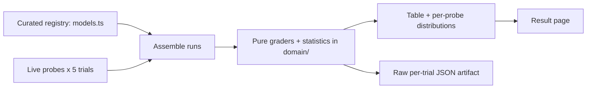

# Fundamental LLM model comparison

This page compares large language models from Anthropic, OpenAI, and Google across
eight aspects. The first five columns — Provider, Model, Tier, Released, Cost, and
Effort levels — are **curated catalog data** with a cited source per model. The
last three — Speed, nested-JSON depth, and length accuracy — are **measured live**
against each provider's API over **5 trials** each, reported as a
**mean with spread**. The split is deliberate: a reader can always tell a sourced
fact from a behavioral measurement.

## Method



Each model is sent three probes, **5 times**, through a
provider-neutral `CompletionClient` anti-corruption layer in
`packages/tech/src/vendors/llm/`, so providers stay swappable and no SDK type
leaks into the comparison logic. Per-trial values are reduced to a mean and sample
standard deviation by the pure statistics in
`packages/tech/src/llm-model-comparison/domain/aggregate.ts`:

- **Speed** — output tokens divided by wall-clock time over a trial's probe calls.
- **Nested-JSON depth** — the model is asked for JSON nested to each depth on a
  fixed ladder (3, 5, 8, 12, 16); the deepest correctly-nested response is recorded.
- **Length accuracy** — the model is asked for a paragraph of exactly
  100 words on "the water cycle";
  accuracy is `1 - min(1, |actual - target| / target)`.

The grading and scoring logic is pure and unit-tested in
`packages/tech/src/llm-model-comparison/domain/`. Every trial's exact prompt and
raw output is preserved in the raw run-artifact linked below.

### Publication constraints

The curated columns cite each provider's official model or pricing page and use
the provider's official product name. Model ids, prices, and release dates move
quickly and some sit near a model's knowledge cutoff; treat every curated cell as
correct only as of the cited source, and the `apiModelId` values are isolated in
`models.ts` so a correction is a one-line edit.

## Comparison

| Provider | Model | Tier | Released | Cost (in / out per MTok) | Effort levels | Speed (mean) | Max JSON depth (mean) | Length accuracy (mean) |
| -------- | ----- | ---- | -------- | ------------------------ | ------------- | ------------ | --------------------- | ---------------------- |
| anthropic | Claude Opus 4.8 | flagship | 2026 | $5.00 / $25.00 | low, medium, high, xhigh, max | n/a (fixtured) | n/a (fixtured) | n/a (fixtured) |
| anthropic | Claude Sonnet 5 | mid | 2026 | $3.00 / $15.00 | low, medium, high, xhigh, max | n/a (fixtured) | n/a (fixtured) | n/a (fixtured) |
| anthropic | Claude Haiku 4.5 | small | 2025-10 | $1.00 / $5.00 | low, medium, high | n/a (fixtured) | n/a (fixtured) | n/a (fixtured) |
| openai | GPT-5.5 | flagship | 2026 | $5.00 / $30.00 | minimal, low, medium, high | n/a (fixtured) | n/a (fixtured) | n/a (fixtured) |
| openai | GPT-5 | mid | 2025 | $1.25 / $10.00 | minimal, low, medium, high | n/a (fixtured) | n/a (fixtured) | n/a (fixtured) |
| openai | GPT-5 mini | small | 2025 | $0.25 / $2.00 | minimal, low, medium, high | n/a (fixtured) | n/a (fixtured) | n/a (fixtured) |
| google | Gemini 3.1 Pro | flagship | 2026 | $2.00 / $12.00 | low, medium, high | n/a (fixtured) | n/a (fixtured) | n/a (fixtured) |
| google | Gemini 3.1 Flash | small | 2026 | $0.30 / $2.50 | low, medium, high | n/a (fixtured) | n/a (fixtured) | n/a (fixtured) |

**Legend.** Provider, Model, Tier, Released, Cost, and Effort levels are
**curated** catalog data (cited). Speed, Max JSON depth, and Length accuracy are
**measured** live, each a mean over 5 trials. A cell shown as
`n/a (fixtured)` was produced by the deterministic fixture client (no API key
supplied) and is **not** a live measurement; `n/a (error)` means every trial for
that model failed.

### Per-probe detail (mean ± sample SD, min–max, n)

| Model | Provenance | Speed (tok/s) | Max JSON depth | Length accuracy |
| ----- | ---------- | ------------- | -------------- | --------------- |
| Claude Opus 4.8 | fixtured | n/a (fixtured) | n/a (fixtured) | n/a (fixtured) |
| Claude Sonnet 5 | fixtured | n/a (fixtured) | n/a (fixtured) | n/a (fixtured) |
| Claude Haiku 4.5 | fixtured | n/a (fixtured) | n/a (fixtured) | n/a (fixtured) |
| GPT-5.5 | fixtured | n/a (fixtured) | n/a (fixtured) | n/a (fixtured) |
| GPT-5 | fixtured | n/a (fixtured) | n/a (fixtured) | n/a (fixtured) |
| GPT-5 mini | fixtured | n/a (fixtured) | n/a (fixtured) | n/a (fixtured) |
| Gemini 3.1 Pro | fixtured | n/a (fixtured) | n/a (fixtured) | n/a (fixtured) |
| Gemini 3.1 Flash | fixtured | n/a (fixtured) | n/a (fixtured) | n/a (fixtured) |

The **raw per-trial run-artifact** — every trial's exact prompt and verbatim model
output — is committed alongside this page at
[`llm-model-comparison.data.json`](./llm-model-comparison.data.json).

## Scope & limitations

This is a deliberately narrow probe set, not an exhaustive evaluation suite:

- **5 trials** per model×probe — a small sample, enough for a mean
  and a rough spread, not a rigorous statistical study. Numbers vary run to run.
- **Point-in-time.** The measured behavior reflects the models and APIs on the
  date below; the curated facts reflect their cited sources on that date.
- The three probes test narrow, specific behaviors (raw throughput, structural
  nesting, length-instruction following) — they do not measure general
  capability, reasoning quality, or task success.
- **This run includes non-measured rows.** A provider with no API key is a deterministic fixture stand-in flagged `n/a (fixtured)`; a model whose every trial failed is flagged `n/a (error)`. Neither is a live measurement.

- **Generated:** 2026-01-01T00:00:00.000Z

## Reproduce

```sh
git clone https://github.com/qmu/research
cd research/packages/tech
npm install

# Pipeline self-test, no API keys or cost (deterministic fixture clients):
npm run compare:fixture

# Against the real providers (populate .env first; see .env.example):
#   ANTHROPIC_API_KEY, OPENAI_API_KEY, GOOGLE_API_KEY
# Optionally bound the run: --trials <n> (default 5) and
# --models <id,id,...> (a subset of models.ts ids).
npm run compare
```

The run regenerates this page and the JSON run-artifact. A provider whose key is
missing in a real run is fixtured-and-flagged, never presented as a live
measurement. Pin the `apiModelId` values in any published comparison so the
result stays interpretable over time.
