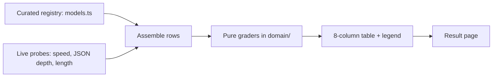

# Fundamental LLM model comparison

This page compares frontier large language models from Anthropic, OpenAI, and
Google across eight aspects. The first five columns — Provider, Model, Released,
Cost, and Effort levels — are **curated catalog data** with a cited source per
model. The last three — Speed, nested-JSON depth, and length accuracy — are
**measured live** against each provider's API. The split is deliberate: a reader
can always tell a sourced fact from a behavioral measurement.

## Method



Each measured model is sent three probes through a provider-neutral
`CompletionClient` anti-corruption layer in
`packages/tech/src/vendors/llm/`, so providers stay swappable and no SDK type
leaks into the comparison logic:

- **Speed** — output tokens divided by wall-clock time for the probe calls.
- **Nested-JSON depth** — the model is asked for JSON nested to each depth on a
  fixed ladder (3, 5, 8, 12, 16); the deepest correctly-nested response is recorded.
- **Length accuracy** — the model is asked for a paragraph of exactly
  100 words on "the water cycle";
  accuracy is `1 - min(1, |actual - target| / target)`.

The grading and scoring logic is pure and unit-tested in
`packages/tech/src/llm-model-comparison/domain/`.

### Publication constraints

The curated columns cite each provider's official model or pricing page and use
the provider's official product name. Model ids, prices, and release dates move
quickly and some sit near a model's knowledge cutoff; treat every curated cell as
correct only as of the cited source, and the `apiModelId` values are isolated in
`models.ts` so a correction is a one-line edit.

## Comparison

| Provider | Model | Released | Cost (in / out per MTok) | Effort levels | Speed | Max JSON depth | Length accuracy |
| -------- | ----- | -------- | ------------------------ | ------------- | ----- | -------------- | --------------- |
| anthropic | Claude Opus 4.8 | 2026 | $5.00 / $25.00 | low, medium, high, xhigh, max | n/a (fixtured) | n/a (fixtured) | n/a (fixtured) |
| openai | GPT-5.5 | 2026 | $5.00 / $30.00 | minimal, low, medium, high | n/a (fixtured) | n/a (fixtured) | n/a (fixtured) |
| google | Gemini 3.1 Pro | 2026 | $2.00 / $12.00 | low, medium, high | n/a (fixtured) | n/a (fixtured) | n/a (fixtured) |

**Legend.** Provider, Model, Released, Cost, and Effort levels are **curated**
catalog data (cited). Speed, Max JSON depth, and Length accuracy are **measured**
live. A cell shown as `n/a (fixtured)` means that row was produced by the
deterministic fixture client — no API key was supplied for that provider — and is
**not** a live measurement.

### Per-probe detail

| Model | Provenance | Elapsed | Output tokens |
| ----- | ---------- | ------- | ------------- |
| Claude Opus 4.8 | fixtured | n/a (fixtured) | n/a (fixtured) |
| GPT-5.5 | fixtured | n/a (fixtured) | n/a (fixtured) |
| Gemini 3.1 Pro | fixtured | n/a (fixtured) | n/a (fixtured) |

## Scope & limitations

This is a deliberately minimal probe, not an exhaustive evaluation suite:

- **One model per provider** and **one run** of each probe — a single sample, not
  a statistical average. Numbers will vary run to run.
- **Point-in-time.** The measured behavior reflects the models and APIs on the
  date below; the curated facts reflect their cited sources on that date.
- The three probes test narrow, specific behaviors (raw throughput, structural
  nesting, length-instruction following) — they do not measure general
  capability, reasoning quality, or task success.
- **This run includes fixtured rows.** At least one provider had no API key, so its row is a deterministic stand-in flagged `n/a (fixtured)` above, not a live measurement.

- **Generated:** 2026-06-23T23:20:09.795Z

## Reproduce

```sh
git clone https://github.com/qmu/research
cd research/packages/tech
npm install

# Pipeline self-test, no API keys or cost (deterministic fixture clients):
npm run compare:fixture

# Against the real providers (populate .env first; see .env.example):
#   ANTHROPIC_API_KEY, OPENAI_API_KEY, GOOGLE_API_KEY
npm run compare
```

The run regenerates this page at
`docs/research-reports/llm-model-comparison.md`. A provider whose key is missing
in a real run is fixtured-and-flagged, never presented as a live measurement. Pin
the `apiModelId` values in any published comparison so the result stays
interpretable over time.
