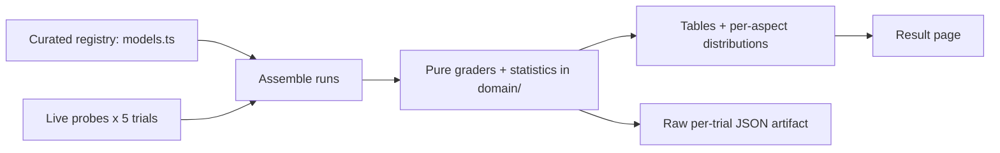

# Fundamental LLM model comparison

A routine, reproducible snapshot of what current large language models from
Anthropic, OpenAI, and Google do on three narrow, auto-gradable behaviors. Each
model is scored on eight aspects: five are **curated catalog data** (a cited
in-code registry — provider, model, tier, released, cost, effort levels) and three
are **measured live** against each provider's API over **5 trials**
each and reported as a **mean with spread**. The split is deliberate and the type
system enforces it: a reader can always tell a sourced fact from a behavioral
measurement.

## Methodology

**Models.** 8 models across 3 providers, spanning each
provider's flagship, mid, and small tiers, so the comparison shows the real spread
of behavior — and cost — from a provider's largest model to its smallest.

**Trials & statistics.** Every probe is run **5 times** per model.
The per-trial values are reduced to a **mean and sample standard deviation**
(Bessel's n−1) by the pure functions in
`packages/tech/src/llm-model-comparison/domain/aggregate.ts`; a failed trial is
excluded from the aggregates, never counted as a zero. Only **successful (ok)**
trials contribute, and `n` is reported alongside every mean.

**Probes.** Each model is sent three probes through a provider-neutral
`CompletionClient` anti-corruption layer in `packages/tech/src/vendors/llm/`, so
providers stay swappable and no SDK type leaks into the comparison logic:

- **Speed** — output tokens divided by wall-clock time over a trial's probe calls.
- **Nested-JSON depth** — the model is asked for JSON nested to each depth on a
  fixed ladder (3, 5, 8, 12, 16); the deepest correctly-nested response is recorded.
- **Length accuracy** — the model is asked for a paragraph of exactly
  100 words on "the water cycle";
  accuracy is `1 - min(1, |actual - target| / target)`, in [0, 1].

The grading and scoring logic is pure and unit-tested in
`packages/tech/src/llm-model-comparison/domain/`.



_Diagram: the curated registry and the live per-trial probes are assembled into
runs, reduced by the pure graders and statistics, and rendered both as this page's
tables and as the raw JSON run-artifact._

### Publication constraints

The curated columns cite each provider's official model or pricing page and use
the provider's official product name. Model ids, prices, and release dates move
quickly and some sit near a model's knowledge cutoff; treat every curated cell as
correct only as of the cited source, and the `apiModelId` values are isolated in
`models.ts` so a correction is a one-line edit.

## Comparison

| Provider | Model | Tier | Released | Cost (in / out per MTok) | Effort levels | Speed (mean) | Max JSON depth (mean) | Length accuracy (mean) |
| -------- | ----- | ---- | -------- | ------------------------ | ------------- | ------------ | --------------------- | ---------------------- |
| anthropic | Claude Opus 4.8 | flagship | 2026 | $5.00 / $25.00 | low, medium, high, xhigh, max | n/a (fixtured) | n/a (fixtured) | n/a (fixtured) |
| anthropic | Claude Sonnet 5 | mid | 2026 | $3.00 / $15.00 | low, medium, high, xhigh, max | n/a (fixtured) | n/a (fixtured) | n/a (fixtured) |
| anthropic | Claude Haiku 4.5 | small | 2025-10 | $1.00 / $5.00 | low, medium, high | n/a (fixtured) | n/a (fixtured) | n/a (fixtured) |
| openai | GPT-5.5 | flagship | 2026 | $5.00 / $30.00 | minimal, low, medium, high | n/a (fixtured) | n/a (fixtured) | n/a (fixtured) |
| openai | GPT-5 | mid | 2025 | $1.25 / $10.00 | minimal, low, medium, high | n/a (fixtured) | n/a (fixtured) | n/a (fixtured) |
| openai | GPT-5 mini | small | 2025 | $0.25 / $2.00 | minimal, low, medium, high | n/a (fixtured) | n/a (fixtured) | n/a (fixtured) |
| google | Gemini 3.1 Pro | flagship | 2026 | $2.00 / $12.00 | low, medium, high | n/a (fixtured) | n/a (fixtured) | n/a (fixtured) |
| google | Gemini 3.1 Flash | small | 2026 | $0.30 / $2.50 | low, medium, high | n/a (fixtured) | n/a (fixtured) | n/a (fixtured) |

**Legend.** Provider, Model, Tier, Released, Cost, and Effort levels are
**curated** catalog data (cited). Speed, Max JSON depth, and Length accuracy are
**measured** live, each a mean over 5 trials. A cell reading
`n/a (fixtured)` was produced by the deterministic fixture client (no API key
supplied) and is **not** a live measurement; `n/a (error)` means every trial for
that model failed. Provenance is stated in words, never by colour, so the table
reads the same for every reader.

## Per-aspect analysis

Each aspect as a distribution across the models — mean ± sample standard
deviation, the observed min–max, and the number of contributing trials.

### Speed (output tokens / second)

| Model | Mean ± SD | Min–Max | n |
| ----- | --------- | ------- | - |
| Claude Opus 4.8 | n/a (fixtured) | n/a (fixtured) | n/a (fixtured) |
| Claude Sonnet 5 | n/a (fixtured) | n/a (fixtured) | n/a (fixtured) |
| Claude Haiku 4.5 | n/a (fixtured) | n/a (fixtured) | n/a (fixtured) |
| GPT-5.5 | n/a (fixtured) | n/a (fixtured) | n/a (fixtured) |
| GPT-5 | n/a (fixtured) | n/a (fixtured) | n/a (fixtured) |
| GPT-5 mini | n/a (fixtured) | n/a (fixtured) | n/a (fixtured) |
| Gemini 3.1 Pro | n/a (fixtured) | n/a (fixtured) | n/a (fixtured) |
| Gemini 3.1 Flash | n/a (fixtured) | n/a (fixtured) | n/a (fixtured) |

No live measurements in this run — every model was fixtured or errored, so this aspect has no comparison.

### Maximum nested-JSON depth

| Model | Mean ± SD | Min–Max | n |
| ----- | --------- | ------- | - |
| Claude Opus 4.8 | n/a (fixtured) | n/a (fixtured) | n/a (fixtured) |
| Claude Sonnet 5 | n/a (fixtured) | n/a (fixtured) | n/a (fixtured) |
| Claude Haiku 4.5 | n/a (fixtured) | n/a (fixtured) | n/a (fixtured) |
| GPT-5.5 | n/a (fixtured) | n/a (fixtured) | n/a (fixtured) |
| GPT-5 | n/a (fixtured) | n/a (fixtured) | n/a (fixtured) |
| GPT-5 mini | n/a (fixtured) | n/a (fixtured) | n/a (fixtured) |
| Gemini 3.1 Pro | n/a (fixtured) | n/a (fixtured) | n/a (fixtured) |
| Gemini 3.1 Flash | n/a (fixtured) | n/a (fixtured) | n/a (fixtured) |

No live measurements in this run — every model was fixtured or errored, so this aspect has no comparison.

### Length-instruction accuracy

| Model | Mean ± SD | Min–Max | n |
| ----- | --------- | ------- | - |
| Claude Opus 4.8 | n/a (fixtured) | n/a (fixtured) | n/a (fixtured) |
| Claude Sonnet 5 | n/a (fixtured) | n/a (fixtured) | n/a (fixtured) |
| Claude Haiku 4.5 | n/a (fixtured) | n/a (fixtured) | n/a (fixtured) |
| GPT-5.5 | n/a (fixtured) | n/a (fixtured) | n/a (fixtured) |
| GPT-5 | n/a (fixtured) | n/a (fixtured) | n/a (fixtured) |
| GPT-5 mini | n/a (fixtured) | n/a (fixtured) | n/a (fixtured) |
| Gemini 3.1 Pro | n/a (fixtured) | n/a (fixtured) | n/a (fixtured) |
| Gemini 3.1 Flash | n/a (fixtured) | n/a (fixtured) | n/a (fixtured) |

No live measurements in this run — every model was fixtured or errored, so this aspect has no comparison.

## Per-model profiles

### Claude Opus 4.8 — anthropic · flagship

- **Curated:** released 2026, cost $5.00 / $25.00 per MTok, effort levels low, medium, high, xhigh, max, [source](https://platform.claude.com/docs/en/about-claude/models/overview).
- **Measured:** fixtured — no live measurement (`n/a (fixtured)`).

### Claude Sonnet 5 — anthropic · mid

- **Curated:** released 2026, cost $3.00 / $15.00 per MTok, effort levels low, medium, high, xhigh, max, [source](https://platform.claude.com/docs/en/about-claude/models/overview).
- **Measured:** fixtured — no live measurement (`n/a (fixtured)`).

### Claude Haiku 4.5 — anthropic · small

- **Curated:** released 2025-10, cost $1.00 / $5.00 per MTok, effort levels low, medium, high, [source](https://platform.claude.com/docs/en/about-claude/models/overview).
- **Measured:** fixtured — no live measurement (`n/a (fixtured)`).

### GPT-5.5 — openai · flagship

- **Curated:** released 2026, cost $5.00 / $30.00 per MTok, effort levels minimal, low, medium, high, [source](https://developers.openai.com/api/docs/pricing).
- **Measured:** fixtured — no live measurement (`n/a (fixtured)`).

### GPT-5 — openai · mid

- **Curated:** released 2025, cost $1.25 / $10.00 per MTok, effort levels minimal, low, medium, high, [source](https://developers.openai.com/api/docs/pricing).
- **Measured:** fixtured — no live measurement (`n/a (fixtured)`).

### GPT-5 mini — openai · small

- **Curated:** released 2025, cost $0.25 / $2.00 per MTok, effort levels minimal, low, medium, high, [source](https://developers.openai.com/api/docs/pricing).
- **Measured:** fixtured — no live measurement (`n/a (fixtured)`).

### Gemini 3.1 Pro — google · flagship

- **Curated:** released 2026, cost $2.00 / $12.00 per MTok, effort levels low, medium, high, [source](https://ai.google.dev/gemini-api/docs/pricing).
- **Measured:** fixtured — no live measurement (`n/a (fixtured)`).

### Gemini 3.1 Flash — google · small

- **Curated:** released 2026, cost $0.30 / $2.50 per MTok, effort levels low, medium, high, [source](https://ai.google.dev/gemini-api/docs/pricing).
- **Measured:** fixtured — no live measurement (`n/a (fixtured)`).

## Data transparency

The exact prompts and every trial's verbatim raw output are preserved so the
result can be re-checked, not just trusted.

**Exact prompts.** The nested-JSON probe sends one prompt per ladder rung; the
deepest (depth 16) rung is:

```text
Return ONLY a single JSON object nested exactly 16 levels deep, with no surrounding text, no markdown, and no code fences. Each level must be an object whose sole key is "child" except the deepest level, whose value is the string "leaf". For example, depth 2 is {"child":{"child":"leaf"}}. Produce depth 16.
```

The length probe sends a single prompt:

```text
Write a single paragraph about the water cycle that is exactly 100 words long. Respond with the paragraph only — no preamble, no word count, no markdown.
```

**Raw per-trial capture.** Every trial's exact prompt and verbatim model output —
for every model, including fixtured and failed ones — is committed alongside this
page as a JSON run-artifact:
[`llm-model-comparison.data.json`](./llm-model-comparison.data.json).

No measured models in this run, so there are no per-trial measured values to tabulate here; the fixtured/failed trials are in the artifact above.

## Scope & limitations

This is a deliberately narrow probe set, not an exhaustive evaluation suite:

- **5 trials** per model×probe — a small sample, enough for a mean
  and a rough spread, not a rigorous statistical study. Numbers vary run to run.
- **Point-in-time.** The measured behavior reflects the models and APIs on the
  date below; the curated facts reflect their cited sources on that date.
- The three probes test narrow, specific behaviors (raw throughput, structural
  nesting, length-instruction following) — they do **not** measure general
  capability, reasoning quality, or task success.
- **This run includes non-measured rows.** A provider with no API key is a deterministic fixture stand-in flagged `n/a (fixtured)`; a model whose every trial failed is flagged `n/a (error)`. Neither is a live measurement.

- **Generated:** 2026-01-01T00:00:00.000Z

## Reproduce

```sh
git clone https://github.com/qmu/research
cd research/packages/tech
npm install

# Pipeline self-test, no API keys or cost (deterministic fixture clients):
npm run compare:fixture

# Against the real providers (populate .env first; see .env.example):
#   ANTHROPIC_API_KEY, OPENAI_API_KEY, GOOGLE_API_KEY
# Optionally bound the run: --trials <n> (default 5) and
# --models <id,id,...> (a subset of the models.ts ids). A full real matrix is
# roughly 8 models x (5-rung ladder + 1 length) x 5 trials of API calls.
npm run compare
```

The run regenerates this page and the JSON run-artifact. A provider whose key is
missing in a real run is fixtured-and-flagged, never presented as a live
measurement. Pin the `apiModelId` values in any published comparison so the
result stays interpretable over time.
